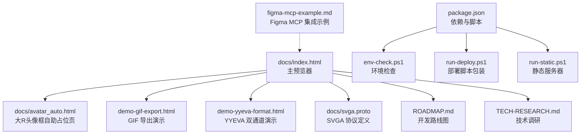
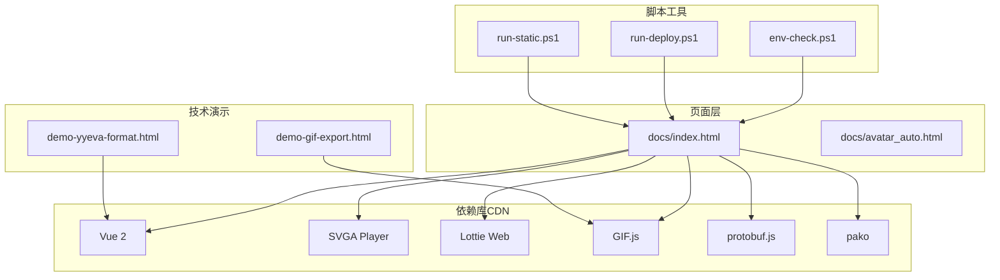
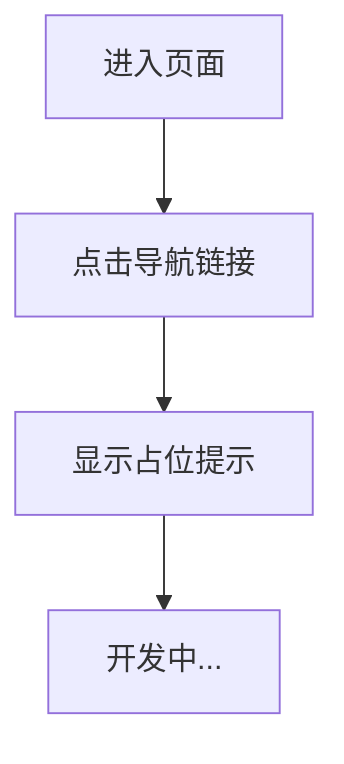
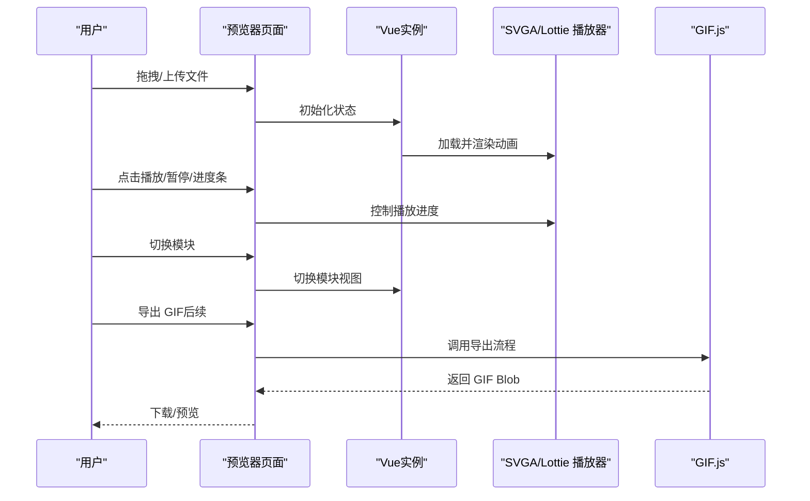
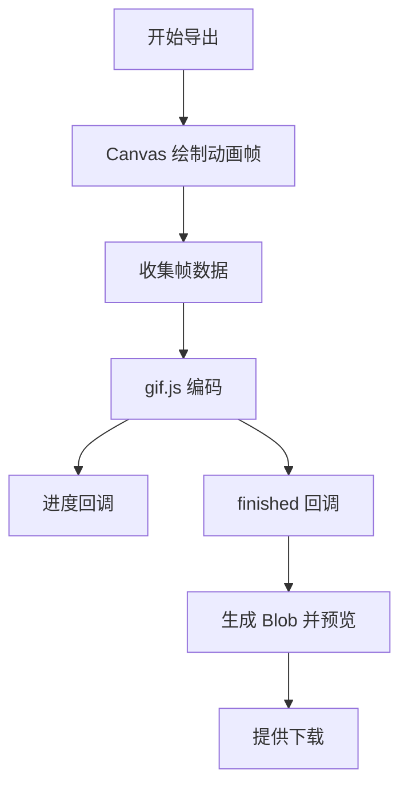
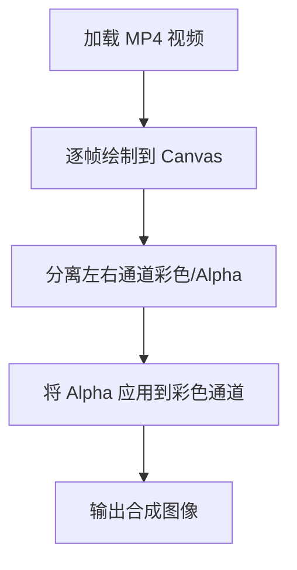
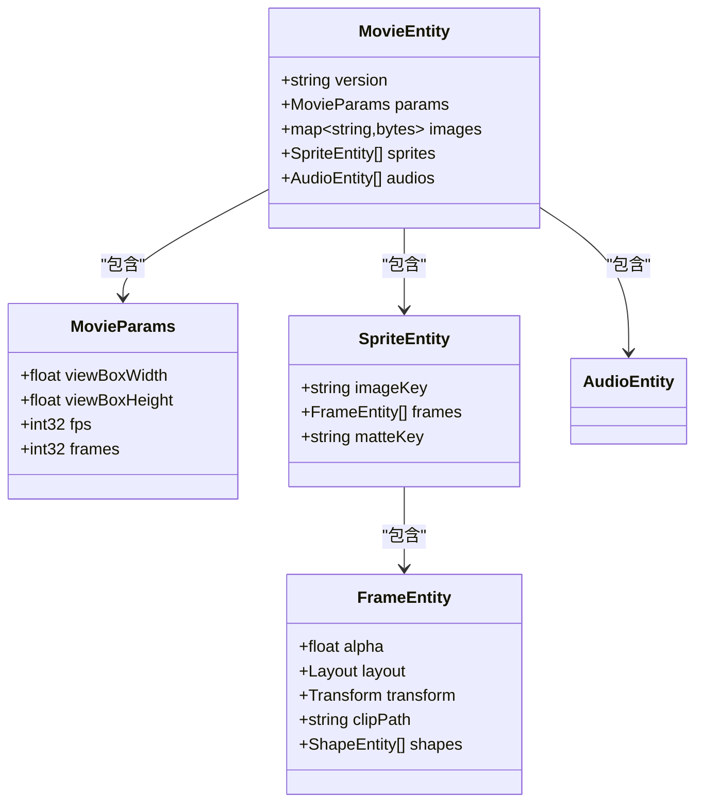
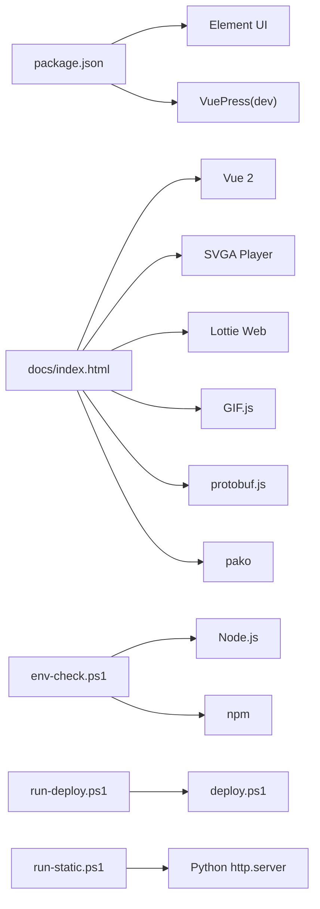

# 大R头像框自助

<cite>
**本文引用的文件**
- [package.json](file://package.json)
- [ROADMAP.md](file://ROADMAP.md)
- [TECH-RESEARCH.md](file://TECH-RESEARCH.md)
- [demo-gif-export.html](file://demo-gif-export.html)
- [demo-yyeva-format.html](file://demo-yyeva-format.html)
- [docs/index.html](file://docs/index.html)
- [docs/avatar_auto.html](file://docs/avatar_auto.html)
- [docs/svga.proto](file://docs/svga.proto)
- [env-check.ps1](file://env-check.ps1)
- [run-deploy.ps1](file://run-deploy.ps1)
- [run-static.ps1](file://run-static.ps1)
- [figma-mcp-example.md](file://figma-mcp-example.md)
</cite>

## 目录
1. [简介](#简介)
2. [项目结构](#项目结构)
3. [核心组件](#核心组件)
4. [架构总览](#架构总览)
5. [详细组件分析](#详细组件分析)
6. [依赖分析](#依赖分析)
7. [性能考量](#性能考量)
8. [故障排查指南](#故障排查指南)
9. [结论](#结论)
10. [附录](#附录)

## 简介
本项目是一个“大R头像框自助”页面，基于现有文档与演示页面，主要目标是：
- 展示“大R头像框自助”的入口与导航
- 作为后续功能开发的占位页，逐步接入 SVGA、YYEVA-MP4、Lottie 的在线预览与导出能力
- 提供基础的环境检查与静态服务器启动脚本，便于本地调试与部署

当前页面内容处于开发中状态，后续将逐步完善交互逻辑与功能模块。

## 项目结构
仓库包含以下关键部分：
- 文档与演示页面：docs/index.html（主预览器）、docs/avatar_auto.html（大R头像框自助占位页）
- 技术路线与调研：ROADMAP.md、TECH-RESEARCH.md
- 功能演示：demo-gif-export.html（GIF 导出）、demo-yyeva-format.html（YYEVA 双通道视频解析）
- 依赖与脚本：package.json、env-check.ps1、run-deploy.ps1、run-static.ps1
- SVGA 协议定义：docs/svga.proto
- 设计工具集成：figma-mcp-example.md

图表来源
- [docs/index.html](file://docs/index.html#L1-L200)
- [docs/avatar_auto.html](file://docs/avatar_auto.html#L1-L118)
- [demo-gif-export.html](file://demo-gif-export.html#L1-L120)
- [demo-yyeva-format.html](file://demo-yyeva-format.html#L1-L120)
- [docs/svga.proto](file://docs/svga.proto#L1-L132)
- [ROADMAP.md](file://ROADMAP.md#L1-L120)
- [TECH-RESEARCH.md](file://TECH-RESEARCH.md#L1-L120)
- [package.json](file://package.json#L1-L19)
- [env-check.ps1](file://env-check.ps1#L1-L60)
- [run-deploy.ps1](file://run-deploy.ps1#L1-L15)
- [run-static.ps1](file://run-static.ps1#L1-L12)
- [figma-mcp-example.md](file://figma-mcp-example.md#L1-L60)

章节来源
- [package.json](file://package.json#L1-L19)
- [ROADMAP.md](file://ROADMAP.md#L1-L120)
- [TECH-RESEARCH.md](file://TECH-RESEARCH.md#L1-L120)
- [docs/index.html](file://docs/index.html#L1-L200)
- [docs/avatar_auto.html](file://docs/avatar_auto.html#L1-L118)
- [demo-gif-export.html](file://demo-gif-export.html#L1-L120)
- [demo-yyeva-format.html](file://demo-yyeva-format.html#L1-L120)
- [docs/svga.proto](file://docs/svga.proto#L1-L132)
- [env-check.ps1](file://env-check.ps1#L1-L60)
- [run-deploy.ps1](file://run-deploy.ps1#L1-L15)
- [run-static.ps1](file://run-static.ps1#L1-L12)
- [figma-mcp-example.md](file://figma-mcp-example.md#L1-L60)

## 核心组件
- 大R头像框自助占位页：提供导航入口，当前为占位状态，后续将接入具体功能
- 主预览器（docs/index.html）：承载 SVGA、YYEVA-MP4、Lottie 的预览与控制区域，包含播放控制、背景色切换、缩放与拖拽、进度条、模块切换等
- 技术演示页面：
  - GIF 导出演示：展示 Canvas 动画预览与 GIF 导出流程
  - YYEVA 双通道视频演示：展示双通道视频的分离与合成
- 技术路线与调研：明确各模块的优先级、技术方案与风险评估
- 环境与部署脚本：辅助本地开发与部署

章节来源
- [docs/avatar_auto.html](file://docs/avatar_auto.html#L1-L118)
- [docs/index.html](file://docs/index.html#L1360-L1600)
- [demo-gif-export.html](file://demo-gif-export.html#L120-L220)
- [demo-yyeva-format.html](file://demo-yyeva-format.html#L120-L220)
- [ROADMAP.md](file://ROADMAP.md#L1-L120)
- [TECH-RESEARCH.md](file://TECH-RESEARCH.md#L1-L120)

## 架构总览
整体架构由“页面层 + 依赖库 + 技术演示 + 脚本工具”构成，页面通过 CDN 引入核心库，演示页面用于验证关键技术点，脚本用于本地开发与部署。

图表来源
- [docs/index.html](file://docs/index.html#L1-L40)
- [demo-gif-export.html](file://demo-gif-export.html#L1-L20)
- [demo-yyeva-format.html](file://demo-yyeva-format.html#L1-L20)
- [env-check.ps1](file://env-check.ps1#L1-L40)
- [run-deploy.ps1](file://run-deploy.ps1#L1-L15)
- [run-static.ps1](file://run-static.ps1#L1-L12)

## 详细组件分析

### 大R头像框自助占位页
- 功能定位：作为导航入口，指向“大R头像框自助”功能页
- 当前状态：页面内容开发中，占位文本提示后续完善
- 交互建议：后续可接入用户登录、模板选择、预览与导出等功能

图表来源
- [docs/avatar_auto.html](file://docs/avatar_auto.html#L70-L118)

章节来源
- [docs/avatar_auto.html](file://docs/avatar_auto.html#L1-L118)

### 主预览器（docs/index.html）
- 顶部导航栏：包含主题切换、返回主页、头像链接等
- 播放区域：支持拖拽上传、Canvas 预览、缩放与拖拽、背景色切换、1:1 重置
- 底部控制区：播放/暂停、进度条、帧数显示、模块切换（SVGA/YYEVA-Lottie 占位）、清空画布
- 依赖库：Vue 2、SVGA Player、Lottie Web、GIF.js、protobuf.js、pako
- 交互流程：拖拽/上传文件 -> 解析并渲染 -> 控制播放/暂停/进度 -> 切换模块 -> 导出（后续）

图表来源
- [docs/index.html](file://docs/index.html#L1360-L1600)
- [docs/index.html](file://docs/index.html#L1-L200)
- [demo-gif-export.html](file://demo-gif-export.html#L200-L308)

章节来源
- [docs/index.html](file://docs/index.html#L1-L200)
- [docs/index.html](file://docs/index.html#L1360-L1600)

### GIF 导出演示（demo-gif-export.html）
- 目标：验证 Canvas 动画预览与 GIF 导出流程
- 关键点：Canvas 逐帧绘制、gif.js 编码器、Web Worker、进度回调、下载预览
- 实现思路：逐帧收集 Canvas 数据，使用 gif.js 渲染为 GIF，回调中生成 Blob 并提供下载

图表来源
- [demo-gif-export.html](file://demo-gif-export.html#L120-L220)
- [demo-gif-export.html](file://demo-gif-export.html#L220-L308)

章节来源
- [demo-gif-export.html](file://demo-gif-export.html#L1-L308)

### YYEVA 双通道视频演示（demo-yyeva-format.html）
- 目标：验证双通道视频的分离与合成流程
- 关键点：<video> 加载 MP4 -> Canvas 提取帧 -> 分离左右通道 -> 合成最终图像
- 实现思路：模拟左右并排布局，分离彩色与 Alpha 通道，将 Alpha 应用到彩色通道生成透明图像

图表来源
- [demo-yyeva-format.html](file://demo-yyeva-format.html#L120-L220)
- [demo-yyeva-format.html](file://demo-yyeva-format.html#L220-L320)

章节来源
- [demo-yyeva-format.html](file://demo-yyeva-format.html#L1-L350)

### SVGA 协议定义（docs/svga.proto）
- 作用：定义 SVGA 文件的核心结构，包括动画参数、精灵实体、帧实体、矢量元素、音频实体等
- 价值：为后续 SVGA 素材替换与导出提供协议依据

图表来源
- [docs/svga.proto](file://docs/svga.proto#L1-L132)

章节来源
- [docs/svga.proto](file://docs/svga.proto#L1-L132)

### 技术路线与调研（ROADMAP.md、TECH-RESEARCH.md）
- 路线图：明确阶段目标、优先级与技术挑战
- 调研：GIF 导出、YYEVA 格式、序列帧提取、MP4 合成等方案对比与最佳实践
- 风险评估：性能、兼容性、内存占用等

章节来源
- [ROADMAP.md](file://ROADMAP.md#L1-L200)
- [TECH-RESEARCH.md](file://TECH-RESEARCH.md#L1-L200)

### 设计工具集成（figma-mcp-example.md）
- 说明：如何使用 Framelink Figma MCP 工具获取与处理 Figma 设计文件
- 价值：与本项目结合，形成从设计到预览的完整工作流（设计 -> 导出帧 -> 转换 -> 预览）

章节来源
- [figma-mcp-example.md](file://figma-mcp-example.md#L1-L172)

## 依赖分析
- 依赖声明：package.json 中声明了 Element UI 与 VuePress（开发依赖）
- 页面依赖：docs/index.html 通过 CDN 引入 Vue 2、SVGA Player、Lottie Web、GIF.js、protobuf.js、pako
- 脚本依赖：env-check.ps1 检查 Node.js、npm 环境；run-deploy.ps1 包装部署脚本；run-static.ps1 启动静态服务器

图表来源
- [package.json](file://package.json#L1-L19)
- [docs/index.html](file://docs/index.html#L1-L40)
- [env-check.ps1](file://env-check.ps1#L1-L60)
- [run-deploy.ps1](file://run-deploy.ps1#L1-L15)
- [run-static.ps1](file://run-static.ps1#L1-L12)

章节来源
- [package.json](file://package.json#L1-L19)
- [docs/index.html](file://docs/index.html#L1-L40)
- [env-check.ps1](file://env-check.ps1#L1-L60)
- [run-deploy.ps1](file://run-deploy.ps1#L1-L15)
- [run-static.ps1](file://run-static.ps1#L1-L12)

## 性能考量
- GIF 导出：限制尺寸与帧数、使用 Web Worker、显示进度，避免阻塞 UI
- YYEVA 合成：注意大分辨率视频的内存占用，必要时降采样或分块处理
- SVGA 素材替换：解析与重打包涉及 Protobuf 与压缩，需关注内存与 CPU 占用
- 兼容性：确保 Canvas、Web Worker、WASM 等特性在目标浏览器可用

章节来源
- [TECH-RESEARCH.md](file://TECH-RESEARCH.md#L250-L360)
- [ROADMAP.md](file://ROADMAP.md#L310-L370)

## 故障排查指南
- 环境检查：使用 env-check.ps1 检查 Node.js、npm 是否就绪，若缺失则按提示安装
- 依赖安装：若未安装依赖或 node_modules 不存在，按提示执行安装命令
- 部署脚本：run-deploy.ps1 会以 bypass 执行 deploy.ps1，请确认当前目录正确
- 静态服务器：run-static.ps1 在 docs 目录启动 Python 简易服务器，访问 http://localhost:8080/index.html

章节来源
- [env-check.ps1](file://env-check.ps1#L1-L103)
- [run-deploy.ps1](file://run-deploy.ps1#L1-L15)
- [run-static.ps1](file://run-static.ps1#L1-L12)

## 结论
本项目以“大R头像框自助”为入口，结合主预览器与技术演示页面，构建了 SVGA、YYEVA-MP4、Lottie 的预览与导出能力蓝图。通过 ROADMAP 与 TECH-RESEARCH 的指导，明确了 GIF 导出、YYEVA 解析、序列帧提取与 MP4 合成的技术路径与风险控制策略。配合环境检查与部署脚本，能够快速搭建本地开发与预览环境。

## 附录
- 术语说明
  - SVGA：一种基于帧序列的动画格式，常用于移动端动效
  - YYEVA：将彩色通道与 Alpha 通道合并到同一 MP4 的格式方案
  - Lottie：JSON 格式的跨平台动画描述语言
- 参考资源
  - SVGA Player Web、Lottie Web、gif.js、protobuf.js、pako 等库的 CDN 引用已在页面中声明