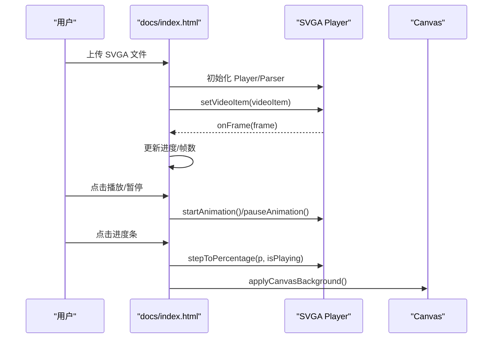

# 技术调研报告

<cite>
**本文引用的文件列表**
- [TECH-RESEARCH.md](file://TECH-RESEARCH.md)
- [ROADMAP.md](file://ROADMAP.md)
- [demo-gif-export.html](file://demo-gif-export.html)
- [demo-yyeva-format.html](file://demo-yyeva-format.html)
- [package.json](file://package.json)
</cite>

## 目录
1. [引言](#引言)
2. [项目结构](#项目结构)
3. [核心组件](#核心组件)
4. [架构总览](#架构总览)
5. [详细组件分析](#详细组件分析)
6. [依赖关系分析](#依赖关系分析)
7. [性能考量](#性能考量)
8. [故障排查指南](#故障排查指南)
9. [结论](#结论)
10. [附录](#附录)

## 引言
本报告面向 A-viewer 项目第二、三阶段的功能开发，围绕 SVGA、YYEVA-MP4、Lottie 三大动画格式的在线预览与转换进行技术调研，重点覆盖以下方面：
- YYEVA-MP4 双通道视频格式规范与解析流程
- 序列帧提取与 GIF 导出方案
- MP4 合成（双通道）方案与性能权衡
- 技术栈与浏览器兼容性
- 风险评估与下一步行动

报告同时梳理了现有 Demo 与路线图，给出可落地的技术方案与实施建议，帮助团队在有限资源下快速推进功能开发。

## 项目结构
仓库包含技术文档、Demo 页面、脚本与文档站点等内容，核心结构如下：
- 文档与路线图：TECH-RESEARCH.md、ROADMAP.md
- Demo 页面：demo-gif-export.html、demo-yyeva-format.html
- 构建与部署脚本：run-deploy.ps1、run-static.ps1、env-check.ps1
- 包管理与依赖：package.json
- 文档站点源码：docs/index.html（包含 SVGA/Lottie/YYEVA 模块的前端实现与交互）

图表来源
- [TECH-RESEARCH.md](file://TECH-RESEARCH.md#L1-L120)
- [ROADMAP.md](file://ROADMAP.md#L1-L120)
- [demo-gif-export.html](file://demo-gif-export.html#L1-L120)
- [demo-yyeva-format.html](file://demo-yyeva-format.html#L1-L120)
- [run-deploy.ps1](file://run-deploy.ps1#L1-L15)
- [run-static.ps1](file://run-static.ps1#L1-L12)
- [env-check.ps1](file://env-check.ps1#L1-L103)
- [package.json](file://package.json#L1-L19)
- [docs/index.html](file://docs/index.html#L1-L120)

章节来源
- [TECH-RESEARCH.md](file://TECH-RESEARCH.md#L1-L120)
- [ROADMAP.md](file://ROADMAP.md#L1-L120)
- [demo-gif-export.html](file://demo-gif-export.html#L1-L120)
- [demo-yyeva-format.html](file://demo-yyeva-format.html#L1-L120)
- [run-deploy.ps1](file://run-deploy.ps1#L1-L15)
- [run-static.ps1](file://run-static.ps1#L1-L12)
- [env-check.ps1](file://env-check.ps1#L1-L103)
- [package.json](file://package.json#L1-L19)
- [docs/index.html](file://docs/index.html#L1-L120)

## 核心组件
- YYEVA-MP4 解析与合成：基于原生 Video + Canvas 的通道分离与合成流程，支持左右并排或上下并排布局。
- GIF 导出：基于 gif.js 的前端 GIF 编码，支持 Web Worker、进度回调与下载。
- 序列帧提取：支持从 SVGA/Video 源逐帧提取帧数据，为 GIF/MP4 合成提供基础素材。
- MP4 合成（双通道）：基于 ffmpeg.wasm 的浏览器内编码，支持左右通道拼接与 MP4 输出。
- 前端预览与交互：docs/index.html 中包含 SVGA/Lottie/YYEVA 模块的播放控制、进度条、帧数显示、主题切换、背景色切换、画布缩放与拖拽等。

章节来源
- [TECH-RESEARCH.md](file://TECH-RESEARCH.md#L66-L108)
- [TECH-RESEARCH.md](file://TECH-RESEARCH.md#L111-L175)
- [TECH-RESEARCH.md](file://TECH-RESEARCH.md#L188-L294)
- [TECH-RESEARCH.md](file://TECH-RESEARCH.md#L297-L383)
- [ROADMAP.md](file://ROADMAP.md#L48-L113)
- [ROADMAP.md](file://ROADMAP.md#L115-L209)
- [docs/index.html](file://docs/index.html#L1860-L2146)

## 架构总览
整体架构由“前端预览与交互”和“技术方案与Demo”两部分组成：
- 前端预览与交互：docs/index.html 作为主入口，负责加载 SVGA/Lottie/YYEVA 模块，提供播放控制、进度条、帧数显示、主题与背景切换、画布缩放与拖拽等。
- 技术方案与Demo：TECH-RESEARCH.md 和 ROADMAP.md 提供技术选型与路线图；demo-gif-export.html 与 demo-yyeva-format.html 作为验证性 Demo，展示 GIF 导出与 YYEVA 解析的关键流程。

图表来源
- [docs/index.html](file://docs/index.html#L1-L120)
- [TECH-RESEARCH.md](file://TECH-RESEARCH.md#L1-L120)
- [ROADMAP.md](file://ROADMAP.md#L1-L120)
- [demo-gif-export.html](file://demo-gif-export.html#L1-L120)
- [demo-yyeva-format.html](file://demo-yyeva-format.html#L1-L120)

## 详细组件分析

### YYEVA-MP4 格式规范与解析流程
- 格式定义：YYEVA 是在普通 MP4 中嵌入透明通道的格式方案，通常采用左右并排或上下并排布局。
- 技术原理：序列帧提取 → 每帧分离彩色与 Alpha → 合成双通道画布 → 编码为标准 MP4。
- 解析流程：加载视频 → 监听每帧 → 绘制到 Canvas → 分离左右（或上下）通道 → 合成最终图像。
- Demo 验证：demo-yyeva-format.html 展示了模拟双通道视频、通道分离与合成的完整流程。

图表来源
- [TECH-RESEARCH.md](file://TECH-RESEARCH.md#L66-L108)
- [demo-yyeva-format.html](file://demo-yyeva-format.html#L135-L217)

章节来源
- [TECH-RESEARCH.md](file://TECH-RESEARCH.md#L8-L108)
- [demo-yyeva-format.html](file://demo-yyeva-format.html#L115-L217)

### 序列帧提取方案
- 方案 A（Canvas API，推荐）：从 SVGA/Video 源逐帧提取帧数据，无需额外库，性能优秀，完全可控。
- 方案 B（ffmpeg.wasm）：功能强大，支持多种格式，但体积大（约 25MB+）、加载慢、性能较差。
- 推荐策略：优先使用 Canvas API；复杂场景再引入 ffmpeg.wasm。

图表来源
- [TECH-RESEARCH.md](file://TECH-RESEARCH.md#L111-L175)

章节来源
- [TECH-RESEARCH.md](file://TECH-RESEARCH.md#L111-L175)

### GIF 导出方案
- 库选型：gif.js（体积小、支持 Web Worker、API 简单、性能优秀）；gifshot（API 更简单但体积较大）。
- 最佳实践：限制尺寸、限制帧数、使用 Web Worker、显示进度。
- Demo 验证：demo-gif-export.html 展示了 Canvas 动画预览、GIF 导出、进度显示与下载。

图表来源
- [demo-gif-export.html](file://demo-gif-export.html#L216-L299)

章节来源
- [TECH-RESEARCH.md](file://TECH-RESEARCH.md#L188-L294)
- [demo-gif-export.html](file://demo-gif-export.html#L118-L151)
- [demo-gif-export.html](file://demo-gif-export.html#L216-L299)

### MP4 合成（双通道）方案
- 方案 A（ffmpeg.wasm，推荐）：支持标准 MP4 输出、兼容性好、可精确控制双通道布局。
- 方案 B（MediaRecorder API）：浏览器原生、性能好，但只支持 WebM 格式且兼容性较差。
- 推荐策略：优先使用 ffmpeg.wasm，并配合懒加载、CDN 加速与进度提示。

图表来源
- [TECH-RESEARCH.md](file://TECH-RESEARCH.md#L297-L383)

章节来源
- [TECH-RESEARCH.md](file://TECH-RESEARCH.md#L297-L383)

### 前端预览与交互（docs/index.html）
- 模块化：SVGA、YYEVA、Lottie 模块分别提供播放控制、进度条、帧数显示、主题切换、背景色切换、画布缩放与拖拽。
- SVGA 播放：初始化 Player/Parser，设置视频项、内容模式、帧回调、播放/暂停、进度跳转等。
- Lottie/YYEVA：当前为占位逻辑，后续实现播放与控制。
- GIF 导出：在 SVGA 模块中实现逐帧捕获与导出流程。

图表来源
- [docs/index.html](file://docs/index.html#L1860-L2146)
- [docs/index.html](file://docs/index.html#L2053-L2080)
- [docs/index.html](file://docs/index.html#L2082-L2114)

章节来源
- [docs/index.html](file://docs/index.html#L1860-L2146)
- [docs/index.html](file://docs/index.html#L2053-L2114)

## 依赖关系分析
- 技术栈与 CDN 引入：gif.js、@ffmpeg/ffmpeg、lottie-web、svgaplayerweb、protobuf.js、pako 等。
- 浏览器兼容性：Canvas API、Web Worker、WASM、Video API 在现代浏览器中均可使用。
- 脚本与环境：env-check.ps1 检查 Node/npm 环境；run-static.ps1 启动静态服务器；run-deploy.ps1 包装部署脚本。

图表来源
- [docs/index.html](file://docs/index.html#L1-L40)
- [TECH-RESEARCH.md](file://TECH-RESEARCH.md#L386-L407)
- [env-check.ps1](file://env-check.ps1#L1-L103)
- [run-static.ps1](file://run-static.ps1#L1-L12)
- [run-deploy.ps1](file://run-deploy.ps1#L1-L15)

章节来源
- [docs/index.html](file://docs/index.html#L1-L40)
- [TECH-RESEARCH.md](file://TECH-RESEARCH.md#L386-L407)
- [env-check.ps1](file://env-check.ps1#L1-L103)
- [run-static.ps1](file://run-static.ps1#L1-L12)
- [run-deploy.ps1](file://run-deploy.ps1#L1-L15)

## 性能考量
- 大尺寸动画内存占用：GIF/MP4 合成时，帧数与尺寸越大，内存占用越高。建议限制最大尺寸与帧数，必要时分块处理。
- ffmpeg.wasm 编码速度：体积大导致加载与编码慢，建议懒加载、CDN 加速与进度提示。
- GIF 导出性能：使用 Web Worker 避免阻塞 UI；合理设置质量与尺寸。
- 浏览器兼容性：现代浏览器对 Canvas/Web Worker/WASM/Video API 支持良好，低版本浏览器可提示升级。

章节来源
- [TECH-RESEARCH.md](file://TECH-RESEARCH.md#L410-L425)
- [TECH-RESEARCH.md](file://TECH-RESEARCH.md#L386-L407)
- [ROADMAP.md](file://ROADMAP.md#L311-L331)

## 故障排查指南
- 环境检查：使用 env-check.ps1 确认 Node/npm 安装与 PATH 配置，确保 vuepress 本地依赖存在。
- 静态服务器：run-static.ps1 在 docs 目录启动本地 HTTP 服务，便于预览静态页面。
- 部署脚本：run-deploy.ps1 包装部署流程，注意执行策略与脚本存在性。
- YYEVA 解析：若合成结果异常，检查通道分离逻辑与 Alpha 通道应用方式。
- GIF 导出：若导出卡顿或失败，检查帧数、尺寸与 Web Worker 数量；确认进度回调与下载触发。

章节来源
- [env-check.ps1](file://env-check.ps1#L1-L103)
- [run-static.ps1](file://run-static.ps1#L1-L12)
- [run-deploy.ps1](file://run-deploy.ps1#L1-L15)
- [demo-yyeva-format.html](file://demo-yyeva-format.html#L180-L217)
- [demo-gif-export.html](file://demo-gif-export.html#L216-L299)

## 结论
- 技术方案明确：YYEVA 解析采用原生 Video + Canvas；序列帧提取优先 Canvas API；GIF 导出采用 gif.js；MP4 合成采用 ffmpeg.wasm。
- Demo 验证充分：demo-gif-export.html 与 demo-yyeva-format.html 成功展示了关键流程，具备可扩展性。
- 路线图清晰：ROADMAP.md 对 SVGA 高级功能（素材替换、导出 GIF、转 YYEVA-MP4）与 YYEVA/Lottie 模块的实现给出了阶段性目标。
- 风险可控：通过限制尺寸与帧数、懒加载与进度提示、Web Worker 与 CDN 等手段，可有效缓解性能与兼容性风险。

## 附录
- 与设计工作流集成：figma-mcp-example.md 提供了从 Figma 获取设计数据与图片资源的方法，可与本项目形成“设计 → 资源 → 转换 → 预览”的闭环。
- 依赖与脚本：package.json 中包含依赖与脚本配置，便于本地开发与文档站点构建。

章节来源
- [figma-mcp-example.md](file://figma-mcp-example.md#L1-L172)
- [package.json](file://package.json#L1-L19)