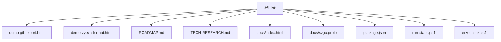
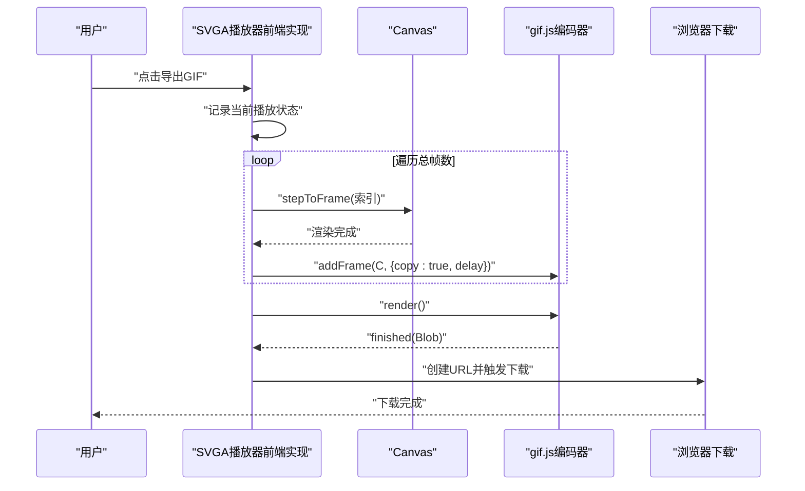
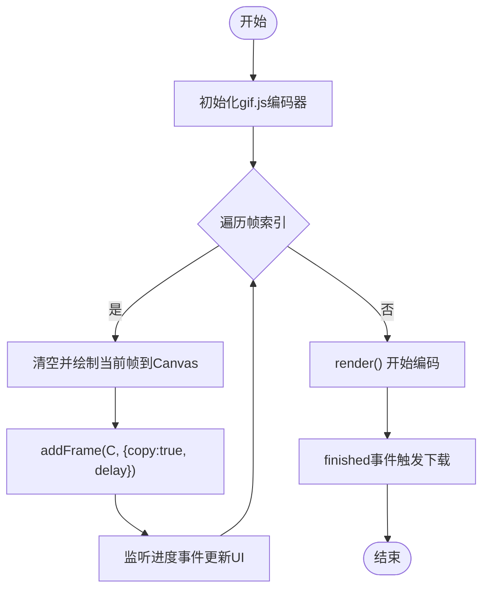
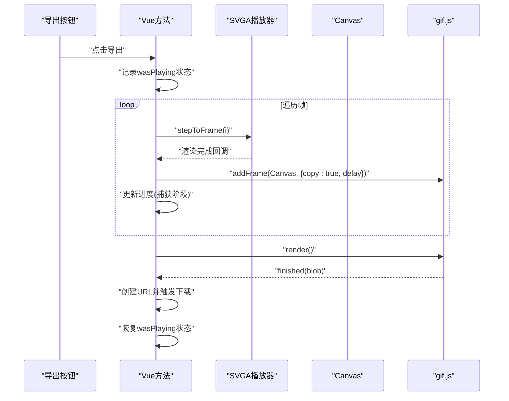

# GIF导出功能

<cite>
**本文引用的文件**
- [demo-gif-export.html](file://demo-gif-export.html)
- [demo-yyeva-format.html](file://demo-yyeva-format.html)
- [ROADMAP.md](file://ROADMAP.md)
- [TECH-RESEARCH.md](file://TECH-RESEARCH.md)
- [docs/index.html](file://docs/index.html)
- [docs/svga.proto](file://docs/svga.proto)
- [package.json](file://package.json)
- [run-static.ps1](file://run-static.ps1)
- [env-check.ps1](file://env-check.ps1)
</cite>

## 目录
1. [简介](#简介)
2. [项目结构](#项目结构)
3. [核心组件](#核心组件)
4. [架构总览](#架构总览)
5. [详细组件分析](#详细组件分析)
6. [依赖分析](#依赖分析)
7. [性能考量](#性能考量)
8. [故障排查指南](#故障排查指南)
9. [结论](#结论)
10. [附录](#附录)

## 简介
本文件聚焦于“GIF导出功能”的实现与使用，涵盖从技术调研、Demo验证到与SVGA播放器集成的完整流程。仓库提供了独立的GIF导出Demo页面，展示了基于gif.js的纯前端GIF编码思路；同时，路线图与技术文档明确了将SVGA动画导出为GIF的技术路径与最佳实践。此外，项目还包含YYEVA格式解析Demo，便于理解双通道视频的分离与合成过程，为后续MP4/双通道视频导出提供参考。

## 项目结构
- 文档与演示页面位于根目录，包含GIF导出Demo、YYEVA格式Demo以及VuePress文档站点。
- 文档站点中包含SVGA播放器的前端实现，其中已内建“导出为GIF”的核心流程逻辑。
- 技术文档与路线图明确了GIF导出的实现步骤、库选型与性能优化策略。

图表来源
- [demo-gif-export.html](file://demo-gif-export.html#L1-L308)
- [demo-yyeva-format.html](file://demo-yyeva-format.html#L1-L350)
- [ROADMAP.md](file://ROADMAP.md#L1-L370)
- [TECH-RESEARCH.md](file://TECH-RESEARCH.md#L1-L454)
- [docs/index.html](file://docs/index.html#L2053-L2701)
- [docs/svga.proto](file://docs/svga.proto#L1-L39)
- [package.json](file://package.json#L1-L19)
- [run-static.ps1](file://run-static.ps1#L1-L12)
- [env-check.ps1](file://env-check.ps1#L1-L103)

章节来源
- [demo-gif-export.html](file://demo-gif-export.html#L1-L308)
- [demo-yyeva-format.html](file://demo-yyeva-format.html#L1-L350)
- [ROADMAP.md](file://ROADMAP.md#L1-L370)
- [TECH-RESEARCH.md](file://TECH-RESEARCH.md#L1-L454)
- [docs/index.html](file://docs/index.html#L2053-L2701)
- [docs/svga.proto](file://docs/svga.proto#L1-L39)
- [package.json](file://package.json#L1-L19)
- [run-static.ps1](file://run-static.ps1#L1-L12)
- [env-check.ps1](file://env-check.ps1#L1-L103)

## 核心组件
- GIF导出Demo页面：展示gif.js的使用方式、逐帧采集与编码流程、进度反馈与下载。
- SVGA播放器前端实现：包含导出GIF的核心逻辑（跳帧、捕获Canvas帧、编码、下载）。
- 技术文档与路线图：明确GIF导出的技术方案、库选型、性能优化与风险评估。
- YYEVA格式Demo：演示双通道视频的分离与合成，为后续MP4导出提供思路。

章节来源
- [demo-gif-export.html](file://demo-gif-export.html#L1-L308)
- [docs/index.html](file://docs/index.html#L2053-L2701)
- [ROADMAP.md](file://ROADMAP.md#L48-L75)
- [TECH-RESEARCH.md](file://TECH-RESEARCH.md#L187-L295)
- [demo-yyeva-format.html](file://demo-yyeva-format.html#L1-L350)

## 架构总览
GIF导出的整体流程如下：
- 从SVGA播放器获取每帧Canvas内容；
- 将每帧Canvas数据加入GIF编码器；
- 使用gif.js在Web Worker中进行编码；
- 完成后生成Blob并触发下载。

图表来源
- [docs/index.html](file://docs/index.html#L2598-L2701)

章节来源
- [docs/index.html](file://docs/index.html#L2598-L2701)

## 详细组件分析

### 组件A：GIF导出Demo页面（demo-gif-export.html）
- 功能概览
  - Canvas动画预览：绘制旋转方块，支持开始/停止动画。
  - GIF导出：将Canvas逐帧渲染为GIF，支持进度反馈与下载。
- 关键实现点
  - 使用gif.js创建编码器，配置workers、quality、width、height与workerScript。
  - 监听进度事件与完成事件，更新UI并触发下载。
  - 逐帧绘制：临时绘制每帧到Canvas，调用addFrame并设置delay。
- 适用场景
  - 快速验证gif.js在浏览器中的可用性与性能表现。
  - 作为SVGA导出GIF的参考实现（逐帧采集与编码流程一致）。

图表来源
- [demo-gif-export.html](file://demo-gif-export.html#L216-L305)

章节来源
- [demo-gif-export.html](file://demo-gif-export.html#L1-L308)

### 组件B：SVGA播放器前端实现（docs/index.html）
- 功能概览
  - 加载SVGA文件，播放控制（播放/暂停/进度拖拽）、帧数显示。
  - 导出GIF：逐帧跳转到指定帧，捕获Canvas帧，编码并下载。
- 关键实现点
  - 计算每帧延迟：根据fps计算delay毫秒。
  - 进度反馈：导出阶段分为“捕获阶段”（0-50%）与“编码阶段”（50-100%）。
  - 错误处理：捕获帧失败、编码失败时恢复播放状态并提示。
  - 下载：创建URL并触发下载，随后释放URL。
- 适用场景
  - 将SVGA动画完整导出为GIF，支持自定义尺寸与质量（通过Canvas与gif.js参数）。

图表来源
- [docs/index.html](file://docs/index.html#L2598-L2701)

章节来源
- [docs/index.html](file://docs/index.html#L2053-L2701)

### 组件C：技术文档与路线图（ROADMAP.md、TECH-RESEARCH.md）
- 技术方案
  - SVGA → Canvas逐帧渲染 → GIF编码器 → 下载。
  - 推荐库：gif.js（体积小、支持Web Worker、API简洁）。
- 最佳实践
  - 限制尺寸与帧数，避免文件过大。
  - 使用Web Worker避免阻塞UI。
  - 显示进度条，提升用户体验。
- 风险与缓解
  - 大尺寸动画内存占用高，建议限制最大尺寸。
  - 编码速度受帧数与尺寸影响，可通过降低质量或帧数优化。

章节来源
- [ROADMAP.md](file://ROADMAP.md#L48-L75)
- [ROADMAP.md](file://ROADMAP.md#L237-L252)
- [TECH-RESEARCH.md](file://TECH-RESEARCH.md#L187-L295)

### 组件D：YYEVA格式Demo（demo-yyeva-format.html）
- 功能概览
  - 模拟双通道视频（左彩色/右Alpha）。
  - 分离左右通道，合成最终带透明效果的画面。
- 适用场景
  - 理解双通道布局与通道分离/合成原理，为后续MP4导出提供参考。

章节来源
- [demo-yyeva-format.html](file://demo-yyeva-format.html#L1-L350)

### 组件E：SVGA文件结构（docs/svga.proto）
- 作用
  - 描述SVGA文件的关键字段（如MovieParams、SpriteEntity、AudioEntity等），为解析与导出提供结构依据。
- 价值
  - 有助于理解SVGA的帧组织、图层与遮罩关系，指导逐帧渲染与素材替换。

章节来源
- [docs/svga.proto](file://docs/svga.proto#L1-L39)

## 依赖分析
- gif.js
  - 用途：纯前端GIF编码，支持Web Worker，体积小、性能好。
  - 引入方式：CDN或本地workerScript。
- @ffmpeg/ffmpeg（计划引入）
  - 用途：MP4合成（与GIF导出不同场景），体积较大，需CDN加速。
- lottie-web（已引入）
  - 用途：Lottie动画播放（与GIF导出同属预览与导出范畴）。
- svgaplayerweb（已引入）
  - 用途：SVGA播放（与GIF导出同属SVGA模块）。

章节来源
- [ROADMAP.md](file://ROADMAP.md#L290-L309)
- [TECH-RESEARCH.md](file://TECH-RESEARCH.md#L386-L408)
- [package.json](file://package.json#L1-L19)

## 性能考量
- 尺寸与帧数
  - GIF文件大小与宽高成正比，与帧数成正比。建议限制最大尺寸与最大帧数。
- Web Worker
  - 使用多Worker可避免UI阻塞，提升导出体验。
- 质量与延迟
  - 质量越低、帧率越低，文件越小、速度越快。
- 内存占用
  - 大尺寸动画可能占用大量内存，建议在导出前进行尺寸限制与帧采样。
- 进度反馈
  - 导出阶段分为“捕获阶段”和“编码阶段”，分别更新进度条，提升用户感知。

章节来源
- [TECH-RESEARCH.md](file://TECH-RESEARCH.md#L254-L287)
- [ROADMAP.md](file://ROADMAP.md#L311-L331)

## 故障排查指南
- 导出失败
  - 检查Canvas尺寸与帧数是否过大，适当降低质量或帧数。
  - 确认gif.js workerScript路径正确，确保CDN可用。
- UI卡顿
  - 增加workers数量，或降低导出质量与帧率。
- 下载失败
  - 确保finished事件触发后及时创建URL并触发下载，随后释放URL。
- 播放状态异常
  - 导出前暂停播放，导出完成后恢复播放状态。

章节来源
- [docs/index.html](file://docs/index.html#L2598-L2701)
- [demo-gif-export.html](file://demo-gif-export.html#L216-L305)

## 结论
- GIF导出在浏览器端具备成熟的实现路径：SVGA逐帧渲染 + gif.js编码 + Web Worker异步处理。
- 项目已提供独立Demo与前端实现两套验证方案，可快速落地。
- 技术文档与路线图明确了库选型、最佳实践与风险控制，便于持续优化与扩展。

## 附录
- 本地启动与环境检查
  - 使用提供的脚本启动静态服务器或检查环境依赖。
- 项目配置
  - package.json中包含VuePress与Element-UI依赖，文档站点基于VuePress构建。

章节来源
- [run-static.ps1](file://run-static.ps1#L1-L12)
- [env-check.ps1](file://env-check.ps1#L1-L103)
- [package.json](file://package.json#L1-L19)