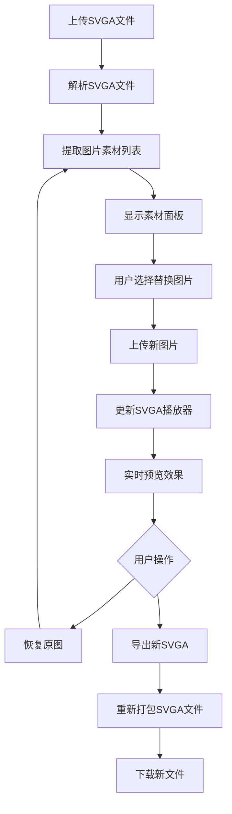
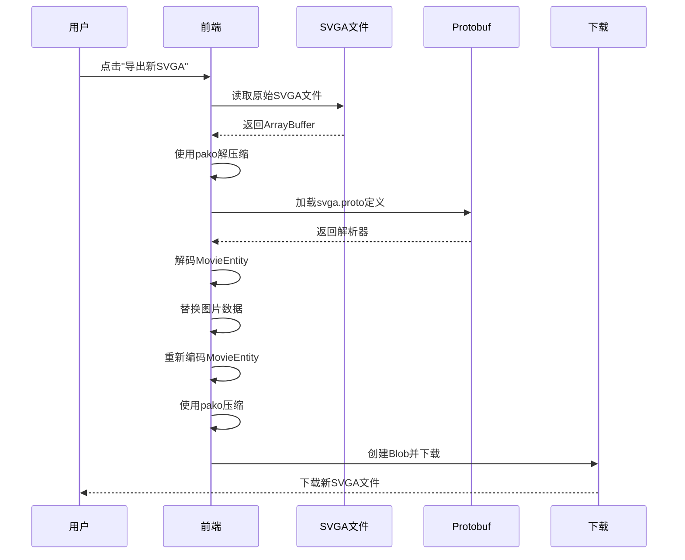
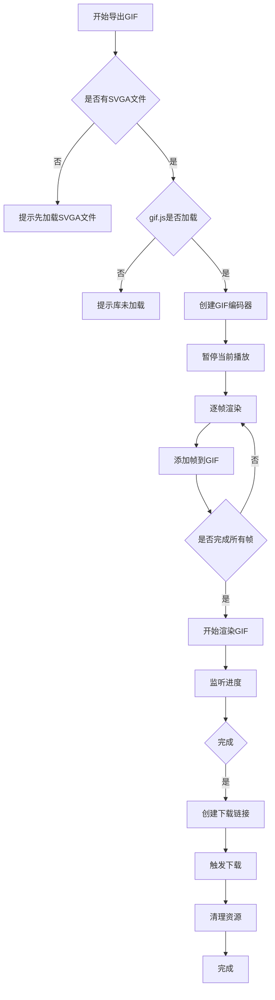
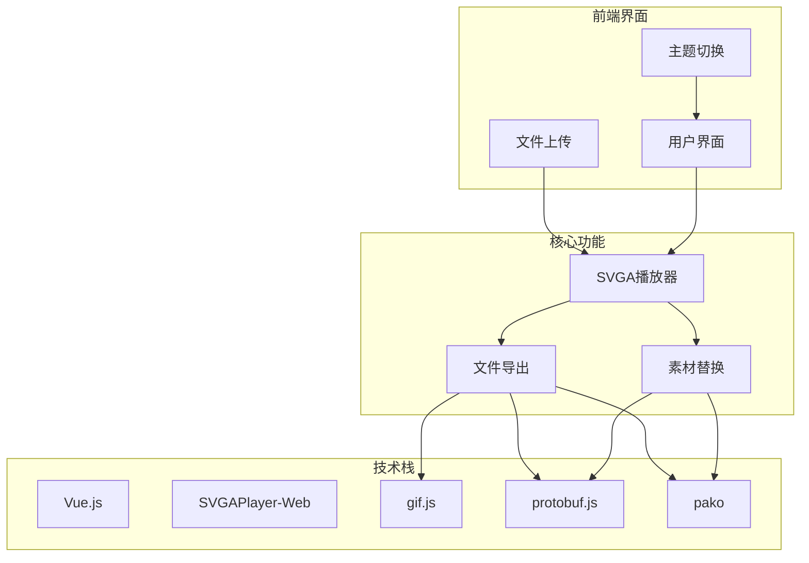
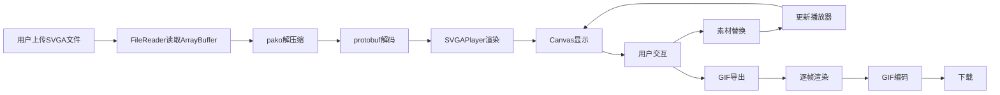
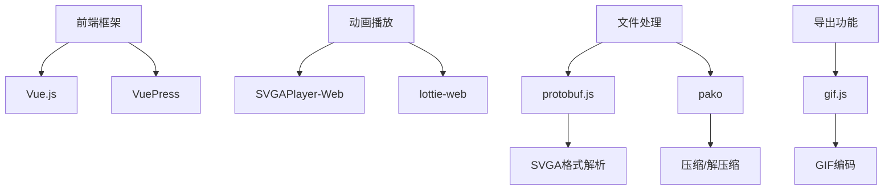

# SVGA素材替换与导出

<cite>
**本文档引用文件**   
- [index.html](file://docs/index.html)
- [ROADMAP.md](file://ROADMAP.md)
- [TECH-RESEARCH.md](file://TECH-RESEARCH.md)
- [svga.proto](file://docs/svga.proto)
- [demo-gif-export.html](file://demo-gif-export.html)
- [demo-yyeva-format.html](file://demo-yyeva-format.html)
- [package.json](file://package.json)
</cite>

## 目录
1. [简介](#简介)
2. [项目结构](#项目结构)
3. [核心功能](#核心功能)
4. [SVGA素材替换与导出](#svga素材替换与导出)
5. [GIF导出功能](#gif导出功能)
6. [技术架构](#技术架构)
7. [依赖库与技术栈](#依赖库与技术栈)
8. [开发路线图](#开发路线图)
9. [结论](#结论)

## 简介

本项目是一个支持SVGA、YYEVA-MP4和Lottie三种动画格式的在线预览与转换工具。其主要功能包括SVGA文件的预览、播放控制、主题切换、背景色切换、画布缩放与拖拽、拖拽上传文件、播放进度条与帧数显示等。项目特别关注SVGA格式的高级功能，如素材替换和导出为GIF或MP4格式。

**Section sources**
- [ROADMAP.md](file://ROADMAP.md#L1-L370)

## 项目结构

项目根目录包含以下主要文件和目录：
- `docs/`：存放文档和静态资源
- `node_modules/`：存放项目依赖
- `.gitignore`：Git忽略文件配置
- `404.html`：404页面
- `CNAME`：自定义域名配置
- `ROADMAP.md`：项目开发路线图
- `TECH-RESEARCH.md`：技术调研报告
- `demo-gif-export.html`：GIF导出功能演示
- `demo-yyeva-format.html`：YYEVA格式解析演示
- `env-check.ps1`：环境检查脚本
- `figma-mcp-example.md`：Figma MCP示例
- `package-lock.json`：npm包锁定文件
- `package.json`：项目配置文件
- `run-deploy.ps1`：部署脚本
- `run-static.ps1`：静态资源运行脚本

**Section sources**
- [project_structure](file://project_structure)

## 核心功能

项目已实现的基础预览功能包括：
- SVGA文件预览与播放控制
- 基础UI框架（顶部播放区 + 底部浮层）
- 暗黑/白天主题切换
- 背景色切换（6种颜色 + 透明网格）
- 画布缩放与拖拽
- 1:1显示、居中显示
- 拖拽上传文件
- 播放进度条与帧数显示
- 模块切换（SVGA/YYEVA/Lottie）

**Section sources**
- [ROADMAP.md](file://ROADMAP.md#L8-L21)

## SVGA素材替换与导出

### 素材替换功能

SVGA素材替换功能允许用户替换SVGA动画中的图片素材，预览替换后的效果，并重新导出替换后的SVGA文件。

#### 功能流程
1. 用户拖拽上传SVGA文件
2. 系统解析SVGA文件，提取可替换的图片素材
3. 用户在素材面板中选择要替换的图片
4. 用户上传新的图片素材
5. 系统实时预览替换效果
6. 用户可选择恢复原图或导出新的SVGA文件

#### 技术实现



**Diagram sources**
- [index.html](file://docs/index.html#L1631-L1691)
- [ROADMAP.md](file://ROADMAP.md#L30-L39)

### 导出新SVGA文件

导出新SVGA文件功能允许用户将替换素材后的动画重新打包为SVGA文件。

#### 技术要点
- 读取原始SVGA文件的二进制数据
- 使用pako库解压缩数据
- 使用protobuf.js加载SVGA协议定义
- 解码protobuf消息
- 替换指定图片的二进制数据
- 重新编码protobuf消息
- 使用pako库压缩数据
- 创建Blob并触发下载



**Diagram sources**
- [index.html](file://docs/index.html#L2453-L2544)
- [svga.proto](file://docs/svga.proto#L1-L132)

**Section sources**
- [index.html](file://docs/index.html#L2453-L2544)
- [ROADMAP.md](file://ROADMAP.md#L30-L39)

## GIF导出功能

### 功能描述

GIF导出功能将SVGA动画导出为GIF格式，支持自定义帧率、尺寸、质量，并显示导出进度。

#### 技术方案
```
SVGA → Canvas 逐帧渲染 → GIF 编码器 → 下载
```

#### 实现步骤
1. 遍历SVGA每一帧，使用Canvas渲染
2. 将每帧Canvas数据传递给GIF编码器
3. 合成GIF并触发下载

### 技术实现



**Diagram sources**
- [index.html](file://docs/index.html#L2563-L2710)
- [demo-gif-export.html](file://demo-gif-export.html#L1-L308)

**Section sources**
- [index.html](file://docs/index.html#L2563-L2710)
- [TECH-RESEARCH.md](file://TECH-RESEARCH.md#L187-L287)

## 技术架构

### 整体架构



**Diagram sources**
- [index.html](file://docs/index.html#L1694-L2793)
- [package.json](file://package.json#L1-L19)

### 数据流



**Diagram sources**
- [index.html](file://docs/index.html#L1869-L1912)
- [index.html](file://docs/index.html#L2563-L2710)

**Section sources**
- [index.html](file://docs/index.html#L1694-L2793)

## 依赖库与技术栈

### 核心依赖

| 库名 | 版本 | 用途 |
|------|------|------|
| vuepress | ^1.8.2 | 静态网站生成器 |
| element-ui | ^2.15.1 | UI组件库 |

### CDN引入库

| 库名 | 用途 |
|------|------|
| svgaplayerweb | SVGA播放 |
| lottie-web | Lottie播放 |
| gif.js | GIF导出 |
| protobuf.js | SVGA文件解析 |
| pako | zlib压缩/解压缩 |

### 技术选型



**Diagram sources**
- [package.json](file://package.json#L1-L19)
- [index.html](file://docs/index.html#L9-L18)

**Section sources**
- [package.json](file://package.json#L1-L19)
- [index.html](file://docs/index.html#L9-L18)

## 开发路线图

### 阶段1：基础预览功能 ✅
**状态：已完成**

#### 已实现功能
- ✅ SVGA 文件预览与播放控制
- ✅ 基础UI框架（顶部播放区 + 底部浮层）
- ✅ 暗黑/白天主题切换
- ✅ 背景色切换（6种颜色 + 透明网格）
- ✅ 画布缩放与拖拽
- ✅ 1:1 显示、居中显示
- ✅ 拖拽上传文件
- ✅ 播放进度条与帧数显示
- ✅ 模块切换（SVGA/YYEVA/Lottie）

### 阶段2：SVGA 高级功能
**目标：完善 SVGA 模块的导出与转换能力**

#### 2.1 素材替换功能
**优先级：高**

- 允许用户替换 SVGA 动画中的图片素材
- 预览替换后的效果
- 支持重新导出替换后的 SVGA 文件

#### 2.2 导出 GIF 功能
**优先级：高**

- 将 SVGA 动画导出为 GIF 格式
- 支持自定义帧率、尺寸、质量
- 显示导出进度

#### 2.3 转 YYEVA-MP4 功能
**优先级：中**

- 将 SVGA 转换为 YYEVA 格式的 MP4 视频
- YYEVA 格式：彩色通道 + Alpha 通道并排的视频

### 阶段3：YYEVA-MP4 与 Lottie 模块
**目标：完成多格式支持，实现格式互转**

#### 3.1 YYEVA-MP4 模块
- 文件解析与预览
- 播放控制
- 转 SVGA 功能

#### 3.2 Lottie 模块
- Lottie JSON 解析与预览
- 播放控制与功能完善

**Section sources**
- [ROADMAP.md](file://ROADMAP.md#L1-L370)

## 结论

本项目成功实现了SVGA文件的在线预览、素材替换和导出功能。通过使用Vue.js作为前端框架，结合SVGAPlayer-Web、protobuf.js、pako和gif.js等库，实现了完整的SVGA文件处理流程。素材替换功能通过解析SVGA文件的protobuf结构，允许用户替换其中的图片素材，并重新打包为新的SVGA文件。GIF导出功能通过逐帧渲染SVGA动画到Canvas，然后使用gif.js编码为GIF格式。项目架构清晰，功能完整，为用户提供了一个强大的SVGA动画处理工具。

**Section sources**
- [ROADMAP.md](file://ROADMAP.md#L1-L370)
- [TECH-RESEARCH.md](file://TECH-RESEARCH.md#L1-L454)
- [index.html](file://docs/index.html#L1-L2796)