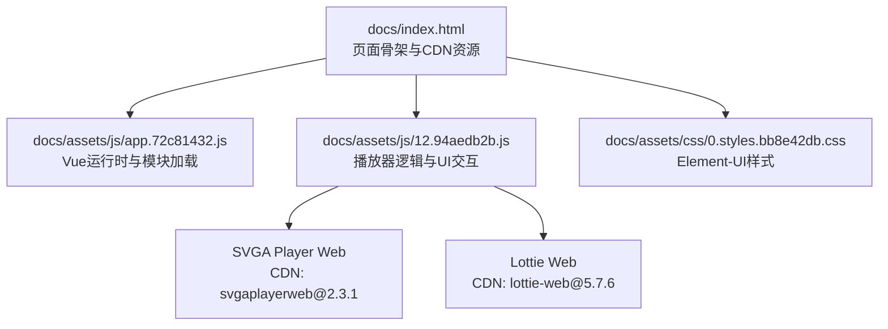
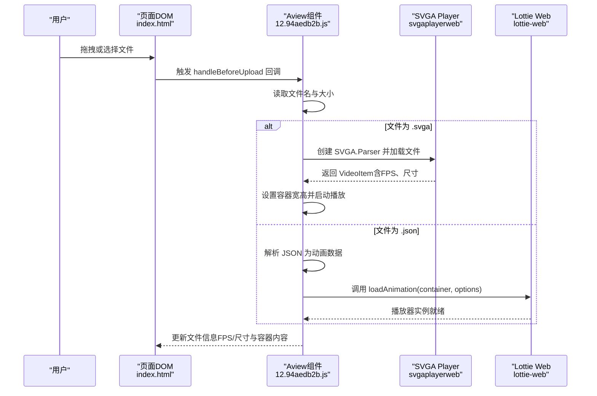
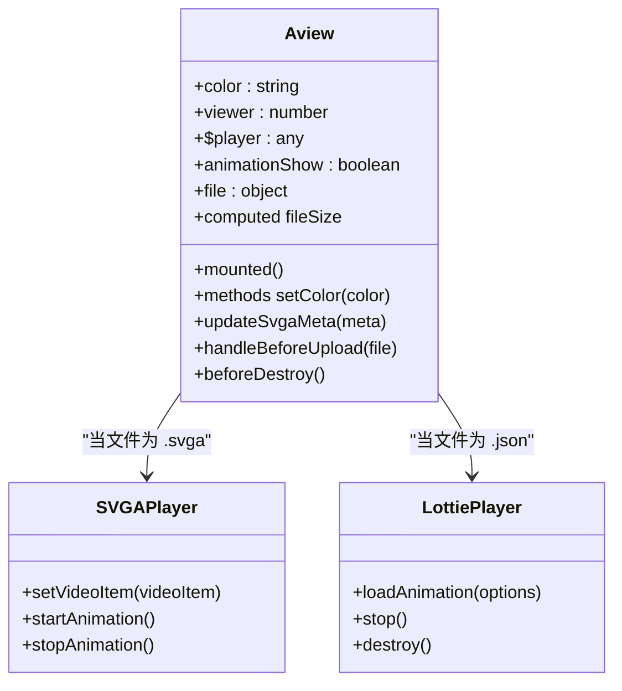
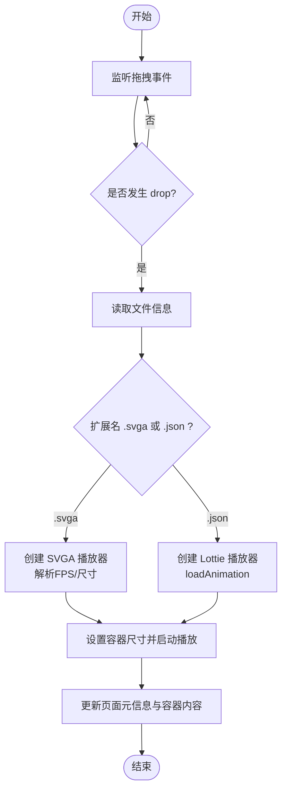
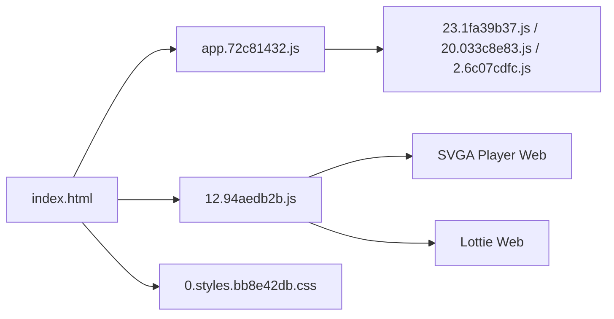

# 核心功能

<cite>
**本文引用的文件**
- [README.md](file://README.md)
- [package.json](file://package.json)
- [docs/index.html](file://docs/index.html)
- [docs/404.html](file://docs/404.html)
- [docs/assets/js/12.94aedb2b.js](file://docs/assets/js/12.94aedb2b.js)
- [docs/assets/js/23.1fa39b37.js](file://docs/assets/js/23.1fa39b37.js)
- [docs/assets/js/20.033c8e83.js](file://docs/assets/js/20.033c8e83.js)
- [docs/assets/js/2.6c07cdfc.js](file://docs/assets/js/2.6c07cdfc.js)
- [docs/assets/js/7.c4a311d8.js](file://docs/assets/js/7.c4a311d8.js)
- [docs/assets/js/app.72c81432.js](file://docs/assets/js/app.72c81432.js)
- [docs/assets/css/0.styles.bb8e42db.css](file://docs/assets/css/0.styles.bb8e42db.css)
- [docs/help.md](file://docs/help.md)
</cite>

## 更新摘要
**变更内容**
- 新增帮助系统功能，用户可通过界面右上角的帮助按钮，悬停查看从 `docs/help.md` 异步加载的 Markdown 格式帮助内容。
- 在 `index.html` 中添加了帮助按钮的 UI 元素和相关样式，并通过 Vue 实例的 `mounted` 钩子函数调用 `loadHelpContent` 方法实现异步加载。
- 帮助内容提供了关于预览播放、高级功能和性能提示的即时指引，增强了用户体验。

## 目录
1. [简介](#简介)
2. [项目结构](#项目结构)
3. [核心组件](#核心组件)
4. [架构总览](#架构总览)
5. [详细组件分析](#详细组件分析)
6. [依赖关系分析](#依赖关系分析)
7. [性能考量](#性能考量)
8. [故障排查指南](#故障排查指南)
9. [结论](#结论)
10. [附录](#附录)

## 简介
本项目提供一个基于浏览器的在线预览工具，用于展示 SVGA 与 Lottie 动画。页面通过 CDN 加载 Vue 与播放器库，采用拖拽上传方式接收本地文件，自动识别文件类型并调用对应播放器进行渲染。该文档聚焦于 index.html 的实现机制、用户交互流程、数据流、使用示例、技术特性与兼容性、性能优化建议以及常见问题排查。

## 项目结构
- 文档站点由 VuePress 构建，入口为 docs/index.html，包含页面骨架、样式与脚本资源。
- 播放器逻辑集中在打包后的 JS 文件中（如 docs/assets/js/12.94aedb2b.js），负责：
  - 初始化 SVGA Player 或 Lottie Web 播放器
  - 处理文件拖拽与上传事件
  - 自动识别 .svga 与 .json 动画文件并启动播放
  - 动态调整播放容器尺寸以适配不同动画规格

**图表来源**
- [docs/index.html](file://docs/index.html#L1-L21)
- [docs/assets/js/app.72c81432.js](file://docs/assets/js/app.72c81432.js#L1-L38)
- [docs/assets/js/12.94aedb2b.js](file://docs/assets/js/12.94aedb2b.js#L1-L1)
- [docs/assets/css/0.styles.bb8e42db.css](file://docs/assets/css/0.styles.bb8e42db.css#L1-L1)

**章节来源**
- [README.md](file://README.md#L1-L3)
- [package.json](file://package.json#L1-L18)
- [docs/index.html](file://docs/index.html#L1-L21)

## 核心组件
- 页面骨架与资源加载
  - index.html 引入 Vue、SVGA Player Web 与 Lottie Web 的 CDN 资源，并预加载静态资源以提升首屏性能。
- 播放器容器与交互
  - 通过 Element-UI 提供的上传组件与按钮，实现拖拽上传与点击上传两种方式。
  - 播放器逻辑封装在 Aview 组件中，负责：
    - 识别文件扩展名（.svga 与 .json）
    - 使用 FileReader 读取二进制或文本内容
    - 初始化对应播放器实例并开始播放
    - 动态计算并设置播放容器宽高，适配动画原始尺寸
- 元数据展示
  - 对于 SVGA 动画，解析 FPS 与视频尺寸并在页面上显示；对于 Lottie 动画，显示文件名与大小。
- **帮助系统**
  - 在界面右上角新增帮助按钮（`.help-button`），用户悬停时可查看帮助内容弹窗（`.help-popup`）。
  - 帮助内容通过 `fetch('./help.md')` 异步加载 `docs/help.md` 文件，并使用 `marked.parse()` 将 Markdown 内容解析为 HTML。
  - 帮助内容包含预览播放、SVGA 高级玩法、特色工具和性能提示等即时指引。

**章节来源**
- [docs/index.html](file://docs/index.html#L1-L21)
- [docs/assets/js/12.94aedb2b.js](file://docs/assets/js/12.94aedb2b.js#L1-L1)
- [docs/assets/js/23.1fa39b37.js](file://docs/assets/js/23.1fa39b37.js#L1-L1)
- [docs/assets/js/20.033c8e83.js](file://docs/assets/js/20.033c8e83.js#L1-L1)
- [docs/assets/js/2.6c07cdfc.js](file://docs/assets/js/2.6c07cdfc.js#L1-L1)
- [docs/assets/js/7.c4a311d8.js](file://docs/assets/js/7.c4a311d8.js#L1-L1)
- [docs/help.md](file://docs/help.md#L1-L23)

## 架构总览
下图展示了从用户上传到动画渲染的关键路径与组件协作关系。

**图表来源**
- [docs/index.html](file://docs/index.html#L1-L21)
- [docs/assets/js/12.94aedb2b.js](file://docs/assets/js/12.94aedb2b.js#L1-L1)

## 详细组件分析

### 播放器初始化与控制（Aview 组件）
- 关键职责
  - 监听拖拽与 drop 事件，触发文件上传处理
  - 识别文件类型并创建对应播放器实例
  - 计算播放容器尺寸，保证动画比例正确
  - 销毁旧播放器实例，避免内存泄漏
- 数据结构与算法
  - 文件读取：FileReader 同步读取 ArrayBuffer 或文本，再交由播放器解析
  - 容器尺寸计算：根据动画原始尺寸与最大限制，按比例缩放并设置容器高度
  - 播放器生命周期：destroy -> create -> startAnimation 或 loadAnimation
- 依赖链
  - 依赖 Vue 运行时与 Element-UI 组件
  - 依赖 SVGA Player Web 与 Lottie Web 的全局对象
  - 依赖预加载的 CSS 样式资源

**图表来源**
- [docs/assets/js/12.94aedb2b.js](file://docs/assets/js/12.94aedb2b.js#L1-L1)

**章节来源**
- [docs/assets/js/12.94aedb2b.js](file://docs/assets/js/12.94aedb2b.js#L1-L1)

### 用户交互流程（拖拽上传）
- 事件绑定
  - 在容器元素上注册 dragover 与 drop 事件，阻止默认行为并提取拖拽文件
- 文件处理
  - 读取文件名与大小，清空旧播放器状态
  - 根据扩展名判断类型并创建对应播放器实例
  - 对于 SVGA，解析 FPS 与尺寸并更新页面元信息；对于 Lottie，直接启动播放
- UI 反馈
  - 显示文件名、大小、FPS（SVGA）、尺寸（SVGA）

**图表来源**
- [docs/index.html](file://docs/index.html#L1-L21)
- [docs/assets/js/12.94aedb2b.js](file://docs/assets/js/12.94aedb2b.js#L1-L1)

**章节来源**
- [docs/index.html](file://docs/index.html#L1-L21)
- [docs/assets/js/12.94aedb2b.js](file://docs/assets/js/12.94aedb2b.js#L1-L1)

### 技术特点与兼容性
- SVGA Player Web
  - 基于 Canvas/SVG 的播放器，适合复杂矢量与逐帧动画
  - 需要 .svga 文件，解析后可获得 FPS 与视频尺寸
  - 通过 setVideoItem 与 startAnimation 控制播放
- Lottie Web
  - 基于 JSON 的动画描述，适合矢量动画与轻量级动效
  - 需要 .json 文件，通过 loadAnimation(container, options) 启动
  - 支持 loop、autoplay 等常用参数
- 兼容性
  - 依赖现代浏览器的 Canvas 与 Web Workers（若启用）
  - CDN 资源在部分网络环境下可能受限，建议离线部署或使用稳定镜像

**章节来源**
- [docs/assets/js/12.94aedb2b.js](file://docs/assets/js/12.94aedb2b.js#L1-L1)

### 使用示例
- 在页面中嵌入播放器
  - 打开 docs/index.html，将动画文件拖拽至“将文件拖到此处，或点击上传”的区域
  - 若为 .svga 文件，页面会显示 FPS 与尺寸；若为 .json 文件，页面会显示文件名与大小
- 设置播放参数
  - 背景颜色：通过颜色按钮切换容器背景色
  - 屏幕方向：切换横屏/竖屏模式，影响容器布局
  - 播放器参数：Lottie 播放器默认使用 canvas 渲染、循环播放与自动播放；SVGA 播放器根据解析结果自动设置尺寸
- **帮助系统使用**
  - 用户可将鼠标悬停在界面右上角的帮助按钮（问号图标）上，即可查看从 `docs/help.md` 加载的实时帮助内容。
  - 帮助内容包含预览播放、SVGA 高级玩法、特色工具和性能提示等即时指引，无需离开当前页面即可获取操作说明。

**章节来源**
- [docs/index.html](file://docs/index.html#L1-L21)
- [docs/assets/js/12.94aedb2b.js](file://docs/assets/js/12.94aedb2b.js#L1-L1)
- [docs/help.md](file://docs/help.md#L1-L23)

## 依赖关系分析
- 外部库
  - Vue：页面框架与组件系统
  - Element-UI：上传、按钮、单选等 UI 组件
  - SVGA Player Web：SVGA 动画播放
  - Lottie Web：Lottie 动画播放
- 内部模块
  - app.72c81432.js：Vue 运行时与模块加载器
  - 12.94aedb2b.js：播放器逻辑与 UI 交互
  - 23.1fa39b37.js、20.033c8e83.js、2.6c07cdfc.js：VuePress 主题与侧边栏等组件
  - 7.c4a311d8.js：404 页面主题组件
  - 0.styles.bb8e42db.css：Element-UI 样式

**图表来源**
- [docs/index.html](file://docs/index.html#L1-L21)
- [docs/assets/js/app.72c81432.js](file://docs/assets/js/app.72c81432.js#L1-L38)
- [docs/assets/js/12.94aedb2b.js](file://docs/assets/js/12.94aedb2b.js#L1-L1)
- [docs/assets/css/0.styles.bb8e42db.css](file://docs/assets/css/0.styles.bb8e42db.css#L1-L1)

**章节来源**
- [package.json](file://package.json#L1-L18)
- [docs/index.html](file://docs/index.html#L1-L21)

## 性能考量
- 资源预加载与懒加载
  - index.html 中使用 rel="preload" 与 rel="prefetch" 预加载关键 CSS 与 JS，减少首屏等待
  - VuePress 的分块加载机制通过动态 import 实现按需加载
- 播放器性能
  - SVGA：优先使用 Canvas 渲染，避免过度复杂滤镜；合理设置 FPS 与分辨率
  - Lottie：使用 canvas 渲染器，避免过多层级与复杂遮罩；必要时降低帧率或分辨率
- 容器尺寸与缩放
  - 根据动画原始尺寸按比例缩放，避免超大画布导致卡顿
- 内存管理
  - 切换动画时先销毁旧播放器实例，释放 DOM 与资源

**章节来源**
- [docs/index.html](file://docs/index.html#L1-L21)
- [docs/assets/js/12.94aedb2b.js](file://docs/assets/js/12.94aedb2b.js#L1-L1)

## 故障排查指南
- 加载失败
  - 现象：页面空白或报错
  - 排查：检查 CDN 是否可用；确认 index.html 中的 script 与 link 是否成功加载
  - 参考：docs/index.html 与 docs/404.html 的资源加载配置
- 格式不支持
  - 现象：无法播放或无任何反馈
  - 排查：确认文件扩展名为 .svga 或 .json；确保文件未损坏
  - 参考：Aview 组件中的文件类型判断逻辑
- 播放异常
  - 现象：动画卡顿或黑屏
  - 排查：尝试切换背景色、调整容器尺寸；检查浏览器控制台错误；确认动画文件本身是否符合规范
- 404 页面
  - 现象：访问不存在路径跳转到 404
  - 排查：确认路径正确；查看 docs/404.html 的主题组件与路由配置
- **帮助系统加载失败**
  - 现象：悬停帮助按钮无内容显示或显示“无法加载帮助文档”
  - 排查：检查 `docs/help.md` 文件是否存在且路径正确；确认网络连接正常；检查浏览器控制台是否有 `fetch` 请求错误。
  - 参考：`index.html` 中的 `loadHelpContent` 方法实现。

**章节来源**
- [docs/index.html](file://docs/index.html#L1-L21)
- [docs/404.html](file://docs/404.html#L1-L23)
- [docs/assets/js/7.c4a311d8.js](file://docs/assets/js/7.c4a311d8.js#L1-L1)
- [docs/assets/js/12.94aedb2b.js](file://docs/assets/js/12.94aedb2b.js#L1-L1)

## 结论
本项目通过简洁的页面与模块化的播放器逻辑，实现了 SVGA 与 Lottie 动画的在线预览。其核心在于：
- 通过 CDN 快速引入播放器库
- 基于拖拽上传的直观交互
- 自动识别与适配不同动画格式
- 合理的资源加载策略与播放器生命周期管理
- **新增的帮助系统**通过异步加载 Markdown 内容，为用户提供了即时的操作指引，显著提升了用户体验。

在实际使用中，建议结合性能优化与兼容性测试，确保在不同设备与网络环境下获得稳定的预览体验。

## 附录
- 开发与构建
  - 使用 VuePress 进行文档站点构建，开发与构建脚本见 package.json
- 资源清单
  - docs/index.html：页面骨架与资源加载
  - docs/assets/js/*：Vue 运行时、主题组件与播放器逻辑
  - docs/assets/css/0.styles.bb8e42db.css：Element-UI 样式
  - docs/help.md：帮助系统内容源文件

**章节来源**
- [package.json](file://package.json#L1-L18)
- [docs/index.html](file://docs/index.html#L1-L21)
- [docs/assets/js/app.72c81432.js](file://docs/assets/js/app.72c81432.js#L1-L38)
- [docs/assets/js/12.94aedb2b.js](file://docs/assets/js/12.94aedb2b.js#L1-L1)
- [docs/assets/css/0.styles.bb8e42db.css](file://docs/assets/css/0.styles.bb8e42db.css#L1-L1)
- [docs/help.md](file://docs/help.md#L1-L23)