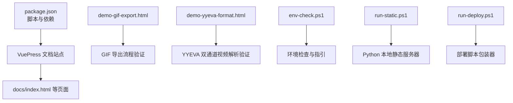
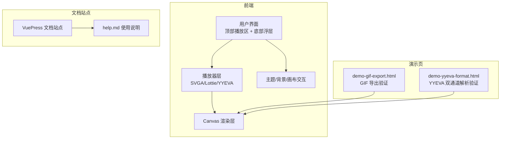
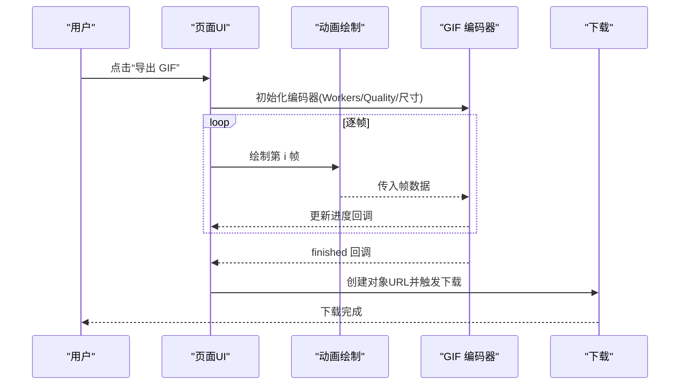
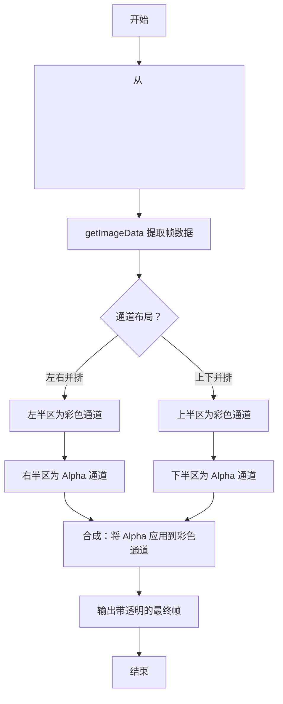
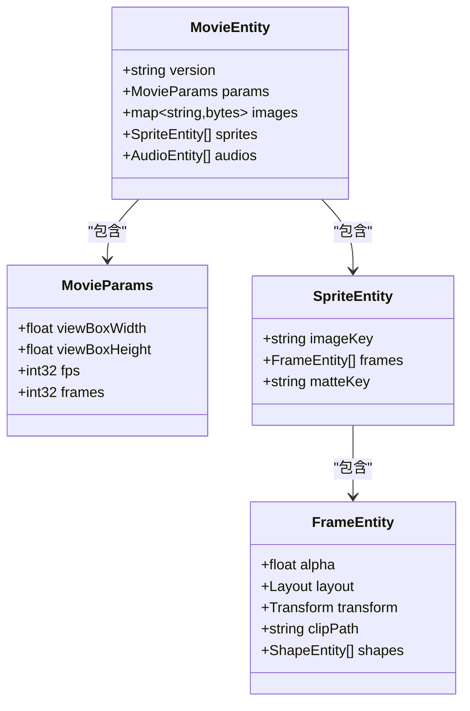
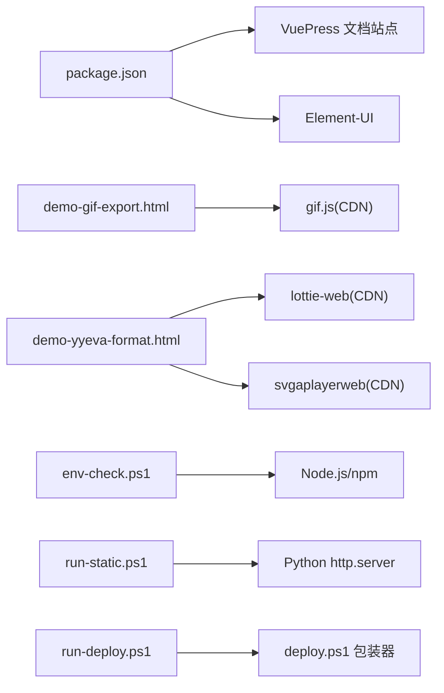

# 阶段1开发记录

<cite>
**本文引用的文件**
- [package.json](file://package.json)
- [ROADMAP.md](file://ROADMAP.md)
- [TECH-RESEARCH.md](file://TECH-RESEARCH.md)
- [docs/help.md](file://docs/help.md)
- [docs/svga.proto](file://docs/svga.proto)
- [demo-gif-export.html](file://demo-gif-export.html)
- [demo-yyeva-format.html](file://demo-yyeva-format.html)
- [env-check.ps1](file://env-check.ps1)
- [run-deploy.ps1](file://run-deploy.ps1)
- [run-static.ps1](file://run-static.ps1)
</cite>

## 目录
1. [引言](#引言)
2. [项目结构](#项目结构)
3. [核心组件](#核心组件)
4. [架构总览](#架构总览)
5. [详细组件分析](#详细组件分析)
6. [依赖分析](#依赖分析)
7. [性能考量](#性能考量)
8. [故障排查指南](#故障排查指南)
9. [结论](#结论)
10. [附录](#附录)

## 引言
本阶段聚焦于“基础预览功能”的落地与验证，目标是完成对 SVGA、YYEVA-MP4、Lottie 三种动画格式的在线预览与播放控制，并配套基础 UI（顶部播放区 + 底部浮层）、主题切换、背景色切换、画布缩放与拖拽、1:1 展示、拖拽上传、播放进度与帧数显示、模块切换等能力。同时，结合技术调研文档，为后续阶段（如 GIF 导出、SVGA 素材替换、YYEVA-MP4 与 Lottie 的互转）奠定基础。

## 项目结构
仓库采用“文档站点 + 演示页 + 脚本”的组织方式：
- 文档站点：基于 VuePress 构建，用于发布使用说明、技术路线与阶段性成果。
- 演示页：独立 HTML 文件，用于快速验证关键技术点（如 GIF 导出、YYEVA 双通道视频解析）。
- 脚本：PowerShell 与 Python 脚本，辅助环境检查、本地静态服务器启动与部署流程。

图表来源
- [package.json](file://package.json#L1-L19)
- [demo-gif-export.html](file://demo-gif-export.html#L1-L308)
- [demo-yyeva-format.html](file://demo-yyeva-format.html#L1-L350)
- [env-check.ps1](file://env-check.ps1#L1-L103)
- [run-static.ps1](file://run-static.ps1#L1-L12)
- [run-deploy.ps1](file://run-deploy.ps1#L1-L15)

章节来源
- [package.json](file://package.json#L1-L19)
- [ROADMAP.md](file://ROADMAP.md#L1-L120)

## 核心组件
- 基础预览与播放控制：支持拖拽上传 SVGA/Lottie/YYEVA 文件，提供播放/暂停、进度条拖拽、帧数显示、循环播放等。
- UI 布局：顶部播放区 + 底部浮层，便于操作与信息展示。
- 主题与背景：支持暗黑/白天主题切换；支持 6 种背景色 + 透明网格，便于检查透明度。
- 画布交互：支持缩放、拖拽、1:1 显示、居中显示。
- 模块切换：支持在 SVGA/YYEVA/Lottie 之间切换。
- 技术验证：通过演示页验证 GIF 导出与 YYEVA 双通道解析的关键路径。

章节来源
- [ROADMAP.md](file://ROADMAP.md#L8-L22)
- [docs/help.md](file://docs/help.md#L1-L22)

## 架构总览
阶段1的系统由“文档站点 + 演示页 + 脚本”构成，核心流程围绕“文件拖拽 -> 解析 -> 渲染 -> 控制 -> 导出/预览”展开。SVGA 与 Lottie 通过各自播放器渲染到 Canvas；YYEVA-MP4 通过 <video> + Canvas 解析双通道并合成透明效果。

图表来源
- [demo-gif-export.html](file://demo-gif-export.html#L1-L308)
- [demo-yyeva-format.html](file://demo-yyeva-format.html#L1-L350)
- [docs/help.md](file://docs/help.md#L1-L22)

## 详细组件分析

### 组件A：GIF 导出流程（demo-gif-export.html）
该演示页验证了“Canvas 逐帧 -> GIF 编码器 -> 下载”的完整链路，包含进度反馈与 Web Worker 使用，确保导出过程不阻塞 UI。

图表来源
- [demo-gif-export.html](file://demo-gif-export.html#L1-L308)

章节来源
- [demo-gif-export.html](file://demo-gif-export.html#L1-L308)
- [TECH-RESEARCH.md](file://TECH-RESEARCH.md#L188-L295)

### 组件B：YYEVA 双通道视频解析（demo-yyeva-format.html）
该演示页验证了“视频帧提取 -> 左右/上下通道分离 -> 合成透明效果”的关键路径，支持左右并排布局的典型实现。

图表来源
- [demo-yyeva-format.html](file://demo-yyeva-format.html#L1-L350)
- [TECH-RESEARCH.md](file://TECH-RESEARCH.md#L1-L108)

章节来源
- [demo-yyeva-format.html](file://demo-yyeva-format.html#L1-L350)
- [TECH-RESEARCH.md](file://TECH-RESEARCH.md#L1-L108)

### 组件C：SVGA 结构与素材替换（docs/svga.proto）
SVGA 文件采用 Protobuf 格式，核心包含动画参数、位图映射、精灵元素（含帧列表）、音频实体等。素材替换的关键在于识别 imageKey 并重新打包。

图表来源
- [docs/svga.proto](file://docs/svga.proto#L1-L132)

章节来源
- [docs/svga.proto](file://docs/svga.proto#L1-L132)
- [ROADMAP.md](file://ROADMAP.md#L24-L45)

### 组件D：阶段1路线与优先级（ROADMAP.md）
- 阶段1：基础预览功能已完成，覆盖 SVGA/Lottie/YYEVA 的预览与播放控制、UI 框架、主题/背景、画布交互、模块切换等。
- 阶段2：计划完善 SVGA 的高级能力（素材替换、GIF 导出、YYEVA-MP4 转换）。
- 阶段3：完善 YYEVA-MP4 与 Lottie 的互转与播放控制。

章节来源
- [ROADMAP.md](file://ROADMAP.md#L1-L120)

### 组件E：使用帮助与特性（docs/help.md）
- 支持拖拽预览：SVGA、Lottie、YYEVA。
- 播放控制：播放/暂停、进度条拖拽、帧数显示、循环播放。
- 画布交互：缩放、拖拽、1:1、居中。
- 主题与背景：暗黑/白天主题、6 种背景色 + 透明网格。
- 高级能力：素材替换、导出新 SVGA、导出 GIF。
- 性能提示：GIF 导出使用 Web Worker，避免卡顿。

章节来源
- [docs/help.md](file://docs/help.md#L1-L22)

## 依赖分析
- 构建与文档：VuePress 作为文档站点工具，Element-UI 作为 UI 组件库。
- 技术验证：演示页通过 CDN 引入 gif.js、lottie-web、svgaplayerweb 等库，验证关键路径。
- 环境与脚本：PowerShell 脚本用于环境检查与部署包装；Python 脚本用于本地静态服务器。

图表来源
- [package.json](file://package.json#L1-L19)
- [demo-gif-export.html](file://demo-gif-export.html#L1-L308)
- [demo-yyeva-format.html](file://demo-yyeva-format.html#L1-L350)
- [env-check.ps1](file://env-check.ps1#L1-L103)
- [run-static.ps1](file://run-static.ps1#L1-L12)
- [run-deploy.ps1](file://run-deploy.ps1#L1-L15)

章节来源
- [package.json](file://package.json#L1-L19)
- [TECH-RESEARCH.md](file://TECH-RESEARCH.md#L386-L407)

## 性能考量
- GIF 导出：使用 Web Worker 分离编码任务，避免阻塞 UI；建议限制帧数与尺寸，以控制文件大小与内存占用。
- YYEVA 解析：大分辨率视频可能带来性能压力，建议在预览区限制最大尺寸或采用分块策略。
- SVGA/Lottie：逐帧渲染到 Canvas 时注意帧率与画布尺寸，必要时降低默认质量或帧率以适配移动端。
- ffmpeg.wasm：体积较大且编码较慢，建议懒加载与进度提示，或考虑服务端转换（未来优化）。

章节来源
- [TECH-RESEARCH.md](file://TECH-RESEARCH.md#L254-L287)
- [TECH-RESEARCH.md](file://TECH-RESEARCH.md#L378-L383)
- [ROADMAP.md](file://ROADMAP.md#L312-L331)

## 故障排查指南
- 环境检查：使用 PowerShell 脚本检查 Node.js、npm、可选工具（winget/yarn/pnpm）与项目依赖状态，按提示安装或修复。
- 本地预览：若未安装依赖，脚本会提示先执行安装命令；随后可通过 npm run dev 启动文档站点。
- 静态服务器：Python 本地服务器用于快速预览 docs 目录下的静态页面，访问 http://localhost:8080/index.html。
- 部署脚本：run-deploy.ps1 作为 deploy.ps1 的包装器，绕过执行策略运行部署脚本。

章节来源
- [env-check.ps1](file://env-check.ps1#L1-L103)
- [run-static.ps1](file://run-static.ps1#L1-L12)
- [run-deploy.ps1](file://run-deploy.ps1#L1-L15)

## 结论
阶段1已达成基础预览与播放控制的目标，完成了 SVGA、YYEVA-MP4、Lottie 的预览与 UI 能力，并通过演示页验证了 GIF 导出与 YYEVA 双通道解析的关键路径。结合路线图与技术调研，为后续阶段（素材替换、导出 GIF、YYEVA-MP4 与 Lottie 互转）提供了清晰的技术方向与实施依据。

## 附录
- 使用帮助与特性概览见文档：[docs/help.md](file://docs/help.md#L1-L22)
- 技术路线与优先级：[ROADMAP.md](file://ROADMAP.md#L1-L120)
- 技术调研与最佳实践：[TECH-RESEARCH.md](file://TECH-RESEARCH.md#L1-L454)
- SVGA 文件结构（Protobuf）：[docs/svga.proto](file://docs/svga.proto#L1-L132)
- GIF 导出示例：[demo-gif-export.html](file://demo-gif-export.html#L1-L308)
- YYEVA 双通道解析示例：[demo-yyeva-format.html](file://demo-yyeva-format.html#L1-L350)
- 环境检查脚本：[env-check.ps1](file://env-check.ps1#L1-L103)
- 部署脚本包装器：[run-deploy.ps1](file://run-deploy.ps1#L1-L15)
- 本地静态服务器脚本：[run-static.ps1](file://run-static.ps1#L1-L12)