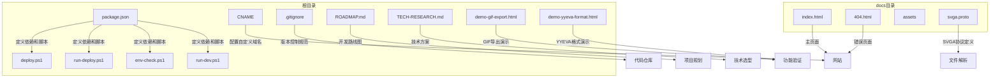
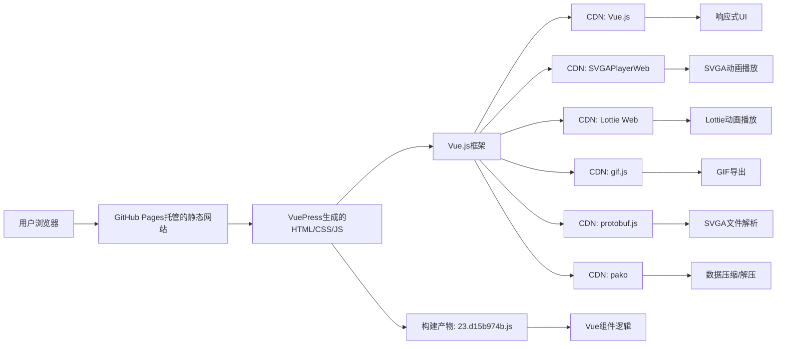

# 项目概述

<cite>
**本文档引用的文件**   
- [README.md](file://README.md)
- [package.json](file://package.json)
- [docs/index.html](file://docs/index.html)
- [deploy.ps1](file://deploy.ps1)
- [run-deploy.ps1](file://run-deploy.ps1)
- [env-check.ps1](file://env-check.ps1)
- [run-dev.ps1](file://run-dev.ps1)
- [CNAME](file://CNAME)
- [.gitignore](file://.gitignore)
- [docs/assets/js/23.d15b974b.js](file://docs/assets/js/23.d15b974b.js)
- [ROADMAP.md](file://ROADMAP.md)
- [TECH-RESEARCH.md](file://TECH-RESEARCH.md)
- [demo-gif-export.html](file://demo-gif-export.html)
- [docs/svga.proto](file://docs/svga.proto)
</cite>

## 更新摘要
**已更新内容**   
- 更新了**项目结构**部分，增加了对`.gitignore`文件中改进的版本控制规范的描述
- 扩展了**核心功能**部分，详细介绍了`index.html`中增强的交互式预览器界面，包括屏幕方向切换和背景色选择功能
- 更新了**架构与技术选型**部分，说明了新的JavaScript构建产物`23.d15b974b.js`在项目中的角色和加载方式
- 更新了**依赖关系与构建流程**部分，反映了`package.json`中的构建脚本配置
- **新增**了**新功能模块**部分，重点介绍了SVGA素材替换、GIF导出和SVGA文件导出等高级功能
- **新增**了**技术演进与路线图**部分，阐述了项目从预览工具到综合性动画处理平台的演进过程

## 目录
1. [简介](#简介)
2. [项目结构](#项目结构)
3. [核心功能](#核心功能)
4. [新功能模块](#新功能模块)
5. [架构与技术选型](#架构与技术选型)
6. [依赖关系与构建流程](#依赖关系与构建流程)
7. [部署机制](#部署机制)
8. [适用场景与局限性](#适用场景与局限性)
9. [常见问题解决思路](#常见问题解决思路)
10. [技术演进与路线图](#技术演进与路线图)
11. [结论](#结论)

## 简介

svga.preview项目已从一个专注于SVGA和Lottie动画在线预览的工具，演进为一个支持动画预览、导出、转换和编辑的综合性平台。项目旨在为开发者和设计师提供一个功能全面的在线工作台，用于处理多种动画格式。其设计目的明确，即简化动画工作流程，提高开发和设计效率。项目利用VuePress作为静态网站生成器，结合CDN集成的Vue.js、SVGAPlayerWeb、Lottie Web、gif.js等库，构建了一个轻量级、高性能的在线服务。这种架构不仅保证了项目的易用性和可访问性，还确保了动画播放和处理的流畅性。通过集成多种前端技术，项目实现了从简单的预览到复杂的动画格式转换和编辑的跨越。

**Section sources**
- [README.md](file://README.md#L1-L3)
- [ROADMAP.md](file://ROADMAP.md#L4)

## 项目结构

项目采用典型的静态网站结构，根目录下包含源代码、配置文件和构建脚本。`docs`目录是VuePress的默认内容目录，存放生成网站的静态资源，包括`index.html`和`404.html`等页面文件。`package.json`定义了项目的基本信息、依赖关系和构建脚本，是项目的核心配置文件。`deploy.ps1`和`run-deploy.ps1`是用于构建和部署的PowerShell脚本，自动化了从代码构建到GitHub Pages发布的整个流程。`env-check.ps1`用于检查本地开发环境，确保Node.js和npm等必要工具已正确安装。`run-dev.ps1`脚本则负责启动开发服务器，自动处理依赖安装和环境配置。此外，`CNAME`文件用于配置自定义域名，指向`svga.saysth.design`。`.gitignore`文件经过改进，包含了更全面的版本控制规范，排除了macOS和Windows系统文件、Node.js依赖、日志文件、IDE配置、测试覆盖率文件以及本地环境配置等，确保了代码仓库的整洁性。这种结构清晰、职责分明的组织方式，使得项目易于维护和扩展。

**Diagram sources **
- [package.json](file://package.json#L1-L18)
- [CNAME](file://CNAME#L1)
- [docs/index.html](file://docs/index.html#L1-L21)
- [.gitignore](file://.gitignore#L1-L56)
- [ROADMAP.md](file://ROADMAP.md#L1)
- [TECH-RESEARCH.md](file://TECH-RESEARCH.md#L1)
- [demo-gif-export.html](file://demo-gif-export.html#L1)
- [demo-yyeva-format.html](file://demo-yyeva-format.html#L1)
- [docs/svga.proto](file://docs/svga.proto#L1)

## 核心功能

svga.preview项目的核心功能是提供SVGA和Lottie动画的在线预览服务。用户可以通过访问项目网站，直接在浏览器中加载和播放SVGA及Lottie格式的动画文件，无需任何本地安装或复杂的配置过程。项目通过集成SVGAPlayerWeb和Lottie Web这两个专门的JavaScript库，实现了对这两种动画格式的原生支持。SVGAPlayerWeb库负责解析和渲染SVGA动画，而Lottie Web库则处理Lottie动画的播放。这两个库通过CDN方式引入，确保了加载速度和全球访问的稳定性。项目的设计使得动画预览过程简单直观，用户只需将动画文件的URL输入到指定位置，即可立即看到播放效果。`index.html`文件中的界面经过增强，提供了一个交互式预览器，包含屏幕方向切换（横屏/竖屏）和背景色选择（黑色、白色、绿色、红色、黄色、蓝色）功能，用户可以通过这些控件自定义预览环境。预览器还包含一个嵌入的canvas查看器（`#demoCanvas`），用于实际渲染动画内容。这一功能极大地便利了动画的调试和分享，特别适用于需要频繁预览动画效果的开发和设计工作流程。

**Section sources**
- [docs/index.html](file://docs/index.html#L8-L10)
- [docs/index.html](file://docs/index.html#L17-L19)

## 新功能模块

随着项目的发展，svga.preview已从一个简单的预览工具演进为一个功能丰富的综合性动画处理平台。新增的核心功能模块包括SVGA素材替换、GIF导出和SVGA文件导出，极大地扩展了项目的应用场景。

### SVGA素材替换功能

该功能允许用户替换SVGA动画中的图片素材。用户可以在预览器中加载SVGA文件后，通过“素材图...”按钮打开素材面板。面板会列出动画中包含的所有图片资源，用户可以点击“替换此图片”按钮，选择本地图片文件进行替换。替换后，预览器会实时更新显示效果，用户可以立即看到修改后的动画。此功能基于`SVGA.Parser`解析SVGA文件结构，识别可替换的图片元素（`imageKey`），并通过`SVGA.Player.setImage()`方法动态更新播放器中的图片资源。该功能为动画的快速迭代和个性化定制提供了便利。

**Section sources**
- [docs/index.html](file://docs/index.html#L1601-L1603)
- [docs/index.html](file://docs/index.html#L2220-L2372)

### GIF导出功能

该项目支持将SVGA动画导出为GIF格式。用户在加载SVGA文件后，可以点击“导出GIF”按钮，系统会通过`gif.js`库将动画逐帧渲染并编码为GIF文件。技术方案为：`SVGA → Canvas 逐帧渲染 → GIF 编码器 → 下载`。`gif.js`库利用Web Worker进行编码，避免阻塞UI线程，确保了导出过程的流畅性。导出过程中会显示进度条，让用户了解处理状态。此功能使得用户可以轻松地将动态效果分享到不支持SVGA格式的平台。

**Section sources**
- [docs/index.html](file://docs/index.html#L1612-L1615)
- [docs/index.html](file://docs/index.html#L2564-L2709)
- [demo-gif-export.html](file://demo-gif-export.html#L1)
- [TECH-RESEARCH.md](file://TECH-RESEARCH.md#L56)

### SVGA文件导出功能

在完成素材替换后，用户可以将修改后的动画导出为新的SVGA文件。该功能通过`exportNewSVGA()`方法实现。其技术流程为：读取原始SVGA文件的二进制数据，使用`pako`库解压缩，利用`protobuf.js`库根据`svga.proto`协议定义解析出`MovieEntity`对象，然后将用户替换的图片数据（Base64编码）更新到`images`字典中，最后重新编码、压缩并生成新的SVGA文件供用户下载。这使得用户能够保存和分享经过编辑的动画，实现了完整的编辑闭环。

**Section sources**
- [docs/index.html](file://docs/index.html#L2453-L2560)
- [docs/svga.proto](file://docs/svga.proto#L123)
- [TECH-RESEARCH.md](file://TECH-RESEARCH.md#L35)

## 架构与技术选型

项目的整体架构基于VuePress静态网站生成器，采用服务端渲染（SSR）技术生成静态HTML文件，然后通过GitHub Pages进行托管。VuePress作为底层框架，提供了强大的Markdown解析、主题系统和插件生态，使得项目能够快速构建出一个功能完整、样式美观的网站。技术选型上，项目选择了Vue.js作为前端框架，利用其响应式数据绑定和组件化开发的优势，构建了动态的用户界面。动画播放功能则通过CDN直接引入SVGAPlayerWeb和Lottie Web库来实现，这种方式避免了将大型库打包进项目，减少了构建体积，提高了加载速度。`index.html`文件中的CDN引入方式是实现这一集成的关键，它确保了这些库能够被浏览器快速加载和执行。项目还生成了多个JavaScript构建产物，其中`23.d15b974b.js`是一个重要的构建产物，通过webpack打包生成，包含了与动画预览相关的Vue组件逻辑，通过``的方式在页面中异步加载。这种架构设计体现了“轻前端、重服务”的理念，将复杂的动画解析和渲染任务交给专门的库处理，而项目本身则专注于提供一个稳定、高效的预览平台。

**Diagram sources **
- [docs/index.html](file://docs/index.html#L8-L18)
- [package.json](file://package.json#L16)
- [docs/assets/js/23.d15b974b.js](file://docs/assets/js/23.d15b974b.js#L1)

## 依赖关系与构建流程

项目的依赖关系清晰明了，主要分为生产依赖和开发依赖。生产依赖`element-ui`提供了UI组件库，用于构建网站的界面元素。开发依赖`vuepress`是项目的核心构建工具，负责将Markdown内容转换为静态网站。构建流程通过`package.json`中的`scripts`字段定义，`npm run dev`命令启动开发服务器，实时预览网站内容；`npm run build`命令则生成用于生产的静态文件，输出到`docs`目录。`run-dev.ps1`脚本在启动开发服务器前，会检查并自动安装必要的依赖，确保开发环境的完整性。整个构建流程高度自动化，开发者只需关注内容创作，无需手动处理复杂的构建配置。VuePress在构建过程中会生成多个JavaScript文件，如`23.d15b974b.js`，这些文件通过webpack进行代码分割和优化，然后在`index.html`中通过`<link rel="preload">`和`<script defer>`标签进行预加载和异步加载，以优化页面性能。这种基于VuePress的构建流程，不仅简化了开发工作，还保证了生成网站的一致性和可靠性。

**Section sources**
- [package.json](file://package.json#L6-L9)
- [run-dev.ps1](file://run-dev.ps1#L51-L64)
- [docs/index.html](file://docs/index.html#L13-L14)

## 部署机制

项目的部署机制通过`deploy.ps1`和`run-deploy.ps1`两个PowerShell脚本实现，形成了一个完整的自动化部署流水线。`run-deploy.ps1`作为入口脚本，负责以正确的权限运行`deploy.ps1`。`deploy.ps1`脚本执行一系列关键步骤：首先确认代码位于`main`分支且工作区干净，然后运行`npm run build`命令构建静态网站。构建成功后，脚本提供两个选项：一是启动本地开发服务器进行预览，二是将构建结果部署到`gh-pages`分支。选择部署选项后，脚本会切换到`gh-pages`分支，同步`main`分支`docs`目录下的所有文件，提交更改并推送到远程仓库，最后切换回`main`分支。这一机制确保了网站的更新能够快速、安全地发布，同时保持了开发分支和发布分支的分离，符合现代软件开发的最佳实践。

**Section sources**
- [deploy.ps1](file://deploy.ps1#L1-L156)
- [run-deploy.ps1](file://run-deploy.ps1#L1-L15)

## 适用场景与局限性

svga.preview项目适用于需要快速预览和处理SVGA和Lottie动画的多种场景。对于动画设计师而言，它可以作为一个即时的预览和编辑工具，用于检查动画效果、调试问题和快速替换素材。对于前端开发者，它提供了一个方便的平台，用于测试动画在不同环境下的表现，并可以将动画导出为GIF等通用格式用于分享。此外，该项目也适合作为团队内部的共享资源，便于成员之间交流和展示动画设计。然而，项目也存在一定的局限性。首先，由于动画播放和处理依赖于CDN引入的外部库，网络状况不佳时可能会影响加载速度和功能使用。其次，项目功能虽然已扩展，但仍以浏览器端处理为主，对于非常复杂的转换（如SVGA转MP4）可能需要引入`ffmpeg.wasm`等大型库，影响性能。最后，作为静态网站，其交互性有限，无法实现复杂的用户操作或数据持久化。了解这些局限性有助于用户合理预期项目的能力，并在必要时寻找补充工具。

## 常见问题解决思路

在使用svga.preview项目时，可能会遇到一些常见问题。例如，动画无法播放，这通常是由于网络问题导致CDN资源加载失败，解决思路是检查网络连接或尝试更换网络环境。如果开发环境无法启动，可能是Node.js或npm未正确安装，此时应运行`env-check.ps1`脚本检查环境，并根据提示安装缺失的工具。构建失败则可能与`package.json`配置或依赖冲突有关，建议清理`node_modules`和`package-lock.json`后重新安装依赖。对于部署过程中出现的权限错误，确保使用`run-deploy.ps1`脚本而非直接运行`deploy.ps1`，以获得正确的执行权限。当遇到未知错误时，查看脚本输出的详细日志是定位问题的关键，这些日志通常能提供明确的错误原因和解决方向。对于新功能如GIF导出失败，应检查`gif.js`库是否成功加载，并确认动画文件已正确加载。

**Section sources**
- [env-check.ps1](file://env-check.ps1#L1-L103)

## 技术演进与路线图

svga.preview项目正遵循一个清晰的开发路线图，从基础预览功能逐步演进为一个支持多种动画格式的综合性处理工具。根据`ROADMAP.md`和`TECH-RESEARCH.md`文档，项目的发展分为多个阶段。第一阶段已完成，实现了SVGA、YYEVA-MP4和Lottie的基础预览功能。当前的重点是第二阶段，即完善SVGA模块的高级功能，包括高优先级的素材替换和GIF导出功能，以及中优先级的转YYEVA-MP4功能。技术调研已确定使用`gif.js`进行GIF导出，使用`protobuf.js`和`pako`库来解析和修改SVGA文件。未来，项目计划支持更多格式的互转，如YYEVA-MP4转SVGA，并探索使用`ffmpeg.wasm`进行更复杂的视频编码。这一演进路径表明，项目正致力于成为一个功能全面的在线动画工作台。

**Section sources**
- [ROADMAP.md](file://ROADMAP.md#L1)
- [TECH-RESEARCH.md](file://TECH-RESEARCH.md#L1)

## 结论

综上所述，svga.preview项目已从一个设计精巧、功能明确的在线动画预览工具，成功演进为一个支持预览、编辑和导出的综合性平台。它通过巧妙地结合VuePress、Vue.js和CDN集成的多种动画处理库，构建了一个高效、易用的在线服务。项目的架构清晰，依赖管理得当，构建和部署流程高度自动化，体现了良好的工程实践。新增的素材替换、GIF导出和SVGA文件导出功能，极大地提升了项目的实用价值。尽管存在一些局限性，但其核心功能——快速预览和处理SVGA及Lottie动画——得到了完美的实现。对于需要频繁处理这两种动画格式的用户来说，该项目提供了一个简单而强大的解决方案。未来，项目有望通过增加更多格式转换和编辑功能，进一步提升用户体验和实用性。