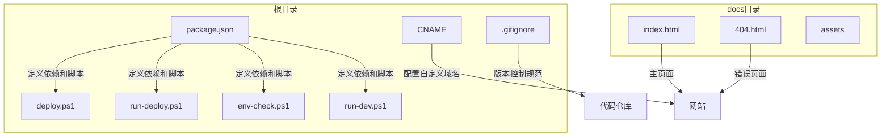
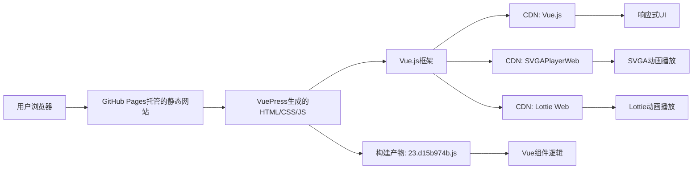

# 项目概述

<cite>
**本文档引用的文件**   
- [README.md](file://README.md)
- [package.json](file://package.json)
- [docs/index.html](file://docs/index.html)
- [deploy.ps1](file://deploy.ps1)
- [run-deploy.ps1](file://run-deploy.ps1)
- [env-check.ps1](file://env-check.ps1)
- [run-dev.ps1](file://run-dev.ps1)
- [CNAME](file://CNAME)
- [.gitignore](file://.gitignore)
- [docs/assets/js/23.d15b974b.js](file://docs/assets/js/23.d15b974b.js)
</cite>

## 更新摘要
**已更新内容**   
- 更新了**项目结构**部分，增加了对`.gitignore`文件中改进的版本控制规范的描述
- 扩展了**核心功能**部分，详细介绍了`index.html`中增强的交互式预览器界面，包括屏幕方向切换和背景色选择功能
- 更新了**架构与技术选型**部分，说明了新的JavaScript构建产物`23.d15b974b.js`在项目中的角色和加载方式
- 更新了**依赖关系与构建流程**部分，反映了`package.json`中的构建脚本配置

## 目录
1. [简介](#简介)
2. [项目结构](#项目结构)
3. [核心功能](#核心功能)
4. [架构与技术选型](#架构与技术选型)
5. [依赖关系与构建流程](#依赖关系与构建流程)
6. [部署机制](#部署机制)
7. [适用场景与局限性](#适用场景与局限性)
8. [常见问题解决思路](#常见问题解决思路)
9. [结论](#结论)

## 简介

svga.preview项目是一个专注于SVGA和Lottie动画在线预览的工具，旨在为开发者和设计师提供一个便捷的平台，用于快速查看和测试这两种流行的动画格式。项目通过简洁的用户界面和高效的动画播放能力，实现了无需安装额外软件即可在浏览器中预览动画效果的目标。其设计目的明确，即简化动画预览流程，提高开发效率。项目利用VuePress作为静态网站生成器，结合CDN集成的Vue.js、SVGAPlayerWeb和Lottie Web库，构建了一个轻量级、高性能的在线预览服务。这种架构不仅保证了项目的易用性和可访问性，还确保了动画播放的流畅性和兼容性。

**Section sources**
- [README.md](file://README.md#L1-L3)

## 项目结构

项目采用典型的静态网站结构，根目录下包含源代码、配置文件和构建脚本。`docs`目录是VuePress的默认内容目录，存放生成网站的静态资源，包括`index.html`和`404.html`等页面文件。`package.json`定义了项目的基本信息、依赖关系和构建脚本，是项目的核心配置文件。`deploy.ps1`和`run-deploy.ps1`是用于构建和部署的PowerShell脚本，自动化了从代码构建到GitHub Pages发布的整个流程。`env-check.ps1`用于检查本地开发环境，确保Node.js和npm等必要工具已正确安装。`run-dev.ps1`脚本则负责启动开发服务器，自动处理依赖安装和环境配置。此外，`CNAME`文件用于配置自定义域名，指向`svga.saysth.design`。`.gitignore`文件经过改进，包含了更全面的版本控制规范，排除了macOS和Windows系统文件、Node.js依赖、日志文件、IDE配置、测试覆盖率文件以及本地环境配置等，确保了代码仓库的整洁性。这种结构清晰、职责分明的组织方式，使得项目易于维护和扩展。

**Diagram sources **
- [package.json](file://package.json#L1-L18)
- [CNAME](file://CNAME#L1)
- [docs/index.html](file://docs/index.html#L1-L21)
- [.gitignore](file://.gitignore#L1-L56)

## 核心功能

svga.preview项目的核心功能是提供SVGA和Lottie动画的在线预览服务。用户可以通过访问项目网站，直接在浏览器中加载和播放SVGA及Lottie格式的动画文件，无需任何本地安装或复杂的配置过程。项目通过集成SVGAPlayerWeb和Lottie Web这两个专门的JavaScript库，实现了对这两种动画格式的原生支持。SVGAPlayerWeb库负责解析和渲染SVGA动画，而Lottie Web库则处理Lottie动画的播放。这两个库通过CDN方式引入，确保了加载速度和全球访问的稳定性。项目的设计使得动画预览过程简单直观，用户只需将动画文件的URL输入到指定位置，即可立即看到播放效果。`index.html`文件中的界面经过增强，提供了一个交互式预览器，包含屏幕方向切换（横屏/竖屏）和背景色选择（黑色、白色、绿色、红色、黄色、蓝色）功能，用户可以通过这些控件自定义预览环境。预览器还包含一个嵌入的canvas查看器（`#demoCanvas`），用于实际渲染动画内容。这一功能极大地便利了动画的调试和分享，特别适用于需要频繁预览动画效果的开发和设计工作流程。

**Section sources**
- [docs/index.html](file://docs/index.html#L8-L10)
- [docs/index.html](file://docs/index.html#L17-L19)

## 架构与技术选型

项目的整体架构基于VuePress静态网站生成器，采用服务端渲染（SSR）技术生成静态HTML文件，然后通过GitHub Pages进行托管。VuePress作为底层框架，提供了强大的Markdown解析、主题系统和插件生态，使得项目能够快速构建出一个功能完整、样式美观的网站。技术选型上，项目选择了Vue.js作为前端框架，利用其响应式数据绑定和组件化开发的优势，构建了动态的用户界面。动画播放功能则通过CDN直接引入SVGAPlayerWeb和Lottie Web库来实现，这种方式避免了将大型库打包进项目，减少了构建体积，提高了加载速度。`index.html`文件中的CDN引入方式是实现这一集成的关键，它确保了这些库能够被浏览器快速加载和执行。项目还生成了多个JavaScript构建产物，其中`23.d15b974b.js`是一个重要的构建产物，通过webpack打包生成，包含了与动画预览相关的Vue组件逻辑，通过``的方式在页面中异步加载。这种架构设计体现了“轻前端、重服务”的理念，将复杂的动画解析和渲染任务交给专门的库处理，而项目本身则专注于提供一个稳定、高效的预览平台。

**Diagram sources **
- [docs/index.html](file://docs/index.html#L8-L10)
- [package.json](file://package.json#L16)
- [docs/assets/js/23.d15b974b.js](file://docs/assets/js/23.d15b974b.js#L1)

## 依赖关系与构建流程

项目的依赖关系清晰明了，主要分为生产依赖和开发依赖。生产依赖`element-ui`提供了UI组件库，用于构建网站的界面元素。开发依赖`vuepress`是项目的核心构建工具，负责将Markdown内容转换为静态网站。构建流程通过`package.json`中的`scripts`字段定义，`npm run dev`命令启动开发服务器，实时预览网站内容；`npm run build`命令则生成用于生产的静态文件，输出到`docs`目录。`run-dev.ps1`脚本在启动开发服务器前，会检查并自动安装必要的依赖，确保开发环境的完整性。整个构建流程高度自动化，开发者只需关注内容创作，无需手动处理复杂的构建配置。VuePress在构建过程中会生成多个JavaScript文件，如`23.d15b974b.js`，这些文件通过webpack进行代码分割和优化，然后在`index.html`中通过`<link rel="preload">`和`<script defer>`标签进行预加载和异步加载，以优化页面性能。这种基于VuePress的构建流程，不仅简化了开发工作，还保证了生成网站的一致性和可靠性。

**Section sources**
- [package.json](file://package.json#L6-L9)
- [run-dev.ps1](file://run-dev.ps1#L51-L64)
- [docs/index.html](file://docs/index.html#L13-L14)

## 部署机制

项目的部署机制通过`deploy.ps1`和`run-deploy.ps1`两个PowerShell脚本实现，形成了一个完整的自动化部署流水线。`run-deploy.ps1`作为入口脚本，负责以正确的权限运行`deploy.ps1`。`deploy.ps1`脚本执行一系列关键步骤：首先确认代码位于`main`分支且工作区干净，然后运行`npm run build`命令构建静态网站。构建成功后，脚本提供两个选项：一是启动本地开发服务器进行预览，二是将构建结果部署到`gh-pages`分支。选择部署选项后，脚本会切换到`gh-pages`分支，同步`main`分支`docs`目录下的所有文件，提交更改并推送到远程仓库，最后切换回`main`分支。这一机制确保了网站的更新能够快速、安全地发布，同时保持了开发分支和发布分支的分离，符合现代软件开发的最佳实践。

**Section sources**
- [deploy.ps1](file://deploy.ps1#L1-L156)
- [run-deploy.ps1](file://run-deploy.ps1#L1-L15)

## 适用场景与局限性

svga.preview项目适用于需要快速预览SVGA和Lottie动画的多种场景。对于动画设计师而言，它可以作为一个即时的预览工具，用于检查动画效果和调试问题。对于前端开发者，它提供了一个方便的平台，用于测试动画在不同环境下的表现。此外，该项目也适合作为团队内部的共享资源，便于成员之间交流和展示动画设计。然而，项目也存在一定的局限性。首先，由于动画播放依赖于CDN引入的外部库，网络状况不佳时可能会影响加载速度和播放体验。其次，项目功能较为单一，仅提供基本的预览功能，缺乏更高级的编辑、导出或分享功能。最后，作为静态网站，其交互性有限，无法实现复杂的用户操作或数据持久化。了解这些局限性有助于用户合理预期项目的能力，并在必要时寻找补充工具。

## 常见问题解决思路

在使用svga.preview项目时，可能会遇到一些常见问题。例如，动画无法播放，这通常是由于网络问题导致CDN资源加载失败，解决思路是检查网络连接或尝试更换网络环境。如果开发环境无法启动，可能是Node.js或npm未正确安装，此时应运行`env-check.ps1`脚本检查环境，并根据提示安装缺失的工具。构建失败则可能与`package.json`配置或依赖冲突有关，建议清理`node_modules`和`package-lock.json`后重新安装依赖。对于部署过程中出现的权限错误，确保使用`run-deploy.ps1`脚本而非直接运行`deploy.ps1`，以获得正确的执行权限。当遇到未知错误时，查看脚本输出的详细日志是定位问题的关键，这些日志通常能提供明确的错误原因和解决方向。

**Section sources**
- [env-check.ps1](file://env-check.ps1#L1-L103)

## 结论

综上所述，svga.preview项目是一个设计精巧、功能明确的在线动画预览工具。它通过巧妙地结合VuePress、Vue.js和CDN集成的动画播放库，构建了一个高效、易用的预览平台。项目的架构清晰，依赖管理得当，构建和部署流程高度自动化，体现了良好的工程实践。尽管存在一些局限性，但其核心功能——快速预览SVGA和Lottie动画——得到了完美的实现。对于需要频繁处理这两种动画格式的用户来说，该项目提供了一个简单而强大的解决方案。未来，项目可以通过增加更多功能，如动画上传、参数调整或导出选项，来进一步提升用户体验和实用性。