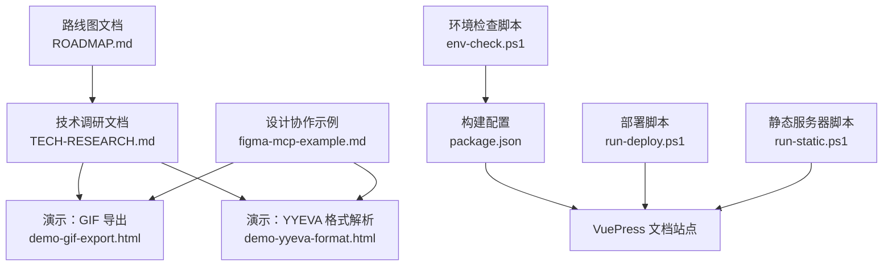
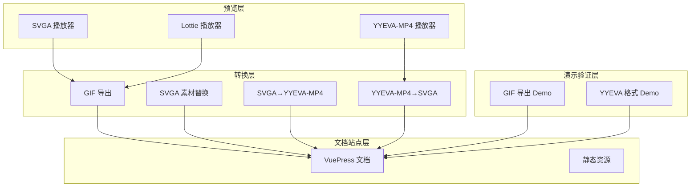
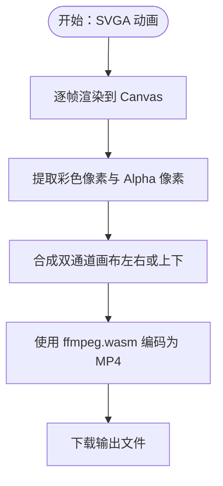
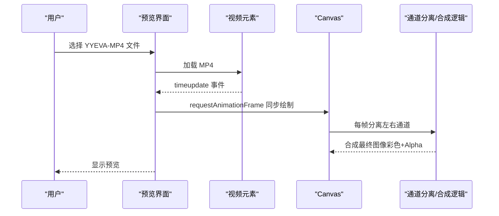
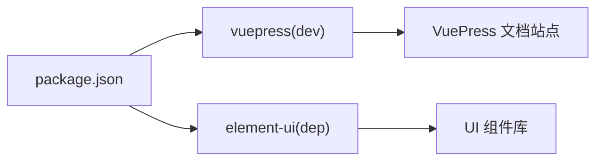

# 项目路线图

<cite>
**本文引用的文件**
- [ROADMAP.md](file://ROADMAP.md)
- [TECH-RESEARCH.md](file://TECH-RESEARCH.md)
- [package.json](file://package.json)
- [demo-gif-export.html](file://demo-gif-export.html)
- [demo-yyeva-format.html](file://demo-yyeva-format.html)
- [run-deploy.ps1](file://run-deploy.ps1)
- [run-static.ps1](file://run-static.ps1)
- [env-check.ps1](file://env-check.ps1)
- [figma-mcp-example.md](file://figma-mcp-example.md)
</cite>

## 目录
1. [引言](#引言)
2. [项目结构](#项目结构)
3. [核心组件](#核心组件)
4. [架构总览](#架构总览)
5. [详细组件分析](#详细组件分析)
6. [依赖分析](#依赖分析)
7. [性能考量](#性能考量)
8. [故障排查指南](#故障排查指南)
9. [结论](#结论)
10. [附录](#附录)

## 引言
本项目旨在构建一个支持 SVGA、YYEVA-MP4、Lottie 三种动画格式的在线预览与转换工具。路线图文档基于现有技术调研与演示文件，梳理了从基础预览到高级导出与转换的阶段性目标，并给出技术选型、风险评估与下一步行动建议，帮助团队有序推进开发。

## 项目结构
仓库包含路线图文档、技术调研文档、演示页面以及部署与环境检查脚本。核心文件包括：
- 路线图与技术调研：ROADMAP.md、TECH-RESEARCH.md
- 演示页面：demo-gif-export.html、demo-yyeva-format.html
- 构建与部署：package.json、run-deploy.ps1、run-static.ps1、env-check.ps1
- 设计协作参考：figma-mcp-example.md

图表来源
- [ROADMAP.md](file://ROADMAP.md#L1-L370)
- [TECH-RESEARCH.md](file://TECH-RESEARCH.md#L1-L454)
- [demo-gif-export.html](file://demo-gif-export.html#L1-L308)
- [demo-yyeva-format.html](file://demo-yyeva-format.html#L1-L350)
- [package.json](file://package.json#L1-L19)
- [run-deploy.ps1](file://run-deploy.ps1#L1-L15)
- [run-static.ps1](file://run-static.ps1#L1-L12)
- [env-check.ps1](file://env-check.ps1#L1-L103)
- [figma-mcp-example.md](file://figma-mcp-example.md#L1-L172)

章节来源
- [ROADMAP.md](file://ROADMAP.md#L1-L370)
- [TECH-RESEARCH.md](file://TECH-RESEARCH.md#L1-L454)
- [package.json](file://package.json#L1-L19)

## 核心组件
- 基础预览模块：支持 SVGA、YYEVA-MP4、Lottie 的加载与播放控制。
- 导出与转换模块：GIF 导出、SVGA 素材替换、SVGA→YYEVA-MP4、YYEVA-MP4→SVGA 等。
- 技术验证与演示：通过 demo-gif-export.html 与 demo-yyeva-format.html 验证关键技术路径。
- 文档与站点：使用 VuePress 构建文档站点，便于展示与分享。

章节来源
- [ROADMAP.md](file://ROADMAP.md#L8-L21)
- [TECH-RESEARCH.md](file://TECH-RESEARCH.md#L187-L295)
- [TECH-RESEARCH.md](file://TECH-RESEARCH.md#L297-L384)

## 架构总览
整体架构分为“预览层”“转换层”“演示验证层”“文档站点层”，各层职责清晰，便于迭代演进。

图表来源
- [ROADMAP.md](file://ROADMAP.md#L24-L113)
- [ROADMAP.md](file://ROADMAP.md#L115-L209)
- [TECH-RESEARCH.md](file://TECH-RESEARCH.md#L187-L384)
- [demo-gif-export.html](file://demo-gif-export.html#L1-L308)
- [demo-yyeva-format.html](file://demo-yyeva-format.html#L1-L350)
- [package.json](file://package.json#L1-L19)

## 详细组件分析

### 阶段1：基础预览功能（已完成）
- 功能要点：SVGA 预览与播放控制、基础 UI 框架、暗黑/白天主题、背景色切换、画布缩放与拖拽、1:1 与居中显示、拖拽上传、播放进度与帧数、模块切换。
- 价值：为后续高级功能提供稳定的基础体验。

章节来源
- [ROADMAP.md](file://ROADMAP.md#L8-L21)

### 阶段2：SVGA 高级功能
- 2.1 素材替换（高优先级）
  - 目标：允许替换 SVGA 动画中的图片素材，预览替换效果并重新导出。
  - 技术要点：解析 SVGA 结构、识别 imageKey、提供图片上传界面、重新打包（需研究 SVGA 文件格式与 Protobuf 规范）。
  - 风险：SVGA 格式复杂，可能需要社区库或后端支持。
- 2.2 导出 GIF（高优先级）
  - 目标：将 SVGA 动画导出为 GIF，支持自定义帧率、尺寸、质量，显示导出进度。
  - 技术方案：SVGA → Canvas 逐帧渲染 → GIF 编码器 → 下载；推荐使用 gif.js（Web Worker 支持）。
  - 挑战：性能优化（Web Worker）、内存管理、进度反馈。
- 2.3 转 YYEVA-MP4（中优先级）
  - 目标：将 SVGA 转换为 YYEVA 格式的 MP4（彩色通道 + Alpha 通道并排）。
  - 技术方案：SVGA → Canvas 逐帧渲染 → 提取彩色与 Alpha → 合成双通道 → ffmpeg.wasm 编码 → 下载。
  - 挑战：ffmpeg.wasm 体积大、编码慢、内存占用高。

图表来源
- [ROADMAP.md](file://ROADMAP.md#L77-L113)
- [TECH-RESEARCH.md](file://TECH-RESEARCH.md#L297-L384)

章节来源
- [ROADMAP.md](file://ROADMAP.md#L24-L113)
- [TECH-RESEARCH.md](file://TECH-RESEARCH.md#L187-L295)
- [TECH-RESEARCH.md](file://TECH-RESEARCH.md#L297-L384)

### 阶段3：YYEVA-MP4 与 Lottie 模块
- 3.1 YYEVA-MP4 模块
  - 文件解析与预览：加载带 Alpha 通道的 MP4，解析双通道布局（左右或上下），在 Canvas 合成显示。
  - 播放控制：监听 video 的 timeupdate 事件，通过 requestAnimationFrame 同步 Canvas 渲染。
  - 转 SVGA：将 YYEVA-MP4 转换为 SVGA（提取序列帧 PNG 带透明，重新打包）。
- 3.2 Lottie 模块
  - 当前状态：已引入 lottie-web，拖入 .json 文件会切换到 Lottie 模块，但为占位。
  - 待实现：使用 lottie.loadAnimation 加载 JSON，在预览区渲染动画并支持播放控制。

图表来源
- [ROADMAP.md](file://ROADMAP.md#L115-L209)
- [TECH-RESEARCH.md](file://TECH-RESEARCH.md#L1-L108)

章节来源
- [ROADMAP.md](file://ROADMAP.md#L115-L209)
- [TECH-RESEARCH.md](file://TECH-RESEARCH.md#L1-L108)

### 技术准备与依赖规划
- 技术准备清单：YYEVA-MP4 格式规范、序列帧提取方案、GIF 导出方案、MP4 合成方案。
- 依赖包规划：当前依赖 element-ui；计划新增（CDN 引入）gif.js、@ffmpeg/ffmpeg、lottie-web（已引入）。
- 浏览器兼容性：Canvas API、Web Worker、WASM、Video API 在现代浏览器中可用。

章节来源
- [ROADMAP.md](file://ROADMAP.md#L211-L309)
- [ROADMAP.md](file://ROADMAP.md#L311-L370)
- [TECH-RESEARCH.md](file://TECH-RESEARCH.md#L386-L407)

### 演示验证与原型
- GIF 导出 Demo：验证 gif.js 的可行性，支持进度显示与文件下载。
- YYEVA 格式 Demo：验证双通道视频解析流程（分离与合成）。

章节来源
- [TECH-RESEARCH.md](file://TECH-RESEARCH.md#L288-L295)
- [TECH-RESEARCH.md](file://TECH-RESEARCH.md#L427-L436)
- [demo-gif-export.html](file://demo-gif-export.html#L1-L308)
- [demo-yyeva-format.html](file://demo-yyeva-format.html#L1-L350)

### 设计协作与工作流
- 与 Figma MCP 集成：从 Figma 获取动画帧图片，转换为 SVGA/Lottie，再在预览器中查看效果，形成设计到开发闭环。

章节来源
- [figma-mcp-example.md](file://figma-mcp-example.md#L131-L172)

## 依赖分析
- 构建与文档：VuePress 用于文档站点构建与发布。
- 运行时依赖：element-ui（UI 组件库）。
- 开发依赖：vuepress（文档构建工具）。
- CDN 依赖：gif.js（GIF 导出）、@ffmpeg/ffmpeg（MP4 合成）、lottie-web（Lottie 播放）。

图表来源
- [package.json](file://package.json#L1-L19)

章节来源
- [package.json](file://package.json#L1-L19)

## 性能考量
- 大尺寸动画与高帧率会显著增加内存占用与编码时间，建议：
  - 限制最大尺寸与帧数；
  - 使用 Web Worker 与进度反馈；
  - 对 ffmpeg.wasm 采用懒加载与 CDN 加速；
  - 在移动端降低默认质量与帧率。
- 兼容性方面，现代浏览器对 Canvas、Web Worker、WASM、Video API 支持良好，但仍需关注低版本与移动端性能差异。

章节来源
- [ROADMAP.md](file://ROADMAP.md#L311-L370)
- [TECH-RESEARCH.md](file://TECH-RESEARCH.md#L410-L425)
- [TECH-RESEARCH.md](file://TECH-RESEARCH.md#L398-L407)

## 故障排查指南
- 环境检查：使用 env-check.ps1 检查 Node.js、npm、项目依赖与本地 vuepress 安装情况，按提示修复缺失项。
- 部署与本地服务：
  - run-deploy.ps1：以绕过策略运行部署脚本（确保存在 deploy.ps1）。
  - run-static.ps1：在 docs 目录启动简单 HTTP 服务器，便于本地预览静态页面。
- 常见问题定位：
  - 依赖未安装：根据 env-check.ps1 提示执行 npm install。
  - 文档构建失败：确认 vuepress 已安装且版本匹配。
  - GIF 导出卡顿：检查帧数与尺寸，必要时降低质量或帧率。
  - YYEVA 解析异常：核对通道布局（左右或上下），确保分离与合成逻辑一致。

章节来源
- [env-check.ps1](file://env-check.ps1#L1-L103)
- [run-deploy.ps1](file://run-deploy.ps1#L1-L15)
- [run-static.ps1](file://run-static.ps1#L1-L12)

## 结论
本路线图明确了从基础预览到高级导出与转换的阶段性目标，给出了技术选型与风险评估，并通过演示验证关键路径。建议优先完成 GIF 导出与 Lottie 预览功能，随后推进 SVGA 素材替换与 YYEVA 转换，持续优化性能与用户体验。

## 附录
- 下一步行动：立即开始 YYEVA 格式规范调研、验证 gif.js 可行性、验证 ffmpeg.wasm 性能，本周内完成技术方案与原型。
- 参考资源：SVGAPlayer-Web、lottie-web、gif.js、ffmpeg.wasm、YYEVA 相关资料。

章节来源
- [ROADMAP.md](file://ROADMAP.md#L333-L370)
- [TECH-RESEARCH.md](file://TECH-RESEARCH.md#L438-L454)