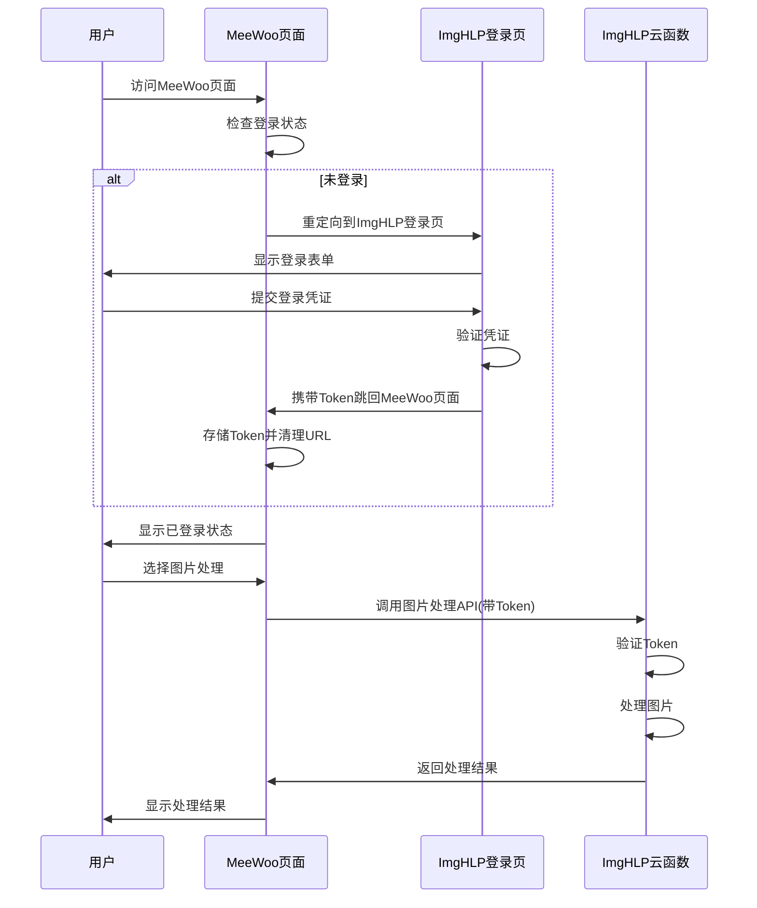

# 跨域登录与图片处理服务集成简化详细方案

## 一、方案概述

本方案旨在解决**不同域名页面**（如 `https://www.meewoo.me/`）使用 www.imghlp.com 统一登录系统并调用 ImgHLP 图片处理服务的问题，同时**保留现有项目结构不变**。

## 二、核心需求

1. **共享登录系统**：使用 ImgHLP 统一登录流程，直接重定向到 www.imghlp.com 的登录页
2. **调用图片处理服务**：登录后可调用 ImgHLP 云函数进行图片处理
3. **跨域支持**：不同域名下的页面能正常工作
4. **用户体验流畅**：登录流程无缝集成，无感知跳转
5. **保留现有结构**：完全保持现有项目结构不变，最小化代码改动

## 三、技术方案

### 1. 技术架构



### 2. 技术栈

| 类别 | 技术/库 | 用途 | 备注 |
|------|---------|------|------|
| 前端 | JavaScript | 前端逻辑 | 使用现有技术栈 |
| 前端 | Vue.js | 页面交互 | 使用现有Vue.js |
| 网络 | Fetch API | API调用 | 浏览器原生支持 |
| 认证 | Token | 身份验证 | 由ImgHLP提供 |
| 存储 | localStorage | 存储Token | 浏览器原生支持 |

### 3. 实现步骤

#### 3.1 步骤1：在首页添加登录按钮

**文件**：`docs/index.html`

**修改内容**：在右上角添加登录按钮，链接到ImgHLP登录页

```html
<!-- 在header-right-action中添加登录按钮 -->
<div class="header-right-action">
  <a href="https://www.imghlp.com/auth/login.html?returnUrl=https://www.meewoo.me/" class="login-btn tooltip" title="用户登录">
    
    <span class="tooltip-text">用户登录</span>
  </a>
  <!-- 现有的主题切换按钮 -->
</div>
```

#### 3.2 步骤2：添加登录状态管理

**文件**：`docs/assets/js/utils/auth-utils.js`

**内容**：创建登录状态管理工具

```javascript
// 登录状态管理工具
class AuthUtils {
  constructor() {
    this.tokenKey = 'imghelptoken';
    this.userKey = 'imghelpuser';
    this.loginUrl = 'https://www.imghlp.com/auth/login.html';
  }

  // 检查是否已登录
  isLoggedIn() {
    return !!localStorage.getItem(this.tokenKey);
  }

  // 获取Token
  getToken() {
    return localStorage.getItem(this.tokenKey);
  }

  // 获取用户信息
  getUserInfo() {
    const userInfo = localStorage.getItem(this.userKey);
    return userInfo ? JSON.parse(userInfo) : null;
  }

  // 存储Token
  saveToken(token) {
    localStorage.setItem(this.tokenKey, token);
  }

  // 存储用户信息
  saveUserInfo(userInfo) {
    localStorage.setItem(this.userKey, JSON.stringify(userInfo));
  }

  // 清除登录信息
  clearAuth() {
    localStorage.removeItem(this.tokenKey);
    localStorage.removeItem(this.userKey);
  }

  // 重定向到登录页面
  redirectToLogin(returnUrl) {
    const encodedReturnUrl = encodeURIComponent(returnUrl || window.location.href);
    window.location.href = `${this.loginUrl}?returnUrl=${encodedReturnUrl}`;
  }

  // 处理登录回调
  handleLoginCallback() {
    const urlParams = new URLSearchParams(window.location.search);
    const token = urlParams.get('token');
    const userInfo = urlParams.get('user');
    
    if (token && userInfo) {
      try {
        // 存储Token和用户信息
        this.saveToken(token);
        this.saveUserInfo(JSON.parse(userInfo));
        
        // 清理URL参数
        const cleanUrl = new URL(window.location.href);
        cleanUrl.searchParams.delete('token');
        cleanUrl.searchParams.delete('user');
        window.history.replaceState({}, '', cleanUrl.toString());
        
        return true;
      } catch (e) {
        console.error('处理登录回调失败:', e);
        return false;
      }
    }
    return false;
  }
}

// 导出单例
const authUtils = new AuthUtils();
window.authUtils = authUtils; // 全局可用
```

#### 3.3 步骤3：修改首页逻辑

**文件**：`docs/index.html`

**修改内容**：添加登录状态检查和处理

```html
<!-- 在底部添加脚本 -->
<script src="assets/js/utils/auth-utils.js"></script>
<script>
  new Vue({
    el: '#app',
    data: {
      // 现有数据
      isLoggedIn: false,
      userInfo: null
    },
    mounted() {
      // 检查登录回调
      if (this.handleLoginCallback()) {
        // 登录成功
        this.updateLoginStatus();
      } else {
        // 检查登录状态
        this.updateLoginStatus();
      }
    },
    methods: {
      // 检查登录回调
      handleLoginCallback() {
        return window.authUtils.handleLoginCallback();
      },

      // 更新登录状态
      updateLoginStatus() {
        this.isLoggedIn = window.authUtils.isLoggedIn();
        this.userInfo = window.authUtils.getUserInfo();
      },

      // 处理登录
      handleLogin() {
        window.authUtils.redirectToLogin(window.location.href);
      },

      // 处理登出
      handleLogout() {
        window.authUtils.clearAuth();
        this.updateLoginStatus();
      }
    }
  });
</script>
```

#### 3.4 步骤4：添加图片处理API调用

**文件**：`docs/assets/js/utils/image-api.js`

**内容**：创建图片处理API调用工具

```javascript
// 图片处理API调用工具
class ImageApi {
  constructor() {
    this.baseUrl = 'https://api.imghlp.com';
  }

  // 检查登录状态
  checkLogin() {
    if (!window.authUtils.isLoggedIn()) {
      throw new Error('未登录，请先登录');
    }
    return window.authUtils.getToken();
  }

  // 通用请求方法
  async request(endpoint, data) {
    const token = this.checkLogin();

    try {
      const response = await fetch(`${this.baseUrl}${endpoint}`, {
        method: 'POST',
        headers: {
          'Content-Type': 'application/json',
          'Authorization': `Bearer ${token}`
        },
        body: JSON.stringify(data)
      });

      if (!response.ok) {
        if (response.status === 401) {
          // Token过期，重新登录
          window.authUtils.redirectToLogin(window.location.href);
          throw new Error('登录已过期，请重新登录');
        }
        throw new Error(`API调用失败: ${response.status}`);
      }

      const result = await response.json();
      
      if (!result.success) {
        throw new Error(result.message || 'API调用失败');
      }

      return result.data;
    } catch (error) {
      console.error('API请求失败:', error);
      throw error;
    }
  }

  // 合并图片
  async mergeImages(images) {
    return this.request('/merge', { images });
  }

  // 切割图片
  async splitImage(mergedImage, positionData) {
    return this.request('/split', { mergedImage, positionData });
  }

  // 文件转Base64
  fileToBase64(file) {
    return new Promise((resolve, reject) => {
      const reader = new FileReader();
      reader.onload = () => resolve(reader.result);
      reader.onerror = reject;
      reader.readAsDataURL(file);
    });
  }

  // Base64转Blob
  base64ToBlob(base64) {
    const matches = base64.match(/^data:image\/(\w+);base64,(.+)$/);
    if (!matches) {
      throw new Error('无效的Base64格式');
    }
    const type = matches[1];
    const buffer = Uint8Array.from(atob(matches[2]), c => c.charCodeAt(0));
    return new Blob([buffer], { type: `image/${type}` });
  }
}

// 导出单例
const imageApi = new ImageApi();
window.imageApi = imageApi; // 全局可用
```

#### 3.5 步骤5：添加图片处理示例

**文件**：`docs/index.html`

**修改内容**：添加图片处理示例按钮

```html
<!-- 在footer-actions中添加图片处理按钮 -->
<div class="footer-actions">
  <!-- 现有按钮 -->
  <button class="btn-large-primary" @click="handleImageMerge" v-if="isLoggedIn">
    合并图片
  </button>
  <button class="btn-large-primary" @click="handleImageSplit" v-if="isLoggedIn">
    切割图片
  </button>
  <button class="btn-large-primary" @click="handleLogin" v-else>
    登录以使用图片处理
  </button>
</div>
```

**添加方法**：

```javascript
methods: {
  // 现有方法
  
  // 处理图片合并
  async handleImageMerge() {
    try {
      // 模拟图片数据
      const testImages = [
        {
          name: 'test1.png',
          image: 'data:image/png;base64,iVBORw0KGgoAAAANSUhEUgAAAAEAAAABCAYAAAAfFcSJAAAADUlEQVR42mNkYPhfDwAChwGA60e6kgAAAABJRU5ErkJggg=='
        }
      ];
      
      // 调用合并API
      const result = await window.imageApi.mergeImages(testImages);
      
      // 显示结果
      console.log('合并结果:', result);
      alert('图片合并成功！');
    } catch (error) {
      console.error('合并失败:', error);
      alert('合并失败: ' + error.message);
    }
  },

  // 处理图片切割
  async handleImageSplit() {
    try {
      // 模拟数据
      const mergedImage = 'data:image/png;base64,iVBORw0KGgoAAAANSUhEUgAAAAEAAAABCAYAAAAfFcSJAAAADUlEQVR42mNkYPhfDwAChwGA60e6kgAAAABJRU5ErkJggg==';
      const positionData = [{ x: 0, y: 0, width: 100, height: 100 }];
      
      // 调用切割API
      const result = await window.imageApi.splitImage(mergedImage, positionData);
      
      // 显示结果
      console.log('切割结果:', result);
      alert('图片切割成功！');
    } catch (error) {
      console.error('切割失败:', error);
      alert('切割失败: ' + error.message);
    }
  }
}
```

## 四、测试方案

### 4.1 本地测试

| 测试项 | 测试内容 | 预期结果 | 测试工具 |
|--------|----------|----------|----------|
| 登录流程测试 | 点击登录按钮，重定向到ImgHLP登录页，登录后返回 | 能正确完成登录流程，登录后返回原页面 | 浏览器 |
| 登录状态测试 | 登录后刷新页面，检查登录状态是否保持 | 页面刷新后登录状态保持 | 浏览器 |
| 图片处理测试 | 登录后调用图片处理API | 能成功调用API并返回结果 | 浏览器 + 控制台 |
| 未登录测试 | 未登录时调用图片处理API | 提示未登录并跳转到登录页 | 浏览器 |
| 跨域测试 | 使用不同端口模拟不同域名 | 不同域名下能正常完成登录流程 | 浏览器 |

### 4.2 线上测试

| 测试项 | 测试内容 | 预期结果 | 测试工具 |
|--------|----------|----------|----------|
| 完整流程测试 | 在实际域名环境中测试完整流程 | 能正确完成所有流程 | 浏览器 |
| 性能测试 | 测试API调用性能 | API调用响应时间在可接受范围内 | 浏览器开发者工具 |
| 兼容性测试 | 测试在不同浏览器中的表现 | 在所有现代浏览器中能正常工作 | 不同浏览器 |

## 五、错误处理

### 5.1 常见错误及处理

| 错误类型 | 错误信息 | 处理方式 |
|----------|----------|----------|
| 未登录 | 未登录，请先登录 | 跳转到ImgHLP登录页 |
| Token过期 | 登录已过期，请重新登录 | 跳转到ImgHLP登录页 |
| API调用失败 | API调用失败: 404 | 显示错误提示，引导用户重试 |
| 网络错误 | 网络错误 | 显示网络错误提示，引导用户检查网络 |
| 图片处理失败 | 图片处理失败 | 显示处理失败提示，引导用户重试 |

### 5.2 错误提示优化

```javascript
// 错误处理工具
function showError(message) {
  const errorElement = document.createElement('div');
  errorElement.className = 'error-toast';
  errorElement.textContent = message;
  errorElement.style.cssText = `
    position: fixed;
    top: 20px;
    right: 20px;
    background: #ff4444;
    color: #fff;
    padding: 12px 20px;
    border-radius: 8px;
    box-shadow: 0 4px 12px rgba(0, 0, 0, 0.15);
    z-index: 9999;
    animation: slideIn 0.3s ease;
  `;
  document.body.appendChild(errorElement);
  
  setTimeout(() => {
    errorElement.remove();
  }, 3000);
}

function showSuccess(message) {
  const successElement = document.createElement('div');
  successElement.className = 'success-toast';
  successElement.textContent = message;
  successElement.style.cssText = `
    position: fixed;
    top: 20px;
    right: 20px;
    background: #4caf50;
    color: #fff;
    padding: 12px 20px;
    border-radius: 8px;
    box-shadow: 0 4px 12px rgba(0, 0, 0, 0.15);
    z-index: 9999;
    animation: slideIn 0.3s ease;
  `;
  document.body.appendChild(successElement);
  
  setTimeout(() => {
    successElement.remove();
  }, 3000);
}

// 添加动画
const style = document.createElement('style');
style.textContent = `
  @keyframes slideIn {
    from {
      transform: translateX(100%);
      opacity: 0;
    }
    to {
      transform: translateX(0);
      opacity: 1;
    }
  }
`;
document.head.appendChild(style);

// 全局可用
window.showError = showError;
window.showSuccess = showSuccess;
```

## 六、安全性考虑

### 6.1 安全措施

1. **HTTPS传输**：确保所有通信使用HTTPS
2. **Token存储**：使用localStorage存储Token，避免XSS攻击
3. **Token验证**：ImgHLP登录页验证用户凭证
4. **API认证**：所有API调用需要Token认证
5. **错误处理**：不暴露敏感错误信息

### 6.2 安全最佳实践

1. **定期清理Token**：定期检查和清理过期Token
2. **限制登录尝试**：ImgHLP登录页限制登录尝试次数
3. **使用强密码**：引导用户使用强密码
4. **定期更新密码**：建议用户定期更新密码
5. **安全审计**：ImgHLP侧记录登录日志和异常操作

## 七、性能优化

### 7.1 前端优化

1. **延迟加载**：图片处理API工具延迟加载
2. **缓存优化**：缓存Token和用户信息
3. **错误处理**：添加重试机制和超时处理
4. **用户体验**：添加加载状态指示

### 7.2 后端优化

1. **API响应**：ImgHLP API优化响应时间
2. **缓存机制**：ImgHLP侧实现图片处理缓存
3. **并行处理**：支持批量图片处理
4. **资源管理**：优化服务器资源使用

## 八、实施时间计划

### 8.1 实施步骤

| 步骤 | 时间 | 任务 | 负责人 |
|------|------|------|--------|
| 1 | 1天 | 创建auth-utils.js | 前端开发 |
| 2 | 1天 | 修改index.html添加登录按钮 | 前端开发 |
| 3 | 1天 | 创建image-api.js | 前端开发 |
| 4 | 1天 | 添加图片处理示例 | 前端开发 |
| 5 | 1天 | 本地测试 | 测试 |
| 6 | 1天 | 线上测试 | 测试 |
| **总计** | **6天** | **-** | **-** |

### 8.2 关键里程碑

| 里程碑 | 时间 | 交付物 | 验收标准 |
|--------|------|--------|----------|
| 登录功能完成 | 第3天 | 登录功能正常 | 能正确完成登录流程 |
| 图片处理功能完成 | 第4天 | 图片处理功能正常 | 能成功调用图片处理API |
| 测试完成 | 第6天 | 功能测试通过 | 所有测试项通过 |

## 九、风险评估

### 9.1 风险识别

| 风险 | 描述 | 影响程度 | 发生概率 | 应对措施 |
|------|------|----------|----------|----------|
| 跨域问题 | 不同域名下的页面可能存在跨域问题 | 高 | 中 | 正确配置CORS，使用标准重定向 |
| Token安全 | Token可能被窃取 | 高 | 低 | 使用HTTPS，合理设置Token过期时间 |
| API调用失败 | 图片处理API调用失败 | 中 | 中 | 添加错误处理和重试机制 |
| 网络延迟 | 网络延迟导致用户体验差 | 中 | 高 | 添加加载状态指示，优化用户体验 |
| 兼容性问题 | 不同浏览器可能存在兼容性问题 | 低 | 中 | 测试多种浏览器，使用标准API |

### 9.2 风险应对策略

| 风险等级 | 应对策略 | 责任方 |
|----------|----------|--------|
| 高 | 制定详细的应对方案，定期监控 | 前端开发 |
| 中 | 制定应对措施，定期检查 | 前端开发 |
| 低 | 持续监控，及时处理 | 前端开发 |

## 十、结论

### 10.1 方案优势

- ✅ **保留现有结构**：完全保持现有项目结构不变
- ✅ **实现简单**：基于标准HTTP重定向和URL参数传递
- ✅ **流程清晰**：用户体验流畅，登录后自动返回目标页面
- ✅ **安全性高**：Token通过HTTPS传输，存储在localStorage
- ✅ **可扩展性强**：支持多个不同域名的页面集成
- ✅ **兼容性好**：支持所有现代浏览器
- ✅ **最小化改动**：只在必要的地方添加代码，不进行大规模重构

### 10.2 预期效果

- ✅ **实现共享登录**：使用ImgHLP统一登录流程
- ✅ **调用图片处理**：登录后可调用ImgHLP图片处理服务
- ✅ **跨域支持**：不同域名下的页面能正常工作
- ✅ **用户体验流畅**：登录流程无缝集成，无感知跳转
- ✅ **保留现有结构**：所有改动都基于现有代码结构

### 10.3 实施建议

1. **分步骤实施**：按照文档中的步骤逐步实施
2. **充分测试**：在本地和线上环境充分测试
3. **关注用户体验**：优化登录流程和错误提示
4. **定期维护**：定期检查和更新代码
5. **安全第一**：优先考虑安全性，确保用户数据安全

**结论**：本方案通过简化的实现方式，成功解决了不同域名页面使用www.imghlp.com统一登录系统并调用图片处理服务的问题，同时保留了现有项目结构不变，是一种理想的跨域集成方案。