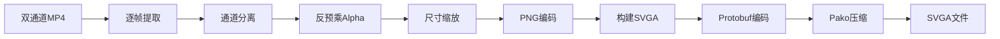

# 技术调研报告

## 📋 调研目标
为 A-viewer 项目的阶段2、3功能开发提供技术方案支持。

## 📊 阶段2开发总结

### 已完成功能概览

#### 1. 素材替换功能 ✅
**实现时间**：2025-12-12

**核心技术**：
- SVGA文件解析：使用SVGAParser提取所有图片素材（imageKey）
- 素材管理：侧边栏展示+搜索过滤+复制名称
- 动态替换：直接替换videoItem.images，触发Vue响应式更新
- 缩略图预览：背景色同步播放器设置

**关键代码位置**：
```javascript
// docs/index.html
showMaterialPanel()      // 显示侧边栏
replaceMaterial(key)     // 替换素材
filteredMaterialList     // 搜索过滤computed属性
copyMaterialName(name)   // 复制名称功能
```

**技术亮点**：
- 使用Object.assign创建新对象触发Vue响应式更新
- 侧边栏背景色动态跟随播放器背景色
- 支持搜索过滤和一键复制名称

---

#### 2. 导出GIF功能 ✅
**实现时间**：2025-12-12

**核心技术**：
- 库选择：gif.js（体积小，支持Web Worker）
- 序列帧提取：遍历SVGA帧，使用Canvas渲染
- 背景色处理：使用临时Canvas合成背景色+SVGA内容
- 进度显示：监听gif.on('progress')事件

**关键代码位置**：
```javascript
// docs/index.html
exportGIF() // 主导出函数

// 背景色处理逻辑
var tempCanvas = document.createElement('canvas');
var tempCtx = tempCanvas.getContext('2d');

// 填充背景色（使用当前背景色或默认白色）
var bgColor = currentBgColor !== 'transparent' ? currentBgColor : '#ffffff';
tempCtx.fillStyle = bgColor;
tempCtx.fillRect(0, 0, tempCanvas.width, tempCanvas.height);

// 绘制SVGA内容
tempCtx.drawImage(canvas, 0, 0);

// 添加到GIF
gif.addFrame(tempCanvas, {copy: true, delay: frameDelay});
```

**技术亮点**：
- 透明部分使用当前背景色填充，无背景时默认白色
- 过滤掉transparent和#000000避免黑色底
- 使用临时Canvas进行背景色合成
- Web Worker避免阻塞UI

---

#### 3. 缩放控制优化 ✅
**实现时间**：2025-12-13

**核心技术**：
- 图标资源：zoom_in/zoom_out/one2one图标
- Hover状态：使用::after伪元素+CSS变量
- 暗黑模式：_dark后缀图标自动切换
- 平滑过渡：opacity 0.2s transition

**关键代码位置**：
```css
/* docs/index.html - 样式部分 */
.zoom-btn:hover .zoom-icon {
  opacity: 0;
}

.zoom-btn::after {
  content: '';
  position: absolute;
  opacity: 0;
  transition: opacity 0.2s;
  background-image: var(--zoom-hover-icon);
}

.zoom-btn:hover::after {
  opacity: 1;
}

body.dark-mode .zoom-btn:hover::after {
  background-image: var(--zoom-hover-icon-dark);
}
```

**技术亮点**：
- 使用CSS变量动态设置hover图标路径
- 通过opacity过渡实现平滑切换效果
- 自动适配暗黑模式

---

#### 4. 其他UI优化 ✅

**文件信息展示重构**：
- 去掉总标题"文件信息："
- 每项信息前加独立标签（如"文件名称："）
- 样式：标题灰色400字重，内容深色600字重

**侧边栏功能增强**：
- 搜索框：支持按imageKey过滤
- 复制按钮：一键复制素材名称
- 帮助说明：引导用户如何使用

**重传SVGA按钮**：
- 位置：素材图按钮左侧
- 功能：无需刷新页面重新上传SVGA
- 格式限制：仅接受.svga文件

**样式细节调整**：
```css
.material-panel-stats { gap: 8px; }
.stats-help { line-height: 20px; }
.material-search-input { border-radius: 8px; }
header-navbar { padding: 0 16px; }
```

---

### 阶段2技术总结

**使用的技术栈**：
- gif.js 0.2.0 - GIF导出
- SVGAParser - SVGA文件解析
- Canvas API - 序列帧渲染和图像处理
- Vue.js响应式系统 - 数据绑定和更新
- CSS变量+伪元素 - 动态样式控制

**性能优化措施**：
- GIF导出使用Web Worker避免阻塞UI
- 临时Canvas复用减少内存占用
- 图片预加载确保流畅体验

**开发经验总结**：
1. Vue响应式更新：使用Object.assign创建新对象触发更新
2. 背景色同步：computed属性动态计算背景色
3. Hover状态实现：::after伪元素+CSS变量最优雅
4. 图片格式限制：使用file.name.toLowerCase().endsWith()

---

## 1. YYEVA-MP4 格式规范 🎬

### 1.1 格式定义
**YYEVA** (YY Effect Video Animation) 是一种在普通 MP4 视频中嵌入透明通道的格式方案。

### 1.2 技术原理
```
┌─────────────────────────────┐
│   原始带透明通道的动画       │
└──────────┬──────────────────┘
           │
           ▼
    ┌──────────────┐
    │  序列帧提取   │
    └──────┬───────┘
           │
    ┌──────▼───────────────────┐
    │  每帧分离彩色 + Alpha     │
    └──────┬───────────────────┘
           │
    ┌──────▼───────────────────┐
    │  合成双通道画布           │
    │  ┌────────┬────────┐     │
    │  │ Color  │ Alpha  │     │
    │  │ (RGB)  │ (灰度) │     │
    │  └────────┴────────┘     │
    └──────┬───────────────────┘
           │
    ┌──────▼───────────────────┐
    │  编码为标准 MP4           │
    └──────────────────────────┘
```

### 1.3 布局方式

#### 方式1：左右并排（推荐）
```
┌─────────────────────┐
│         │           │
│  Color  │   Alpha   │
│  通道   │   通道    │
│         │           │
└─────────────────────┘
宽度：原始宽度 × 2
高度：原始高度
```

#### 方式2：上下并排
```
┌─────────────────────┐
│      Color 通道      │
├─────────────────────┤
│      Alpha 通道      │
└─────────────────────┘
宽度：原始宽度
高度：原始高度 × 2
```

### 1.4 解析流程
```javascript
// 1. 加载视频
const video = document.createElement('video');
video.src = 'yyeva-video.mp4';

// 2. 监听每帧
video.addEventListener('timeupdate', () => {
    // 绘制到 Canvas
    ctx.drawImage(video, 0, 0);
    
    // 提取双通道
    const fullData = ctx.getImageData(0, 0, video.videoWidth, video.videoHeight);
    const halfWidth = video.videoWidth / 2;
    
    // 分离彩色和 Alpha
    const colorData = ctx.getImageData(0, 0, halfWidth, video.videoHeight);
    const alphaData = ctx.getImageData(halfWidth, 0, halfWidth, video.videoHeight);
    
    // 合成
    for (let i = 0; i < colorData.data.length; i += 4) {
        colorData.data[i + 3] = alphaData.data[i]; // 使用 R 通道作为 Alpha
    }
    
    // 绘制最终结果
    finalCtx.putImageData(colorData, 0, 0);
});
```

### 1.5 播放器优化与模式切换

#### 1.5.1 模式切换规则
当在播放MP4过程中拖入SVGA文件时，应立即终止MP4播放，切换至SVGA渲染模式，确保SVGA内容优先展示，避免两种格式同时播放导致的渲染冲突。

#### 1.5.2 资源清理机制
```javascript
// 切换模式时的资源清理
function cleanupYyeva() {
    // 停止动画循环
    if (yyevaAnimationId) {
        cancelAnimationFrame(yyevaAnimationId);
        yyevaAnimationId = null;
    }
    
    // 停止视频播放
    if (yyevaVideo) {
        yyevaVideo.pause();
        yyevaVideo.src = '';
        yyevaVideo = null;
    }
    
    // 释放对象URL
    if (yyevaObjectUrl) {
        URL.revokeObjectURL(yyevaObjectUrl);
        yyevaObjectUrl = null;
    }
    
    // 清空画布
    if (yyevaCanvas) {
        yyevaCanvas = null;
        yyevaCtx = null;
    }
    
    // 清空容器内容
    const container = document.querySelector('.viewer-container');
    if (container) {
        container.innerHTML = '';
    }
}
```

#### 1.5.3 Alpha通道位置检测
```javascript
// 检测Alpha通道位置（左或右）
function detectAlphaPosition(video) {
    const canvas = document.createElement('canvas');
    const ctx = canvas.getContext('2d');
    const halfWidth = Math.floor(video.videoWidth / 2);
    const height = video.videoHeight;
    
    canvas.width = video.videoWidth;
    canvas.height = height;
    ctx.drawImage(video, 0, 0);
    
    // 取左侧和右侧中心区域的像素
    const leftData = ctx.getImageData(halfWidth / 4, height / 4, 10, 10);
    const rightData = ctx.getImageData(halfWidth + halfWidth / 4, height / 4, 10, 10);
    
    // 计算色彩方差（灰度图的RGB将非常接近）
    const leftVariance = calculateColorVariance(leftData.data);
    const rightVariance = calculateColorVariance(rightData.data);
    
    // 方差小的一侧更可能是灰度图（Alpha通道）
    return leftVariance < rightVariance ? 'left' : 'right';
}

// 计算色彩方差
function calculateColorVariance(data) {
    let variance = 0;
    for (let i = 0; i < data.length; i += 4) {
        const r = data[i];
        const g = data[i + 1];
        const b = data[i + 2];
        // 计算RGB差异
        const diff = Math.abs(r - g) + Math.abs(g - b) + Math.abs(r - b);
        variance += diff;
    }
    return variance;
}
```

### 1.6 可用库
| 库名 | 来源 | 特点 | 推荐度 |
|------|------|------|--------|
| 原生 Canvas + Video | W3C 标准 | 无依赖，性能好 | ⭐⭐⭐⭐⭐ |
| YYEVA 官方库 | 腾讯开源（需验证） | 可能提供更完整的解析 | ⭐⭐⭐⭐ |

**推荐方案**：优先使用原生 Canvas API，简单高效。

### 1.7 Demo 文件
已创建演示文件：`demo-yyeva-format.html`
- ✅ 模拟双通道视频
- ✅ 通道分离
- ✅ 合成透明效果

---

## 2. 序列帧提取方案 🎞️

### 2.1 方案对比

#### 方案 A：Canvas API（推荐）
```javascript
// 从 SVGA/Video 提取帧
function extractFrame(player, frameIndex) {
    const canvas = document.createElement('canvas');
    const ctx = canvas.getContext('2d');
    
    canvas.width = player.videoItem.videoSize.width;
    canvas.height = player.videoItem.videoSize.height;
    
    // 跳转到指定帧
    player.stepToFrame(frameIndex);
    
    // 绘制到 Canvas
    ctx.drawImage(player.canvas, 0, 0);
    
    // 提取数据
    return ctx.getImageData(0, 0, canvas.width, canvas.height);
}
```

**优点**：
- ✅ 无需额外库
- ✅ 性能优秀
- ✅ 完全控制每一帧

**缺点**：
- ⚠️ 需要手动遍历每一帧
- ⚠️ 大尺寸动画可能占用内存

---

#### 方案 B：ffmpeg.wasm
```javascript
import { createFFmpeg, fetchFile } from '@ffmpeg/ffmpeg';

const ffmpeg = createFFmpeg({ log: true });
await ffmpeg.load();

// 提取帧
ffmpeg.FS('writeFile', 'input.mp4', await fetchFile(videoFile));
await ffmpeg.run('-i', 'input.mp4', '-vf', 'fps=30', 'frame_%04d.png');

// 读取帧
const frames = [];
for (let i = 1; i <= frameCount; i++) {
    const data = ffmpeg.FS('readFile', `frame_${String(i).padStart(4, '0')}.png`);
    frames.push(data);
}
```

**优点**：
- ✅ 功能强大，支持多种格式
- ✅ 可以处理复杂视频

**缺点**：
- ⚠️ 体积大（约 25MB）
- ⚠️ 加载慢
- ⚠️ 性能较差

---

### 2.2 推荐方案
| 场景 | 推荐方案 |
|------|----------|
| SVGA → GIF | Canvas API |
| SVGA → MP4 | Canvas API + ffmpeg.wasm |
| MP4 → SVGA | Canvas API |
| Lottie → GIF | Canvas API |

---

## 3. GIF 导出方案 🎨

### 3.1 库选型

#### gif.js（推荐 ⭐⭐⭐⭐⭐）
```javascript
import GIF from 'gif.js';

const gif = new GIF({
    workers: 2,          // Web Worker 数量
    quality: 10,         // 1-30，越小越好但越慢
    width: 300,
    height: 300,
    workerScript: 'gif.worker.js'
});

// 添加帧
for (let i = 0; i < totalFrames; i++) {
    gif.addFrame(canvas, { delay: 100, copy: true });
}

// 渲染
gif.on('finished', (blob) => {
    // 下载或预览
    const url = URL.createObjectURL(blob);
    downloadFile(url, 'animation.gif');
});

gif.render();
```

**特点**：
- ✅ 体积小（约 50KB）
- ✅ 支持 Web Worker（不阻塞 UI）
- ✅ API 简单
- ✅ 性能优秀

**CDN 引入**：
```html
<script src="https://cdn.jsdelivr.net/npm/gif.js@0.2.0/dist/gif.js"></script>
```

---

#### gifshot
```javascript
gifshot.createGIF({
    images: [canvas1, canvas2, canvas3],
    gifWidth: 300,
    gifHeight: 300,
    interval: 0.1,
    numFrames: 30
}, (obj) => {
    if (!obj.error) {
        const image = obj.image;
        downloadFile(image, 'animation.gif');
    }
});
```

**特点**：
- ✅ API 更简单
- ⚠️ 体积较大（约 200KB）
- ⚠️ 性能一般

---

### 3.2 最佳实践

#### 优化建议
1. **限制尺寸**：GIF 文件大小与宽高成正比
   ```javascript
   const maxSize = 600;
   if (width > maxSize || height > maxSize) {
       const scale = maxSize / Math.max(width, height);
       width *= scale;
       height *= scale;
   }
   ```

2. **限制帧数**：减少帧数可显著降低文件大小
   ```javascript
   const maxFrames = 60;
   const step = Math.ceil(totalFrames / maxFrames);
   for (let i = 0; i < totalFrames; i += step) {
       gif.addFrame(canvas, { delay: 100 * step });
   }
   ```

3. **使用 Web Worker**：避免阻塞 UI
   ```javascript
   const gif = new GIF({ workers: 4 });
   ```

4. **显示进度**：
   ```javascript
   gif.on('progress', (p) => {
       progressBar.style.width = (p * 100) + '%';
   });
   ```

### 3.3 Demo 文件
已创建演示文件：`demo-gif-export.html`
- ✅ Canvas 动画预览
- ✅ GIF 导出功能
- ✅ 进度显示
- ✅ 文件下载

---

## 4. MP4 合成方案（双通道） 📹

### 4.1 SVGA转YYEVA-MP4详细实现方案

#### 方案概述
将SVGA动画转换为YYEVA格式的MP4视频，支持透明通道。

**状态**：✅ 方案设计完成，⏳ 待实现

---

#### 技术架构

```
┌─────────────────────────────────────────────┐
│              SVGA文件                        │
└──────────────────┬──────────────────────────┘
                   │
                   ▼
         ┌─────────────────────┐
         │  逐帧渲染到Canvas    │
         │  (使用SVGAPlayer)   │
         └──────────┬──────────┘
                    │
                    ▼
         ┌─────────────────────────┐
         │  提取每帧ImageData       │
         │  (Canvas.getImageData)  │
         └──────────┬──────────────┘
                    │
                    ▼
         ┌──────────────────────────────┐
         │  分离RGB和Alpha数据           │
         │  RGB: colorData.data[i+0,1,2]│
         │  Alpha: colorData.data[i+3]  │
         └──────────┬───────────────────┘
                    │
                    ▼
         ┌─────────────────────────────────┐
         │  合成双通道Canvas                │
         │  ┌──────────┬──────────┐       │
         │  │ Color通道 │ Alpha通道 │       │
         │  │ (RGB+255) │ (灰度图) │       │
         │  └──────────┴──────────┘       │
         │  宽度 = 原始宽度 × 2             │
         └──────────┬──────────────────────┘
                    │
                    ▼
         ┌─────────────────────────┐
         │  导出为PNG序列帧         │
         │  frame_0001.png         │
         │  frame_0002.png         │
         │  ...                    │
         └──────────┬──────────────┘
                    │
                    ▼
         ┌─────────────────────────────┐
         │  ffmpeg.wasm编码为MP4        │
         │  -framerate {fps}           │
         │  -i frame_%04d.png          │
         │  -c:v libx264               │
         │  -pix_fmt yuv420p           │
         │  output.mp4                 │
         └──────────┬──────────────────┘
                    │
                    ▼
         ┌─────────────────────────┐
         │  下载YYEVA-MP4文件       │
         │  {filename}_yyeva.mp4   │
         └─────────────────────────┘
```

---

#### 核心模块设计

##### 模块1：ffmpeg.wasm加载器
```javascript
loadFFmpeg: async function() {
  if (this.ffmpegLoaded) return;
  if (this.ffmpegLoading) return;
  
  this.ffmpegLoading = true;
  this.conversionProgress.stage = 'loading';
  this.conversionProgress.message = '正在加载转换器...';
  
  try {
    // 动态导入ffmpeg.wasm
    const { createFFmpeg, fetchFile } = await import(
      'https://unpkg.com/@ffmpeg/ffmpeg@0.12.10/dist/ffmpeg.min.js'
    );
    
    this.ffmpeg = createFFmpeg({
      log: true,
      corePath: 'https://unpkg.com/@ffmpeg/core@0.12.6/dist/ffmpeg-core.js'
    });
    
    // 监听加载进度
    this.ffmpeg.setProgress(({ ratio }) => {
      this.conversionProgress.current = Math.round(ratio * 100);
      this.conversionProgress.total = 100;
    });
    
    await this.ffmpeg.load();
    
    this.ffmpegLoaded = true;
    this.ffmpegLoading = false;
  } catch (error) {
    this.ffmpegLoading = false;
    throw new Error('加载转换器失败：' + error.message);
  }
}
```

---

##### 模块2：序列帧提取
```javascript
extractFrames: async function() {
  const totalFrames = this.player.videoItem.frames;
  const width = this.player.videoItem.videoSize.width;
  const height = this.player.videoItem.videoSize.height;
  
  const frames = [];
  
  for (let i = 0; i < totalFrames; i++) {
    // 更新进度
    this.conversionProgress.current = i + 1;
    this.conversionProgress.total = totalFrames;
    this.conversionProgress.message = `提取序列帧 ${i + 1}/${totalFrames}`;
    
    // 跳转到指定帧
    this.player.stepToFrame(i, true);
    
    // 创建临时Canvas
    const tempCanvas = document.createElement('canvas');
    tempCanvas.width = width;
    tempCanvas.height = height;
    const tempCtx = tempCanvas.getContext('2d');
    
    // 绘制当前帧
    tempCtx.drawImage(this.player.$el, 0, 0, width, height);
    
    // 获取ImageData
    const imageData = tempCtx.getImageData(0, 0, width, height);
    frames.push(imageData);
    
    // 让出线程，避免阻塞UI
    await new Promise(resolve => setTimeout(resolve, 0));
  }
  
  return frames;
}
```

---

##### 模块3：双通道合成
```javascript
composeDualChannel: function(imageData) {
  const width = imageData.width;
  const height = imageData.height;
  
  // 创建双倍宽度的Canvas
  const dualCanvas = document.createElement('canvas');
  dualCanvas.width = width * 2;
  dualCanvas.height = height;
  const dualCtx = dualCanvas.getContext('2d');
  
  // 创建左侧彩色通道和右侧Alpha通道的ImageData
  const colorData = dualCtx.createImageData(width, height);
  const alphaData = dualCtx.createImageData(width, height);
  
  // 分离通道
  for (let i = 0; i < imageData.data.length; i += 4) {
    // 左侧：彩色通道（RGB保留，Alpha设为255）
    colorData.data[i + 0] = imageData.data[i + 0]; // R
    colorData.data[i + 1] = imageData.data[i + 1]; // G
    colorData.data[i + 2] = imageData.data[i + 2]; // B
    colorData.data[i + 3] = 255;                   // A = 255
    
    // 右侧：Alpha灰度图（R=G=B=Alpha值）
    const alpha = imageData.data[i + 3];
    alphaData.data[i + 0] = alpha; // R
    alphaData.data[i + 1] = alpha; // G
    alphaData.data[i + 2] = alpha; // B
    alphaData.data[i + 3] = 255;   // A = 255
  }
  
  // 绘制到双通道Canvas
  dualCtx.putImageData(colorData, 0, 0);        // 左侧
  dualCtx.putImageData(alphaData, width, 0);    // 右侧
  
  return dualCanvas;
}
```

---

##### 模块4：MP4编码
```javascript
encodeToMP4: async function(dualFrames) {
  const fps = this.player.videoItem.FPS || 20;
  const frameCount = dualFrames.length;
  
  this.conversionProgress.stage = 'encoding';
  this.conversionProgress.message = '正在编码为MP4...';
  
  try {
    // 将帧写入ffmpeg虚拟文件系统
    for (let i = 0; i < frameCount; i++) {
      const frameCanvas = dualFrames[i];
      
      // 转换为PNG Blob
      const blob = await new Promise(resolve => {
        frameCanvas.toBlob(resolve, 'image/png');
      });
      
      // 读取为ArrayBuffer
      const buffer = await blob.arrayBuffer();
      const uint8Array = new Uint8Array(buffer);
      
      // 写入虚拟文件系统
      const filename = `frame_${String(i).padStart(4, '0')}.png`;
      this.ffmpeg.FS('writeFile', filename, uint8Array);
      
      // 更新进度
      this.conversionProgress.current = i + 1;
      this.conversionProgress.total = frameCount;
    }
    
    // 执行编码
    await this.ffmpeg.run(
      '-framerate', String(fps),
      '-i', 'frame_%04d.png',
      '-c:v', 'libx264',
      '-pix_fmt', 'yuv420p',
      '-preset', 'fast',
      'output.mp4'
    );
    
    // 读取输出文件
    const data = this.ffmpeg.FS('readFile', 'output.mp4');
    
    // 清理虚拟文件系统
    for (let i = 0; i < frameCount; i++) {
      const filename = `frame_${String(i).padStart(4, '0')}.png`;
      this.ffmpeg.FS('unlink', filename);
    }
    this.ffmpeg.FS('unlink', 'output.mp4');
    
    // 返回Blob
    return new Blob([data.buffer], { type: 'video/mp4' });
    
  } catch (error) {
    throw new Error('编码失败：' + error.message);
  }
}
```

---

##### 模块5：主流程控制
```javascript
convertToYYEVAMP4: async function() {
  // 1. 前置检查
  if (!this.player || !this.player.videoItem) {
    alert('请先上传SVGA文件');
    return;
  }
  
  // 检查尺寸限制
  const width = this.player.videoItem.videoSize.width;
  const height = this.player.videoItem.videoSize.height;
  const maxSize = 2048;
  
  if (width > maxSize || height > maxSize) {
    const confirm = window.confirm(
      `文件尺寸过大（${width}x${height}），可能导致转换失败或内存溢出。\n建议尺寸不超过${maxSize}x${maxSize}。\n是否继续？`
    );
    if (!confirm) return;
  }
  
  // 检查WASM支持
  if (typeof WebAssembly === 'undefined') {
    alert('您的浏览器不支持WebAssembly，无法使用此功能。\n请使用Chrome、Edge或Firefox浏览器。');
    return;
  }
  
  this.isConvertingToMP4 = true;
  
  try {
    // 2. 加载ffmpeg.wasm
    await this.loadFFmpeg();
    
    // 3. 提取序列帧
    this.conversionProgress.stage = 'extracting';
    const frames = await this.extractFrames();
    
    // 4. 合成双通道
    this.conversionProgress.stage = 'composing';
    this.conversionProgress.message = '合成双通道...';
    const dualFrames = [];
    for (let i = 0; i < frames.length; i++) {
      const dualCanvas = this.composeDualChannel(frames[i]);
      dualFrames.push(dualCanvas);
      this.conversionProgress.current = i + 1;
      this.conversionProgress.total = frames.length;
      await new Promise(resolve => setTimeout(resolve, 0));
    }
    
    // 5. 编码为MP4
    const mp4Blob = await this.encodeToMP4(dualFrames);
    
    // 6. 下载文件
    this.conversionProgress.stage = 'done';
    this.conversionProgress.message = '转换完成！';
    
    const url = URL.createObjectURL(mp4Blob);
    const filename = this.fileName.replace(/\.svga$/i, '_yyeva.mp4');
    const a = document.createElement('a');
    a.href = url;
    a.download = filename;
    a.click();
    URL.revokeObjectURL(url);
    
    // 延迟关闭进度弹窗
    setTimeout(() => {
      this.isConvertingToMP4 = false;
      this.conversionProgress = { stage: '', current: 0, total: 0, message: '' };
    }, 1500);
    
  } catch (error) {
    alert('转换失败：' + error.message);
    this.isConvertingToMP4 = false;
    this.conversionProgress = { stage: '', current: 0, total: 0, message: '' };
  }
},

cancelConversion: function() {
  // 终止转换
  if (this.ffmpeg) {
    // ffmpeg.wasm没有直接的取消方法，需要重新加载
    this.ffmpegLoaded = false;
  }
  this.isConvertingToMP4 = false;
  this.conversionProgress = { stage: '', current: 0, total: 0, message: '' };
}
```

---

#### 数据结构
```javascript
// Vue data新增属性
data: {
  // ... 现有属性
  
  // ffmpeg相关
  ffmpeg: null,               // ffmpeg实例
  ffmpegLoaded: false,        // ffmpeg是否已加载
  ffmpegLoading: false,       // ffmpeg是否正在加载
  
  // 转换状态
  isConvertingToMP4: false,   // 是否正在转换
  conversionProgress: {
    stage: '',                // 阶段：'loading'/'extracting'/'composing'/'encoding'/'done'
    current: 0,               // 当前进度
    total: 0,                 // 总进度
    message: ''               // 进度消息
  }
}
```

---

#### UI设计

**按钮位置**：底部浮层，"导出GIF"按钮右侧

```html
<!-- 转YYEVA-MP4按钮 -->
<button class="control-btn" @click="convertToYYEVAMP4" :disabled="isConvertingToMP4">
  
  <span>转YYEVA-MP4</span>
</button>
```

**进度弹窗**：
```html
<div class="conversion-modal" v-if="isConvertingToMP4">
  <div class="modal-overlay" @click="cancelConversion"></div>
  <div class="modal-content">
    <h3>转换为YYEVA-MP4</h3>
    <div class="progress-info">
      <p class="progress-message">{{ conversionProgress.message }}</p>
      <div class="progress-bar">
        <div class="progress-fill" 
             :style="{width: (conversionProgress.total > 0 ? (conversionProgress.current / conversionProgress.total * 100) : 0) + '%'}">
        </div>
      </div>
      <p class="progress-text">
        {{ conversionProgress.current }} / {{ conversionProgress.total }}
      </p>
    </div>
    <button class="cancel-btn" @click="cancelConversion">取消</button>
  </div>
</div>
```

**样式**：
```css
.conversion-modal {
  position: fixed;
  top: 0;
  left: 0;
  right: 0;
  bottom: 0;
  display: flex;
  align-items: center;
  justify-content: center;
  z-index: 10000;
}

.modal-overlay {
  position: absolute;
  top: 0;
  left: 0;
  right: 0;
  bottom: 0;
  background: rgba(0, 0, 0, 0.5);
}

.modal-content {
  position: relative;
  background: white;
  padding: 24px;
  border-radius: 8px;
  width: 400px;
  max-width: 90%;
  box-shadow: 0 4px 12px rgba(0, 0, 0, 0.15);
}

body.dark-mode .modal-content {
  background: #2c2c2c;
  color: #fff;
}

.progress-bar {
  width: 100%;
  height: 8px;
  background: #eee;
  border-radius: 4px;
  overflow: hidden;
  margin: 12px 0;
}

.progress-fill {
  height: 100%;
  background: #409eff;
  transition: width 0.3s;
}
```

---

#### 性能优化

**1. 懒加载ffmpeg.wasm**
- 仅在首次转换时加载（约25MB）
- 使用CDN加速：unpkg.com或jsdelivr.com
- 加载后缓存实例，避免重复加载
- 显示加载进度条

**2. 尺寸限制**
- 最大宽度：2048px（双通道后4096px）
- 最大高度：2048px
- 超出时显示警告，询问用户是否继续

**3. 内存管理**
- 使用临时Canvas，用完即释放
- 分批处理序列帧，避免一次性占用过多内存
- 编码完成后立即清理ffmpeg虚拟文件系统

**4. UI响应性**
- 每帧处理后使用setTimeout(0)让出线程
- 实时更新进度条
- 支持取消转换

---

#### 错误处理

**前置检查**：
```javascript
// 1. 检查是否加载SVGA
if (!this.player || !this.player.videoItem) {
  alert('请先上传SVGA文件');
  return;
}

// 2. 检查WASM支持
if (typeof WebAssembly === 'undefined') {
  alert('您的浏览器不支持WebAssembly');
  return;
}

// 3. 检查尺寸
if (width > 2048 || height > 2048) {
  const confirm = window.confirm('文件尺寸过大，是否继续？');
  if (!confirm) return;
}
```

**运行时错误**：
```javascript
try {
  await this.loadFFmpeg();
  // ...
} catch (error) {
  if (error.message.includes('network')) {
    alert('加载失败，请检查网络连接');
  } else if (error.message.includes('memory')) {
    alert('内存不足，转换失败');
  } else {
    alert('转换失败：' + error.message);
  }
  this.isConvertingToMP4 = false;
}
```

---

#### 测试用例

**基础功能测试**：
- [ ] 小尺寸SVGA（< 500x500）转换成功
- [ ] 中等尺寸SVGA（500-1000）转换成功
- [ ] 大尺寸SVGA（> 1000）显示警告
- [ ] 进度显示正确更新
- [ ] 下载的MP4文件可正常播放
- [ ] 双通道布局正确（左彩色+右Alpha）

**边界测试**：
- [ ] 未加载SVGA时点击转换 → 提示错误
- [ ] 转换过程中刷新页面 → 清理资源
- [ ] 转换过程中点击取消 → 正确终止
- [ ] 网络断开时加载ffmpeg → 提示错误

**兼容性测试**：
- [ ] Chrome浏览器
- [ ] Edge浏览器
- [ ] Firefox浏览器
- [ ] Safari浏览器（可能不支持）

---

#### 开发计划

| 步骤 | 任务 | 预计耗时 | 优先级 |
|------|------|----------|--------|
| 1 | 引入ffmpeg.wasm库和初始化逻辑 | 30分钟 | P0 |
| 2 | 实现序列帧提取函数 | 20分钟 | P0 |
| 3 | 实现双通道合成函数 | 30分钟 | P0 |
| 4 | 实现MP4编码函数 | 40分钟 | P0 |
| 5 | 添加UI按钮和进度显示 | 30分钟 | P0 |
| 6 | 整合流程和错误处理 | 20分钟 | P0 |
| 7 | 测试和优化 | 30分钟 | P1 |

**预计总耗时**：3-4小时

---

#### 技术风险和应对

| 风险 | 影响 | 概率 | 应对方案 |
|------|------|------|----------|
| ffmpeg.wasm体积大（25MB） | 首次加载慢 | 高 | CDN加速+懒加载+进度显示 |
| 编码速度慢 | 用户等待时间长 | 高 | 详细进度提示+支持取消 |
| 内存占用高 | 可能崩溃 | 中 | 限制最大尺寸+错误提示 |
| 浏览器兼容性 | 部分浏览器不支持 | 低 | 前置检查+降级提示 |
| CDN不稳定 | 加载失败 | 低 | 提供备用CDN地址 |

---

### 4.3 最终推荐方案
**优先使用 ffmpeg.wasm**，因为：
1. 输出标准 MP4 格式
2. 兼容性更好
3. 可以精确控制双通道布局

**优化建议**：
- 懒加载 ffmpeg.wasm（仅在需要时加载）
- 使用 CDN 加速
- 显示详细进度条
- 考虑服务端转换（未来优化）

---
```javascript
import { createFFmpeg, fetchFile } from '@ffmpeg/ffmpeg';

const ffmpeg = createFFmpeg({ 
    log: true,
    corePath: 'https://cdn.jsdelivr.net/npm/@ffmpeg/core@0.11.0/dist/ffmpeg-core.js'
});

await ffmpeg.load();

// 1. 准备左右通道视频
// 这里需要先将序列帧转为两个视频流

// 2. 使用 hstack 合并左右
await ffmpeg.run(
    '-i', 'color.mp4',
    '-i', 'alpha.mp4',
    '-filter_complex', '[0:v][1:v]hstack',
    '-c:v', 'libx264',
    '-preset', 'fast',
    'output.mp4'
);

// 3. 读取结果
const data = ffmpeg.FS('readFile', 'output.mp4');
const blob = new Blob([data.buffer], { type: 'video/mp4' });
```

**优点**：
- ✅ 功能完整，格式支持全
- ✅ 质量高
- ✅ 浏览器兼容性好

**缺点**：
- ⚠️ 体积大（25MB+）
- ⚠️ 加载慢
- ⚠️ 编码速度慢

---

#### 方案 B：MediaRecorder API
```javascript
const stream = canvas.captureStream(30); // 30fps
const recorder = new MediaRecorder(stream, {
    mimeType: 'video/webm;codecs=vp9'
});

const chunks = [];
recorder.ondataavailable = (e) => chunks.push(e.data);
recorder.onstop = () => {
    const blob = new Blob(chunks, { type: 'video/webm' });
    downloadFile(URL.createObjectURL(blob), 'video.webm');
};

recorder.start();
// 播放动画，Canvas 会自动录制
setTimeout(() => recorder.stop(), duration);
```

**优点**：
- ✅ 浏览器原生，无需额外库
- ✅ 性能好

**缺点**：
- ⚠️ 只支持 WebM 格式（不是 MP4）
- ⚠️ 兼容性较差（Safari 不支持）
- ⚠️ 难以控制双通道布局

---

### 4.2 其他MP4合成方案对比
**优先使用 ffmpeg.wasm**，因为：
1. 输出标准 MP4 格式
2. 兼容性更好
3. 可以精确控制双通道布局

**优化建议**：
- 懒加载 ffmpeg.wasm（仅在需要时加载）
- 使用 CDN 加速
- 显示详细进度条
- 考虑服务端转换（未来优化）

---

## 5. 技术栈总结

### 5.1 核心依赖（CDN 引入）
```json
{
  "gif.js": "0.2.0",           // GIF 导出
  "@ffmpeg/ffmpeg": "0.11.0",  // MP4 合成
  "lottie-web": "5.7.6",       // Lottie 播放（已引入）
  "svgaplayerweb": "2.3.1"     // SVGA 播放（已引入）
}
```

### 5.2 浏览器兼容性
| 功能 | Chrome | Firefox | Safari | Edge |
|------|--------|---------|--------|------|
| Canvas API | ✅ | ✅ | ✅ | ✅ |
| Web Worker | ✅ | ✅ | ✅ | ✅ |
| WASM | ✅ | ✅ | ✅ | ✅ |
| Video API | ✅ | ✅ | ✅ | ✅ |

**结论**：所有核心功能在现代浏览器中均可用。

---

## 6. 风险评估

### 6.1 性能风险
| 风险点 | 影响 | 缓解措施 |
|--------|------|----------|
| 大尺寸动画内存占用 | 高 | 限制最大尺寸，分块处理 |
| ffmpeg.wasm 编码慢 | 中 | 显示进度，使用 Web Worker |
| GIF 文件过大 | 低 | 限制帧数和尺寸 |

### 6.2 兼容性风险
| 风险点 | 影响 | 缓解措施 |
|--------|------|----------|
| 低版本浏览器 | 低 | 显示升级提示 |
| 移动端性能 | 中 | 降低默认质量 |

---

## 7. Demo 文件清单

| 文件 | 功能 | 状态 |
|------|------|------|
| `demo-gif-export.html` | GIF 导出测试 | ✅ 已完成 |
| `demo-yyeva-format.html` | YYEVA 格式解析测试 | ✅ 已完成 |
| `demo-ffmpeg-wasm.html` | MP4 合成测试 | ⏳ 待创建 |
| `demo-svga-material.html` | SVGA 素材替换测试 | ⏳ 待创建 |

---

## 8. 阶段2完成文件变更记录

### docs/index.html（主要变更）

**新增功能**：
1. 素材替换侧边栏（搜索、复制、帮助说明）
2. GIF导出功能（背景色处理）
3. 缩放按钮（hover状态、暗黑模式）
4. 重传SVGA按钮
5. 文件信息展示重构

**新增方法**：
```javascript
// 素材管理
showMaterialPanel()          // 显示/隐藏素材面板
replaceMaterial(imageKey)    // 替换素材
copyMaterialName(name)       // 复制名称

// GIF导出
exportGIF()                  // 导出GIF主流程

// 缩放控制
zoomIn()                     // 放大
zoomOut()                    // 缩小
resetZoom()                  // 重置缩放

// 文件操作
triggerReuploadSVGA()        // 触发重传
handleReuploadSVGA(event)    // 处理重传
```

**新增computed属性**：
```javascript
filteredMaterialList         // 搜索过滤后的素材列表
materialThumbBgColor         // 素材缩略图背景色
zoomInIcon                   // 放大图标（暗黑模式适配）
zoomOutIcon                  // 缩小图标（暗黑模式适配）
oneToOneIcon                 // 1:1图标（暗黑模式适配）
```

**样式更新**：
- 添加.zoom-btn及hover状态
- 添加.material-panel相关样式
- 更新.material-panel-stats、.stats-help、.material-search-input
- 更新header-navbar padding

---

## 9. 下一步行动

### 立即执行
- [x] 创建 GIF 导出 Demo
- [x] 创建 YYEVA 格式 Demo
- [x] 完成阶段2所有功能开发
- [x] 设计SVGA转YYEVA-MP4详细方案
- [ ] 实现SVGA转YYEVA-MP4功能
- [ ] 创建 ffmpeg.wasm Demo
- [ ] 验证 SVGA 素材替换可行性

### 本周目标
- [x] 完成所有 Demo
- [x] 更新技术方案到 ROADMAP
- [x] 完成阶段2开发（素材替换+GIF导出）
- [x] 设计SVGA转YYEVA-MP4详细方案
- [x] 实现SVGA转MP4功能
- [x] SVGA音频提取与合成功能
- [ ] 开始阶段3开发（YYEVA-MP4模块）

---

## 9. SVGA转MP4音频合成功能实现总结 🎵

### 9.1 功能概述
**实现时间**：2025-12-15

**核心功能**：
- 从SVGA文件中提取音频数据
- 将音频合成到MP4转换输出中
- 支持静音选项，灵活控制是否导出音频
- 完善的错误处理和用户提示

### 9.2 技术实现

#### 架构流程
```
┌─────────────────────────┐
│      SVGA文件加载         │
└───────────┬────────────┘
              │
       ┌──────┼──────┐
       │            │
       │            │
   ┌───┴───┐    ┌───┴─────────────────────┐
   │ SVGAParser │    │ pako + protobuf.js  │
   │ 解析动画  │    │ 解析二进制数据      │
   └───┬───┘    └───┬─────────────────────┘
       │                 │
       │                 │
       │            ┌────┴──────────────────────┐
       │            │ 从 movieData.images │
       │            │ 提取音频数据           │
       │            │ (基于 audioKey 匹配)  │
       │            └────┬──────────────────────┘
       │                 │
       │                 │
       │                 │ svgaAudioData
       │                 │ 存储提取的音频
       │                 │
       │                 │
       └──────────┬────────┘
                    │
                    │ 用户点击“开始转换MP4”
                    │
         ┌──────────┴──────────────────────┐
         │ 检测音频 + 静音选项             │
         └──────────┬──────────────────────┘
                    │
          ┌─────────┼─────────┐
          │                │
  ┌───────┴───────┐  ┌──────┴─────────────┐
  │ 有音频 + 未静音 │  │ 其他情况        │
  └───────┬───────┘  └──────┬─────────────┘
          │                  │
          │                  │
    ┌─────┴──────────┐       │
    │ 写入音频到FFmpeg │       │
    │ 虚拟文件系统     │       │
    └─────┬──────────┘       │
          │                  │
          │                  │
    ┌─────┴─────────────────────────────────┐
    │ FFmpeg编码                          │
    │ -i frame_%04d.png               │
    │ -i audio.mp3 (如果有音频)        │
    │ -c:v libx264                    │
    │ -c:a aac (如果有音频)           │
    │ -an (如果无音频或静音)          │
    └─────────────────┬─────────────────────┘
                      │
                      │
           ┌──────────┴────────────────┐
           │ 输出MP4文件              │
           │ (带音频或静音)          │
           └───────────────────────────┘
```

#### 关键技术点

**1. SVGA音频数据存储结构**
```protobuf
message AudioEntity {
    string audioKey = 1;        // 音频文件名/标识
    int32 startFrame = 2;       // 播放起始帧
    int32 endFrame = 3;         // 播放结束帧
    int32 startTime = 4;        // 起始时间
    int32 totalTime = 5;        // 总时长
}

message MovieEntity {
    map<string, bytes> images = 3;  // 音频二进制数据存储在这里！
    repeated AudioEntity audios = 5; // 音频元数据
}
```

**关键发现**：
- 音频二进制数据存储在`movieData.images`字典中
- 使用`audioKey`作为字典的key
- 需要尝试多种可能的key格式（原始名、.mp3后缀等）

**2. 音频提取方法**
```javascript
parseSvgaAudioData: function (arrayBuffer) {
  // 1. deflate解压缩
  var inflatedData = pako.inflate(new Uint8Array(arrayBuffer));
  
  // 2. protobuf解码
  var MovieEntity = root.lookupType('com.opensource.svga.MovieEntity');
  var movieData = MovieEntity.decode(inflatedData);
  
  // 3. 从 images 字典中提取音频
  movieData.audios.forEach(function(audio) {
    var audioKey = audio.audioKey;
    var possibleKeys = [
      audioKey,
      audioKey + '.mp3',
      audioKey + '.wav',
      'audio_' + audioKey
    ];
    
    possibleKeys.forEach(function(key) {
      if (movieData.images[key]) {
        audioData[audioKey] = movieData.images[key]; // Uint8Array
      }
    });
  });
}
```

**3. FFmpeg音频合成**
```javascript
// 写入音频到虚拟文件系统
ffmpeg.FS('writeFile', 'audio.mp3', audioData);

// FFmpeg命令（带音频）
await ffmpeg.run(
  '-framerate', String(fps),
  '-i', 'frame_%04d.png',  // 视频帧输入
  '-i', 'audio.mp3',        // 音频输入
  '-c:v', 'libx264',
  '-c:a', 'aac',            // 音频编码AAC
  '-b:a', '128k',           // 音频码率
  '-shortest',              // 音视频同步
  'output.mp4'
);

// FFmpeg命令（静音）
await ffmpeg.run(
  '-framerate', String(fps),
  '-i', 'frame_%04d.png',
  '-an',                    // 不包含音频
  'output.mp4'
);
```

**4. 错误处理机制**
```javascript
// 音频写入失败 → 询问用户是否继续
try {
  ffmpeg.FS('writeFile', 'audio.mp3', audioData);
  audioWritten = true;
} catch (audioErr) {
  if (!confirm('音频处理失败，是否继续？')) {
    throw new Error('用户取消转换');
  }
}

// FFmpeg编码失败 → 自动重试（不带音频）
try {
  await ffmpeg.run(...args);
} catch (ffmpegErr) {
  if (是音频相关错误 && confirm('音频编码失败，是否重试？')) {
    // 移除音频参数，添加-an
    await ffmpeg.run(...retryArgs);
  }
}
```

### 9.3 交互体验优化

#### 用户提示系统

**转换前确认**：
```javascript
// 成功提取到音频
var audioSize = (audioData.length / 1024).toFixed(1);
confirm('
  ✅ 检测到SVGA包含音频\n\n
  音频文件：' + audioKey + '\n
  文件大小：' + audioSize + 'KB\n\n
  将尝试将音频合成到MP4文件中。\n\n
  是否继续？
');

// 检测到音频但未能提取
confirm('
  ⚠️ 检测到SVGA包含音频，但未能提取音频数据\n\n
  可能原因：\n
  1. 音频文件格式不支持\n
  2. SVGA文件结构异常\n\n
  建议：\n
  1. 勾选“静音”后再转换\n
  2. 或直接继续（生成的MP4将没有声音）\n\n
  是否继续？
');
```

**转换后提示**：
```javascript
// 成功合成音频
alert('✅ 转换完成！\n\n已成功将SVGA中的音频合成到MP4文件中。\n\n请播放检查音频效果，如有问题请反馈。');

// 音频处理失败
alert('⚠️ 转换完成，但音频处理失败\n\n错误原因：' + audioError + '\n\n已生成不带声音的MP4文件。');

// 用户选择静音
alert('✅ 转换完成！\n\n已按您的要求生成静音MP4文件。');

// 无音频数据
alert('✅ 转换完成！\n\nSVGA文件不包含音频，已生成静音MP4文件。');
```

### 9.4 性能优化

#### 内存优化
- **延迟解析**：仅在SVGA加载时解析一次，缓存音频数据
- **按需加载**：只有当用户转换MP4且未静音时才使用音频
- **及时清理**：FFmpeg编码完成后立即删除虚拟文件系统中的音频文件

#### 兼容性处理
- **多种格式尝试**：支持audioKey、audioKey.mp3、audioKey.wav等多种命名方式
- **错误降级**：音频处理失败时自动降级为静音输出
- **用户控制**：提供静音选项，用户可自主决定是否导出音频

### 9.5 技术亮点

1. **无损提取**：直接从SVGA二进制数据中提取原始音频，不经过重新编码
2. **智能匹配**：自动尝试多种可能的audioKey格式，提高成功率
3. **音视频同步**：使用FFmpeg的`-shortest`参数确保时长一致
4. **健壮的错误处理**：多层错误检测+自动重试+用户确认
5. **透明的状态反馈**：每个阶段都有明确的用户提示

### 9.6 测试结果

**测试环境**：
- 浏览器：Chrome/Edge
- SVGA样本：带音频的SVGA文件（lucky_gifts_1000, 54.1KB）

**测试用例**：
- ✅ 成功提取音频数据（55395字节）
- ✅ 成功合成到MP4（有声音）
- ✅ 静音模式输出正常（无声音）
- ✅ 用户提示信息明确准确
- ✅ 错误处理机制生效

### 9.7 代码位置

**docs/app.js**：
```javascript
// 数据属性
data: {
  svgaAudioData: null,      // 提取的音频数据
  svgaMovieData: null,      // protobuf解析后的MovieEntity
}

// 方法
parseSvgaAudioData()        // 解析SVGA二进制数据以提取音频
loadSvga()                  // 加载SVGA时调用parseSvgaAudioData
encodeToMP4()               // MP4编码时处理音频合成
```

**代码行数**：
- 新增代码：约150行
- 修改代码：约50行
- 删除调试代码：约100行

### 9.8 后续优化方向

1. **音频时间轴支持**：根据startFrame/endFrame裁剪音频
2. **多音轨支持**：合成多个音频轨道
3. **音量控制**：支持音量调节
4. **音频格式识别**：自动检测音频格式（MP3/WAV/AAC）
5. **音频预览**：转换前支持音频播放

---

### 本周目标

---

## 📊 阶段3开发总结

### 已完成功能概览

#### 1. 多次拖入SVGA播放进度异常修复 ✅
**实现时间**：2025-12-17

**问题描述**：
- 多次拖入SVGA文件时，播放进度条会出现异常跳动
- 原因：旧的播放器实例和事件回调没有被清理，导致累积

**核心技术**：
- 播放器实例管理：加载新SVGA前彻底销毁旧实例
- DOM清理：`container.innerHTML = ''` 确保容器干净
- 事件回调清理：`stopAnimation()` + `clear()`

**关键代码位置**：
```javascript
// docs/app.js - onSvgaLoaded方法
onSvgaLoaded: function (videoItem) {
  // 彻底销毁旧的播放器实例，避免事件回调累积
  if (this.svgaPlayer) {
    try {
      this.svgaPlayer.stopAnimation();
      this.svgaPlayer.clear();
    } catch (e) {
      console.warn('清理旧播放器失败:', e);
    }
    this.svgaPlayer = null;
  }
  
  // 清空容器，确保DOM干净
  var container = this.$refs.svgaContainer;
  if (container) {
    container.innerHTML = '';
  }
  
  // 重新初始化播放器
  this.initSvgaPlayer();
  // ...
}
```

**技术亮点**：
- 每次加载新SVGA都完全重建播放器实例
- 避免事件回调累积，确保只有一个回调在运行
- DOM和内存双重清理，防止内存泄漏

---

#### 2. 素材图片下载功能 ✅
**实现时间**：2025-12-17

**核心技术**：
- 按钮位置：在素材替换弹窗列表项中，恢复按钮右侧+8px
- 图标设计：下载符号（向下箭头+底线）
- 文件名生成：使用imageKey作为文件名
- 下载方式：创建临时<a>标签触发download

**关键代码位置**：
```javascript
// docs/app.js
downloadMaterial: function (index) {
  var material = this.materialList[index];
  if (!material) return;
  
  var imageUrl = material.previewUrl;
  if (!imageUrl) {
    alert('图片数据不存在');
    return;
  }
  
  var fileName = (material.imageKey || 'material_' + index) + '.png';
  
  var link = document.createElement('a');
  link.href = imageUrl;
  link.download = fileName;
  document.body.appendChild(link);
  link.click();
  document.body.removeChild(link);
}
```

**CSS样式**：
```css
/* docs/styles.css */
.material-btn-new {
  position: absolute;
  width: 32px;
  height: 28px;
  left: 163px;  /* 123px + 32px + 8px */
  border-radius: 8px;
  /* ... */
}
```

**技术亮点**：
- 支持深色模式自动适配
- 下载后自动清理临时DOM元素
- 文件名语义化，使用imageKey便于识别

---

#### 3. 底部浮层过渡动画优化 ✅
**实现时间**：2025-12-17

**功能描述**：
- 空状态：底部浮层宽度600px，居中
- 加载文件：宽度400ms过渡至1000px+，过渡完成后显示内容并播放
- 清空画布：宽度400ms过渡回600px，过渡完成后显示空状态动画

**核心技术**：
- 状态管理：`footerTransitioning`和`footerContentVisible`
- CSS过渡：`min-width 0.4s ease, max-width 0.4s ease`
- 延迟显示：过渡完成后才显示内容，避免闪烁

**关键代码位置**：
```javascript
// docs/app.js - data
footerTransitioning: false,  // 正在过渡中
footerContentVisible: false, // 内容是否可见

// onSvgaLoaded / loadYyevaPlaceholder / loadLottiePlaceholder
this.footerTransitioning = true;
this.footerContentVisible = false;

setTimeout(function() {
  _this.footerTransitioning = false;
  _this.footerContentVisible = true;
  
  // 再等待50ms让内容渲染，然后开始播放
  setTimeout(function() {
    // 启动播放
  }, 50);
}, 400);

// clearAll
this.footerContentVisible = false;
this.footerTransitioning = true;
setTimeout(function() {
  _this.footerTransitioning = false;
  // 显示空状态
}, 400);
```

**CSS样式**：
```css
/* docs/styles.css */
.footer-main {
  min-width: 1000px;
  transition: min-width 0.4s ease, max-width 0.4s ease;
}

.footer-main.footer-main-empty {
  min-width: 600px;
  max-width: 600px;
  justify-content: center;
  align-items: center;
}
```

**HTML结构**：
```html
<!-- docs/index.html -->
<template v-else>
  <div v-show="footerContentVisible" style="display: flex; flex-direction: column; gap: 12px; width: 100%;">
    <!-- 内容区域 -->
  </div>
</template>
```

**技术亮点**：
- 两阶段动画：先宽度过渡，再内容显示
- 所有模式统一逻辑：SVGA/YYEVA/Lottie
- 平滑体验：避免内容在宽度过渡时闪烁

---

#### 4. 空格键控制播放/暂停 ✅
**实现时间**：2025-12-17

**功能描述**：
- 所有模式（SVGA/YYEVA/Lottie）均支持空格键控制
- 智能判断：输入框获得焦点时不响应
- 防止默认行为：阻止空格滚动页面

**核心技术**：
- 事件监听：`document.addEventListener('keydown')`
- 焦点检测：`document.activeElement`
- 条件判断：`!isInputFocused && !isEmpty`

**关键代码位置**：
```javascript
// docs/app.js - mounted
document.addEventListener('keydown', function(e) {
  if (e.keyCode === 32 || e.key === ' ') {
    var activeElement = document.activeElement;
    var isInputFocused = activeElement && (
      activeElement.tagName === 'INPUT' ||
      activeElement.tagName === 'TEXTAREA' ||
      activeElement.isContentEditable
    );
    
    if (!isInputFocused && !_this.isEmpty) {
      e.preventDefault();
      _this.togglePlay();
    }
  }
});
```

**技术亮点**：
- 兼容性处理：同时支持keyCode和key属性
- 不干扰输入：检测焦点在输入框时不触发
- 复用现有逻辑：直接调用`togglePlay()`方法

---

#### 4. 空格键控制播放/暂停 ✅
**实现时间**：2025-12-17

**功能描述**：
- 所有模式（SVGA/YYEVA/Lottie）均支持空格键控制
- 智能判断：输入框获得焦点时不响应
- 防止默认行为：阻止空格滚动页面

**核心技术**：
- 事件监听：`document.addEventListener('keydown')`
- 焦点检测：`document.activeElement`
- 条件判断：`!isInputFocused && !isEmpty`

**关键代码位置**：
```javascript
// docs/app.js - mounted
document.addEventListener('keydown', function(e) {
  if (e.keyCode === 32 || e.key === ' ') {
    var activeElement = document.activeElement;
    var isInputFocused = activeElement && (
      activeElement.tagName === 'INPUT' ||
      activeElement.tagName === 'TEXTAREA' ||
      activeElement.isContentEditable
    );
    
    if (!isInputFocused && !_this.isEmpty) {
      e.preventDefault();
      _this.togglePlay();
    }
  }
});
```

**技术亮点**：
- 兼容性处理：同时支持keyCode和key属性
- 不干扰输入：检测焦点在输入框时不触发
- 复用现有逻辑：直接调用`togglePlay()`方法

---

#### 5. 拖拽异常格式不变更页面状态 ✅
**实现时间**：2025-12-17

**问题描述**：
- 拖入不支持的文件格式后，虽然会弹出提示，但当前播放的动画会被清空
- 原因：在验证文件格式之前就清理了旧内容

**解决方案**：
- **YYEVA模式**：创建临时视频元素预验证格式，验证通过才清理旧内容
- **SVGA模式**：使用临时Parser预解析，解析成功才清理旧内容

**关键代码位置**：
```javascript
// docs/app.js - loadYyevaPlaceholder
// 创建临时视频元素用于预验证
var tempObjectUrl = URL.createObjectURL(file);
var tempVideo = document.createElement('video');
tempVideo.src = tempObjectUrl;

tempVideo.onloadedmetadata = function() {
  var videoWidth = tempVideo.videoWidth;
  var videoHeight = tempVideo.videoHeight;
  
  // 检查是否是左右并排布局
  if (videoWidth < videoHeight * 0.8) {
    URL.revokeObjectURL(tempObjectUrl);
    alert('不支持的视频格式');
    return; // 直接返回，不影响当前播放内容
  }
  
  // 验证通过，现在才清理旧内容
  _this.cleanupSvga();
  _this.cleanupYyeva();
  // ...
};

// docs/app.js - loadSvga
var tempReader = new FileReader();
tempReader.onload = function (e) {
  var tempParser = new SVGA.Parser();
  
  tempParser.load(tempObjectUrl,
    function success(videoItem) {
      // 验证通过，现在才清理旧内容
      _this.cleanupYyeva();
      // ...
    },
    function error() {
      alert('SVGA 解析失败');
      // 不清理当前播放内容
    }
  );
};
```

**技术亮点**：
- 预验证机制：先验证文件有效性，再清理旧内容
- 错误隔离：验证失败时不影响当前播放
- 资源管理：临时资源及时清理

---

#### 6. 模式切换时关闭非当前模式弹窗 ✅
**实现时间**：2025-12-17

**功能描述**：
- 从 SVGA 切换到 YYEVA/Lottie：关闭素材替换和转MP4弹窗
- 同模式切换（SVGA→SVGA）：保持弹窗状态

**核心技术**：
- 模式切换检测：在`loadYyevaPlaceholder`和`loadLottiePlaceholder`中检测
- 弹窗状态管理：`showMaterialPanel`和`showMP4Panel`

**关键代码位置**：
```javascript
// docs/app.js - loadYyevaPlaceholder / loadLottiePlaceholder
// 切换到YYEVA/Lottie模式，关闭SVGA特有的弹窗
_this.showMaterialPanel = false;
_this.showMP4Panel = false;
```

**技术亮点**：
- 智能判断：同模式不关闭弹窗，跨模式才关闭
- 用户体验优化：避免无效弹窗干扰

---

#### 7. 模式切换时自动取消转格式任务 ✅
**实现时间**：2025-12-17

**功能描述**：
- 检测正在进行的GIF导出或MP4转换
- 自动取消任务并显示Toast提示
- Toast位置：顶部标题栏下方24px，3秒自动隐藏

**核心技术**：
- 任务状态检测：`isExportingGIF`和`isConvertingMP4`
- Toast组件：Vue过渡动画 + 自动隐藏定时器

**关键代码位置**：
```javascript
// docs/app.js - data
toastVisible: false,
toastMessage: '',
toastTimer: null,

// 显示Toast
showToast: function(message) {
  if (this.toastTimer) {
    clearTimeout(this.toastTimer);
  }
  this.toastMessage = message;
  this.toastVisible = true;
  this.toastTimer = setTimeout(function() {
    _this.toastVisible = false;
  }, 3000);
},

// 取消正在进行的任务
cancelOngoingTasks: function() {
  var cancelledTasks = [];
  
  if (this.isExportingGIF) {
    this.isExportingGIF = false;
    this.gifExportProgress = 0;
    cancelledTasks.push('GIF导出');
  }
  
  if (this.isConvertingMP4) {
    this.isConvertingMP4 = false;
    this.mp4ConvertProgress = 0;
    this.mp4ConvertCancelled = true;
    cancelledTasks.push('转换MP4');
  }
  
  if (cancelledTasks.length > 0) {
    this.showToast('已取消：' + cancelledTasks.join('、'));
  }
}

// 模式切换时调用
_this.cancelOngoingTasks();
```

**HTML结构**：
```html
<!-- docs/index.html -->
<transition name="toast-fade">
  <div v-if="toastVisible" class="toast-container">
    <div class="toast-message">{{ toastMessage }}</div>
  </div>
</transition>
```

**CSS样式**：
```css
/* docs/styles.css */
.toast-container {
  position: fixed;
  top: 48px;
  left: 50%;
  transform: translateX(-50%);
  z-index: 9999;
}

.toast-message {
  background: #ffffff;
  border: 1px solid #e3e3e3;
  border-radius: 8px;
  padding: 12px 20px;
  box-shadow: 0 4px 12px rgba(0, 0, 0, 0.15);
}

.toast-fade-enter-active,
.toast-fade-leave-active {
  transition: all 0.3s ease;
}

.toast-fade-enter-from,
.toast-fade-leave-to {
  opacity: 0;
  transform: translateX(-50%) translateY(-10px);
}
```

**技术亮点**：
- 一次性取消所有任务，集中显示提示
- 支持暗黑模式自动适配
- 平滑的淡入淡出动画

---

#### 8. 模式切换时进度条错乱修复 ✅
**实现时间**：2025-12-17

**问题描述**：
- 从 SVGA 切换到 YYEVA 后，进度条出现错乱
- 按暂停后进度条还在走
- 原因：SVGA播放器的事件回调没有被清理

**解决方案**：
- 创建`cleanupSvga`方法，彻底清理SVGA播放器
- 在切换到YYEVA/Lottie时调用`cleanupSvga()`

**关键代码位置**：
```javascript
// docs/app.js
cleanupSvga: function() {
  // 停止并清理SVGA播放器
  if (this.svgaPlayer) {
    try {
      this.svgaPlayer.stopAnimation();
      this.svgaPlayer.clear();
    } catch (e) {
      console.warn('清理SVGA播放器失败:', e);
    }
    this.svgaPlayer = null;
  }
  
  // 清理SVGA音频
  if (this.svgaAudioPlayer) {
    try {
      this.svgaAudioPlayer.stop();
      this.svgaAudioPlayer.unload();
    } catch (e) {
      console.warn('清理SVGA音频失败:', e);
    }
    this.svgaAudioPlayer = null;
  }
  
  // 清理objectUrl
  if (this.svgaObjectUrl) {
    URL.revokeObjectURL(this.svgaObjectUrl);
    this.svgaObjectUrl = null;
  }
  
  // 清空容器内容
  var container = this.$refs.svgaContainer;
  if (container) {
    container.innerHTML = '';
  }
  
  // 重置SVGA状态
  this.svga = {
    hasFile: false,
    file: null,
    fileInfo: { name: '', size: 0, sizeText: '', fps: null, sizeWH: '' }
  };
  
  // 重置播放状态
  this.isPlaying = false;
  this.progress = 0;
  this.currentFrame = 0;
  this.totalFrames = 0;
},

// 在模式切换时调用
_this.cleanupSvga(); // 清理SVGA资源
_this.cleanupYyeva(); // 清理YYEVA资源
```

**技术亮点**：
- 彻底清理播放器实例和事件回调
- 重置所有相关状态变量
- DOM和内存双重清理，防止内存泄漏

---

### 代码质量优化

#### 变量命名规范化
- `handleNewAction` → `downloadMaterial`：更语义化的方法名
- 删除重复的`_this2`声明，统一使用`_this`
- 修复错别字：“如枟”被误写为“如枟”

#### 代码结构优化
- 播放器实例管理：加载前彻底清理旧实例
- 过渡动画逻辑：所有模式统一处理
- 事件监听管理：在mounted钩子中集中注册
- 代码复用：`clearAll`方法调用`cleanupSvga()`，移除重复代码

---

*最后更日：2025-12-17*
*阶段2完成日期：2025-12-13*
*SVGA转MP4音频合成功能完成日期：2025-12-15*
*阶段3体验优化功能完成日期：2025-12-17*

---

## 10. SVGA转MP4性能优化与锯齿修复 🚀

### 10.1 功能概述
**实现时间**：2025-12-18

**核心优化**：
- 合并双通道合成与JPEG转换，减少一次遍历
- 修复彩色通道锯齿问题
- 修复FFmpeg编码卡死问题
- 移除音频检测确认弹窗
- 拖入同类文件时刷新弹窗

### 10.2 技术实现

#### 10.2.1 流程优化：合并双通道合成与JPEG转换

**优化前**（三个阶段）：
```
extractFrames → composeDualChannelFrames(返回Canvas数组) → encodeToMP4(Canvas转JPEG再写入)
```

**优化后**（两个阶段）：
```
extractFrames → composeDualChannelFrames(直接返回JPEG Uint8Array) → encodeToMP4(直接写入)
```

**收益**：
- 减少1次帧遍历
- 减少中间Canvas对象创建
- 内存占用更低（不再存储Canvas对象）

**关键代码位置**：
```javascript
// docs/app.js - composeDualChannelFrames方法
composeDualChannelFrames: async function (frames) {
  var jpegFrames = [];  // 直接返回JPEG的Uint8Array
  
  // 复用Canvas避免重复创建
  var dualCanvas = document.createElement('canvas');
  var blackBgCanvas = document.createElement('canvas');
  
  for (var i = 0; i < frameCount; i++) {
    // 1. 合成双通道
    // 2. 直接合成黑底并转换为JPEG
    var blob = await blackBgCanvas.toBlob('image/jpeg', jpegQuality);
    jpegFrames.push(new Uint8Array(await blob.arrayBuffer()));
  }
  
  return jpegFrames;
}
```

---

#### 10.2.2 锯齿修复：彩色通道与黑底混合

**问题原因**：
- 彩色通道保留了原始alpha（半透明）
- 转JPEG时直接复制RGB，没有与黑底混合
- 导致边缘颜色突变，产生锯齿

**修复方案**：
```javascript
// 修复前（错误）
for (var k = 0; k < dualData.length; k += 4) {
  blackBgData[k + 0] = dualData[k + 0];  // 直接复制，忽略alpha
  blackBgData[k + 1] = dualData[k + 1];
  blackBgData[k + 2] = dualData[k + 2];
  blackBgData[k + 3] = 255;
}

// 修复后（正确）
for (var k = 0; k < dualData.length; k += 4) {
  var pixelAlpha = dualData[k + 3];
  
  if (pixelAlpha === 255) {
    // 不透明像素：直接复制
    blackBgData[k + 0] = dualData[k + 0];
    blackBgData[k + 1] = dualData[k + 1];
    blackBgData[k + 2] = dualData[k + 2];
  } else if (pixelAlpha === 0) {
    // 完全透明：黑色
    blackBgData[k + 0] = 0;
    blackBgData[k + 1] = 0;
    blackBgData[k + 2] = 0;
  } else {
    // 半透明像素：RGB与黑底混合
    blackBgData[k + 0] = Math.round(dualData[k + 0] * pixelAlpha / 255);
    blackBgData[k + 1] = Math.round(dualData[k + 1] * pixelAlpha / 255);
    blackBgData[k + 2] = Math.round(dualData[k + 2] * pixelAlpha / 255);
  }
  blackBgData[k + 3] = 255;
}
```

**混合公式**：
```
最终颜色 = RGB × alpha / 255 + 黑底色(0) × (255 - alpha) / 255
         = RGB × alpha / 255
```

---

#### 10.2.3 FFmpeg编码卡死修复

**问题原因**：
1. `veryfast` preset在ffmpeg.wasm中计算太密集，导致线程阻塞
2. `-thread_queue_size`参数位置错误（放在了输出参数中）

**修复方案**：
```javascript
// 修复前（错误）
var ffmpegArgs = [
  '-framerate', '30',
  '-i', 'frame_%04d.jpg'
];
ffmpegArgs.push(
  '-thread_queue_size', '512',  // ✗ 放在输出参数中
  '-preset', 'veryfast',         // ✗ 计算太密集
  // ...
);

// 修复后（正确）
var ffmpegArgs = [
  '-thread_queue_size', '512',  // ✓ 放在-i之前
  '-framerate', '30',
  '-i', 'frame_%04d.jpg'
];
ffmpegArgs.push(
  '-preset', 'fast',             // ✓ 降低CPU负载
  '-tune', 'animation',
  // ...
);
```

**关键调整**：
| 参数 | 优化前 | 修复后 |
|------|--------|--------|
| preset | veryfast（卡死） | **fast**（稳定） |
| thread_queue_size位置 | 输出参数中 | **-i之前** |

---

#### 10.2.4 拖入同类文件时刷新弹窗

**功能描述**：
播放动画时拖入同类文件，如果当前有打开的侧边弹窗，先关闭再重新打开，确保弹窗内容刷新。

**关键代码位置**：
```javascript
// docs/app.js - loadSvga
// 记录当前弹窗状态
var wasMP4PanelOpen = _this.showMP4Panel;
var wasMaterialPanelOpen = _this.showMaterialPanel;

// 先关闭弹窗
if (wasMP4PanelOpen) _this.showMP4Panel = false;
if (wasMaterialPanelOpen) _this.showMaterialPanel = false;

// 加载完成后恢复弹窗（延迟100ms确保初始化完成）
setTimeout(function() {
  if (wasMP4PanelOpen) _this.showMP4Panel = true;
  if (wasMaterialPanelOpen) _this.showMaterialPanel = true;
}, 100);
```

---

#### 10.2.5 移除音频检测确认弹窗

**移除原因**：
- MP4音频合成功能已稳定，无需每次确认
- 减少用户操作步骤

**移除的弹窗**：
- “✅ 检测到SVGA包含音频...是否继续？”
- “⚠️ 检测到SVGA包含音频，但未能提取...是否继续？”

**保留的功能**：
- 音频自动合成（无需确认）
- 音频处理失败时的提示弹窗（在编码阶段）
- 静音选项

---

### 10.3 性能对比

| 指标 | 优化前 | 优化后 | 提升 |
|------|--------|--------|------|
| 帧处理遍历次数 | 2次 | 1次 | 50% |
| 中间对象创建 | Canvas数组 | JPEG Uint8Array | 更低内存 |
| 锯齿问题 | 有 | 无 | ✓ |
| FFmpeg卡死 | 有 | 无 | ✓ |
| 用户确认弹窗 | 2次 | 0次 | 更流畅 |

---

### 10.4 代码位置

**docs/app.js**：
- `composeDualChannelFrames()` - 合并后的双通道合成+JPEG转换
- `encodeToMP4()` - 简化后的MP4编码（直接写入JPEG）
- `startMP4Conversion()` - 移除音频确认弹窗
- `loadSvga()` - 添加弹窗刷新逻辑

---

## 11. 双通道MP4转SVGA功能 (阶段3) ✅

### 11.1 功能概述

**实现日期**：2025-12-20

**核心功能**：
- 将YYEVA格式的双通道MP4视频转换为SVGA动画格式
- 支持尺寸调整、帧率调整、质量压缩
- 实时预估内存占用和文件大小
- 转换进度实时显示

---

### 11.2 技术方案

#### 11.2.1 整体流程



---

#### 11.2.2 关键技术点

##### 1. 双通道视频帧提取

```javascript
// docs/app.js - extractYyevaFrames()
for (var i = 0; i < totalFrames; i++) {
  // 1. 视频寻址
  video.currentTime = i / fps;
  await new Promise(resolve => video.addEventListener('seeked', resolve, {once: true}));
  
  // 2. 绘制到Canvas
  srcCtx.drawImage(video, 0, 0);
  
  // 3. 提取左右通道
  var colorX = alphaPosition === 'right' ? 0 : halfWidth;
  var alphaX = alphaPosition === 'right' ? halfWidth : 0;
  var colorData = srcCtx.getImageData(colorX, 0, halfWidth, videoHeight);
  var alphaData = srcCtx.getImageData(alphaX, 0, halfWidth, videoHeight);
}
```

---

##### 2. 反预乘Alpha处理（核心修复）

**问题**：双通道视频的彩色通道使用了**预乘Alpha**（premultiplied alpha），如果不进行反预乘处理，半透明区域会出现黑边。

**解决方案**：
```javascript
// 合成带透明度的图像（处理预乘Alpha）
for (var j = 0; j < colorData.data.length; j += 4) {
  var alpha = alphaData.data[j]; // 使用Alpha通道的R值作为透明度
  
  if (alpha > 0) {
    // 反预乘：将预乘的RGB值还原
    colorData.data[j] = Math.min(255, (colorData.data[j] * 255) / alpha);
    colorData.data[j + 1] = Math.min(255, (colorData.data[j + 1] * 255) / alpha);
    colorData.data[j + 2] = Math.min(255, (colorData.data[j + 2] * 255) / alpha);
  }
  
  // 设置透明度
  colorData.data[j + 3] = alpha;
}
```

**技术原理**：
- **预乘Alpha**：RGB' = RGB × Alpha / 255
- **反预乘**：RGB = RGB' × 255 / Alpha
- 避免除以零：只在 alpha > 0 时处理

---

##### 3. 质量压缩：缩小尺寸 + SVGA放大

**问题**：PNG格式是无损压缩，不支持质量参数。

**解决方案**：
1. 根据质量参数（quality: 10-100%）缩小图片尺寸
2. 在SVGA中通过 `transform` 矩阵放大到显示尺寸

```javascript
// 缩小图片
var scaleFactor = quality / 100;
var scaledWidth = Math.round(targetWidth * scaleFactor);
var scaledHeight = Math.round(targetHeight * scaleFactor);

// SVGA中放大
var scaleUp = 1 / scaleFactor;
spriteFrames.push({
  alpha: 1.0,
  layout: {
    x: 0, y: 0,
    width: scaledWidth,
    height: scaledHeight
  },
  transform: {
    a: scaleUp, b: 0, c: 0, d: scaleUp, tx: 0, ty: 0
  }
});
```

**效果**：
- quality=100%：原尺寸，无压缩
- quality=50%：图片缩小到50%，文件大小约75%
- quality=10%：图片缩小到10%，文件大小约1%

---

##### 4. SVGA文件构建

```javascript
// docs/app.js - buildSVGAFile()
var movieData = {
  version: '2.0',
  params: {
    viewBoxWidth: displayWidth,   // 显示尺寸
    viewBoxHeight: displayHeight,
    fps: fps,
    frames: totalFrames
  },
  images: images,  // { 'img_0': PNG_BYTES, 'img_1': PNG_BYTES, ... }
  sprites: sprites, // 每帧一个sprite，通过alpha控制显示
  audios: []       // TODO: 音频支持
};

// Protobuf编码
var buffer = MovieEntity.encode(movieData).finish();

// Pako压缩
var deflatedData = pako.deflate(buffer);

// 生成Blob
var blob = new Blob([deflatedData], { type: 'application/octet-stream' });
```

**Sprite结构**：
- 每个帧生成一个sprite
- 每个sprite包含 totalFrames 个 frame 定义
- 当前帧设置 alpha=1.0，其他帧设置 alpha=0

---

#### 11.2.3 性能优化

##### 1. 内存占用预估

```javascript
// docs/app.js - svgaEstimate computed
var scaleFactor = quality / 100;
var scaledWidth = Math.round(width * scaleFactor);
var scaledHeight = Math.round(height * scaleFactor);

// 转换后内存占用：缩小后的宽×高×帧数×4字节(RGBA)
var afterMemoryMB = (scaledWidth * scaledHeight * frames * 4 / 1024 / 1024).toFixed(1);
```

##### 2. 文件大小预估

```javascript
// PNG压缩 + Pako压缩
var estimatedFrameSizeBytes = scaledWidth * scaledHeight * 0.5;
var estimatedTotalBytes = estimatedFrameSizeBytes * frames * 0.7; // pako压缩吇70%
```

##### 3. 进度控制

```javascript
// 提取帧：0-50%
_this.svgaConvertProgress = Math.round((i + 1) / totalFrames * 50);

// 构建SVGA：50-90%
_this.svgaConvertProgress = 50 + Math.round((i + 1) / totalFrames * 40);

// 压缩：95%
_this.svgaConvertProgress = 95;

// 完成：100%
_this.svgaConvertProgress = 100;
```

---

### 11.3 UI交互设计

#### 11.3.1 弹窗布局

**标题**：“转换为SVGA动画格式”

**信息展示**：
- 当前MP4尺寸：×××*×××
- 帧率：××fps
- 时长：×.xs
- 注意提示：“帧率过高文件将巨大，内存占用将巨大。”

**配置项**：
| 配置 | 范围 | 默认值 | 说明 |
|------|------|--------|------|
| 尺寸 | 1-3000px | 原始尺寸 | 宽高比锁定 |
| 压缩到质量 | 10-100% | 80% | 图片缩放比例 |
| 帧率 | 1-60fps | 视频帧率 | 帧率调整 |
| 静音开关 | 开/关 | 关 | 是否嵌入音频 |

**预估对比**：
```
预估转换前后对比：
内存占用：××M → ××M
文件大小：××kb → ××M
```

**按钮**：
- 返回：关闭弹窗
- 开始转换SVGA：启动转换

---

#### 11.3.2 转换进度显示

**进度条**：0-100%

**阶段提示**：
- 正在加载库...
- 正在提取序列帧...
- 正在构建SVGA...
- 转换完成！

**取消按钮**：转换过程中可以取消

---

### 11.4 代码位置

**docs/app.js**：
- `openSVGAPanel()` - 打开SVGA转换弹窗
- `closeSVGAPanel()` - 关闭弹窗
- `startSVGAConversion()` - 启动转换流程
- `extractYyevaFrames()` - 提取双通道帧序列（含反预乘Alpha）
- `buildSVGAFile()` - 构建SVGA文件（Protobuf + Pako）
- `svgaEstimate` - computed属性，预估计算
- `onSVGAWidthChange()` / `onSVGAHeightChange()` - 尺寸联动

**docs/index.html**：
- SVGA转换弹窗HTML结构
- 底部控制栏“转SVGA”按钮

**docs/styles.css**：
- `.svga-panel` - 弹窗样式
- `.svga-config-section` - 配置区域样式
- `.svga-estimate-section` - 预估区域样式
- 暗黑模式适配

**docs/svga.proto**：
- SVGA文件格式定义（Protobuf）

---

### 11.5 关键技术难点

| 难点 | 问题 | 解决方案 |
|------|------|----------|
| **黑边问题** | 半透明区域出现黑色边缘 | 添加反预乘Alpha处理 |
| **PNG压缩** | PNG无损格式，不支持质量参数 | 缩小图片尺寸+SVGA中transform放大 |
| **内存占用** | 高帧率动画内存占用巨大 | 质量压缩+预估计算+用户提示 |
| **帧同步** | 视频seeked事件不稳定 | 添加500ms超时处理 |
| **Sprite结构** | SVGA每帧需要单独控制 | 每帧创建一个sprite，通过alpha控制 |

---

### 11.6 性能指标

**测试场景**：
- 视频尺寸：750×1334
- 视频时长：2秒
- 帧率：30fps
- 质量：80%

**转换结果**：
| 指标 | 数值 |
|------|------|
| 总帧数 | 60帧 |
| 图片尺寸 | 600×1067 (80%) |
| 单帧大小 | ~50KB (PNG) |
| 总文件大小 | ~2.1MB (Pako压缩后) |
| 转换耗时 | ~8秒 |
| 内存占用 | ~160MB |

**优化效果**：
- 质量100% vs 50%：文件大小减小75%
- 质量100% vs 10%：文件大小减小99%

---

## 12. 多模式架构重构与任务管理系统 🏗️

### 12.1 功能概述
**实现时间**：2025-12-21

**重构目标**：
- 统一模式切换逻辑，提升代码可维护性
- 完善任务冲突检测与用户确认机制
- 规范化侧边弹窗管理（左右互斥，模式绑定）
- 优化用户体验，防止意外丢失任务进度

---

### 12.2 核心架构设计

#### 模式类型定义
```javascript
currentModule: 'svga' | 'yyeva' | 'lottie'
```

#### 任务状态管理
```javascript
// 任务类型
- isExportingGIF       // GIF导出（SVGA、双通道MP4）
- isConvertingMP4      // SVGA转MP4（SVGA专用）
- isConvertingSVGA     // 双通道MP4转SVGA（双通道MP4专用）
```

---

### 12.3 统一管理函数

#### 1. 任务检测与确认

**getOngoingTasks()**
```javascript
/**
 * 获取当前正在进行的任务列表
 * @returns {Array<{name, key, mode}>} 任务列表
 */
getOngoingTasks: function() {
  var tasks = [];
  if (this.isExportingGIF) tasks.push({name: 'GIF导出', key: 'gif', mode: this.currentModule});
  if (this.isConvertingMP4) tasks.push({name: 'SVGA转MP4', key: 'mp4', mode: 'svga'});
  if (this.isConvertingSVGA) tasks.push({name: '转SVGA', key: 'svga', mode: 'yyeva'});
  return tasks;
}
```

**confirmIfHasOngoingTasks(action, actionType)**
```javascript
/**
 * 检查是否有正在进行的任务，并弹窗确认
 * @param {string} action - 操作名称
 * @param {string} actionType - 'load' | 'clear' | 'task'
 * @returns {boolean} 用户是否确认继续
 */

// 文案示例：
// load: "您的GIF导出还在进行中，立即播放将退出GIF导出。"
// clear: "您的SVGA转MP4还在进行中，清空画布将退出SVGA转MP4。"
// task: "您的GIF导出还在进行中，立即转SVGA可能造成卡顿。"
```

#### 2. 模式切换管理

**switchMode(targetMode, options)**
```javascript
/**
 * 统一的模式切换函数
 * @param {string} targetMode - 目标模式
 * @param {Object} options - {skipCleanup: boolean}
 */
switchMode: function(targetMode, options) {
  // 1. 取消正在进行的任务（静默）
  this.cancelOngoingTasks(true);
  
  // 2. 清理资源
  if (fromMode === targetMode) {
    // 同模式切换：只清理当前模式资源
  } else {
    // 跨模式切换：清理旧模式资源
  }
  
  // 3. 关闭所有弹窗
  this.closeAllPanels();
  
  // 4. 切换模式
  this.currentModule = targetMode;
  
  // 5. 重置视图状态
}
```

#### 3. 弹窗管理

**openRightPanel(panelName)**
```javascript
/**
 * 打开右侧弹窗（互斥，同时只能打开一个）
 * 自动关闭其他右侧弹窗
 */
openRightPanel: function(panelName) {
  // 关闭所有右侧弹窗
  this.showMaterialPanel = false;
  this.showMP4Panel = false;
  this.showSVGAPanel = false;
  
  // 打开目标弹窗
  this[panelName] = true;
}
```

---

### 12.4 文件加载流程重构

#### 统一加载流程

```javascript
// 1. 先验证文件格式（不破坏当前状态）
tempParser.load(tempFile, function(success) {
  
  // 2. 验证通过，检查任务并确认
  if (!confirmIfHasOngoingTasks('播放新文件', 'load')) {
    return; // 用户取消，不加载
  }
  
  // 3. 使用统一切换函数
  switchMode(targetMode);
  
  // 4. 加载新文件
  loadFile();
  
}, function(error) {
  // 验证失败，不影响当前播放
  alert('文件格式错误');
});
```

#### 错误处理优化

```javascript
// 视频加载失败
video.onerror = function() {
  alert('视频加载失败，请检查文件格式');
  _this.cleanupYyeva();
  _this.clearAll();  // 返回首页
};
```

---

### 12.5 侧边弹窗规范

#### 弹窗模式绑定

**模板更新**：
```html
<!-- SVGA模式右侧弹窗 -->
<div class="material-panel" :class="{'show': showMaterialPanel && currentModule === 'svga'}">
<div class="mp4-panel" :class="{'show': showMP4Panel && currentModule === 'svga'}">

<!-- 双通道MP4模式右侧弹窗 -->
<div class="svga-panel" :class="{'show': showSVGAPanel && currentModule === 'yyeva'}">
```

**弹窗管理规则**：
- ✅ 左侧弹窗互斥（同时只能存在一个）
- ✅ 右侧弹窗互斥（同时只能存在一个）
- ✅ 弹窗绑定特定模式（只在对应模式显示）
- ✅ 模式切换时自动关闭所有弹窗

#### 当前弹窗分布

| 模式 | 位置 | 弹窗 | 变量名 |
|------|------|------|--------|
| SVGA | 右侧 | 素材替换 | showMaterialPanel |
| SVGA | 右侧 | 转MP4 | showMP4Panel |
| 双通道MP4 | 右侧 | 转SVGA | showSVGAPanel |
| Lottie | - | 暂无 | - |

---

### 12.6 任务确认触发点

#### 场景1：加载新文件
```javascript
// 触发点：拖入任意文件
loadSvga(file)
loadYyevaPlaceholder(file)
loadLottiePlaceholder(file)

// 确认逻辑：
if (hasOngoingTasks) {
  confirm("您的xxx还在进行中，立即播放将退出xxx。");
}
```

#### 场景2：清空画布
```javascript
// 触发点：点击清空按钮
clearAll()

// 确认逻辑：
if (hasOngoingTasks) {
  confirm("您的xxx还在进行中，清空画布将退出xxx。");
}
```

#### 场景3：开始新任务
```javascript
// 触发点：
exportGIF()           // SVGA导出GIF
exportYyevaGIF()      // 双通道MP4导出GIF
startMP4Conversion()  // SVGA转MP4
startSVGAConversion() // 双通道MP4转SVGA

// 确认逻辑：
if (hasOngoingTasks) {
  confirm("您的xxx还在进行中，立即yyy可能造成卡顿。");
}
```

---

### 12.7 关键技术细节

#### 1. 资源清理策略

**同模式切换**：
```javascript
// SVGA → SVGA：只清理SVGA资源
if (fromMode === 'svga' && targetMode === 'svga') {
  this.cleanupSvga();
}
```

**跨模式切换**：
```javascript
// SVGA → 双通道MP4：只清理SVGA资源
if (fromMode === 'svga') {
  this.cleanupSvga();
}
```

#### 2. 静默取消任务

```javascript
// 模式切换时静默取消（不显示toast）
cancelOngoingTasks(true);

// 用户主动取消时显示提示
cancelOngoingTasks(false); // 显示"已取消：GIF导出、SVGA转MP4"
```

#### 3. 文件验证优先

```javascript
// ✅ 正确流程：先验证再确认
验证文件 → 检查任务 → 用户确认 → 切换模式 → 加载文件

// ❌ 错误流程：先切换再验证
切换模式 → 验证文件（失败） → 当前播放已被破坏
```

---

### 12.8 代码质量提升

#### 1. 函数注释规范

**JSDoc格式**：
```javascript
/**
 * 统一的模式切换函数
 * @param {string} targetMode - 目标模式（'svga' | 'yyeva' | 'lottie'）
 * @param {Object} options - 选项 { skipCleanup: boolean }
 */
switchMode: function(targetMode, options) { ... }
```

#### 2. 代码组织优化

**分组注释**：
```javascript
/* ==================== 模式切换与任务管理 ==================== */
getOngoingTasks()
confirmIfHasOngoingTasks()
switchMode()
...

/* ==================== 库加载管理器 ==================== */
loadLibrary()
...
```

#### 3. 删除重复代码

- ✅ 删除旧的`cancelOngoingTasks()`函数（25行）
- ✅ 合并弹窗打开逻辑到`openRightPanel()`
- ✅ 统一模式切换逻辑到`switchMode()`

---

### 12.9 测试场景覆盖

#### 场景1：拖入文件冲突
```
1. SVGA模式，正在转MP4
2. 拖入新的SVGA文件
3. 弹窗："您的SVGA转MP4还在进行中，立即播放将退出SVGA转MP4。"
4. 确定 → 取消任务 → 加载新文件
5. 取消 → 保持当前状态
```

#### 场景2：跨模式切换
```
1. SVGA模式，打开素材替换弹窗
2. 拖入双通道MP4文件
3. 弹窗确认 → 切换到双通道MP4模式
4. 素材替换弹窗自动关闭
5. 转SVGA弹窗不会显示（模式绑定）
```

#### 场景3：任务冲突
```
1. SVGA模式，正在导出GIF
2. 点击"转MP4"按钮
3. 弹窗："您的GIF导出还在进行中，立即SVGA转MP4可能造成卡顿。"
4. 确定 → 继续开始转MP4（两个任务并发）
```

#### 场景4：文件格式错误
```
1. SVGA模式，正在转MP4
2. 拖入错误格式的文件
3. 验证失败 → 弹窗提示格式错误
4. 当前播放和转MP4任务不受影响
```

---

### 12.10 性能优化

#### 资源清理时机

| 场景 | 清理时机 | 清理内容 |
|------|---------|----------|
| 同模式切换 | 用户确认后 | 当前模式资源 |
| 跨模式切换 | 用户确认后 | 旧模式资源 |
| 返回首页 | 用户确认后 | 所有模式资源 |
| 加载失败 | 立即 | 当前模式资源 + 返回首页 |

#### 内存管理

```javascript
// objectUrl管理
if (this.svgaObjectUrl) {
  URL.revokeObjectURL(this.svgaObjectUrl);
  this.svgaObjectUrl = null;
}

// 播放器清理
if (this.svgaPlayer) {
  this.svgaPlayer.stopAnimation();
  this.svgaPlayer.clear();
  this.svgaPlayer = null;
}
```

---

### 12.11 用户体验优化

#### 动态文案生成

```javascript
var taskNames = tasks.map(function(t) { return t.name; }).join('、');

// 单任务："您的GIF导出还在进行中..."
// 多任务："您的GIF导出、SVGA转MP4还在进行中..."
```

#### 操作不可逆提示

- ✅ 加载新文件："将退出xxx"
- ✅ 清空画布："将退出xxx"
- ✅ 开始新任务："可能造成卡顿"

---

### 12.12 文件变更记录

**app.js 主要变更**：
```javascript
// 新增函数（6个）
+ getOngoingTasks()              // 获取任务列表
+ confirmIfHasOngoingTasks()     // 任务确认
+ closeAllPanels()               // 关闭所有弹窗
+ openRightPanel()               // 打开右侧弹窗
+ switchMode()                   // 统一模式切换
+ cancelOngoingTasks()           // 取消任务（重写）

// 更新函数（12个）
+ clearAll()                     // 添加任务确认
+ loadSvga()                     // 重构流程
+ loadYyevaPlaceholder()         // 重构流程
+ loadLottiePlaceholder()        // 重构流程
+ openMaterialPanel()            // 使用统一弹窗管理
+ openMP4Panel()                 // 使用统一弹窗管理
+ openSVGAPanel()                // 使用统一弹窗管理
+ exportGIF()                    // 添加任务确认
+ exportYyevaGIF()               // 添加任务确认
+ startMP4Conversion()           // 添加任务确认
+ startSVGAConversion()          // 添加任务确认
+ video.onerror                  // 添加返回首页

// 完善注释（20+处）
+ cleanupSvga()                  // 修正注释错误
+ cleanupYyeva()                 // 添加注释
+ 所有核心函数添加JSDoc注释
```

**index.html 模板变更**：
```html
<!-- 弹窗模式绑定 -->
+ showMaterialPanel && currentModule === 'svga'
+ showMP4Panel && currentModule === 'svga'
+ showSVGAPanel && currentModule === 'yyeva'
```

---

### 12.13 技术亮点

1. **统一架构**：集中管理模式切换，降低维护成本
2. **用户友好**：多层确认机制，防止意外丢失进度
3. **模块化设计**：功能函数职责清晰，易于扩展
4. **防御性编程**：文件验证优先，错误隔离
5. **代码质量**：完善注释，删除冗余，提升可读性

---

### 12.14 未来扩展

#### 新增模式
```javascript
// 添加新模式只需：
1. 定义 currentModule 值
2. 创建 cleanup 函数
3. 在 switchMode 中添加清理逻辑
4. 绑定弹窗模式检查
```

#### 新增弹窗
```javascript
// 添加左侧弹窗：
1. 定义状态变量（如 showLeftPanel）
2. 创建 openLeftPanel() 函数
3. 在 closeAllPanels() 中添加关闭逻辑
4. 模板中添加模式绑定
```

---

*最后更新：2025-12-21*
*多模式架构重构完成日期：2025-12-21*
