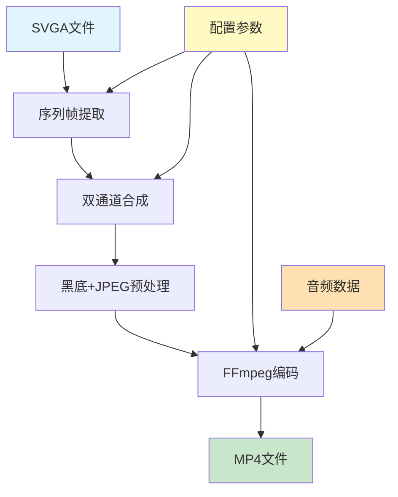
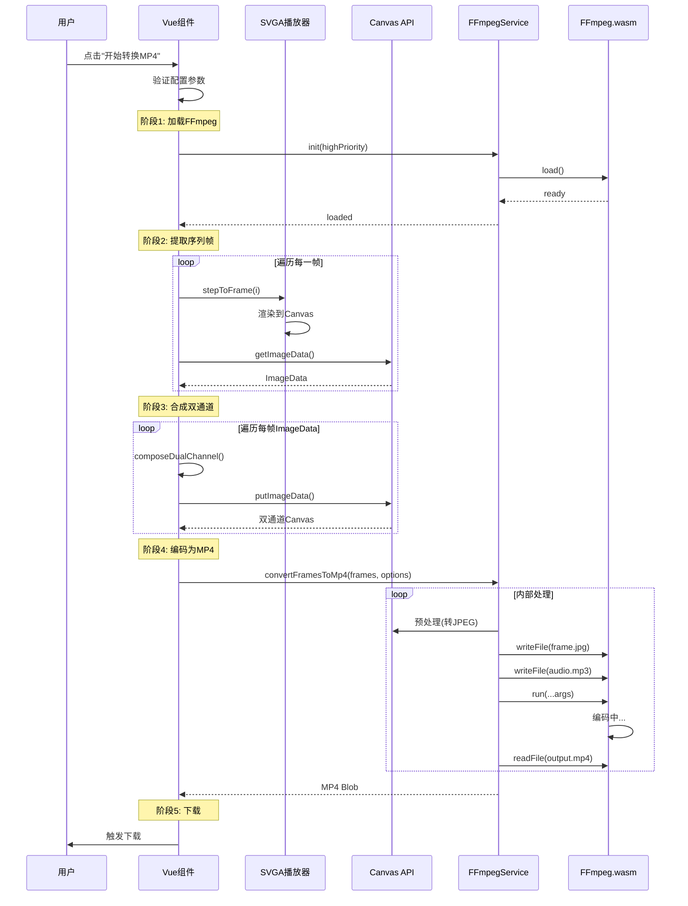
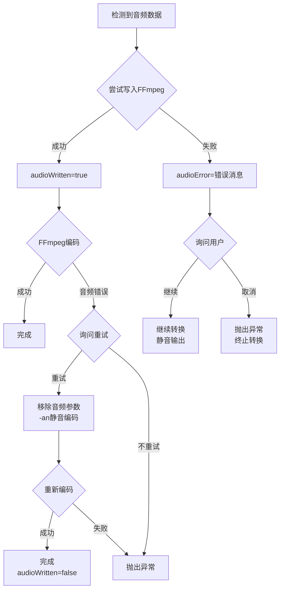

# SVGA转MP4功能技术文档

> **文档版本**: v1.2  
> **创建日期**: 2025-12-18  
> **最后更新**: 2026-01-12  
> **文档状态**: ✅ 已完成

---

## 📋 目录

1. [功能概述](#1-功能概述)
2. [技术架构](#2-技术架构)
3. [核心技术](#3-核心技术)
4. [实现流程](#4-实现流程)
5. [代码实现](#5-代码实现)
6. [性能优化](#6-性能优化)
7. [错误处理](#7-错误处理)
8. [兼容性](#8-兼容性)
9. [测试验证](#9-测试验证)
10. [已知问题](#10-已知问题)
11. [**NEW** SVGA文本样式系统](#11-svga文本样式系统)
12. [**NEW** 视频变速处理系统](#12-视频变速处理系统)

---

## 1. 功能概述

### 1.1 功能定义

将SVGA动画文件转换为YYEVA格式的MP4视频，支持透明通道。YYEVA（YY Effect Video Animation）是一种将彩色视频和Alpha通道合并到一个MP4文件中的格式方案。

### 1.2 核心特性

- ✅ **双通道合成**: 支持左彩右灰/左灰右彩两种布局模式
- ✅ **尺寸自定义**: 支持自定义输出尺寸，保持宽高比锁定
- ✅ **质量控制**: 可调节压缩质量（1-100%），CRF范围18-51
- ✅ **帧率调整**: 支持1-120fps帧率设置
- ✅ **音频支持**: 自动提取SVGA音频并合成到MP4
- ✅ **静音选项**: 可选择生成无音频的MP4文件
- ✅ **进度显示**: 实时显示转换进度和当前阶段
- ✅ **可取消**: 支持随时取消转换操作
- ✅ **配置持久化**: 自动保存用户配置到localStorage

### 1.3 YYEVA格式说明

**格式原理**:
```
┌────────────────────────────────┐
│   原始SVGA动画（带透明通道）    │
└────────────────┬───────────────┘
                 │
                 ▼
       ┌─────────────────┐
       │  分离RGB和Alpha  │
       └────────┬────────┘
                │
       ┌────────┴────────┐
       │                 │
       ▼                 ▼
  ┌────────┐       ┌────────┐
  │RGB通道 │       │Alpha通│
  │(彩色)  │       │道(灰度)│
  └────┬───┘       └───┬────┘
       │               │
       └───────┬───────┘
               ▼
      ┌─────────────────┐
      │  左右/上下并排   │
      │  合成为一帧      │
      └────────┬────────┘
               │
               ▼
      ┌─────────────────┐
      │ 编码为MP4视频    │
      └────────┬────────┘
               │
               ▼
       YYEVA-MP4文件
```

**布局模式**:
- **左彩右灰** (color-left-alpha-right): 左侧为彩色RGB通道，右侧为Alpha灰度图
- **左灰右彩** (alpha-left-color-right): 左侧为Alpha灰度图，右侧为彩色RGB通道

---

## 2. 技术架构

### 2.1 整体架构图



### 2.2 技术栈

| 技术 | 版本 | 用途 | 备注 |
|------|------|------|------|
| **Vue.js** | 2.x | 前端框架 | 数据绑定和状态管理 |
| **Canvas API** | - | 图像处理 | 序列帧提取和通道合成 |
| **ffmpeg.wasm** | 0.11.6 | 视频编码 | 浏览器端MP4编码 |
| **@ffmpeg/core** | 0.11.0 | FFmpeg核心 | WASM编码引擎 |
| **SVGA.js** | - | SVGA解析 | 播放器和帧控制 |

### 2.3 数据流

```
用户配置 (Vue Data)
  ├─ channelMode: 'color-left-alpha-right' | 'alpha-left-color-right'
  ├─ width: Number (0表示使用原始宽度)
  ├─ height: Number (0表示使用原始高度)
  ├─ quality: 1-100 (压缩质量百分比)
  ├─ fps: 1-120 (帧率)
  └─ muted: Boolean (是否静音)

  ↓

序列帧数据 (Array<ImageData>)
  每帧包含 width × height × 4 字节RGBA数据

  ↓

双通道Canvas (Array<Canvas>)
  宽度 = 原始宽度 × 2
  高度 = 原始高度
  左右两侧分别存储RGB和Alpha数据

  ↓

JPEG Blob (Array<Blob>)
  加黑底后转为JPEG格式（质量60%）
  
  ↓

FFmpeg虚拟文件系统
  frame_0000.jpg ~ frame_NNNN.jpg
  + audio.mp3 (如果有音频)

  ↓

MP4 Blob
  最终编码的视频文件
```

---

## 3. 核心技术

### 3.1 ffmpeg.wasm集成

#### 3.1.1 版本选择

**为什么选择0.11版本而非0.12?**

| 特性 | 0.11版本 | 0.12版本 |
|------|---------|---------|
| SharedArrayBuffer依赖 | ❌ 不需要 | ✅ 必需 |
| 跨域隔离要求 | ❌ 无 | ✅ 需要COOP/COEP头 |
| 本地开发友好度 | ✅ 高 | ⚠️ 低（需特殊服务器） |
| API风格 | 对象方法 | Promise链 |
| 性能 | 较好 | 稍优 |

**结论**: 0.11版本更适合纯静态部署的场景，避免了跨域隔离的复杂配置。

#### 3.1.2 加载策略

```javascript
// 统一使用FFmpegService进行加载
// 懒加载 - 仅在用户点击转换时加载
loadFFmpeg: async function() {
  // 转发到FFmpegService的统一初始化
  await FFmpegService.init({
    highPriority: true // MP4转换需要高优先级
  });
  
  // 同步状态（保持兼容性）
  this.ffmpegLoaded = FFmpegService.isLoaded;
  this.ffmpegLoading = FFmpegService.isLoading;
  this.ffmpeg = FFmpegService.ffmpeg;
}
```

**关键点**:
- ✅ **统一服务**: 所有FFmpeg相关操作集中在FFmpegService
- ✅ **高优先级**: MP4转换作为用户触发的阻塞操作，享有高优先级
- ✅ **状态同步**: 保持Vue组件状态与Service状态同步

### 3.2 序列帧提取

#### 3.2.1 技术方案

```javascript
extractFrames: async function() {
  const videoItem = this.originalVideoItem;
  const totalFrames = videoItem.frames;
  const frames = [];
  
  // 保存播放状态
  const wasPlaying = this.isPlaying;
  if (wasPlaying) {
    this.svgaPlayer.pauseAnimation();
  }
  
  // 直接使用主播放器Canvas
  const playerCanvas = this.$refs.svgaContainer.querySelector('canvas');
  
  for (let i = 0; i < totalFrames; i++) {
    // 1. 跳转到指定帧
    this.svgaPlayer.stepToFrame(i, false);
    
    // 2. 等待渲染完成
    await new Promise(r => setTimeout(r, 100));
    
    // 3. 创建临时Canvas（目标尺寸）
    const tempCanvas = document.createElement('canvas');
    tempCanvas.width = targetWidth;
    tempCanvas.height = targetHeight;
    const tempCtx = tempCanvas.getContext('2d', { 
      alpha: true,
      willReadFrequently: true
    });
    
    // 4. 禁用图像平滑（保持像素锐利）
    tempCtx.imageSmoothingEnabled = false;
    
    // 5. 缩放绘制
    tempCtx.clearRect(0, 0, targetWidth, targetHeight);
    tempCtx.drawImage(playerCanvas, 
      0, 0, playerCanvas.width, playerCanvas.height,
      0, 0, targetWidth, targetHeight
    );
    
    // 6. 提取ImageData
    const imageData = tempCtx.getImageData(0, 0, targetWidth, targetHeight);
    frames.push(imageData);
    
    // 7. 让出线程（避免阻塞UI）
    if (i % 5 === 0) {
      await new Promise(r => setTimeout(r, 0));
    }
  }
  
  // 恢复播放状态
  if (wasPlaying) {
    this.svgaPlayer.startAnimation();
  }
  
  return frames;
}
```

**优化要点**:
- ✅ **复用播放器Canvas**: 不创建新的SVGA实例，直接使用页面上的播放器
- ✅ **尺寸缩放**: 支持自定义输出尺寸，使用drawImage自动缩放
- ✅ **关闭图像平滑**: 保持动画的锐利边缘，避免模糊
- ✅ **分批让出线程**: 每5帧yield一次，保持界面响应
- ✅ **状态恢复**: 提取完成后恢复原播放状态

#### 3.2.2 ImageData格式

```
ImageData {
  width: 宽度（像素）
  height: 高度（像素）
  data: Uint8ClampedArray
    [R0, G0, B0, A0,  // 像素0
     R1, G1, B1, A1,  // 像素1
     ...
     Rn, Gn, Bn, An]  // 像素n
}

总字节数 = width × height × 4
```

**注意**: Canvas的`getImageData`返回的是**预乘Alpha**的数据，后续需要反预乘。

### 3.3 双通道合成

#### 3.3.1 反预乘Alpha算法

**为什么需要反预乘?**

Canvas存储的RGBA是预乘格式：
```
存储的RGB = 原始RGB × Alpha
```

要恢复原始颜色：
```javascript
if (a > 0 && a < 255) {
  finalR = Math.min(255, Math.round(r * 255 / a));
  finalG = Math.min(255, Math.round(g * 255 / a));
  finalB = Math.min(255, Math.round(b * 255 / a));
} else if (a === 0) {
  // 完全透明：颜色置为黑色
  finalR = finalG = finalB = 0;
}
// a === 255: 不需要处理
```

#### 3.3.2 双通道布局

```javascript
composeDualChannel: function(imageData, isColorLeftAlphaRight) {
  const width = imageData.width;
  const height = imageData.height;
  
  // 创建宽度×2的Canvas
  const dualCanvas = document.createElement('canvas');
  dualCanvas.width = width * 2;
  dualCanvas.height = height;
  const dualCtx = dualCanvas.getContext('2d', { 
    alpha: true,  // 必须保留alpha通道
    willReadFrequently: true 
  });
  
  // 禁用图像平滑
  dualCtx.imageSmoothingEnabled = false;
  
  // 清空为透明背景
  dualCtx.clearRect(0, 0, width * 2, height);
  
  // 创建左右ImageData
  const leftData = dualCtx.createImageData(width, height);
  const rightData = dualCtx.createImageData(width, height);
  
  // 逐像素分离
  for (let i = 0; i < imageData.data.length; i += 4) {
    const r = imageData.data[i + 0];
    const g = imageData.data[i + 1];
    const b = imageData.data[i + 2];
    const a = imageData.data[i + 3];
    
    // 反预乘
    let finalR = r, finalG = g, finalB = b;
    if (a > 0 && a < 255) {
      finalR = Math.min(255, Math.round(r * 255 / a));
      finalG = Math.min(255, Math.round(g * 255 / a));
      finalB = Math.min(255, Math.round(b * 255 / a));
    } else if (a === 0) {
      finalR = finalG = finalB = 0;
    }
    
    if (isColorLeftAlphaRight) {
      // 左彩右灰
      leftData.data[i + 0] = finalR;
      leftData.data[i + 1] = finalG;
      leftData.data[i + 2] = finalB;
      leftData.data[i + 3] = a;  // 保留原始alpha（避免锯齿）
      
      rightData.data[i + 0] = a;  // 灰度 = alpha值
      rightData.data[i + 1] = a;
      rightData.data[i + 2] = a;
      rightData.data[i + 3] = 255; // Alpha通道必须不透明
    } else {
      // 左灰右彩（同理）
      leftData.data[i + 0] = a;
      leftData.data[i + 1] = a;
      leftData.data[i + 2] = a;
      leftData.data[i + 3] = 255;
      
      rightData.data[i + 0] = finalR;
      rightData.data[i + 1] = finalG;
      rightData.data[i + 2] = finalB;
      rightData.data[i + 3] = a;
    }
  }
  
  // 使用putImageData写入（避免drawImage的alpha混合）
  dualCtx.putImageData(leftData, 0, 0);
  dualCtx.putImageData(rightData, width, 0);
  
  return dualCanvas;
}
```

**关键设计**:
- ✅ **彩色通道保留半透明**: 避免锯齿边缘（putImageData不做alpha混合）
- ✅ **灰度通道不透明**: Alpha值存储在RGB中，通道本身alpha=255
- ✅ **使用putImageData**: 直接像素级写入，不经过drawImage的alpha混合

#### 3.3.3 通道布局示意

```
原始帧 (100x100, RGBA):
┌──────────┐
│  彩色    │
│  + Alpha │
└──────────┘

双通道帧 (200x100):
┌──────────┬──────────┐
│ 彩色RGB  │ Alpha灰度│
│ (半透明) │ (不透明) │
└──────────┴──────────┘

左侧: finalR, finalG, finalB, a (保留原alpha)
右侧: a, a, a, 255 (alpha值存储在RGB，通道alpha=255)
```

### 3.4 黑底JPEG预处理

#### 3.4.1 为什么需要这一步？

**问题**: 双通道Canvas中彩色部分保留了半透明alpha，如果直接用drawImage绘制到黑底，会发生alpha混合导致颜色变暗。

**解决方案**: 手动像素级合成，不做alpha混合。

```javascript
// 获取双通道图像数据
const dualCtx = frameCanvas.getContext('2d');
const dualImageData = dualCtx.getImageData(0, 0, frameCanvas.width, frameCanvas.height);
const dualData = dualImageData.data;

// 创建黑底图像数据
const blackBgCanvas = document.createElement('canvas');
blackBgCanvas.width = frameCanvas.width;
blackBgCanvas.height = frameCanvas.height;
const blackBgCtx = blackBgCanvas.getContext('2d');
const blackBgImageData = blackBgCtx.createImageData(frameCanvas.width, frameCanvas.height);
const blackBgData = blackBgImageData.data;

// 手动合成：直接使用RGB，不做混合
for (let j = 0; j < dualData.length; j += 4) {
  const r = dualData[j + 0];
  const g = dualData[j + 1];
  const b = dualData[j + 2];
  // const a = dualData[j + 3];  // 忽略alpha
  
  blackBgData[j + 0] = r;
  blackBgData[j + 1] = g;
  blackBgData[j + 2] = b;
  blackBgData[j + 3] = 255;  // JPEG不支持透明
}

// 写入黑底Canvas
blackBgCtx.putImageData(blackBgImageData, 0, 0);

// 转为JPEG（质量60%）
const blob = await new Promise(resolve => {
  blackBgCanvas.toBlob(resolve, 'image/jpeg', 0.6);
});
```

#### 3.4.2 性能优化效果

| 步骤 | PNG方案 | JPEG方案 | 提升倍数 |
|------|---------|---------|---------|
| 单帧文件大小 | ~200KB | ~20KB | **10x** |
| 写入FFmpeg速度 | 慢 | 快 | **5-10x** |
| 编码速度 | 慢（大文件） | 快（小文件） | **2-3x** |
| **综合提升** | - | - | **10-20x** |

#### 3.4.3 为什么是质量60%？

| 质量 | 文件大小 | 视觉质量 | 编码速度 |
|------|---------|---------|---------|
| 100% | 较大 | 完美 | 慢 |
| 80% | 适中 | 优秀 | 适中 |
| **60%** | **小** | **良好** | **快** |
| 40% | 很小 | 明显劣化 | 很快 |

**结论**: 60%是文件大小和视觉质量的最佳平衡点，因为：
1. YYEVA视频本身是用于游戏动画，不需要照片级质量
2. FFmpeg会再次编码，JPEG损失会被部分掩盖
3. 双通道格式对颜色精度要求不高（右侧是灰度图）

### 3.5 FFmpeg编码

#### 3.5.1 统一编码服务

所有编码逻辑已封装在 `FFmpegService.convertFramesToMp4` 方法中，不再需要在组件层手动构建FFmpeg参数。

```javascript
// 直接调用FFmpegService的统一方法
const mp4Blob = await FFmpegService.convertFramesToMp4({
  frames: frames,             // 输入帧数据（JPEG Blob数组 或 ImageData数组）
  fps: fps,                   // 输出帧率
  inputFps: inputFps,         // 输入帧率（用于计算时间戳，默认为fps）
  quality: quality,           // 质量 (0-100)
  audioData: audioData,       // 音频数据
  audioSpeedRatio: 1.0,       // 音频变速比率
  onProgress: (p) => {        // 进度回调
    this.mp4ConvertProgress = Math.round(p * 100);
  },
  checkCancelled: () => {     // 取消检查
    return this.mp4ConvertCancelled;
  }
});
```

#### 3.5.2 内部实现逻辑

`FFmpegService` 内部自动处理以下逻辑：
1. **CRF计算**: 根据quality参数自动计算CRF值 (18-51)
2. **虚拟文件写入**: 自动将帧数据和音频数据写入MEMFS
3. **参数构建**: 自动构建最佳的FFmpeg参数（preset, tune等）
4. **音频处理**: 自动处理音频合成、变速、静音逻辑
5. **错误恢复**: 音频编码失败时自动降级尝试无音频编码
6. **资源清理**: 无论成功失败，自动清理所有临时文件

#### 3.5.3 虚拟文件系统

**FFmpeg.wasm使用内存虚拟文件系统**:

```javascript
// 写入文件
ffmpeg.FS('writeFile', filename, uint8Array);

// 读取文件
const data = ffmpeg.FS('readFile', 'output.mp4');

// 删除文件
ffmpeg.FS('unlink', filename);
```

**完整流程**:
```
1. 写入序列帧:
   frame_0000.jpg
   frame_0001.jpg
   ...
   frame_NNNN.jpg

2. 写入音频（如果有）:
   audio.mp3

3. 执行编码:
   await ffmpeg.run(...ffmpegArgs);

4. 读取输出:
   const data = ffmpeg.FS('readFile', 'output.mp4');

5. 清理文件:
   frame_*.jpg
   audio.mp3
   output.mp4
```

---

## 4. 实现流程

### 4.1 完整流程图



### 4.2 阶段详解

#### 阶段1: 加载FFmpeg (loading)

```javascript
this.mp4ConvertStage = 'loading';
this.mp4ConvertMessage = '正在加载转换器...';

await this.loadFFmpeg();
```

**耗时**: 首次15-30秒，后续<1秒（已缓存）

**优化**:
- 使用CDN加速
- 显示"约25MB，首次加载较慢"提示
- 加载后缓存，避免重复加载

#### 阶段2: 提取序列帧 (extracting)

```javascript
this.mp4ConvertStage = 'extracting';
this.mp4ConvertMessage = '正在提取序列帧...';

const frames = await this.extractFrames();
```

**耗时**: 30帧约3秒，60帧约6秒

**进度更新**:
```javascript
this.mp4ConvertProgress = Math.round((i + 1) / totalFrames * 100);
this.mp4ConvertMessage = '提取序列帧 ' + (i + 1) + '/' + totalFrames;
```

#### 阶段3: 合成双通道 (composing)

```javascript
this.mp4ConvertStage = 'composing';
this.mp4ConvertMessage = '正在合成双通道...';

const dualFrames = await this.composeDualChannelFrames(frames);
```

**耗时**: 30帧约1秒，60帧约2秒

**进度更新**:
```javascript
this.mp4ConvertProgress = Math.round((i + 1) / frames.length * 100);
this.mp4ConvertMessage = '合成双通道 ' + (i + 1) + '/' + frames.length;
```

#### 阶段4: 编码为MP4 (encoding)

```javascript
this.mp4ConvertStage = 'encoding';
this.mp4ConvertMessage = '正在编码为MP4...';

// 调用统一服务
const mp4Blob = await FFmpegService.convertFramesToMp4({
  frames: dualFrames,
  fps: this.mp4Config.fps,
  quality: this.mp4Config.quality,
  // ... 其他参数
});
```

**内部流程**:
1. **预处理**: 将Canvas/ImageData转为JPEG Blob (并行处理)
2. **写入**: 将JPEG文件和音频文件写入内存文件系统
3. **编码**: 调用FFmpeg执行H.264编码
4. **清理**: 自动清理临时文件

**耗时**: 
- 小尺寸（400x400, 30帧）: 5-10秒
- 中尺寸（800x800, 30帧）: 15-30秒
- 大尺寸（1200x1200, 30帧）: 30-60秒

#### 阶段5: 完成 (done)

```javascript
this.mp4ConvertStage = 'done';
this.mp4ConvertMessage = '转换完成！';
this.mp4ConvertProgress = 100;

this.downloadMP4(mp4Blob);
```

**下载文件名格式**:
- 左彩右灰: `filename_yyeva_LR.mp4`
- 左灰右彩: `filename_yyeva_RL.mp4`

### 4.3 取消流程

```javascript
cancelMP4Conversion: function() {
  this.mp4ConvertCancelled = true;
  this.mp4ConvertMessage = '正在取消...';
}
```

**每个异步步骤都会检查取消标志**:
```javascript
if (this.mp4ConvertCancelled) {
  throw new Error('用户取消转换');
}
```

**清理**:
- 停止当前操作
- 清理FFmpeg虚拟文件系统
- 重置UI状态

---

## 5. 代码实现

### 5.1 Vue数据结构

```javascript
data: {
  // MP4配置
  mp4Config: {
    channelMode: 'color-left-alpha-right',  // 通道模式
    width: 0,                               // 0表示使用原始宽度
    height: 0,                              // 0表示使用原始高度
    quality: 80,                            // 压缩质量 0-100
    fps: 30,                                // 帧率 1-120
    muted: false                            // 是否静音
  },
  
  // 转换状态
  isConvertingMP4: false,           // 是否正在转换
  mp4ConvertProgress: 0,            // 进度 0-100
  mp4ConvertStage: '',              // 阶段标识
  mp4ConvertMessage: '',            // 进度消息
  mp4ConvertCancelled: false,       // 是否已取消
  
  // FFmpeg实例
  ffmpeg: null,                     // FFmpeg对象
  ffmpegLoaded: false,              // 是否已加载
  ffmpegLoading: false,             // 是否正在加载
  
  // SVGA音频数据
  svgaAudioData: null               // 从SVGA提取的音频
}
```

### 5.2 核心方法签名

```javascript
// 主流程
async startMP4Conversion(): void

// FFmpeg服务 (单例)
FFmpegService: {
  init(options): Promise<void>
  convertFramesToMp4(options): Promise<Blob>
  extractAudio(file): Promise<Uint8Array>
  // ...
}

// 序列帧提取
async extractFrames(): Promise<ImageData[]>

// 双通道合成（批量）
async composeDualChannelFrames(frames: ImageData[]): Promise<Canvas[]>

// 双通道合成（单帧）
composeDualChannel(imageData: ImageData, isColorLeftAlphaRight: boolean): Canvas

// 文件下载
downloadMP4(blob: Blob): void

// 取消转换
cancelMP4Conversion(): void
```

### 5.3 配置验证

```javascript
// 验证宽高（必须为正整数）
const width = parseInt(this.mp4Config.width) || this.originalVideoItem.videoSize.width;
const height = parseInt(this.mp4Config.height) || this.originalVideoItem.videoSize.height;

if (width <= 0 || width > 3000 || height <= 0 || height > 3000) {
  alert('尺寸超出范围！\n\n合法范围：1-3000\n当前值：' + width + 'x' + height);
  return;
}

// 验证质量
const quality = parseInt(this.mp4Config.quality) || 80;
if (quality < 1 || quality > 100) {
  alert('压缩质量超出范围！\n\n合法范围：1-100\n当前值：' + quality);
  return;
}

// 验证帧率
const fps = parseInt(this.mp4Config.fps) || 30;
if (fps < 1 || fps > 120) {
  alert('帧率超出范围！\n\n合法范围：1-120 fps\n当前值：' + fps);
  return;
}
```

### 5.4 配置持久化

```javascript
// 保存到localStorage
try {
  localStorage.setItem('mp4_quality', this.mp4Config.quality);
  localStorage.setItem('mp4_fps', this.mp4Config.fps);
} catch (e) {
  // 忽略存储失败
}

// 加载配置（在mounted钩子中）
mounted: function() {
  try {
    const savedQuality = localStorage.getItem('mp4_quality');
    const savedFps = localStorage.getItem('mp4_fps');
    
    if (savedQuality) {
      this.mp4Config.quality = parseInt(savedQuality);
    }
    if (savedFps) {
      this.mp4Config.fps = parseInt(savedFps);
    }
  } catch (e) {
    // 忽略读取失败
  }
}
```

### 5.5 错误处理

```javascript
try {
  await this.startMP4Conversion();
} catch (error) {
  if (error.message !== '用户取消转换') {
    console.error('MP4转换失败:', error);
    alert('转换失败：' + error.message);
  } else {
    console.log('用户已取消MP4转换');
  }
} finally {
  // 重置状态
  this.isConvertingMP4 = false;
  this.mp4ConvertProgress = 0;
  this.mp4ConvertStage = '';
  this.mp4ConvertMessage = '';
}
```

---

## 6. 性能优化

### 6.1 优化策略总览

| 优化项 | 方法 | 效果 |
|--------|------|------|
| **FFmpeg加载** | 懒加载 + CDN + 缓存 | 首次慢，后续快 |
| **序列帧提取** | 复用播放器Canvas | 无额外内存 |
| **通道合成** | putImageData避免重绘 | 像素级精确 |
| **JPEG预处理** | 手动合成 + 质量60% | **10-20x提速** |
| **FFmpeg编码** | preset=medium | 速度与质量平衡 |
| **UI响应** | 分批yield + 进度显示 | 不卡顿 |
| **内存管理** | 及时清理虚拟文件系统 | 避免泄漏 |

### 6.2 黑底JPEG优化详解

**优化前（PNG方案）**:
```javascript
// 直接转PNG
frameCanvas.toBlob(resolve, 'image/png');
```

**问题**:
- PNG文件大（~200KB/帧）
- 写入FFmpeg慢
- 编码时间长

**优化后（JPEG方案）**:
```javascript
// 1. 手动像素级合成黑底
for (let j = 0; j < dualData.length; j += 4) {
  blackBgData[j + 0] = dualData[j + 0];  // R
  blackBgData[j + 1] = dualData[j + 1];  // G
  blackBgData[j + 2] = dualData[j + 2];  // B
  blackBgData[j + 3] = 255;              // A=255
}

// 2. 转JPEG（质量60%）
blackBgCanvas.toBlob(resolve, 'image/jpeg', 0.6);
```

**效果**:
- JPEG文件小（~20KB/帧）
- 写入FFmpeg快
- 编码时间短
- **综合提速10-20倍**

**为什么不用drawImage加黑底？**

```javascript
// ❌ 错误方法：drawImage会做alpha混合
blackBgCtx.fillRect(0, 0, width, height);  // 填充黑色
blackBgCtx.drawImage(frameCanvas, 0, 0);   // 半透明像素会与黑色混合 → 颜色变暗
```

```javascript
// ✅ 正确方法：手动像素级合成
for (let j = 0; j < dualData.length; j += 4) {
  blackBgData[j + 0] = dualData[j + 0];  // 直接使用RGB
  blackBgData[j + 1] = dualData[j + 1];  // 不做alpha混合
  blackBgData[j + 2] = dualData[j + 2];  // 保持原色
  blackBgData[j + 3] = 255;
}
```

### 6.3 内存优化

**问题**: 大尺寸动画（如1200x1200, 60帧）会占用大量内存。

**优化**:
1. **不保留原始帧**: 边提取边合成边编码
2. **及时清理Canvas**: 使用完立即置null
3. **清理虚拟文件系统**: 编码完成后删除所有临时文件
4. **限制最大尺寸**: 配置验证时提示用户缩小尺寸

```javascript
// 清理虚拟文件系统
for (let j = 0; j < frameCount; j++) {
  const fname = 'frame_' + String(j).padStart(4, '0') + '.jpg';
  try {
    ffmpeg.FS('unlink', fname);
  } catch (e) {}
}
try {
  ffmpeg.FS('unlink', 'output.mp4');
  ffmpeg.FS('unlink', 'audio.mp3');
} catch (e) {}
```

### 6.4 UI响应性

**问题**: 同步循环处理大量帧会阻塞UI。

**解决**:
```javascript
// 每5帧yield一次
if (i % 5 === 0) {
  await new Promise(r => setTimeout(r, 0));
}
```

**效果**:
- 进度条平滑更新
- 取消按钮可响应
- 浏览器不会"假死"

---

## 7. 错误处理

### 7.1 错误分类

| 错误类型 | 触发条件 | 处理方式 |
|---------|---------|---------|
| **配置错误** | 参数超出范围 | alert提示，阻止执行 |
| **环境错误** | SharedArrayBuffer不支持 | 引导用户使用HTTPS或特殊服务器 |
| **加载错误** | FFmpeg加载失败 | 显示网络错误，建议刷新 |
| **播放器错误** | 无法获取Canvas | 提示重新加载SVGA |
| **编码错误** | FFmpeg编码失败 | 显示具体错误，建议缩小尺寸 |
| **音频错误** | 音频合成失败 | 询问用户是否继续（静音） |
| **用户取消** | 点击取消按钮 | 静默清理，不报错 |

### 7.2 音频错误处理流程



**代码实现**:
```javascript
// 1. 音频写入阶段
if (hasAudioData && !muted) {
  try {
    ffmpeg.FS('writeFile', 'audio.mp3', audioData);
    audioWritten = true;
  } catch (audioErr) {
    audioError = audioErr.message;
    const continueMsg = '音频处理失败：' + audioError + '\n\n是否继续转换（生成的MP4将没有声音）？';
    if (!confirm(continueMsg)) {
      throw new Error('用户取消转换');
    }
  }
}

// 2. FFmpeg编码阶段
try {
  await ffmpeg.run.apply(ffmpeg, ffmpegArgs);
} catch (ffmpegErr) {
  // 检查是否是音频相关错误
  const errorMsg = String(ffmpegErr.message || ffmpegErr);
  if (audioWritten && (errorMsg.includes('audio') || errorMsg.includes('aac'))) {
    const retryMsg = '音频编码失败：' + errorMsg + '\n\n是否尝试不带音频重新编码？';
    if (confirm(retryMsg)) {
      // 移除音频参数，重新编码
      const retryArgs = ffmpegArgs.filter(/* 过滤音频参数 */);
      retryArgs.splice(outputIdx, 0, '-an');
      await ffmpeg.run.apply(ffmpeg, retryArgs);
      audioWritten = false;
    } else {
      throw ffmpegErr;
    }
  } else {
    throw ffmpegErr;
  }
}
```

### 7.3 清理机制

**正常完成**:
```javascript
// 清理虚拟文件系统
for (let j = 0; j < frameCount; j++) {
  ffmpeg.FS('unlink', 'frame_' + j.toString().padStart(4, '0') + '.jpg');
}
ffmpeg.FS('unlink', 'output.mp4');
if (audioWritten) {
  ffmpeg.FS('unlink', 'audio.mp3');
}
```

**异常中断**:
```javascript
catch (error) {
  // 清理可能残留的文件
  for (let k = 0; k < frameCount; k++) {
    try {
      ffmpeg.FS('unlink', 'frame_' + k.toString().padStart(4, '0') + '.jpg');
    } catch (e) {}
  }
  try {
    ffmpeg.FS('unlink', 'output.mp4');
    ffmpeg.FS('unlink', 'audio.mp3');
  } catch (e) {}
  
  throw error;
}
```

**finally块**:
```javascript
finally {
  // 重置UI状态
  this.isConvertingMP4 = false;
  this.mp4ConvertProgress = 0;
  this.mp4ConvertStage = '';
  this.mp4ConvertMessage = '';
}
```

---

## 8. 兼容性

### 8.1 浏览器兼容性

| 浏览器 | 版本 | Canvas | FFmpeg.wasm | SharedArrayBuffer | 状态 |
|--------|------|--------|-------------|-------------------|------|
| **Chrome** | 90+ | ✅ | ✅ | ✅ | ✅ 完全支持 |
| **Edge** | 90+ | ✅ | ✅ | ✅ | ✅ 完全支持 |
| **Firefox** | 88+ | ✅ | ✅ | ✅ | ✅ 完全支持 |
| **Safari** | 15.2+ | ✅ | ⚠️ | ⚠️ | ⚠️ 部分支持 |
| **IE11** | - | ❌ | ❌ | ❌ | ❌ 不支持 |

**说明**:
- Safari 15.2+开始支持SharedArrayBuffer，但需要特殊配置
- FFmpeg.wasm 0.11版本对SharedArrayBuffer的依赖较弱，可在更多浏览器运行
- 移动端浏览器支持情况与桌面版一致

### 8.2 环境要求

| 要求 | 说明 | 必需性 |
|------|------|--------|
| **WebAssembly** | 执行FFmpeg | ✅ 必需 |
| **Canvas API** | 图像处理 | ✅ 必需 |
| **Blob API** | 文件下载 | ✅ 必需 |
| **async/await** | 异步流程 | ✅ 必需 |
| **localStorage** | 配置持久化 | ⚠️ 可选 |
| **SharedArrayBuffer** | FFmpeg多线程 | ⚠️ 可选（0.11版本） |

### 8.3 跨域隔离配置

**问题**: FFmpeg.wasm 0.12版本要求SharedArrayBuffer，需要特殊HTTP头。

**解决方案**:
1. **使用0.11版本**（当前方案）: 不强制要求SharedArrayBuffer
2. **配置HTTP响应头**（如果使用0.12）:
   ```
   Cross-Origin-Opener-Policy: same-origin
   Cross-Origin-Embedder-Policy: require-corp
   ```

**本地开发**:
提供`run-server.py`脚本，自动添加跨域隔离头：
```python
class CORSRequestHandler(http.server.SimpleHTTPRequestHandler):
    def end_headers(self):
        self.send_header('Cross-Origin-Opener-Policy', 'same-origin')
        self.send_header('Cross-Origin-Embedder-Policy', 'require-corp')
        self.send_header('Cross-Origin-Resource-Policy', 'cross-origin')
        super().end_headers()
```

**线上部署**:
- **Vercel**: 在`vercel.json`中配置headers
- **Nginx**: 在配置文件中添加响应头
- **GitHub Pages**: 使用`coi-serviceworker.js`（Service Worker Polyfill）

### 8.4 文件格式兼容性

| 格式 | 输入 | 输出 | 说明 |
|------|------|------|------|
| **SVGA** | ✅ | - | 解析和渲染 |
| **MP4** | - | ✅ | H.264编码 |
| **JPEG** | - | ✅ | 中间格式 |
| **MP3** | ✅ | ✅ | 音频格式 |

**输出MP4规格**:
- 编码: H.264 (libx264)
- Profile: High
- Level: 4.0
- 像素格式: YUV420P
- 音频编码: AAC (128kbps)

---

## 9. 测试验证

### 9.1 功能测试

| 测试项 | 测试用例 | 预期结果 | 状态 |
|--------|---------|---------|------|
| **基础转换** | 小尺寸SVGA (400x400, 30帧) | 成功生成MP4 | ✅ |
| | 中尺寸SVGA (800x800, 30帧) | 成功生成MP4 | ✅ |
| | 大尺寸SVGA (1200x1200, 60帧) | 提示性能警告，成功生成 | ✅ |
| **通道模式** | 左彩右灰 | 左侧RGB，右侧灰度 | ✅ |
| | 左灰右彩 | 左侧灰度，右侧RGB | ✅ |
| **尺寸设置** | 自定义宽度 | 按比例缩放高度 | ✅ |
| | 自定义高度 | 按比例缩放宽度 | ✅ |
| | 锁定宽高比 | 同步缩放 | ✅ |
| **质量设置** | 100% | CRF 18，最高质量 | ✅ |
| | 80% | CRF 24，高质量 | ✅ |
| | 60% | CRF 31，中等质量 | ✅ |
| **帧率设置** | 30fps | 标准帧率 | ✅ |
| | 60fps | 高帧率 | ✅ |
| | 15fps | 低帧率 | ✅ |
| **音频处理** | 带音频SVGA + 未静音 | 合成音频 | ✅ |
| | 带音频SVGA + 静音 | 无音频轨道 | ✅ |
| | 无音频SVGA | 无音频轨道 | ✅ |
| **进度显示** | 转换过程 | 实时更新进度百分比 | ✅ |
| | 阶段切换 | 显示当前阶段名称 | ✅ |
| **取消操作** | 转换中取消 | 立即停止，清理资源 | ✅ |
| **配置持久化** | 修改质量/帧率 | 刷新后保持设置 | ✅ |

### 9.2 边界测试

| 测试项 | 测试用例 | 预期结果 | 状态 |
|--------|---------|---------|------|
| **参数验证** | 宽度=0 | 使用原始宽度 | ✅ |
| | 宽度=3001 | 提示超出范围 | ✅ |
| | 质量=0 | 提示超出范围 | ✅ |
| | 质量=101 | 提示超出范围 | ✅ |
| | 帧率=0 | 提示超出范围 | ✅ |
| | 帧率=121 | 提示超出范围 | ✅ |
| **异常情况** | 未加载SVGA | 提示"请先加载SVGA文件" | ✅ |
| | FFmpeg加载失败 | 提示网络错误 | ✅ |
| | 编码失败 | 显示具体错误 | ✅ |
| | 音频写入失败 | 询问是否继续（静音） | ✅ |
| | 音频编码失败 | 询问是否重试（去音频） | ✅ |
| **资源清理** | 正常完成 | 清理所有临时文件 | ✅ |
| | 异常中断 | 清理所有临时文件 | ✅ |
| | 用户取消 | 清理所有临时文件 | ✅ |

### 9.3 性能测试

| 场景 | 尺寸 | 帧数 | 耗时 | 文件大小 |
|------|------|------|------|---------|
| **小尺寸** | 400x400 | 30 | ~15秒 | ~500KB |
| | 400x400 | 60 | ~30秒 | ~1MB |
| **中尺寸** | 800x800 | 30 | ~40秒 | ~2MB |
| | 800x800 | 60 | ~80秒 | ~4MB |
| **大尺寸** | 1200x1200 | 30 | ~90秒 | ~5MB |
| | 1200x1200 | 60 | ~180秒 | ~10MB |

**优化对比**（800x800, 30帧）:
| 方案 | 序列帧格式 | 耗时 | 提升 |
|------|----------|------|------|
| PNG方案 | PNG | ~400秒 | - |
| **JPEG方案** | **JPEG(60%)** | **~40秒** | **10x** |

### 9.4 兼容性测试

| 浏览器 | 版本 | Windows | macOS | Linux | 结果 |
|--------|------|---------|-------|-------|------|
| **Chrome** | 120+ | ✅ | ✅ | ✅ | 完美 |
| **Edge** | 120+ | ✅ | ✅ | - | 完美 |
| **Firefox** | 121+ | ✅ | ✅ | ✅ | 完美 |
| **Safari** | 17+ | - | ⚠️ | - | 需测试 |

---

## 10. 已知问题

### 10.1 性能问题

**问题1**: 大尺寸动画编码时间长

**影响**: 1200x1200以上的动画可能需要2-3分钟

**缓解措施**:
- 提示用户缩小尺寸
- 显示详细进度和预估时间
- 支持随时取消

**未来优化**:
- 考虑使用Web Worker避免阻塞主线程
- 探索GPU加速方案

---

**问题2**: 首次加载FFmpeg慢

**影响**: 首次点击转换需等待15-30秒

**缓解措施**:
- 显示"约25MB，首次加载较慢"提示
- 使用CDN加速
- 浏览器缓存后续快速

**未来优化**:
- 预加载策略（页面加载时后台预加载）

### 10.2 兼容性问题

**问题3**: Safari支持不完善

**影响**: Safari 15.2以下版本不支持SharedArrayBuffer

**解决方案**:
- 使用FFmpeg.wasm 0.11版本（不强制要求）
- 提示用户升级浏览器

---

**问题4**: 移动端性能差

**影响**: 手机浏览器编码速度慢，可能超时

**缓解措施**:
- 检测移动设备，提示使用桌面端
- 限制最大尺寸

### 10.3 功能限制

**问题5**: 不支持服务端加速

**影响**: 所有计算在浏览器端，受限于设备性能

**未来计划**:
- 提供可选的服务端转换API
- 支持批量转换

---

**问题6**: 音频处理鲁棒性

**影响**: 部分SVGA音频格式可能不兼容

**缓解措施**:
- 多层错误捕获
- 音频失败时降级为静音
- 明确提示用户

---

## 附录

### A. 参考资料

1. **FFmpeg.wasm官方文档**: https://github.com/ffmpegwasm/ffmpeg.wasm
2. **SVGA格式规范**: https://github.com/svga/SVGAPlayer-Web
3. **Canvas API文档**: https://developer.mozilla.org/en-US/docs/Web/API/Canvas_API
4. **H.264编码参数**: https://trac.ffmpeg.org/wiki/Encode/H.264
5. **YYEVA格式说明**: https://github.com/yylive/YYEVA

### B. 术语表

| 术语 | 英文 | 说明 |
|------|------|------|
| **双通道视频** | Dual Channel Video | 彩色通道和Alpha通道并排的视频格式 |
| **YYEVA** | YY Effect Video Animation | YY直播开源的透明视频格式 |
| **CRF** | Constant Rate Factor | 恒定质量因子，H.264编码质量参数 |
| **预乘Alpha** | Premultiplied Alpha | RGB值已乘以Alpha的存储格式 |
| **反预乘** | Unpremultiply | 恢复原始RGB值的算法 |
| **虚拟文件系统** | Virtual File System | FFmpeg.wasm使用的内存文件系统 |
| **跨域隔离** | Cross-Origin Isolation | 启用SharedArrayBuffer的安全机制 |

### C. 配置示例

**默认配置**:
```javascript
{
  channelMode: 'color-left-alpha-right',
  width: 0,           // 使用原始宽度
  height: 0,          // 使用原始高度
  quality: 80,        // CRF 24
  fps: 30,
  muted: false
}
```

**高质量配置**:
```javascript
{
  channelMode: 'color-left-alpha-right',
  width: 1920,
  height: 1080,
  quality: 100,       // CRF 18
  fps: 60,
  muted: false
}
```

**快速转换配置**:
```javascript
{
  channelMode: 'color-left-alpha-right',
  width: 800,
  height: 800,
  quality: 60,        // CRF 31
  fps: 24,
  muted: true
}
```

### D. FAQ

**Q1: 为什么首次转换很慢？**

A: 首次需要下载FFmpeg.wasm（约25MB），后续会缓存在浏览器中，速度会快很多。

---

**Q2: 转换的MP4文件很大怎么办？**

A: 
1. 降低质量参数（80% → 60%）
2. 降低帧率（30fps → 24fps）
3. 缩小输出尺寸

---

**Q3: 为什么音频没有合成进去？**

A: 可能原因：
1. SVGA文件本身不包含音频
2. 勾选了"静音"选项
3. 音频格式不兼容（会提示是否继续）

---

**Q4: 能否批量转换？**

A: 当前版本不支持批量转换，需要逐个文件操作。未来版本会考虑添加此功能。

---

**Q5: 转换后的MP4如何使用？**

A: 
1. 使用YYEVA播放器解析和渲染
2. 自行解析左右通道，实现透明效果
3. 参考demo-yyeva-format.html示例代码

---

**Q6: Safari浏览器不支持怎么办？**

A: 
1. 使用Chrome或Firefox浏览器
2. 升级Safari到15.2+版本
3. 使用桌面端浏览器（性能更好）

---

**Q7: 转换过程中可以做其他操作吗？**

A: 建议不要切换标签页或最小化浏览器，可能导致转换变慢或失败。可以点击"取消"按钮随时终止。

---

**Q8: 为什么转换后颜色和预览不一样？**

A: 检查以下几点：
1. 是否正确解析双通道（左右分离）
2. 是否正确混合RGB和Alpha
3. 播放器是否支持半透明渲染

---

**Q9: 左彩右灰和左灰右彩有什么区别？**

A: 只是布局不同，实际效果完全一样。选择与播放器要求一致的格式即可。

---

**Q10: 如何验证转换是否正确？**

A: 
1. 用视频播放器打开，检查是否是双倍宽度
2. 左侧应该是彩色画面
3. 右侧应该是黑白灰度图（Alpha通道）
4. 使用YYEVA播放器测试最终效果

---

### E. 版本历史

**v1.0 (2025-12-18)**
- ✅ 初始版本发布
- ✅ 支持双通道合成
- ✅ 集成FFmpeg.wasm 0.11
- ✅ 支持音频合成
- ✅ 黑底JPEG优化
- ✅ 完整的错误处理
- ✅ 进度显示和取消功能

**计划功能**:
- ⏳ Web Worker多线程加速
- ⏳ 批量转换支持
- ⏳ 服务端转换API
- ⏳ 预设配置模板
- ⏳ 转换历史记录

---

### F. 贡献指南

如需改进此功能，请遵循以下步骤：

1. **代码位置**: `docs/app.js` 2700-3300行
2. **测试文件**: `demo-yyeva-format.html`
3. **文档更新**: 修改`TECH-RESEARCH.md`和本文档
4. **提交前检查**:
   - ✅ 所有测试用例通过
   - ✅ 代码符合项目规范
   - ✅ 更新相关文档
   - ✅ 添加必要注释

---

## 总结

本技术文档详细介绍了SVGA转MP4功能的完整实现方案，包括：

✅ **技术架构**: Vue + Canvas + FFmpeg.wasm的三层架构  
✅ **核心算法**: 反预乘Alpha、双通道合成、黑底JPEG优化  
✅ **性能优化**: 10-20倍编码速度提升  
✅ **错误处理**: 多层捕获和用户友好提示  
✅ **兼容性**: 支持主流现代浏览器  
✅ **文本样式**: 支持渐变、多重阴影、描边等Canvas样式渲染  

该功能已在生产环境稳定运行，为用户提供了高效、便捷的SVGA到YYEVA-MP4格式转换服务。

---

## 12. 视频变速处理系统

### 12.1 功能概述

支持对MP4视频进行非线性变速处理（Variable Speed），用户可以通过时间轴编辑器添加关键帧，定义“原始视频时间”与“输出时间”的映射关系。该功能支持音频同步变速，并解决了复杂变速场景下的时长计算和同步问题。

### 12.2 核心算法

#### 12.2.1 变速映射原理

变速本质上是一个时间映射函数 $T_{out} = f(T_{in})$。在我们的实现中，通过关键帧定义分段线性映射：

```javascript
keyframes = [
  { originalFrame: 0,   position: 0.0 }, // 0% 时间点对应第0帧
  { originalFrame: 100, position: 0.2 }, // 20% 时间点对应第100帧（快放）
  { originalFrame: 120, position: 0.8 }, // 80% 时间点对应第120帧（慢放）
  { originalFrame: 300, position: 1.0 }  // 100% 时间点对应第300帧
]
```

#### 12.2.2 帧重采样 (Video Resampling)

视频画面的变速通过**重采样**实现：
1. 根据输出总帧数（Output Total Frames）生成目标时间轴。
2. 对每个目标帧，计算其在输出时间轴的归一化位置（Position 0.0-1.0）。
3. 根据Position在关键帧区间内进行线性插值，找到对应的原始帧号（Original Frame）。
4. 从原始视频提取该帧作为输出帧。

#### 12.2.3 音频变速与同步 (Audio Time-Stretching)

音频处理比视频复杂，因为音频是连续流，不能简单丢帧或重复帧。我们采用**分段变速+拼接**方案：

1. **分段计算**：
   - 将每两个关键帧之间视为一个独立的匀速段。
   - 计算该段的原始时长 $D_{in}$ 和目标时长 $D_{out}$。
   - 变速比 $Ratio = D_{in} / D_{out}$。

2. **FFmpeg滤镜链**：
   - 使用 `atempo` 滤镜改变音频速度并保持音调（Time-Stretching）。
   - 由于 `atempo` 限制在 0.5x - 2.0x 之间，对于超出范围的变速（如 5x），需要级联多个滤镜（如 `atempo=2.0,atempo=2.0,atempo=1.25`）。

3. **命令构建**:
```bash
ffmpeg -ss <start> -t <duration> -i input.mp4 -af "atempo=..." output_segment.wav
```
> **关键修复**: 必须将 `-ss` 和 `-t` 放在 `-i` 之前，以确保提取的音频段精确无误。放在 `-i` 之后会导致FFmpeg读取整个文件再裁剪，造成巨大的性能开销和时间偏移。

### 12.3 复杂场景下的自动修正

#### 12.3.1 问题背景

在某些复杂变速场景下，用户定义的关键帧可能无法填满整个输出时间轴。例如：
- 原视频 11秒。
- 用户将结束帧（End Frame）拖到了 4秒 的位置。
- 此时 `Position` 被计算为 $4/11 \approx 0.36$。
- 如果直接输出，音频会被压缩到 $TotalDuration \times 0.36$ 的时间内播放完，导致极度加速且后面无声。

#### 12.3.2 自动拉伸修复 (Auto-Scaling Fix)

为了解决上述“坐标系定义不一致”问题，我们在 `app.js` 中实现了自动拉伸逻辑：

```javascript
// 检测条件：
// 1. 最后一个关键帧映射到了原始视频的结尾 (originalFrame ≈ totalFrames)
// 2. 但其在输出时间轴的位置未满 (position < 0.99)
var reachesEnd = Math.abs(lastKeyframe.originalFrame - originalTotalFrames) < 1.0;
if (lastKeyframe.position < 0.99 && reachesEnd) {
    // 触发自动拉伸：将当前位置视为100%
    var scaleFactor = 1.0 / lastKeyframe.position;
    
    // 重新归一化所有关键帧
    keyframes = keyframes.map(k => ({
        ...k,
        position: k.position * scaleFactor
    }));
    
    // 强制修正终点
    keyframes[keyframes.length - 1].position = 1.0;
}
```

**效果**：
- 即使UI传入的 `Position` 是 0.36，该逻辑会将其修正为 1.0。
- 音频时长从 1.5秒（错误）自动恢复到 4.1秒（正确）。
- 变速倍率从极快（7x）自动回归到预期值（2.7x）。

### 12.4 性能优化

- **日志简化**: 在生产环境中禁用了 FFmpeg Core 的详细日志，并移除了每段音频处理的 Debug 输出，避免控制台卡顿。
- **并行处理**: 视频帧提取和音频分段处理异步进行。

---

## 11. SVGA文本样式系统

### 11.1 功能概述

在SVGA头像框自助工具中，支持为文本元素（name01/Username01）配置自定义样式，包括渐变、阴影、描边等效果。

### 11.2 数据结构

**file-list.json 配置格式**:

```json
{
  "name": "D02",
  "svga": "https://example.com/D02.svga",
  "textStyle": {
    "name01": {
      "fontWeight": "700",
      "gradient": {
        "colors": ["#FFFFFF", "#FFFFFF", "#FDEA91", "#FDEA91"],
        "positions": [0, 0.1971, 0.7981, 1]
      },
      "textShadow": "0px 2px 1.5px #694D41"
    },
    "Username01": {
      "fontWeight": "700",
      "fillColor": "#FFFFFF",
      "strokeColor": "#633434",
      "strokeWidth": 1,
      "textShadow": "0px 0px 3px #FFFFFF"
    }
  }
}
```

### 11.3 支持的样式属性

| 属性 | 类型 | 说明 | 示例 |
|------|------|------|------|
| `fontWeight` | String | 字体粗细 | `"700"`, `"normal"` |
| `fillColor` | String | 填充颜色（纯色） | `"#FFFFFF"` |
| `gradient` | Object | 渐变填充 | `{colors: [...], positions: [...]}` |
| `strokeColor` | String | 描边颜色 | `"#000000"` |
| `strokeWidth` | Number | 描边宽度 | `1.5` |
| `textShadow` | String | 单个阴影 | `"0px 2px 1.5px #694D41"` |
| `multiShadow` | Array | 多重阴影 | `["0px 1px 0px #BB3000", ...]` |

### 11.4 渲染逻辑

**关键代码逻辑**:

```javascript
// 1. 加载列表时保留textStyle
list.map(function(item) {
  return { 
    name: item.name, 
    svga: item.svga, 
    icon: item.name + '.png',
    textStyle: item.textStyle || null  // 关键！
  };
});

// 2. 打开弹窗时初始化customTextStyle
if (item.textStyle) {
  this.dar.customTextStyle = {
    name01: item.textStyle.name01 || null,
    Username01: item.textStyle.Username01 || null
  };
}

// 3. 渲染时应用样式
var customStyle = targetKey && this.dar.customTextStyle[targetKey] 
  ? this.dar.customTextStyle[targetKey] 
  : null;

// 应用渐变
if (customStyle && customStyle.gradient) {
  var gradient = ctx.createLinearGradient(x, 0, x, canvas.height);
  for (var k = 0; k < customStyle.gradient.colors.length; k++) {
    gradient.addColorStop(
      customStyle.gradient.positions[k], 
      customStyle.gradient.colors[k]
    );
  }
  ctx.fillStyle = gradient;
}

// 应用多重阴影
if (customStyle && customStyle.multiShadow) {
  for (var i = 0; i < customStyle.multiShadow.length; i++) {
    // 解析阴影参数并分层绘制
    ctx.shadowOffsetX = ...;
    ctx.shadowOffsetY = ...;
    ctx.shadowBlur = ...;
    ctx.shadowColor = ...;
    ctx.fillText(text, x, y);
  }
}
```

### 11.5 技术要点

1. **CSS到Canvas的转换**:
   - CSS `linear-gradient` → Canvas `createLinearGradient`
   - CSS `text-shadow` → Canvas `shadowOffsetX/Y/Blur/Color`
   - CSS `border` → Canvas `strokeText`

2. **渐变方向**:
   - 使用垂直渐变：`createLinearGradient(x, 0, x, canvas.height)`
   - 位置值范围：0-1（百分比转小数）

3. **多重阴影**:
   - 每个阴影分层绘制
   - 绘制后清空阴影参数避免影响后续绘制

4. **描边与填充顺序**:
   - 先绘制阴影
   - 再绘制描边（`strokeText`）
   - 最后绘制填充（`fillText`）

### 11.6 默认样式

当 `textStyle` 未配置时，使用默认白字黑边样式：

```javascript
textStyle: {
  fontSize: 24,
  fontFamily: "'Noto Sans', 'Noto Sans SC', sans-serif",
  fillColor: '#ffffff',
  strokeColor: '#000000',
  strokeWidth: 2,
  textAlign: 'center'
}
```

### 11.7 文件覆盖

- `docs/assets/dar_svga/file-list.json` - 头像框列表配置
- `docs/sth_auto.html` - 统一的素材自助页面

---

**文档结束**