# 技术调研报告

> **最后更新**: 2026-01-02 (SVGA素材压缩功能与导出流程优化)  
> **文档状态**: ✅ 持续更新

## 📋 调研目标
为 SVGA Preview 项目的功能开发提供技术方案支持和实现记录。

---

## 📊 阶段9：SVGA素材压缩与导出流程优化
**完成时间**：2026-01-02

### 1. 功能概述 ✅

素材压缩功能允许用户缩小 SVGA 中的图片尺寸，从而减少内存占用（主要目标）和文件体积。

**核心特性**：
- 图片尺寸缩小（scalePercent: 10-100%）
- 与导出SVGA功能合并，一键完成“压缩并导出”
- 导出时自动修改sprite的transform实现放大显示
- 支持撤销压缩

**技术结论**：
- ✅ 尺寸缩小是最有效的压缩方式（内存减少 = 像素减少）
- ❌ 前端PNG质量压缩效果有限，无法达到专业工具水平
- ℹ️ 进一步优化需后端集成TinyPNG/pngquant等专业工具

### 2. 技术实现

#### 2.1 压缩流程

```
原始图片 (250x250)
    ↓
尺寸缩小 (scalePercent=70% → 175x175)
    ↓
Canvas原生PNG编码 (toDataURL)
    ↓
生成两份图片:
  - compressedDataUrl: 175x175小图 (用于导出SVGA)
  - previewDataUrl: 250x250放大图 (用于预览显示)
    ↓
保存缩放信息到 compressedScaleInfo
    ↓
导出SVGA时使用小图 + 修改transform
```

#### 2.2 数据结构

```javascript
// 压缩缩放信息
compressedScaleInfo: {
  'imageKey': {
    scaledWidth: 175,        // 压缩后宽度
    scaledHeight: 175,       // 压缩后高度
    originalWidth: 250,      // 原始宽度
    originalHeight: 250,     // 原始高度
    compressedDataUrl: '...' // 小图DataURL（Canvas原生PNG，用于导出SVGA）
  }
}
```

#### 2.3 PNG压缩技术调研与结论 ⚠️

**调研背景**：为进一步减小文件体积，尝试在前端集成PNG质量压缩。

**尝试方案**：

1. **@jsquash/oxipng** (最初方案)
   - 基于WebAssembly的PNG优化器
   - 问题：WASM文件加载失败，本地环境MIME类型配置复杂
   - 结论：放弃

2. **pako手动构建PNG** (第二方案)
   - 手动构建PNG文件结构（签名 + IHDR + IDAT + IEND）
   - 实现CRC32校验
   - 测试结果：比Canvas原生PNG小8-10%
   - **关键问题**：导出SVGA时会用protobuf+pako再压缩一次，导致**双重压缩反而增大文件**
   - 结论：放弃

3. **browser-image-compression** (第三方案)
   - 对PNG压缩效果有限
   - 需转为JPEG才能有效，但SVGA必须保留透明度
   - 结论：不适用

**最终方案**：Canvas原生`toDataURL('image/png')`
- 简单可靠，无需额外依赖
- SVGA的protobuf+pako会统一压缩所有图片
- 虽然压缩效率低于专业工具，但主要优化已通过尺寸缩小实现

**数据对比**（某SVGA示例）：
- 原始文件：975KB（使用专业工具预处理）
- 尺寸缩小70% + Canvas PNG：1733KB
- 内存占用：13.8MB → 6.8MB（减小51%）

**结论**：
- ✅ **内存优化目标达成**（减少像素数量）
- ❌ **文件体积优化受限**（Canvas PNG压缩效率低于专业工具）
- 💡 **进一步优化方向**：后端集成TinyPNG/pngquant等专业工具

#### 2.4 导出时的transform处理（核心算法！）

**✅ 正确方案**：
- 替换images中的图片数据（使用小图）
- **layout完全不变**（x/y/width/height都保持原始值）
- **修改transform矩阵**：
  - a/b/c/d 乘以scaleUp（控制缩放、旋转、斜切）
  - tx/ty 保持不变（画布坐标系下的绝对位置）

**关键发现**：

1. **transform矩阵的a/b/c/d必须同步缩放**：
   - a/d 控制X/Y轴的缩放
   - b/c 参与旋转和斜切变换
   - 如果只缩放a/d不缩放b/c，会导致**旋转角度错误约15°**

2. **transform的tx/ty不能缩放**：
   - tx/ty 是相对于layout坐标系的绝对偏移量
   - 与图片尺寸无关，只与画布位置有关
   - 如果乘以scaleUp，会导致**位置大幅偏移**

3. **layout完全不变**：
   - layout定义了显示区域，不受图片尺寸影响
   - 之前认为需要调整layout.x/y是错误的

```javascript
// 正确做法
var scaleUp = originalWidth / scaledWidth;
sprite.frames.forEach(function(frame) {
  // layout完全不变！
  
  // 只修改transform
  if (!frame.transform) {
    frame.transform = { a: 1, b: 0, c: 0, d: 1, tx: 0, ty: 0 };
  }
  
  var origA = frame.transform.a || 1;
  var origB = frame.transform.b || 0;
  var origC = frame.transform.c || 0;
  var origD = frame.transform.d || 1;
  var origTx = frame.transform.tx || 0;
  var origTy = frame.transform.ty || 0;
  
  // 核心：a/b/c/d乘以scaleUp，tx/ty保持不变
  frame.transform.a = origA * scaleUp;
  frame.transform.b = origB * scaleUp;
  frame.transform.c = origC * scaleUp;
  frame.transform.d = origD * scaleUp;
  frame.transform.tx = origTx;  // 保持不变！
  frame.transform.ty = origTy;  // 保持不变！
});
```

**错误做法总结**：
- ✗ 只缩放a/d不缩放b/c → 旋转角度错误
- ✗ 缩放tx/ty → 位置大幅偏移
- ✗ 调整layout.x/y → 无效且混乱

#### 2.5 导出处理流程

```javascript
// 1. 替换图片数据（使用小图）
var scaleInfo = compressedScaleInfo[imageKey];
var base64Data = scaleInfo ? scaleInfo.compressedDataUrl : replacedImages[imageKey];
movieData.images[imageKey] = base64ToUint8Array(base64Data);

// 2. 修改sprite的transform（layout完全不变）
if (scaleInfo) {
  var scaleUp = scaleInfo.originalWidth / scaleInfo.scaledWidth;
  sprite.frames.forEach(function(frame) {
    var origA = frame.transform.a || 1;
    var origB = frame.transform.b || 0;
    var origC = frame.transform.c || 0;
    var origD = frame.transform.d || 1;
    var origTx = frame.transform.tx || 0;
    var origTy = frame.transform.ty || 0;
    
    frame.transform.a = origA * scaleUp;
    frame.transform.b = origB * scaleUp;
    frame.transform.c = origC * scaleUp;
    frame.transform.d = origD * scaleUp;
    frame.transform.tx = origTx;
    frame.transform.ty = origTy;
  });
}
```

### 3. 注意事项

1. **预览与导出分离**：预览使用放大图（SVGA播放器不自动放大），导出使用小图+transform放大
2. **transform矩阵必须完整**：a/b/c/d四个值必须同步缩放，缺一不可
3. **tx/ty的特殊性**：它们是画布坐标系下的绝对偏移，不受图片尺寸影响
3. **Canvas PNG即可**：前端无需额外PNG质量压缩，SVGA的protobuf+pako会统一处理
4. **撤销支持**：需同时保存materialList、replacedImages、compressedScaleInfo

### 4. UI/UX优化

**操作流程合并**：
- 原方案：“压缩素材图”按钮 + “导出新SVGA”按钮（分离）
- 新方案：“压缩并导出新SVGA”按钮（合并）
- 已压缩时显示绿色✓标记
- 点击后打开“设置素材图压缩参数”弹窗
- 弹窗内有“撤销”按钮（已压缩时显示）
- 导出成功使用toast提示而非alert弹窗

### 5. 文件变更

#### docs/assets/js/app.js
- 新增 `compressedScaleInfo` 数据字段
- 新增 `openCompressAndExportModal()` 打开压缩并导出弹窗
- 新增 `startCompressAndExport()` 压缩并导出方法
- 新增 `startCompressMaterials()` 压缩方法（只做尺寸缩小 + Canvas PNG）
- 新增 `undoCompressMaterials()` 撤销方法
- 修改 `exportNewSVGA()` 支持压缩图导出 + toast提示
- ✅ **代码清理（2026-01-02）**: 移除 `_compressPNGWithPako()`, `_buildPNG()`, `_createPNGChunk()`, `_crc32()`, `_initCRC32Table()` 等pako手动构建PNG的函数（已证明无效）
- ✅ **注释优化（2026-01-02）**: 移除"oxipng压缩级别"字段及注释，移除pngquant加载逻辑，统一日志标签为"[素材压缩]"，优化函数注释

#### docs/assets/js/library-loader.js
- ✅ **禁用无用库（2026-01-02）**: 将pngquant库标记为disabled=true（不再用于PNG压缩）

#### docs/index.html
- 移除“压缩素材图”按钮
- 移除“导出新SVGA”按钮
- 新增“压缩并导出新SVGA”按钮（带✓标记）
- 修改压缩弹窗标题为“设置素材图压缩参数”
- 修改弹窗“确定”按钮为“压缩并导出”

---

## 📊 阶段8：沉浸模式（Immersive Mode）
**完成时间**：2026-01-01

### 1. 功能概述 ✅

沉浸模式为用户提供更大的动画展示空间，通过隐藏非核心UI元素，让用户专注于内容本身。

**核心特性**：
- 标题栏向上退出消失（300ms动画）
- 底部完整浮层切换为mini浮层（高度154px → 80px）
- 视图自动向上移动，充分利用空间
- 隐藏恢复播放、清空画布、帮助按钮
- 模式名称居中显示

### 2. 技术实现

#### 2.1 状态管理

**Vue状态**：
```javascript
data: {
  isImmersiveMode: false,  // 沉浸模式状态
  // ...
}
```

**切换方法**：
```javascript
toggleImmersiveMode: function () {
  this.isImmersiveMode = !this.isImmersiveMode;
  
  // 更新viewport-controller的headerHeight和footerHeight
  if (this.viewportController) {
    // 沉浸模式：headerHeight=0（标题栏隐藏），footerHeight=80px（mini浮层）
    // 正常模式：headerHeight=36px，footerHeight=154px
    var newHeaderHeight = this.isImmersiveMode ? 0 : 36;
    var newFooterHeight = this.isImmersiveMode ? 80 : 154;
    this.viewportController.setHeaderHeight(newHeaderHeight);
    this.viewportController.setFooterHeight(newFooterHeight);
    // 重新居中视图，因为可用高度变了
    this.viewportController.centerView();
  }
},
```

#### 2.2 视图控制器调整

**新增参数和方法**：
```javascript
// viewport-controller.js
function ViewportController(options) {
  // 配置参数
  this.headerHeight = options.headerHeight || 36;  // 顶部标题栏高度
  this.footerHeight = options.footerHeight || 154; // 底部浮层高度
  // ...
}

// 设置顶部标题栏高度
ViewportController.prototype.setHeaderHeight = function (height) {
  this.headerHeight = height;
};

// 设置底部浮层高度  
ViewportController.prototype.setFooterHeight = function (height) {
  this.footerHeight = height;
};
```

**居中计算调整**：
```javascript
ViewportController.prototype.centerView = function () {
  // 计算可用高度 = 窗口高度 - 顶部标题栏 - 底部浮层
  var availableHeight = window.innerHeight - this.headerHeight - this.footerHeight;
  
  var size = this.getContentSize();
  var contentHeight = size ? size.height * this.scale : 0;
  
  this.offsetX = 0;
  
  // 计算垂直偏移（居中）
  if (contentHeight > 0 && contentHeight < availableHeight) {
    // 居中显示，向上偏移20px获得更好的视觉居中效果
    this.offsetY = this.headerHeight + (availableHeight - contentHeight) / 2 - 20;
  } else {
    // 顶部对齐
    this.offsetY = this.headerHeight;
  }
  
  this.onViewportChange(this.scale, this.offsetX, this.offsetY);
};
```

**视觉居中优化**：
- 数学居中往往视觉偏下
- 统一向上偏移20px获得更好的视觉效果
- 同时应用于普通模式和沉浸模式

#### 2.3 UI布局

**HTML结构**：
```html
<!-- 标题栏：添加沉浸模式class -->
<div class="header-navbar" :class="{'header-hidden': isImmersiveMode}">
  <!-- ... -->
</div>

<!-- 底部浮层：动态高度 -->
<div class="footer-bar" :class="{'footer-immersive': isImmersiveMode}">
  <div class="footer-main-wrapper" :class="{'footer-main-wrapper-immersive': isImmersiveMode}">
    
    <!-- 顶部操作区：模式名称居中，隐藏其他按钮 -->
    <div class="footer-top-actions" 
         :class="{'footer-top-actions-immersive': isImmersiveMode}" 
         v-if="!isEmpty">
      <div class="mode-name-box">
        <span class="mode-name-label">{{ currentModuleName }}</span>
      </div>
      <!-- 恢复播放按钮（沉浸模式隐藏） -->
      <button class="restore-playback-btn" 
              v-show="!isImmersiveMode" 
              @click="restorePlayback"></button>
      <!-- 清空画布按钮（沉浸模式隐藏） -->
      <button class="clear-canvas-btn" 
              v-show="!isImmersiveMode" 
              @click="clearAll"></button>
    </div>
    
    <!-- 完整浮层（沉浸模式隐藏） -->
    <div class="footer-main" v-show="!isImmersiveMode">
      <!-- ... -->
    </div>
    
    <!-- Mini浮层（沉浸模式显示） -->
    <div class="footer-mini" v-show="isImmersiveMode && !isEmpty">
      <button class="mini-play-btn" :class="{'is-playing': isPlaying}" 
              @click="togglePlay"></button>
      <button class="mini-mute-btn" :class="{'is-muted': isMuted}" 
              @click="toggleMute"></button>
      <button class="mini-scale-btn" :class="{'is-contain': viewMode === '1:1'}" 
              @click="resetScale"></button>
      <button class="mini-maximize-btn" 
              @click="toggleImmersiveMode"></button>
    </div>
  </div>
</div>

<!-- Help按钮（沉浸模式隐藏） -->
<div class="help-button" v-show="!isImmersiveMode">
  <!-- ... -->
</div>
```

#### 2.4 CSS样式

**标题栏隐藏动画**：
```css
.header-navbar.header-hidden {
  transform: translateY(-100%);
  opacity: 0;
  pointer-events: none;
  transition: transform 0.3s ease, opacity 0.3s ease;
}
```

**底部浮层高度切换**：
```css
.footer-bar.footer-immersive {
  height: 80px;
  transition: height 0.3s ease;
}
```

**Mini浮层样式**：
```css
.footer-mini {
  display: flex;
  align-items: center;
  justify-content: center;
  gap: 16px;
  height: 60px;
  padding: 0 24px;
  background-color: #ffffff;
  border: 1px solid #e6e6e6;
  border-radius: 16px;
  box-shadow: 0px 10px 32px 0px rgba(51, 51, 51, 0.2);
}

/* Mini按钮尺寸：60x60px */
.mini-play-btn,
.mini-mute-btn,
.mini-scale-btn,
.mini-maximize-btn {
  width: 60px;
  height: 60px;
  border: none;
  background-color: transparent;
  background-size: 400px 320px; /* 雪碧图缩放 */
  background-repeat: no-repeat;
  cursor: pointer;
  outline: none;
  flex-shrink: 0;
}
```

**模式名称居中**：
```css
/* 沉浸模式下模式名称居中显示 */
.footer-top-actions-immersive {
  left: 50%;
  right: auto;
  transform: translateX(-50%);
}
```

**图标状态切换无动画**：
```css
/* 移除transition，直接切换状态 */
.mini-play-btn,
.mini-mute-btn {
  /* 不添加 transition: background-position */
}
```

#### 2.5 雪碧图更新

**图标增加**：
- 原有：6行（240px高）
- 新增：2行Mini图标（minimize、maximize、mini_play等）
- 总计：8行（320px高）

**background-size更新**：
```css
/* 从 400px 240px 更新为 400px 320px */
background-size: 400px 320px;
```

**所有按钮需同步更新**，共8处：
- play-btn
- mute-btn
- reset-scale-btn
- minimize-btn
- mini-play-btn
- mini-mute-btn
- mini-scale-btn
- mini-maximize-btn

### 3. 关键技术点

#### 3.1 动态视图计算

**问题**：切换沉浸模式时，可用高度改变，内容需要重新居中

**解决方案**：
- 通过`setHeaderHeight()`和`setFooterHeight()`动态更新参数
- 调用`centerView()`重新计算偏移量
- 视图自动适应新的可用空间

**可用高度对比**：

| 模式 | headerHeight | footerHeight | 可用高度（1080p） |
|------|--------------|--------------|------------------|
| 普通 | 36px | 154px | 1080 - 36 - 154 = 890px |
| 沉浸 | 0px | 80px | 1080 - 0 - 80 = 1000px |

沉浸模式增加110px显示空间。

#### 3.2 视觉居中调整

**问题**：数学居中看起来偏下

**原因**：人眼视觉中心偏上，纯数学居中会感觉内容"掉下来"

**解决方案**：
```javascript
// 统一向上偏移20px
this.offsetY = this.headerHeight + (availableHeight - contentHeight) / 2 - 20;
```

**适用范围**：普通模式和沉浸模式都应用此调整

#### 3.3 功能禁用策略

**沉浸模式下禁用的功能**：
1. ❌ 恢复播放（`v-show="!isImmersiveMode"`）
2. ❌ 清空画布（`v-show="!isImmersiveMode"`）
3. ❌ 帮助按钮（`v-show="!isImmersiveMode"`）
4. ❌ 进度条显示（完整浮层隐藏）

**保留的功能**：
1. ✅ 播放/暂停
2. ✅ 静音控制
3. ✅ 1:1/适应屏幕切换
4. ✅ 退出沉浸模式（最大化按钮）
5. ✅ 模式名称显示（居中）

**设计理念**：
- 沉浸模式专注于内容展示
- 保留最核心的播放控制
- 移除所有管理功能
- 只能通过最大化按钮退出

#### 3.4 Toast防闪现

**问题**：页面初始加载时，toast-container短暂显示

**解决方案**：
```css
.toast-container {
  /* 防止初始加载时闪现 */
  opacity: 0;
  visibility: hidden;
}

/* Vue transition激活时显示 */
.toast-fade-enter-active .toast-container,
.toast-fade-leave-active .toast-container,
.toast-fade-enter-to .toast-container,
.toast-fade-leave-from .toast-container {
  visibility: visible;
}
```

### 4. 退出机制

**主动退出**：
- 点击最大化按钮退出沉浸模式
- 恢复headerHeight=36, footerHeight=154
- 重新居中视图

**不自动退出的场景**：
- 恢复播放（功能已禁用）
- 清空画布（功能已禁用）
- 切换文件（沉浸模式持续）

### 5. 文件清单

**修改的文件**：
1. `docs/index.html` - HTML结构调整
2. `docs/assets/css/styles.css` - CSS样式
3. `docs/assets/js/app.js` - Vue逻辑
4. `docs/assets/js/viewport-controller.js` - 视图控制
5. 雪碧图（新增2行图标）

**新增图标**：
- minimize（进入沉浸模式）
- maximize（退出沉浸模式）
- mini_play / mini_play_on
- mini_mute / mini_mute_on
- mini_scale / mini_scale_contain

### 6. 优势总结

✅ **用户体验**：
- 更大的展示空间（+110px可用高度）
- 极简界面，专注内容
- 流畅的过渡动画（300ms）

✅ **技术架构**：
- 状态管理清晰（单一状态控制）
- 视图自动适配（动态参数）
- 组件按需显示（v-show控制）

✅ **维护性**：
- 逻辑集中在viewport-controller
- CSS动画统一管理
- 退出机制简单可靠

---

## 📊 阶段7：播放器重构与音频同步修复
**完成时间**：2025-12-30

### 1. 适配器模式重构 ✅

#### 问题背景
项目支持多种动画格式（SVGA/Lottie/双通道MP4），每种格式的播放器 API 不统一：
- SVGA: `svgaPlayer.startAnimation()`, `pauseAnimation()`, `stepToPercentage()`
- Lottie: `animation.play()`, `pause()`, `goToAndStop()`
- 双通道MP4: `video.play()`, `pause()`, `currentTime`

导致业务代码中大量 `if-else` 判断，难以维护。

#### 技术方案
采用**适配器模式**（Adapter Pattern）统一播放控制接口。

**设计结构**：
```
PlayerController (统一调度器)
    |
    ├─→ LottiePlayerAdapter
    ├─→ SvgaPlayerAdapter
    └─→ YyevaPlayerAdapter

统一接口：
- play()
- pause()
- seekTo(percentage)
- setMuted(muted)
- canHandle() // 判断是否可以处理当前状态
```

**核心代码**：
```javascript
// 基础适配器
function PlayerAdapter(state) {
  this.state = state;
}

PlayerAdapter.prototype.canHandle = function() {
  return false;
};

// SVGA 适配器
function SvgaPlayerAdapter(state) {
  PlayerAdapter.call(this, state);
}

SvgaPlayerAdapter.prototype = Object.create(PlayerAdapter.prototype);
SvgaPlayerAdapter.prototype.canHandle = function() {
  return this.state.hasFile && this.state.svgaPlayer;
};

// 统一调度器
function PlayerController(state) {
  this.state = state;
  this.adapters = [
    new LottiePlayerAdapter(state),
    new SvgaPlayerAdapter(state),
    new YyevaPlayerAdapter(state),
    new FramesPlayerAdapter(state)
  ];
}

PlayerController.prototype.getActiveAdapter = function() {
  for (var i = 0; i < this.adapters.length; i++) {
    if (this.adapters[i].canHandle()) {
      return this.adapters[i];
    }
  }
  return null;
};

PlayerController.prototype.play = function() {
  var adapter = this.getActiveAdapter();
  if (adapter) adapter.play();
};
```

**优势**：
1. **接口统一**：业务代码只调用 `playerController.play()`，不关心底层实现
2. **易于扩展**：新增播放器只需添加新的适配器
3. **职责分离**：每个适配器专注于一种播放器的控制逻辑
4. **自动匹配**：通过 `canHandle()` 自动选择合适的适配器

*文件位置**：`docs/assets/js/player-controller.js`

---

### 2. PlayerController 资源清理修复 ✅

#### 问题描述

**症状**：点击"清空画布"后重新拖入动画文件，进度条无法点击和拖动

**影响范围**：所有模式（SVGA、Lottie、MP4、YYEVA、序列帧）

**严重程度**：高（核心功能完全失效）

#### 根本原因

所有 `cleanup*` 函数（`cleanupSvga`、`cleanupLottie`、`cleanupMp4`、`cleanupYyeva`、`cleanupFrames`）都没有销毁 `PlayerController` 实例，导致：

1. **事件监听器残留**：旧的事件监听器仍然绑定在已失效的 DOM 引用上
2. **无法响应交互**：当重新加载文件时，虽然调用了 `initPlayerController()`，但由于 DOM 时序问题，进度条控制失效
3. **内存泄漏**：未清理的监听器导致潜在的内存泄漏

#### 技术细节

**PlayerController 的生命周期**：
```
创建 → 绑定事件监听器 → 使用 → 清理（destroy）
```

**事件监听器绑定位置**：
- `progressThumb` 上的 `mousedown` / `touchstart` 事件
- `progressBar` 上的 `click` 事件
- 全局 `mousemove` / `mouseup` / `touchmove` / `touchend` 事件（拖拽时）

**destroy() 方法的作用**：
```javascript
PlayerController.prototype.destroy = function() {
  if (this._cleanupDrag) {
    this._cleanupDrag(); // 移除所有事件监听器
    this._cleanupDrag = null;
  }
  this.progressBar = null;
  this.progressThumb = null;
};
```

#### 修复方案

在所有 5 个 cleanup 函数中添加 PlayerController 销毁逻辑：

```javascript
// 销毁播放控制器（清理进度条事件监听器）
// 重要：必须在清理时销毁，否则清空画布后重新加载文件时进度条会失效
// 原因：PlayerController.destroy() 会移除绑定在 progressBar/progressThumb 上的事件监听器
// 如果不销毁，旧的事件监听器仍然绑定在已失效的 DOM 引用上，导致无法响应点击和拖动
if (this.playerController) {
  this.playerController.destroy();
  this.playerController = null;
}
```

**修改文件**：
- `docs/assets/js/app.js`
  - `cleanupSvga()` - 第 2774-2778 行
  - `cleanupYyeva()` - 第 2836-2840 行
  - `cleanupMp4()` - 第 3021-3025 行
  - `cleanupLottie()` - 第 2214-2218 行
  - `cleanupFrames()` - 第 2569-2573 行

#### 测试验证

**测试步骤**：
1. 拖入任意动画文件（SVGA/Lottie/MP4等）
2. 验证进度条正常工作
3. 点击"清空画布"按钮
4. 再次拖入动画文件
5. 验证进度条可以点击和拖动

**预期结果**：所有模式下进度条均能正常响应用户交互

#### 经验总结

**教训**：
- 所有持有事件监听器的控制器实例，必须在资源清理时显式调用 `destroy()`
- 不能依赖重新初始化来清理旧实例，必须在清理阶段就完成销毁
- DOM 引用失效后，绑定在上面的事件监听器不会自动解绑

**最佳实践**：
- 资源清理函数中必须包含所有控制器的销毁逻辑
- 使用统一的清理模式，避免遗漏
- 在控制器中实现标准的 `destroy()` 方法来集中管理清理逻辑

**相关问题**：
- 类似的问题可能存在于其他控制器（如 `ViewportController`），需要检查是否在所有清理函数中都正确销毁

**修复日期**：2026-01-02

---

### 3. SVGA 音频同步修复 ✅

#### 问题梳理

| 问题 | 表现 | 影响 |
|-----|------|------|
| 1. Lottie 拖动暂停 | 拖动进度条时强制暂停播放 | 用户体验差 |
| 2. SVGA 进度不更新 | 播放时进度条和时间不动 | 无法看到播放进度 |
| 3. SVGA 静音失效 | 有音频的 SVGA 不显示静音按钮 | 功能缺失 |
| 4. 暂停后音频继续 | 暂停动画但声音继续播放 | 音画不同步 |
| 5. 音频叠加 | 暂停/播放出现多个声音同时播放 | 严重bug |
| 6. 声音从头播放 | 暂停后播放，声音从头开始 | 音画不同步 |

#### 修复过程

**问题1：Lottie 拖动暂停**

原因：`seekTo()` 使用 `goToAndStop()` 导致强制暂停

修复：
```javascript
LottiePlayerAdapter.prototype.seekTo = function(percentage) {
  var targetFrame = Math.round(percentage * this.state.totalFrames);
  // 根据播放状态选择方法
  if (this.state.isPlaying) {
    this.state.lottiePlayer.goToAndPlay(targetFrame, true);
  } else {
    this.state.lottiePlayer.goToAndStop(targetFrame, true);
  }
};
```

**问题2：SVGA 进度不更新**

原因：`onFrame` 是方法，不是属性，错误用法：`player.onFrame = callback`

修复（查询官方文档后）：
```javascript
// 错误用法
this.svgaPlayer.onFrame = function(frame) { ... };

// 正确用法
this.svgaPlayer.onFrame(function(frame) {
  _this.currentFrame = frame;
  _this.progress = Math.round((frame / _this.totalFrames) * 100);
});
```

**问题3：SVGA 静音失效**

原因：`loadSvgaFile()` 中没有调用音频提取方法

修复：
```javascript
loadSvgaFile: function(validatedData) {
  var file = validatedData.file;
  
  // 添加音频提取
  file.arrayBuffer().then(function(arrayBuffer) {
    _this.parseSvgaAudioData(arrayBuffer);
  });
  
  // ... 其他代码
}
```

**问题4-6：音频同步问题（核心修复）**

**尝试方案1：Howler.mute()**
```javascript
// 暂停时静音
Howler.mute(true);
// 播放时取消静音
Howler.mute(false);
```
❌ 失败：只是静音，音频还在后台播放

**尝试方案2：Howler.stop()**
```javascript
// 暂停时停止
Howler.stop();
// 播放时重新播放
Howler.mute(false);
```
❌ 失败：音频从头开始，不是从暂停位置继续

**尝试方案3：保存/恢复音频位置**
```javascript
var svgaAudioStates = [];

// 暂停时保存位置
Howler._howls.forEach(function(howl) {
  svgaAudioStates.push(howl.seek());
  howl.pause();
});

// 播放时恢复位置
Howler._howls.forEach(function(howl, index) {
  howl.seek(svgaAudioStates[index]);
});
```
❌ 失败：时序不稳定，有时声音消失，有时叠加

**最终方案：阻止 SVGA 重创建音频实例**

核心思路：
1. SVGA 的 `stepToPercentage(..., true)` 会重新创建 Howler 音频实例
2. 我们记录旧实例，让 SVGA 创建新实例后立即停止
3. 恢复旧实例继续播放，保持音频位置不变

```javascript
SvgaPlayerAdapter.prototype.play = function() {
  var _this = this;
  
  // 1. 记录当前的音频实例
  var existingHowls = [];
  if (typeof Howler !== 'undefined' && Howler._howls) {
    existingHowls = Howler._howls.slice(); // 复制数组
  }
  
  // 2. SVGA 从当前位置继续播放（会创建新的音频实例）
  var currentPercentage = (this.state.progress || 0) / 100;
  this.state.svgaPlayer.stepToPercentage(currentPercentage, true);
  
  // 3. 延迟 50ms，处理音频实例
  setTimeout(function() {
    if (typeof Howler !== 'undefined' && Howler._howls) {
      // 停止新创建的音频实例
      Howler._howls.forEach(function(howl) {
        if (howl && existingHowls.indexOf(howl) === -1) {
          howl.stop(); // 这是新实例，停止它
        }
      });
      
      // 恢复旧的音频实例（从暂停位置继续）
      if (!_this.state.isMuted) {
        existingHowls.forEach(function(howl) {
          if (howl && !howl.playing()) {
            howl.play(); // 旧实例，恢复播放
          }
        });
      }
    }
  }, 50);
};

SvgaPlayerAdapter.prototype.pause = function() {
  // 暂停动画
  this.state.svgaPlayer.pauseAnimation();
  
  // 暂停所有 Howler 音频（保留播放位置）
  if (typeof Howler !== 'undefined' && Howler._howls) {
    Howler._howls.forEach(function(howl) {
      if (howl && howl.playing()) {
        howl.pause();
      }
    });
  }
};
```

#### 关键技术点

1. **Howler._howls 内部数组**
   - Howler.js 维护所有音频实例的数组
   - 可以通过对比数组来识别新旧实例

2. **数组对比算法**
   ```javascript
   if (existingHowls.indexOf(howl) === -1) {
     // 这是新实例
   }
   ```

3. **Howler API**
   - `howl.pause()` - 暂停并保留播放位置
   - `howl.play()` - 从暂停位置继续播放
   - `howl.stop()` - 停止并重置到开头
   - `howl.seek()` - 获取或设置播放位置（秒）

4. **异步时序控制**
   - 使用 `setTimeout(50ms)` 等待 SVGA 创建音频实例
   - 延迟时间基于测试调优

5. **SVGA API**
   - `stepToPercentage(percentage, andPlay)`
   - 第二个参数 `true` 会触发音频播放
   - 第二个参数 `false` 只跳转不播放

#### 测试结果

| 场景 | 预期 | 实际 | 结果 |
|-----|------|------|------|
| 暂停后播放 | 动画和音频从暂停位置继续 | ✅ 符合预期 | 通过 |
| 多次暂停/播放 | 音画同步，无叠加 | ✅ 符合预期 | 通过 |
| 拖动进度条 | 跳转到新位置，无叠加 | ✅ 符合预期 | 通过 |
| 静音控制 | 正确显示按钮，功能正常 | ✅ 符合预期 | 通过 |
| Lottie 拖动 | 播放中拖动不暂停 | ✅ 符合预期 | 通过 |

#### 文件修改

| 文件 | 修改内容 | 行数变化 |
|-----|---------|--------|
| player-controller.js | 适配器模式重构 + 音频同步修复 | +200行 |
| app.js | 修复 onFrame 调用 + 音频提取 | +30行 |

---

### 技术总结

#### 设计模式应用
- **适配器模式**：统一多种播放器接口
- **策略模式**：自动选择合适的适配器
- **单一职责原则**：每个适配器只负责一种播放器

#### 核心技术
1. **SVGA Player Web API**：正确使用官方 API
2. **Howler.js 内部机制**：利用 `_howls` 数组管理实例
3. **JavaScript 原型链**：实现适配器继承
4. **异步时序控制**：setTimeout 处理创建时序
5. **数组对比算法**：识别新旧对象实例

#### 经验教训
1. **查阅官方文档**：`onFrame` 是方法不是属性，避免猜测
2. **理解底层机制**：SVGA 会重新创建音频实例
3. **多方案尝试**：3种方案失败后找到最优解
4. **防御性编程**：检查 `typeof Howler !== 'undefined'`
5. **代码注释**：复杂逻辑添加详细注释

---

## 📊 阶段2开发总结

### 已完成功能概览

#### 1. 素材替换功能 ✅
**实现时间**：2025-12-12

**核心技术**：
- SVGA文件解析：使用SVGAParser提取所有图片素材（imageKey）
- 素材管理：侧边栏展示+搜索过滤+复制名称
- 动态替换：直接替换videoItem.images，触发Vue响应式更新
- 缩略图预览：背景色同步播放器设置

**关键代码位置**：
```javascript
// docs/index.html
showMaterialPanel()      // 显示侧边栏
replaceMaterial(key)     // 替换素材
filteredMaterialList     // 搜索过滤computed属性
copyMaterialName(name)   // 复制名称功能
```

**技术亮点**：
- 使用Object.assign创建新对象触发Vue响应式更新
- 侧边栏背景色动态跟随播放器背景色
- 支持搜索过滤和一键复制名称

---

#### 2. 导出GIF功能 ✅
**实现时间**：2025-12-12

**核心技术**：
- 库选择：gif.js（体积小，支持Web Worker）
- 序列帧提取：遍历SVGA帧，使用Canvas渲染
- 背景色处理：使用临时Canvas合成背景色+SVGA内容
- 进度显示：监听gif.on('progress')事件

**关键代码位置**：
```javascript
// docs/index.html
exportGIF() // 主导出函数

// 背景色处理逻辑
var tempCanvas = document.createElement('canvas');
var tempCtx = tempCanvas.getContext('2d');

// 填充背景色（使用当前背景色或默认白色）
var bgColor = currentBgColor !== 'transparent' ? currentBgColor : '#ffffff';
tempCtx.fillStyle = bgColor;
tempCtx.fillRect(0, 0, tempCanvas.width, tempCanvas.height);

// 绘制SVGA内容
tempCtx.drawImage(canvas, 0, 0);

// 添加到GIF
gif.addFrame(tempCanvas, {copy: true, delay: frameDelay});
```

**技术亮点**：
- 透明部分使用当前背景色填充，无背景时默认白色
- 过滤掉transparent和#000000避免黑色底
- 使用临时Canvas进行背景色合成
- Web Worker避免阻塞UI

---

#### 3. 缩放控制优化 ✅
**实现时间**：2025-12-13

**核心技术**：
- 图标资源：zoom_in/zoom_out/one2one图标
- Hover状态：使用::after伪元素+CSS变量
- 暗黑模式：_dark后缀图标自动切换
- 平滑过渡：opacity 0.2s transition

**关键代码位置**：
```css
/* docs/index.html - 样式部分 */
.zoom-btn:hover .zoom-icon {
  opacity: 0;
}

.zoom-btn::after {
  content: '';
  position: absolute;
  opacity: 0;
  transition: opacity 0.2s;
  background-image: var(--zoom-hover-icon);
}

.zoom-btn:hover::after {
  opacity: 1;
}

body.dark-mode .zoom-btn:hover::after {
  background-image: var(--zoom-hover-icon-dark);
}
```

**技术亮点**：
- 使用CSS变量动态设置hover图标路径
- 通过opacity过渡实现平滑切换效果
- 自动适配暗黑模式

---

#### 4. 其他UI优化 ✅

**文件信息展示重构**：
- 去掉总标题"文件信息："
- 每项信息前加独立标签（如"文件名称："）
- 样式：标题灰色400字重，内容深色600字重

**侧边栏功能增强**：
- 搜索框：支持按imageKey过滤
- 复制按钮：一键复制素材名称
- 帮助说明：引导用户如何使用

**重传SVGA按钮**：
- 位置：素材图按钮左侧
- 功能：无需刷新页面重新上传SVGA
- 格式限制：仅接受.svga文件

**样式细节调整**：
```css
.material-panel-stats { gap: 8px; }
.stats-help { line-height: 20px; }
.material-search-input { border-radius: 8px; }
header-navbar { padding: 0 16px; }
```

---

## 📚 阶段6：代码模块化与广告系统（2025-12-26 ~ 2025-12-29）

### 已完成功能概览

#### 1. 代码模块化重构 ✅
**实现时间**：2025-12-26

**目标**：将326KB的app.js拆分为多个独立模块，提升代码可维护性和IDE性能

**已抽取模块**：

##### 1.1 PlayerController (播放控制器)
- **文件**: `docs/assets/js/player-controller.js` (11KB)
- **功能**: 封装多模式统一的播放控制逻辑
- **核心能力**:
  - 播放/暂停切换
  - 进度跳转（0-1）
  - 进度条拖拽
  - 支持SVGA/Lottie/双通MP4/普通MP4四种模式

**使用方式**:
```javascript
var controller = new PlayerController({
  onProgressChange: function(progress, currentFrame) {},
  onPlayStateChange: function(isPlaying) {},
  getPlayerState: function() { return { mode, hasFile, player, ... } }
});

controller.togglePlay();
controller.seekTo(0.5); // 0-1
```

##### 1.2 SVGABuilder (SVGA构建器)
- **文件**: `docs/assets/js/svga-builder.js` (13.2KB)
- **功能**: 将序列帧构建为SVGA文件
- **核心能力**:
  - 从BLOB帧数组构建
  - 从已编码PNG构建
  - 支持质量压缩（图片缩放 + transform放大）
  - 支持音频数据
  - 支持进度回调

**API**:
```javascript
// 从BLOB构建
SVGABuilder.build({
  frames: [{blob}],
  width, height, fps, quality,
  audios, muted,
  onProgress: (p) => {}
});

// 从PNG构建
SVGABuilder.buildFromPNG({
  frames: [Uint8Array],
  scaledWidth, displayWidth,
  audios, muted,
  onProgress: (p) => {}
});
```

##### 1.3 DualChannelComposer (双通道合成器)
- **文件**: `docs/assets/js/dual-channel-composer.js` (6.8KB)
- **功能**: 将带透明通道的图像合成为双通道格式
- **核心能力**:
  - 批量合成：ImageData[] → JPEG Uint8Array[]
  - 支持左彩右灰/左灰右彩两种模式
  - 正确处理预乘Alpha，避免颜色失真和锯齿

**技术亮点**:
```javascript
// 去预乘算法，恢复真实颜色
if (alpha > 0) {
  var r = Math.round(data[idx] * 255 / alpha);
  var g = Math.round(data[idx + 1] * 255 / alpha);
  var b = Math.round(data[idx + 2] * 255 / alpha);
  // ...
}
```

##### 1.4 LibraryLoader (库加载管理器)
- **文件**: `docs/assets/js/library-loader.js` (10.5KB)
- **功能**: 统一管理所有外部库的动态加载
- **核心能力**:
  - 优先级队列加载
  - 进度显示
  - 懒加载（按需加载）
  - 缓存管理

**管理的库**:
- Vue.js (priority: 0)
- SVGA Player (priority: 1)
- Lottie (priority: 5)
- Howler.js (priority: 6)
- GIF.js (priority: 15)
- Marked (priority: 20)
- Protobuf.js (priority: 25)
- Pako (priority: 25)
- PngQuant (priority: 26) - PNG压缩库
- SVGA-Web (disabled) - 已禁用
- FFmpeg.wasm (priority: 30)

**工作原理**:

1. **预加载阶段**（低优先级，后台执行）
   - 页面启动时自动预加载所有库
   - 在 `app.js mounted()` 中调用 `preloadLibraries()`
   - 按照 `priority` 值从小到大依次加载（vue=0 最先，ffmpeg=30 最后）
   - `disabled: true` 的库会被跳过

2. **插队加载阶段**（高优先级，立即执行）
   - 用户打开功能时按需加载
   - 调用 `load(libs, highPriority=true)` 时会插队到队列最前面
   - 例如：打开转SVGA弹窗时，`protobuf/pako` 会立即插队加载
   - 插队任务会中断当前预加载，优先执行，完成后继续预加载

3. **加载队列机制**
   - `queue`: 所有待加载任务的队列 `[{libs, priority, resolve, reject}]`
   - `highPriority=true` → `priority=0` → `unshift()` 插到队列最前面
   - `highPriority=false` → `priority=10` → `push()` 追加到队列末尾
   - 每次 `processQueue()` 会对队列按 `priority` 排序，优先级高的先执行

4. **进度通知机制**
   - `currentLib`: 当前正在加载的库 `{name, url, progress}`
   - `listeners`: 进度监听器数组，通过 `onProgress(callback)` 注册
   - 加载过程中会实时更新 `progress`（0→50→100），触发所有监听器

5. **容错降级**
   - 如果库已加载（`checkFn()=true`），直接跳过
   - 加载失败不会阻塞其他库，继续处理队列
   - 实际使用时（如 svga-builder.js）会检测库是否存在，不存在则降级

**使用方式**:
```javascript
// 页面启动：预加载所有库（低优先级）
window.libraryLoader.preloadLibraries();

// 用户操作：插队加载必需库（高优先级）
window.libraryLoader.load(['protobuf', 'pako'], true);

// 监听加载进度
window.libraryLoader.onProgress(function(currentLib) {
  if (currentLib) {
    console.log(currentLib.name + ': ' + currentLib.progress + '%');
  }
});
```

##### 1.5 GIFExporter (GIF导出器)
- **文件**: `docs/assets/js/gif-exporter.js` (8.0KB)
- **功能**: 封装GIF导出弹窗和导出逻辑
- **核心能力**:
  - 通用GIF导出弹窗（所有模式复用）
  - 参数配置（尺寸、帧率、质量、帧范围）
  - 透明底支持
  - 杂色边处理
  - 进度显示

**API**:
```javascript
GIFExporter.open({
  source: canvas,
  totalFrames: 100,
  defaultConfig: { width: 750, fps: 15 },
  onExport: (config) => { /* 自定义导出逻辑 */ }
});
```

#### 2. 广告系统集成 ✅
**实现时间**：2025-12-29

##### 2.1 Google AdSense集成
**核心文件**:
- `docs/assets/js/ad-controller.js` - 广告位控制器
- `docs/assets/js/site-config-loader.js` - 站点配置加载器
- `site-config.json` - 远程配置文件
- `AD-CONFIG-README.md` - 配置说明文档

**功能特点**:
- ✅ 远程配置控制（通过腾讯云COS）
- ✅ 多广告位支持（right-float/bottom-float/inline-top）
- ✅ 自动初始化AdSense广告单元
- ✅ 响应式布局（<1200px自动隐藏）
- ✅ 防止重复初始化

**技术实现**:

```javascript
// ad-controller.js - 自动初始化AdSense
initAdSense(container) {
  const adElements = container.querySelectorAll('.adsbygoogle');
  if (adElements.length > 0 && window.adsbygoogle) {
    try {
      adElements.forEach(adElement => {
        // 检查是否已初始化
        if (!adElement.getAttribute('data-adsbygoogle-status')) {
          (window.adsbygoogle = window.adsbygoogle || []).push({});
        }
      });
    } catch (e) {
      console.error('[AdController] AdSense 初始化失败:', e);
    }
  }
}
```

**配置结构**:
```json
{
  "version": "1.0.0",
  "timestamp": 1735315567000,
  "features": {
    "advertisement": {
      "enabled": true,
      "position": "right-float"
    }
  }
}
```

##### 2.2 配置加载流程
```
页面加载
    ↓
SiteConfigLoader.init()
    ↓
拉取远程配置 JSON
    ↓
AdController.init()
    ↓
查找所有 [data-ad-position]
    ↓
根据配置显示/隐藏
    ↓
自动初始化AdSense
```

**技术亮点**:
1. **分离关注**：SiteConfigLoader负责加载数据，AdController负责操作DOM
2. **降级处理**：配置加载失败不影响主功能
3. **灵活扩展**：可添加更多功能开关（analytics、feature flags等）

#### 3. 技术文档完善 ✅

##### 3.1 新增文档
- `GIF-EXPORT-TECHNICAL-DOCUMENTATION.md` - GIF导出技术文档
- `AD-CONFIG-README.md` - 广告配置说明

##### 3.2 更新文档
- `ROADMAP.md` - 增加阶段6总结
- `TECH-RESEARCH.md` - 此文档

### 技术总结

#### 模块化成果

| 模块 | 大小 | 行数 | 职责 |
|------|------|------|------|
| app.js | 326.9KB | ~4400行 | Vue实例、主逻辑 |
| player-controller.js | 11.0KB | 338行 | 播放控制 |
| svga-builder.js | 13.2KB | 384行 | SVGA构建 |
| dual-channel-composer.js | 6.8KB | 197行 | 双通道合成 |
| library-loader.js | 10.5KB | 376行 | 库加载管理 |
| gif-exporter.js | 8.0KB | ~250行 | GIF导出 |
| ad-controller.js | 6.8KB | 205行 | 广告控制 |
| site-config-loader.js | 7.8KB | ~250行 | 配置加载 |

**总计**: 8个模块，约68KB代码从Bloated app.js抽离

#### 核心技术点

1. **模块化设计原则**:
   - 单一职责：每个模块只做一件事
   - 接口清晰：通过配置对象传递参数
   - 易于测试：独立模块可单元测试
   - 避免耦合：通过回调通信

2. **透明GIF导出关键**:
   - Canvas必须启用alpha通道：`{ alpha: true }`
   - GIF编码器配置：`transparent: 0x00000000`
   - 每帧配置：`{ transparent: true }`
   - 杂色边处理：Alpha混合算法

3. **双通道合成技术**:
   - 去预乘Alpha算法：`color = premultiplied * 255 / alpha`
   - 避免颜色失真和锯齿
   - JPEG质量自适应：根据帧数动态调整

4. **广告系统架构**:
   - 配置与逻辑分离
   - 远程配置热更新
   - 降级处理机制
   - 防止重复初始化

#### 开发经验总结

1. **模块化抽取顺序**:
   - 先抽离工具类模块（Builder、Composer）
   - 再抽离控制类模块（Controller、Loader）
   - 最后抽离UI类模块（Exporter、Panel）

2. **兼容性处理**:
   - 所有模块使用IIFE包裹
   - 挂载到window对象
   - ES5语法兼容旧浏览器

3. **错误处理**:
   - 所有异步操作使用try-catch
   - 提供详细错误信息
   - 支持取消操作

---

### 阶段2技术总结

**使用的技术栈**：
- gif.js 0.2.0 - GIF导出
- SVGAParser - SVGA文件解析
- Canvas API - 序列帧渲染和图像处理
- Vue.js响应式系统 - 数据绑定和更新
- CSS变量+伪元素 - 动态样式控制

**性能优化措施**：
- GIF导出使用Web Worker避免阻塞UI
- 临时Canvas复用减少内存占用
- 图片预加载确保流畅体验

**开发经验总结**：
1. Vue响应式更新：使用Object.assign创建新对象触发更新
2. 背景色同步：computed属性动态计算背景色
3. Hover状态实现：::after伪元素+CSS变量最优雅
4. 图片格式限制：使用file.name.toLowerCase().endsWith()

---

## 1. YYEVA-MP4 格式规范 🎬

### 1.1 格式定义
**YYEVA** (YY Effect Video Animation) 是一种在普通 MP4 视频中嵌入透明通道的格式方案。

### 1.2 技术原理
```
┌─────────────────────────────┐
│   原始带透明通道的动画       │
└──────────┬──────────────────┘
           │
           ▼
    ┌──────────────┐
    │  序列帧提取   │
    └──────┬───────┘
           │
    ┌──────▼───────────────────┐
    │  每帧分离彩色 + Alpha     │
    └──────┬───────────────────┘
           │
    ┌──────▼───────────────────┐
    │  合成双通道画布           │
    │  ┌────────┬────────┐     │
    │  │ Color  │ Alpha  │     │
    │  │ (RGB)  │ (灰度) │     │
    │  └────────┴────────┘     │
    └──────┬───────────────────┘
           │
    ┌──────▼───────────────────┐
    │  编码为标准 MP4           │
    └──────────────────────────┘
```

### 1.3 布局方式

#### 方式1：左右并排（推荐）
```
┌─────────────────────┐
│         │           │
│  Color  │   Alpha   │
│  通道   │   通道    │
│         │           │
└─────────────────────┘
宽度：原始宽度 × 2
高度：原始高度
```

#### 方式2：上下并排
```
┌─────────────────────┐
│      Color 通道      │
├─────────────────────┤
│      Alpha 通道      │
└─────────────────────┘
宽度：原始宽度
高度：原始高度 × 2
```

### 1.4 解析流程
```javascript
// 1. 加载视频
const video = document.createElement('video');
video.src = 'yyeva-video.mp4';

// 2. 监听每帧
video.addEventListener('timeupdate', () => {
    // 绘制到 Canvas
    ctx.drawImage(video, 0, 0);
    
    // 提取双通道
    const fullData = ctx.getImageData(0, 0, video.videoWidth, video.videoHeight);
    const halfWidth = video.videoWidth / 2;
    
    // 分离彩色和 Alpha
    const colorData = ctx.getImageData(0, 0, halfWidth, video.videoHeight);
    const alphaData = ctx.getImageData(halfWidth, 0, halfWidth, video.videoHeight);
    
    // 合成
    for (let i = 0; i < colorData.data.length; i += 4) {
        colorData.data[i + 3] = alphaData.data[i]; // 使用 R 通道作为 Alpha
    }
    
    // 绘制最终结果
    finalCtx.putImageData(colorData, 0, 0);
});
```

### 1.5 播放器优化与模式切换

#### 1.5.1 模式切换规则
当在播放MP4过程中拖入SVGA文件时，应立即终止MP4播放，切换至SVGA渲染模式，确保SVGA内容优先展示，避免两种格式同时播放导致的渲染冲突。

#### 1.5.2 资源清理机制
```javascript
// 切换模式时的资源清理
function cleanupYyeva() {
    // 停止动画循环
    if (yyevaAnimationId) {
        cancelAnimationFrame(yyevaAnimationId);
        yyevaAnimationId = null;
    }
    
    // 停止视频播放
    if (yyevaVideo) {
        yyevaVideo.pause();
        yyevaVideo.src = '';
        yyevaVideo = null;
    }
    
    // 释放对象URL
    if (yyevaObjectUrl) {
        URL.revokeObjectURL(yyevaObjectUrl);
        yyevaObjectUrl = null;
    }
    
    // 清空画布
    if (yyevaCanvas) {
        yyevaCanvas = null;
        yyevaCtx = null;
    }
    
    // 清空容器内容
    const container = document.querySelector('.viewer-container');
    if (container) {
        container.innerHTML = '';
    }
}
```

#### 1.5.3 Alpha通道位置检测
```javascript
// 检测Alpha通道位置（左或右）
function detectAlphaPosition(video) {
    const canvas = document.createElement('canvas');
    const ctx = canvas.getContext('2d');
    const halfWidth = Math.floor(video.videoWidth / 2);
    const height = video.videoHeight;
    
    canvas.width = video.videoWidth;
    canvas.height = height;
    ctx.drawImage(video, 0, 0);
    
    // 取左侧和右侧中心区域的像素
    const leftData = ctx.getImageData(halfWidth / 4, height / 4, 10, 10);
    const rightData = ctx.getImageData(halfWidth + halfWidth / 4, height / 4, 10, 10);
    
    // 计算色彩方差（灰度图的RGB将非常接近）
    const leftVariance = calculateColorVariance(leftData.data);
    const rightVariance = calculateColorVariance(rightData.data);
    
    // 方差小的一侧更可能是灰度图（Alpha通道）
    return leftVariance < rightVariance ? 'left' : 'right';
}

// 计算色彩方差
function calculateColorVariance(data) {
    let variance = 0;
    for (let i = 0; i < data.length; i += 4) {
        const r = data[i];
        const g = data[i + 1];
        const b = data[i + 2];
        // 计算RGB差异
        const diff = Math.abs(r - g) + Math.abs(g - b) + Math.abs(r - b);
        variance += diff;
    }
    return variance;
}
```

### 1.6 可用库
| 库名 | 来源 | 特点 | 推荐度 |
|------|------|------|--------|
| 原生 Canvas + Video | W3C 标准 | 无依赖，性能好 | ⭐⭐⭐⭐⭐ |
| YYEVA 官方库 | 腾讯开源（需验证） | 可能提供更完整的解析 | ⭐⭐⭐⭐ |

**推荐方案**：优先使用原生 Canvas API，简单高效。

### 1.7 Demo 文件
已创建演示文件：`demo-yyeva-format.html`
- ✅ 模拟双通道视频
- ✅ 通道分离
- ✅ 合成透明效果

---

## 2. 序列帧提取方案 🎞️

### 2.1 方案对比

#### 方案 A：Canvas API（推荐）
```javascript
// 从 SVGA/Video 提取帧
function extractFrame(player, frameIndex) {
    const canvas = document.createElement('canvas');
    const ctx = canvas.getContext('2d');
    
    canvas.width = player.videoItem.videoSize.width;
    canvas.height = player.videoItem.videoSize.height;
    
    // 跳转到指定帧
    player.stepToFrame(frameIndex);
    
    // 绘制到 Canvas
    ctx.drawImage(player.canvas, 0, 0);
    
    // 提取数据
    return ctx.getImageData(0, 0, canvas.width, canvas.height);
}
```

**优点**：
- ✅ 无需额外库
- ✅ 性能优秀
- ✅ 完全控制每一帧

**缺点**：
- ⚠️ 需要手动遍历每一帧
- ⚠️ 大尺寸动画可能占用内存

---

#### 方案 B：ffmpeg.wasm
```javascript
import { createFFmpeg, fetchFile } from '@ffmpeg/ffmpeg';

const ffmpeg = createFFmpeg({ log: true });
await ffmpeg.load();

// 提取帧
ffmpeg.FS('writeFile', 'input.mp4', await fetchFile(videoFile));
await ffmpeg.run('-i', 'input.mp4', '-vf', 'fps=30', 'frame_%04d.png');

// 读取帧
const frames = [];
for (let i = 1; i <= frameCount; i++) {
    const data = ffmpeg.FS('readFile', `frame_${String(i).padStart(4, '0')}.png`);
    frames.push(data);
}
```

**优点**：
- ✅ 功能强大，支持多种格式
- ✅ 可以处理复杂视频

**缺点**：
- ⚠️ 体积大（约 25MB）
- ⚠️ 加载慢
- ⚠️ 性能较差

---

### 2.2 推荐方案
| 场景 | 推荐方案 |
|------|----------|
| SVGA → GIF | Canvas API |
| SVGA → MP4 | Canvas API + ffmpeg.wasm |
| MP4 → SVGA | Canvas API |
| Lottie → GIF | Canvas API |

---

## 3. GIF 导出方案 🎨

### 3.1 库选型

#### gif.js（推荐 ⭐⭐⭐⭐⭐）
```javascript
import GIF from 'gif.js';

const gif = new GIF({
    workers: 2,          // Web Worker 数量
    quality: 10,         // 1-30，越小越好但越慢
    width: 300,
    height: 300,
    workerScript: 'gif.worker.js'
});

// 添加帧
for (let i = 0; i < totalFrames; i++) {
    gif.addFrame(canvas, { delay: 100, copy: true });
}

// 渲染
gif.on('finished', (blob) => {
    // 下载或预览
    const url = URL.createObjectURL(blob);
    downloadFile(url, 'animation.gif');
});

gif.render();
```

**特点**：
- ✅ 体积小（约 50KB）
- ✅ 支持 Web Worker（不阻塞 UI）
- ✅ API 简单
- ✅ 性能优秀

**CDN 引入**：
```html
<script src="https://cdn.jsdelivr.net/npm/gif.js@0.2.0/dist/gif.js"></script>
```

---

#### gifshot
```javascript
gifshot.createGIF({
    images: [canvas1, canvas2, canvas3],
    gifWidth: 300,
    gifHeight: 300,
    interval: 0.1,
    numFrames: 30
}, (obj) => {
    if (!obj.error) {
        const image = obj.image;
        downloadFile(image, 'animation.gif');
    }
});
```

**特点**：
- ✅ API 更简单
- ⚠️ 体积较大（约 200KB）
- ⚠️ 性能一般

---

### 3.2 最佳实践

#### 优化建议
1. **限制尺寸**：GIF 文件大小与宽高成正比
   ```javascript
   const maxSize = 600;
   if (width > maxSize || height > maxSize) {
       const scale = maxSize / Math.max(width, height);
       width *= scale;
       height *= scale;
   }
   ```

2. **限制帧数**：减少帧数可显著降低文件大小
   ```javascript
   const maxFrames = 60;
   const step = Math.ceil(totalFrames / maxFrames);
   for (let i = 0; i < totalFrames; i += step) {
       gif.addFrame(canvas, { delay: 100 * step });
   }
   ```

3. **使用 Web Worker**：避免阻塞 UI
   ```javascript
   const gif = new GIF({ workers: 4 });
   ```

4. **显示进度**：
   ```javascript
   gif.on('progress', (p) => {
       progressBar.style.width = (p * 100) + '%';
   });
   ```

### 3.3 Demo 文件
已创建演示文件：`demo-gif-export.html`
- ✅ Canvas 动画预览
- ✅ GIF 导出功能
- ✅ 进度显示
- ✅ 文件下载

---

## 4. MP4 合成方案（双通道） 📹

### 4.0 双通道MP4自动检测

#### 4.0.1 技术需求
当用户拖入MP4文件时，系统需要自动识别该文件是普通MP4还是双通道MP4（YYEVA格式），并自动切换到对应的播放模式。

**状态**：✅ 已实现

---

#### 4.0.2 检测算法原理

**核心思路**：双通道视频由左右两部分组成：
- **左半部分**：RGB彩色内容
- **右半部分**：Alpha通道（通常为黑白灰度图或纯黑）

通过分析视频左右两半的**饱和度**和**亮度**差异，判断是否为双通道格式。

```
双通道视频特征：
┌─────────────┬─────────────┐
│  RGB内容    │  Alpha通道  │
│  (彩色)     │  (黑白/黑)  │
│  饱和度高   │  饱和度极低 │
│  亮度正常   │  亮度可能低 │
└─────────────┴─────────────┘
       ↓              ↓
    left半区      right半区
```

---

#### 4.0.3 实现方案

##### 检测时机
```javascript
handleFile: function (file) {
  var _this = this;
  var name = (file.name || '').toLowerCase();

  if (name.endsWith('.mp4')) {
    // 先检测MP4类型，再决定加载方式
    this.detectMp4Type(file, function(isDualChannel) {
      if (isDualChannel) {
        _this.loadYyevaPlaceholder(file);  // 双通道模式
      } else {
        _this.loadMp4(file);               // 普通模式
      }
    });
  }
}
```

##### 检测流程

```
┌─────────────────────────┐
│  用户拖入MP4文件         │
└───────────┬─────────────┘
            │
            ▼
┌─────────────────────────┐
│  创建临时video元素       │
│  video.src = ObjectURL  │
└───────────┬─────────────┘
            │
            ▼
┌─────────────────────────┐
│  等待视频元数据加载      │
│  (onloadedmetadata)     │
└───────────┬─────────────┘
            │
            ▼
┌─────────────────────────┐
│  跳转到30%时长位置       │
│  video.currentTime      │
└───────────┬─────────────┘
            │
            ▼
┌─────────────────────────┐
│  等待seeked事件          │
│  绘制到临时canvas        │
└───────────┬─────────────┘
            │
            ▼
┌─────────────────────────┐
│  提取左右半区ImageData   │
│  getImageData()         │
└───────────┬─────────────┘
            │
            ▼
┌─────────────────────────┐
│  计算饱和度和亮度        │
│  (抖样采集提升性能)      │
└───────────┬─────────────┘
            │
            ▼
┌─────────────────────────┐
│  判断是否双通道？        │
│  1. 有一边饱和度<0.05    │
│  2. 饱和度差异>0.08 OR  │
│     亮度差异>0.15       │
└───────────┬─────────────┘
            │
      ┌─────┴─────┐
      │           │
    是            否
      │           │
      ▼           ▼
┌─────────┐ ┌─────────┐
│ 双通道  │ │继续检测 │
│ 模式    │ │70%位置  │
└─────────┘ └────┬────┘
                 │
                 ▼
          ┌─────────────┐
          │ 两帧都不符合 │
          │ → 普通MP4   │
          └─────────────┘
```

---

#### 4.0.4 关键代码实现

##### 饱和度和亮度计算
```javascript
// 计算区域平均饱和度和亮度
function calculateMetrics(imageData) {
  var data = imageData.data;
  var totalSaturation = 0;
  var totalBrightness = 0;
  var count = 0;
  
  // 抖样计算（每16个像素抽1个，提升性能）
  for (var i = 0; i < data.length; i += 64) {
    var r = data[i] / 255;
    var g = data[i + 1] / 255;
    var b = data[i + 2] / 255;
    var max = Math.max(r, g, b);
    var min = Math.min(r, g, b);
    
    // 饱和度：HSV模型中的S值
    var saturation = max === 0 ? 0 : (max - min) / max;
    totalSaturation += saturation;
    
    // 亮度：相对亮度公式（符合人眼感知）
    var brightness = 0.299 * r + 0.587 * g + 0.114 * b;
    totalBrightness += brightness;
    
    count++;
  }
  
  return {
    saturation: count === 0 ? 0 : totalSaturation / count,
    brightness: count === 0 ? 0 : totalBrightness / count
  };
}
```

##### 双通道判断逻辑
```javascript
function analyzeFrame() {
  // 绘制当前帧
  ctx.drawImage(video, 0, 0);
  
  // 分别提取左右半区
  var halfWidth = Math.floor(videoWidth / 2);
  var leftData = ctx.getImageData(0, 0, halfWidth, videoHeight);
  var rightData = ctx.getImageData(halfWidth, 0, halfWidth, videoHeight);
  
  // 计算指标
  var leftMetrics = calculateMetrics(leftData);
  var rightMetrics = calculateMetrics(rightData);
  
  var satDiff = Math.abs(leftMetrics.saturation - rightMetrics.saturation);
  var brightDiff = Math.abs(leftMetrics.brightness - rightMetrics.brightness);
  
  // 判断条件：
  // 1. 一边是纯黑（饱和度 < 0.05）
  // 2. 且饱和度差异 > 0.08 或亮度差异 > 0.15
  var hasBlackSide = leftMetrics.saturation < 0.05 || 
                      rightMetrics.saturation < 0.05;
  var hasSaturationDiff = satDiff > 0.08;
  var hasBrightnessDiff = brightDiff > 0.15;
  
  return hasBlackSide && (hasSaturationDiff || hasBrightnessDiff);
}
```

---

#### 4.0.5 检测参数配置

| 参数 | 值 | 说明 |
|------|-----|------|
| `pureBlackThreshold` | 0.05 | 饱和度低于此值判定为纯黑（alpha通道） |
| `saturationDiffThreshold` | 0.08 | 左右饱和度差异大于此值视为不同内容 |
| `brightnessDiffThreshold` | 0.15 | 左右亮度差异大于此值视为不同内容 |
| `checkFramePositions` | [0.3, 0.7] | 检测30%和70%位置的两帧避免误判 |

**为什么检测两帧？**
- 避免视频首尾黑屏导致误判
- 30%和70%位置通常是动画主要内容区域
- 任一帧确认为双通道即判定为双通道视频

---

#### 4.0.6 性能优化

1. **抖样采集**：每16个像素采样1个（步进64字节），性能提升16倍
2. **提前终止**：第一帧检测为双通道立即返回，无需检测第二帧
3. **资源清理**：检测完成后立即释放ObjectURL和临时video元素
4. **Canvas优化**：设置`willReadFrequently: true`提升getImageData性能

```javascript
var ctx = canvas.getContext('2d', { willReadFrequently: true });
```

---

#### 4.0.7 技术亮点

✅ **全自动**：无需用户手动选择模式，拖入即检测
✅ **高准确度**：双帧检测机制，误判率极低
✅ **高性能**：抖样采集+提前终止，检测耗时<100ms
✅ **鲁棒性**：支持左右alpha或右左alpha两种布局
✅ **兼容性**：纯前端实现，无需服务器支持

---

### 4.1 SVGA转YYEVA-MP4详细实现方案

#### 方案概述
将SVGA动画转换为YYEVA格式的MP4视频，支持透明通道。

**状态**：✅ 方案设计完成，⏳ 待实现

---

#### 技术架构

```
┌─────────────────────────────────────────────┐
│              SVGA文件                        │
└──────────────────┬──────────────────────────┘
                   │
                   ▼
         ┌─────────────────────┐
         │  逐帧渲染到Canvas    │
         │  (使用SVGAPlayer)   │
         └──────────┬──────────┘
                    │
                    ▼
         ┌─────────────────────────┐
         │  提取每帧ImageData       │
         │  (Canvas.getImageData)  │
         └──────────┬──────────────┘
                    │
                    ▼
         ┌──────────────────────────────┐
         │  分离RGB和Alpha数据           │
         │  RGB: colorData.data[i+0,1,2]│
         │  Alpha: colorData.data[i+3]  │
         └──────────┬───────────────────┘
                    │
                    ▼
         ┌─────────────────────────────────┐
         │  合成双通道Canvas                │
         │  ┌──────────┬──────────┐       │
         │  │ Color通道 │ Alpha通道 │       │
         │  │ (RGB+255) │ (灰度图) │       │
         │  └──────────┴──────────┘       │
         │  宽度 = 原始宽度 × 2             │
         └──────────┬──────────────────────┘
                    │
                    ▼
         ┌─────────────────────────┐
         │  导出为PNG序列帧         │
         │  frame_0001.png         │
         │  frame_0002.png         │
         │  ...                    │
         └──────────┬──────────────┘
                    │
                    ▼
         ┌─────────────────────────────┐
         │  ffmpeg.wasm编码为MP4        │
         │  -framerate {fps}           │
         │  -i frame_%04d.png          │
         │  -c:v libx264               │
         │  -pix_fmt yuv420p           │
         │  output.mp4                 │
         └──────────┬──────────────────┘
                    │
                    ▼
         ┌─────────────────────────┐
         │  下载YYEVA-MP4文件       │
         │  {filename}_yyeva.mp4   │
         └─────────────────────────┘
```

---

#### 核心模块设计

##### 模块1：ffmpeg.wasm加载器
```javascript
loadFFmpeg: async function() {
  if (this.ffmpegLoaded) return;
  if (this.ffmpegLoading) return;
  
  this.ffmpegLoading = true;
  this.conversionProgress.stage = 'loading';
  this.conversionProgress.message = '正在加载转换器...';
  
  try {
    // 动态导入ffmpeg.wasm
    const { createFFmpeg, fetchFile } = await import(
      'https://unpkg.com/@ffmpeg/ffmpeg@0.12.10/dist/ffmpeg.min.js'
    );
    
    this.ffmpeg = createFFmpeg({
      log: true,
      corePath: 'https://unpkg.com/@ffmpeg/core@0.12.6/dist/ffmpeg-core.js'
    });
    
    // 监听加载进度
    this.ffmpeg.setProgress(({ ratio }) => {
      this.conversionProgress.current = Math.round(ratio * 100);
      this.conversionProgress.total = 100;
    });
    
    await this.ffmpeg.load();
    
    this.ffmpegLoaded = true;
    this.ffmpegLoading = false;
  } catch (error) {
    this.ffmpegLoading = false;
    throw new Error('加载转换器失败：' + error.message);
  }
}
```

---

##### 模块2：序列帧提取
```javascript
extractFrames: async function() {
  const totalFrames = this.player.videoItem.frames;
  const width = this.player.videoItem.videoSize.width;
  const height = this.player.videoItem.videoSize.height;
  
  const frames = [];
  
  for (let i = 0; i < totalFrames; i++) {
    // 更新进度
    this.conversionProgress.current = i + 1;
    this.conversionProgress.total = totalFrames;
    this.conversionProgress.message = `提取序列帧 ${i + 1}/${totalFrames}`;
    
    // 跳转到指定帧
    this.player.stepToFrame(i, true);
    
    // 创建临时Canvas
    const tempCanvas = document.createElement('canvas');
    tempCanvas.width = width;
    tempCanvas.height = height;
    const tempCtx = tempCanvas.getContext('2d');
    
    // 绘制当前帧
    tempCtx.drawImage(this.player.$el, 0, 0, width, height);
    
    // 获取ImageData
    const imageData = tempCtx.getImageData(0, 0, width, height);
    frames.push(imageData);
    
    // 让出线程，避免阻塞UI
    await new Promise(resolve => setTimeout(resolve, 0));
  }
  
  return frames;
}
```

---

##### 模块3：双通道合成
```javascript
composeDualChannel: function(imageData) {
  const width = imageData.width;
  const height = imageData.height;
  
  // 创建双倍宽度的Canvas
  const dualCanvas = document.createElement('canvas');
  dualCanvas.width = width * 2;
  dualCanvas.height = height;
  const dualCtx = dualCanvas.getContext('2d');
  
  // 创建左侧彩色通道和右侧Alpha通道的ImageData
  const colorData = dualCtx.createImageData(width, height);
  const alphaData = dualCtx.createImageData(width, height);
  
  // 分离通道
  for (let i = 0; i < imageData.data.length; i += 4) {
    // 左侧：彩色通道（RGB保留，Alpha设为255）
    colorData.data[i + 0] = imageData.data[i + 0]; // R
    colorData.data[i + 1] = imageData.data[i + 1]; // G
    colorData.data[i + 2] = imageData.data[i + 2]; // B
    colorData.data[i + 3] = 255;                   // A = 255
    
    // 右侧：Alpha灰度图（R=G=B=Alpha值）
    const alpha = imageData.data[i + 3];
    alphaData.data[i + 0] = alpha; // R
    alphaData.data[i + 1] = alpha; // G
    alphaData.data[i + 2] = alpha; // B
    alphaData.data[i + 3] = 255;   // A = 255
  }
  
  // 绘制到双通道Canvas
  dualCtx.putImageData(colorData, 0, 0);        // 左侧
  dualCtx.putImageData(alphaData, width, 0);    // 右侧
  
  return dualCanvas;
}
```

---

##### 模块4：MP4编码
```javascript
encodeToMP4: async function(dualFrames) {
  const fps = this.player.videoItem.FPS || 20;
  const frameCount = dualFrames.length;
  
  this.conversionProgress.stage = 'encoding';
  this.conversionProgress.message = '正在编码为MP4...';
  
  try {
    // 将帧写入ffmpeg虚拟文件系统
    for (let i = 0; i < frameCount; i++) {
      const frameCanvas = dualFrames[i];
      
      // 转换为PNG Blob
      const blob = await new Promise(resolve => {
        frameCanvas.toBlob(resolve, 'image/png');
      });
      
      // 读取为ArrayBuffer
      const buffer = await blob.arrayBuffer();
      const uint8Array = new Uint8Array(buffer);
      
      // 写入虚拟文件系统
      const filename = `frame_${String(i).padStart(4, '0')}.png`;
      this.ffmpeg.FS('writeFile', filename, uint8Array);
      
      // 更新进度
      this.conversionProgress.current = i + 1;
      this.conversionProgress.total = frameCount;
    }
    
    // 执行编码
    await this.ffmpeg.run(
      '-framerate', String(fps),
      '-i', 'frame_%04d.png',
      '-c:v', 'libx264',
      '-pix_fmt', 'yuv420p',
      '-preset', 'fast',
      'output.mp4'
    );
    
    // 读取输出文件
    const data = this.ffmpeg.FS('readFile', 'output.mp4');
    
    // 清理虚拟文件系统
    for (let i = 0; i < frameCount; i++) {
      const filename = `frame_${String(i).padStart(4, '0')}.png`;
      this.ffmpeg.FS('unlink', filename);
    }
    this.ffmpeg.FS('unlink', 'output.mp4');
    
    // 返回Blob
    return new Blob([data.buffer], { type: 'video/mp4' });
    
  } catch (error) {
    throw new Error('编码失败：' + error.message);
  }
}
```

---

##### 模块5：主流程控制
```javascript
convertToYYEVAMP4: async function() {
  // 1. 前置检查
  if (!this.player || !this.player.videoItem) {
    alert('请先上传SVGA文件');
    return;
  }
  
  // 检查尺寸限制
  const width = this.player.videoItem.videoSize.width;
  const height = this.player.videoItem.videoSize.height;
  const maxSize = 2048;
  
  if (width > maxSize || height > maxSize) {
    const confirm = window.confirm(
      `文件尺寸过大（${width}x${height}），可能导致转换失败或内存溢出。\n建议尺寸不超过${maxSize}x${maxSize}。\n是否继续？`
    );
    if (!confirm) return;
  }
  
  // 检查WASM支持
  if (typeof WebAssembly === 'undefined') {
    alert('您的浏览器不支持WebAssembly，无法使用此功能。\n请使用Chrome、Edge或Firefox浏览器。');
    return;
  }
  
  this.isConvertingToMP4 = true;
  
  try {
    // 2. 加载ffmpeg.wasm
    await this.loadFFmpeg();
    
    // 3. 提取序列帧
    this.conversionProgress.stage = 'extracting';
    const frames = await this.extractFrames();
    
    // 4. 合成双通道
    this.conversionProgress.stage = 'composing';
    this.conversionProgress.message = '合成双通道...';
    const dualFrames = [];
    for (let i = 0; i < frames.length; i++) {
      const dualCanvas = this.composeDualChannel(frames[i]);
      dualFrames.push(dualCanvas);
      this.conversionProgress.current = i + 1;
      this.conversionProgress.total = frames.length;
      await new Promise(resolve => setTimeout(resolve, 0));
    }
    
    // 5. 编码为MP4
    const mp4Blob = await this.encodeToMP4(dualFrames);
    
    // 6. 下载文件
    this.conversionProgress.stage = 'done';
    this.conversionProgress.message = '转换完成！';
    
    const url = URL.createObjectURL(mp4Blob);
    const filename = this.fileName.replace(/\.svga$/i, '_yyeva.mp4');
    const a = document.createElement('a');
    a.href = url;
    a.download = filename;
    a.click();
    URL.revokeObjectURL(url);
    
    // 延迟关闭进度弹窗
    setTimeout(() => {
      this.isConvertingToMP4 = false;
      this.conversionProgress = { stage: '', current: 0, total: 0, message: '' };
    }, 1500);
    
  } catch (error) {
    alert('转换失败：' + error.message);
    this.isConvertingToMP4 = false;
    this.conversionProgress = { stage: '', current: 0, total: 0, message: '' };
  }
},

cancelConversion: function() {
  // 终止转换
  if (this.ffmpeg) {
    // ffmpeg.wasm没有直接的取消方法，需要重新加载
    this.ffmpegLoaded = false;
  }
  this.isConvertingToMP4 = false;
  this.conversionProgress = { stage: '', current: 0, total: 0, message: '' };
}
```

---

#### 数据结构
```javascript
// Vue data新增属性
data: {
  // ... 现有属性
  
  // ffmpeg相关
  ffmpeg: null,               // ffmpeg实例
  ffmpegLoaded: false,        // ffmpeg是否已加载
  ffmpegLoading: false,       // ffmpeg是否正在加载
  
  // 转换状态
  isConvertingToMP4: false,   // 是否正在转换
  conversionProgress: {
    stage: '',                // 阶段：'loading'/'extracting'/'composing'/'encoding'/'done'
    current: 0,               // 当前进度
    total: 0,                 // 总进度
    message: ''               // 进度消息
  }
}
```

---

#### UI设计

**按钮位置**：底部浮层，"导出GIF"按钮右侧

```html
<!-- 转YYEVA-MP4按钮 -->
<button class="control-btn" @click="convertToYYEVAMP4" :disabled="isConvertingToMP4">
  
  <span>转YYEVA-MP4</span>
</button>
```

**进度弹窗**：
```html
<div class="conversion-modal" v-if="isConvertingToMP4">
  <div class="modal-overlay" @click="cancelConversion"></div>
  <div class="modal-content">
    <h3>转换为YYEVA-MP4</h3>
    <div class="progress-info">
      <p class="progress-message">{{ conversionProgress.message }}</p>
      <div class="progress-bar">
        <div class="progress-fill" 
             :style="{width: (conversionProgress.total > 0 ? (conversionProgress.current / conversionProgress.total * 100) : 0) + '%'}">
        </div>
      </div>
      <p class="progress-text">
        {{ conversionProgress.current }} / {{ conversionProgress.total }}
      </p>
    </div>
    <button class="cancel-btn" @click="cancelConversion">取消</button>
  </div>
</div>
```

**样式**：
```css
.conversion-modal {
  position: fixed;
  top: 0;
  left: 0;
  right: 0;
  bottom: 0;
  display: flex;
  align-items: center;
  justify-content: center;
  z-index: 10000;
}

.modal-overlay {
  position: absolute;
  top: 0;
  left: 0;
  right: 0;
  bottom: 0;
  background: rgba(0, 0, 0, 0.5);
}

.modal-content {
  position: relative;
  background: white;
  padding: 24px;
  border-radius: 8px;
  width: 400px;
  max-width: 90%;
  box-shadow: 0 4px 12px rgba(0, 0, 0, 0.15);
}

body.dark-mode .modal-content {
  background: #2c2c2c;
  color: #fff;
}

.progress-bar {
  width: 100%;
  height: 8px;
  background: #eee;
  border-radius: 4px;
  overflow: hidden;
  margin: 12px 0;
}

.progress-fill {
  height: 100%;
  background: #409eff;
  transition: width 0.3s;
}
```

---

#### 性能优化

**1. 懒加载ffmpeg.wasm**
- 仅在首次转换时加载（约25MB）
- 使用CDN加速：unpkg.com或jsdelivr.com
- 加载后缓存实例，避免重复加载
- 显示加载进度条

**2. 尺寸限制**
- 最大宽度：2048px（双通道后4096px）
- 最大高度：2048px
- 超出时显示警告，询问用户是否继续

**3. 内存管理**
- 使用临时Canvas，用完即释放
- 分批处理序列帧，避免一次性占用过多内存
- 编码完成后立即清理ffmpeg虚拟文件系统

**4. UI响应性**
- 每帧处理后使用setTimeout(0)让出线程
- 实时更新进度条
- 支持取消转换

---

#### 错误处理

**前置检查**：
```javascript
// 1. 检查是否加载SVGA
if (!this.player || !this.player.videoItem) {
  alert('请先上传SVGA文件');
  return;
}

// 2. 检查WASM支持
if (typeof WebAssembly === 'undefined') {
  alert('您的浏览器不支持WebAssembly');
  return;
}

// 3. 检查尺寸
if (width > 2048 || height > 2048) {
  const confirm = window.confirm('文件尺寸过大，是否继续？');
  if (!confirm) return;
}
```

**运行时错误**：
```javascript
try {
  await this.loadFFmpeg();
  // ...
} catch (error) {
  if (error.message.includes('network')) {
    alert('加载失败，请检查网络连接');
  } else if (error.message.includes('memory')) {
    alert('内存不足，转换失败');
  } else {
    alert('转换失败：' + error.message);
  }
  this.isConvertingToMP4 = false;
}
```

---

#### 测试用例

**基础功能测试**：
- [ ] 小尺寸SVGA（< 500x500）转换成功
- [ ] 中等尺寸SVGA（500-1000）转换成功
- [ ] 大尺寸SVGA（> 1000）显示警告
- [ ] 进度显示正确更新
- [ ] 下载的MP4文件可正常播放
- [ ] 双通道布局正确（左彩色+右Alpha）

**边界测试**：
- [ ] 未加载SVGA时点击转换 → 提示错误
- [ ] 转换过程中刷新页面 → 清理资源
- [ ] 转换过程中点击取消 → 正确终止
- [ ] 网络断开时加载ffmpeg → 提示错误

**兼容性测试**：
- [ ] Chrome浏览器
- [ ] Edge浏览器
- [ ] Firefox浏览器
- [ ] Safari浏览器（可能不支持）

---

#### 开发计划

| 步骤 | 任务 | 预计耗时 | 优先级 |
|------|------|----------|--------|
| 1 | 引入ffmpeg.wasm库和初始化逻辑 | 30分钟 | P0 |
| 2 | 实现序列帧提取函数 | 20分钟 | P0 |
| 3 | 实现双通道合成函数 | 30分钟 | P0 |
| 4 | 实现MP4编码函数 | 40分钟 | P0 |
| 5 | 添加UI按钮和进度显示 | 30分钟 | P0 |
| 6 | 整合流程和错误处理 | 20分钟 | P0 |
| 7 | 测试和优化 | 30分钟 | P1 |

**预计总耗时**：3-4小时

---

#### 技术风险和应对

| 风险 | 影响 | 概率 | 应对方案 |
|------|------|------|----------|
| ffmpeg.wasm体积大（25MB） | 首次加载慢 | 高 | CDN加速+懒加载+进度显示 |
| 编码速度慢 | 用户等待时间长 | 高 | 详细进度提示+支持取消 |
| 内存占用高 | 可能崩溃 | 中 | 限制最大尺寸+错误提示 |
| 浏览器兼容性 | 部分浏览器不支持 | 低 | 前置检查+降级提示 |
| CDN不稳定 | 加载失败 | 低 | 提供备用CDN地址 |

---

### 4.3 最终推荐方案
**优先使用 ffmpeg.wasm**，因为：
1. 输出标准 MP4 格式
2. 兼容性更好
3. 可以精确控制双通道布局

**优化建议**：
- 懒加载 ffmpeg.wasm（仅在需要时加载）
- 使用 CDN 加速
- 显示详细进度条
- 考虑服务端转换（未来优化）

---
```javascript
import { createFFmpeg, fetchFile } from '@ffmpeg/ffmpeg';

const ffmpeg = createFFmpeg({ 
    log: true,
    corePath: 'https://cdn.jsdelivr.net/npm/@ffmpeg/core@0.11.0/dist/ffmpeg-core.js'
});

await ffmpeg.load();

// 1. 准备左右通道视频
// 这里需要先将序列帧转为两个视频流

// 2. 使用 hstack 合并左右
await ffmpeg.run(
    '-i', 'color.mp4',
    '-i', 'alpha.mp4',
    '-filter_complex', '[0:v][1:v]hstack',
    '-c:v', 'libx264',
    '-preset', 'fast',
    'output.mp4'
);

// 3. 读取结果
const data = ffmpeg.FS('readFile', 'output.mp4');
const blob = new Blob([data.buffer], { type: 'video/mp4' });
```

**优点**：
- ✅ 功能完整，格式支持全
- ✅ 质量高
- ✅ 浏览器兼容性好

**缺点**：
- ⚠️ 体积大（25MB+）
- ⚠️ 加载慢
- ⚠️ 编码速度慢

---

#### 方案 B：MediaRecorder API
```javascript
const stream = canvas.captureStream(30); // 30fps
const recorder = new MediaRecorder(stream, {
    mimeType: 'video/webm;codecs=vp9'
});

const chunks = [];
recorder.ondataavailable = (e) => chunks.push(e.data);
recorder.onstop = () => {
    const blob = new Blob(chunks, { type: 'video/webm' });
    downloadFile(URL.createObjectURL(blob), 'video.webm');
};

recorder.start();
// 播放动画，Canvas 会自动录制
setTimeout(() => recorder.stop(), duration);
```

**优点**：
- ✅ 浏览器原生，无需额外库
- ✅ 性能好

**缺点**：
- ⚠️ 只支持 WebM 格式（不是 MP4）
- ⚠️ 兼容性较差（Safari 不支持）
- ⚠️ 难以控制双通道布局

---

### 4.2 其他MP4合成方案对比
**优先使用 ffmpeg.wasm**，因为：
1. 输出标准 MP4 格式
2. 兼容性更好
3. 可以精确控制双通道布局

**优化建议**：
- 懒加载 ffmpeg.wasm（仅在需要时加载）
- 使用 CDN 加速
- 显示详细进度条
- 考虑服务端转换（未来优化）

---

## 5. 技术栈总结

### 5.1 核心依赖（CDN 引入）
```json
{
  "gif.js": "0.2.0",           // GIF 导出
  "@ffmpeg/ffmpeg": "0.11.0",  // MP4 合成
  "lottie-web": "5.7.6",       // Lottie 播放（已引入）
  "svgaplayerweb": "2.3.1"     // SVGA 播放（已引入）
}
```

### 5.2 浏览器兼容性
| 功能 | Chrome | Firefox | Safari | Edge |
|------|--------|---------|--------|------|
| Canvas API | ✅ | ✅ | ✅ | ✅ |
| Web Worker | ✅ | ✅ | ✅ | ✅ |
| WASM | ✅ | ✅ | ✅ | ✅ |
| Video API | ✅ | ✅ | ✅ | ✅ |

**结论**：所有核心功能在现代浏览器中均可用。

---

## 6. 风险评估

### 6.1 性能风险
| 风险点 | 影响 | 缓解措施 |
|--------|------|----------|
| 大尺寸动画内存占用 | 高 | 限制最大尺寸，分块处理 |
| ffmpeg.wasm 编码慢 | 中 | 显示进度，使用 Web Worker |
| GIF 文件过大 | 低 | 限制帧数和尺寸 |

### 6.2 兼容性风险
| 风险点 | 影响 | 缓解措施 |
|--------|------|----------|
| 低版本浏览器 | 低 | 显示升级提示 |
| 移动端性能 | 中 | 降低默认质量 |

---

## 7. Demo 文件清单

| 文件 | 功能 | 状态 |
|------|------|------|
| `demo-gif-export.html` | GIF 导出测试 | ✅ 已完成 |
| `demo-yyeva-format.html` | YYEVA 格式解析测试 | ✅ 已完成 |
| `demo-ffmpeg-wasm.html` | MP4 合成测试 | ⏳ 待创建 |
| `demo-svga-material.html` | SVGA 素材替换测试 | ⏳ 待创建 |

---

## 8. 阶段2完成文件变更记录

### docs/index.html（主要变更）

**新增功能**：
1. 素材替换侧边栏（搜索、复制、帮助说明）
2. GIF导出功能（背景色处理）
3. 缩放按钮（hover状态、暗黑模式）
4. 重传SVGA按钮
5. 文件信息展示重构

**新增方法**：
```javascript
// 素材管理
showMaterialPanel()          // 显示/隐藏素材面板
replaceMaterial(imageKey)    // 替换素材
copyMaterialName(name)       // 复制名称

// GIF导出
exportGIF()                  // 导出GIF主流程

// 缩放控制
zoomIn()                     // 放大
zoomOut()                    // 缩小
resetZoom()                  // 重置缩放

// 文件操作
triggerReuploadSVGA()        // 触发重传
handleReuploadSVGA(event)    // 处理重传
```

**新增computed属性**：
```javascript
filteredMaterialList         // 搜索过滤后的素材列表
materialThumbBgColor         // 素材缩略图背景色
zoomInIcon                   // 放大图标（暗黑模式适配）
zoomOutIcon                  // 缩小图标（暗黑模式适配）
oneToOneIcon                 // 1:1图标（暗黑模式适配）
```

**样式更新**：
- 添加.zoom-btn及hover状态
- 添加.material-panel相关样式
- 更新.material-panel-stats、.stats-help、.material-search-input
- 更新header-navbar padding

---

## 9. 下一步行动

### 立即执行
- [x] 创建 GIF 导出 Demo
- [x] 创建 YYEVA 格式 Demo
- [x] 完成阶段2所有功能开发
- [x] 设计SVGA转YYEVA-MP4详细方案
- [ ] 实现SVGA转YYEVA-MP4功能
- [ ] 创建 ffmpeg.wasm Demo
- [ ] 验证 SVGA 素材替换可行性

### 本周目标
- [x] 完成所有 Demo
- [x] 更新技术方案到 ROADMAP
- [x] 完成阶段2开发（素材替换+GIF导出）
- [x] 设计SVGA转YYEVA-MP4详细方案
- [x] 实现SVGA转MP4功能
- [x] SVGA音频提取与合成功能
- [ ] 开始阶段3开发（YYEVA-MP4模块）

---

## 9. SVGA转MP4音频合成功能实现总结 🎵

### 9.1 功能概述
**实现时间**：2025-12-15

**核心功能**：
- 从SVGA文件中提取音频数据
- 将音频合成到MP4转换输出中
- 支持静音选项，灵活控制是否导出音频
- 完善的错误处理和用户提示

### 9.2 技术实现

#### 架构流程
```
┌─────────────────────────┐
│      SVGA文件加载         │
└───────────┬────────────┘
              │
       ┌──────┼──────┐
       │            │
       │            │
   ┌───┴───┐    ┌───┴─────────────────────┐
   │ SVGAParser │    │ pako + protobuf.js  │
   │ 解析动画  │    │ 解析二进制数据      │
   └───┬───┘    └───┬─────────────────────┘
       │                 │
       │                 │
       │            ┌────┴──────────────────────┐
       │            │ 从 movieData.images │
       │            │ 提取音频数据           │
       │            │ (基于 audioKey 匹配)  │
       │            └────┬──────────────────────┘
       │                 │
       │                 │
       │                 │ svgaAudioData
       │                 │ 存储提取的音频
       │                 │
       │                 │
       └──────────┬────────┘
                    │
                    │ 用户点击“开始转换MP4”
                    │
         ┌──────────┴──────────────────────┐
         │ 检测音频 + 静音选项             │
         └──────────┬──────────────────────┘
                    │
          ┌─────────┼─────────┐
          │                │
  ┌───────┴───────┐  ┌──────┴─────────────┐
  │ 有音频 + 未静音 │  │ 其他情况        │
  └───────┬───────┘  └──────┬─────────────┘
          │                  │
          │                  │
    ┌─────┴──────────┐       │
    │ 写入音频到FFmpeg │       │
    │ 虚拟文件系统     │       │
    └─────┬──────────┘       │
          │                  │
          │                  │
    ┌─────┴─────────────────────────────────┐
    │ FFmpeg编码                          │
    │ -i frame_%04d.png               │
    │ -i audio.mp3 (如果有音频)        │
    │ -c:v libx264                    │
    │ -c:a aac (如果有音频)           │
    │ -an (如果无音频或静音)          │
    └─────────────────┬─────────────────────┘
                      │
                      │
           ┌──────────┴────────────────┐
           │ 输出MP4文件              │
           │ (带音频或静音)          │
           └───────────────────────────┘
```

#### 关键技术点

**1. SVGA音频数据存储结构**
```protobuf
message AudioEntity {
    string audioKey = 1;        // 音频文件名/标识
    int32 startFrame = 2;       // 播放起始帧
    int32 endFrame = 3;         // 播放结束帧
    int32 startTime = 4;        // 起始时间
    int32 totalTime = 5;        // 总时长
}

message MovieEntity {
    map<string, bytes> images = 3;  // 音频二进制数据存储在这里！
    repeated AudioEntity audios = 5; // 音频元数据
}
```

**关键发现**：
- 音频二进制数据存储在`movieData.images`字典中
- 使用`audioKey`作为字典的key
- 需要尝试多种可能的key格式（原始名、.mp3后缀等）

**2. 音频提取方法**
```javascript
parseSvgaAudioData: function (arrayBuffer) {
  // 1. deflate解压缩
  var inflatedData = pako.inflate(new Uint8Array(arrayBuffer));
  
  // 2. protobuf解码
  var MovieEntity = root.lookupType('com.opensource.svga.MovieEntity');
  var movieData = MovieEntity.decode(inflatedData);
  
  // 3. 从 images 字典中提取音频
  movieData.audios.forEach(function(audio) {
    var audioKey = audio.audioKey;
    var possibleKeys = [
      audioKey,
      audioKey + '.mp3',
      audioKey + '.wav',
      'audio_' + audioKey
    ];
    
    possibleKeys.forEach(function(key) {
      if (movieData.images[key]) {
        audioData[audioKey] = movieData.images[key]; // Uint8Array
      }
    });
  });
}
```

**3. FFmpeg音频合成**
```javascript
// 写入音频到虚拟文件系统
ffmpeg.FS('writeFile', 'audio.mp3', audioData);

// FFmpeg命令（带音频）
await ffmpeg.run(
  '-framerate', String(fps),
  '-i', 'frame_%04d.png',  // 视频帧输入
  '-i', 'audio.mp3',        // 音频输入
  '-c:v', 'libx264',
  '-c:a', 'aac',            // 音频编码AAC
  '-b:a', '128k',           // 音频码率
  '-shortest',              // 音视频同步
  'output.mp4'
);

// FFmpeg命令（静音）
await ffmpeg.run(
  '-framerate', String(fps),
  '-i', 'frame_%04d.png',
  '-an',                    // 不包含音频
  'output.mp4'
);
```

**4. 错误处理机制**
```javascript
// 音频写入失败 → 询问用户是否继续
try {
  ffmpeg.FS('writeFile', 'audio.mp3', audioData);
  audioWritten = true;
} catch (audioErr) {
  if (!confirm('音频处理失败，是否继续？')) {
    throw new Error('用户取消转换');
  }
}

// FFmpeg编码失败 → 自动重试（不带音频）
try {
  await ffmpeg.run(...args);
} catch (ffmpegErr) {
  if (是音频相关错误 && confirm('音频编码失败，是否重试？')) {
    // 移除音频参数，添加-an
    await ffmpeg.run(...retryArgs);
  }
}
```

### 9.3 交互体验优化

#### 用户提示系统

**转换前确认**：
```javascript
// 成功提取到音频
var audioSize = (audioData.length / 1024).toFixed(1);
confirm('
  ✅ 检测到SVGA包含音频\n\n
  音频文件：' + audioKey + '\n
  文件大小：' + audioSize + 'KB\n\n
  将尝试将音频合成到MP4文件中。\n\n
  是否继续？
');

// 检测到音频但未能提取
confirm('
  ⚠️ 检测到SVGA包含音频，但未能提取音频数据\n\n
  可能原因：\n
  1. 音频文件格式不支持\n
  2. SVGA文件结构异常\n\n
  建议：\n
  1. 勾选“静音”后再转换\n
  2. 或直接继续（生成的MP4将没有声音）\n\n
  是否继续？
');
```

**转换后提示**：
```javascript
// 成功合成音频
alert('✅ 转换完成！\n\n已成功将SVGA中的音频合成到MP4文件中。\n\n请播放检查音频效果，如有问题请反馈。');

// 音频处理失败
alert('⚠️ 转换完成，但音频处理失败\n\n错误原因：' + audioError + '\n\n已生成不带声音的MP4文件。');

// 用户选择静音
alert('✅ 转换完成！\n\n已按您的要求生成静音MP4文件。');

// 无音频数据
alert('✅ 转换完成！\n\nSVGA文件不包含音频，已生成静音MP4文件。');
```

### 9.4 性能优化

#### 内存优化
- **延迟解析**：仅在SVGA加载时解析一次，缓存音频数据
- **按需加载**：只有当用户转换MP4且未静音时才使用音频
- **及时清理**：FFmpeg编码完成后立即删除虚拟文件系统中的音频文件

#### 兼容性处理
- **多种格式尝试**：支持audioKey、audioKey.mp3、audioKey.wav等多种命名方式
- **错误降级**：音频处理失败时自动降级为静音输出
- **用户控制**：提供静音选项，用户可自主决定是否导出音频

### 9.5 技术亮点

1. **无损提取**：直接从SVGA二进制数据中提取原始音频，不经过重新编码
2. **智能匹配**：自动尝试多种可能的audioKey格式，提高成功率
3. **音视频同步**：使用FFmpeg的`-shortest`参数确保时长一致
4. **健壮的错误处理**：多层错误检测+自动重试+用户确认
5. **透明的状态反馈**：每个阶段都有明确的用户提示

### 9.6 测试结果

**测试环境**：
- 浏览器：Chrome/Edge
- SVGA样本：带音频的SVGA文件（lucky_gifts_1000, 54.1KB）

**测试用例**：
- ✅ 成功提取音频数据（55395字节）
- ✅ 成功合成到MP4（有声音）
- ✅ 静音模式输出正常（无声音）
- ✅ 用户提示信息明确准确
- ✅ 错误处理机制生效

### 9.7 代码位置

**docs/app.js**：
```javascript
// 数据属性
data: {
  svgaAudioData: null,      // 提取的音频数据
  svgaMovieData: null,      // protobuf解析后的MovieEntity
}

// 方法
parseSvgaAudioData()        // 解析SVGA二进制数据以提取音频
loadSvga()                  // 加载SVGA时调用parseSvgaAudioData
encodeToMP4()               // MP4编码时处理音频合成
```

**代码行数**：
- 新增代码：约150行
- 修改代码：约50行
- 删除调试代码：约100行

### 9.8 后续优化方向

1. **音频时间轴支持**：根据startFrame/endFrame裁剪音频
2. **多音轨支持**：合成多个音频轨道
3. **音量控制**：支持音量调节
4. **音频格式识别**：自动检测音频格式（MP3/WAV/AAC）
5. **音频预览**：转换前支持音频播放

---

### 本周目标

---

## 📊 阶段3开发总结

### 已完成功能概览

#### 1. 多次拖入SVGA播放进度异常修复 ✅
**实现时间**：2025-12-17

**问题描述**：
- 多次拖入SVGA文件时，播放进度条会出现异常跳动
- 原因：旧的播放器实例和事件回调没有被清理，导致累积

**核心技术**：
- 播放器实例管理：加载新SVGA前彻底销毁旧实例
- DOM清理：`container.innerHTML = ''` 确保容器干净
- 事件回调清理：`stopAnimation()` + `clear()`

**关键代码位置**：
```javascript
// docs/app.js - onSvgaLoaded方法
onSvgaLoaded: function (videoItem) {
  // 彻底销毁旧的播放器实例，避免事件回调累积
  if (this.svgaPlayer) {
    try {
      this.svgaPlayer.stopAnimation();
      this.svgaPlayer.clear();
    } catch (e) {
      console.warn('清理旧播放器失败:', e);
    }
    this.svgaPlayer = null;
  }
  
  // 清空容器，确保DOM干净
  var container = this.$refs.svgaContainer;
  if (container) {
    container.innerHTML = '';
  }
  
  // 重新初始化播放器
  this.initSvgaPlayer();
  // ...
}
```

**技术亮点**：
- 每次加载新SVGA都完全重建播放器实例
- 避免事件回调累积，确保只有一个回调在运行
- DOM和内存双重清理，防止内存泄漏

---

#### 2. 素材图片下载功能 ✅
**实现时间**：2025-12-17

**核心技术**：
- 按钮位置：在素材替换弹窗列表项中，恢复按钮右侧+8px
- 图标设计：下载符号（向下箭头+底线）
- 文件名生成：使用imageKey作为文件名
- 下载方式：创建临时<a>标签触发download

**关键代码位置**：
```javascript
// docs/app.js
downloadMaterial: function (index) {
  var material = this.materialList[index];
  if (!material) return;
  
  var imageUrl = material.previewUrl;
  if (!imageUrl) {
    alert('图片数据不存在');
    return;
  }
  
  var fileName = (material.imageKey || 'material_' + index) + '.png';
  
  var link = document.createElement('a');
  link.href = imageUrl;
  link.download = fileName;
  document.body.appendChild(link);
  link.click();
  document.body.removeChild(link);
}
```

**CSS样式**：
```css
/* docs/styles.css */
.material-btn-new {
  position: absolute;
  width: 32px;
  height: 28px;
  left: 163px;  /* 123px + 32px + 8px */
  border-radius: 8px;
  /* ... */
}
```

**技术亮点**：
- 支持深色模式自动适配
- 下载后自动清理临时DOM元素
- 文件名语义化，使用imageKey便于识别

---

#### 3. 底部浮层过渡动画优化 ✅
**实现时间**：2025-12-17

**功能描述**：
- 空状态：底部浮层宽度600px，居中
- 加载文件：宽度400ms过渡至1000px+，过渡完成后显示内容并播放
- 清空画布：宽度400ms过渡回600px，过渡完成后显示空状态动画

**核心技术**：
- 状态管理：`footerTransitioning`和`footerContentVisible`
- CSS过渡：`min-width 0.4s ease, max-width 0.4s ease`
- 延迟显示：过渡完成后才显示内容，避免闪烁

**关键代码位置**：
```javascript
// docs/app.js - data
footerTransitioning: false,  // 正在过渡中
footerContentVisible: false, // 内容是否可见

// onSvgaLoaded / loadYyevaPlaceholder / loadLottiePlaceholder
this.footerTransitioning = true;
this.footerContentVisible = false;

setTimeout(function() {
  _this.footerTransitioning = false;
  _this.footerContentVisible = true;
  
  // 再等待50ms让内容渲染，然后开始播放
  setTimeout(function() {
    // 启动播放
  }, 50);
}, 400);

// clearAll
this.footerContentVisible = false;
this.footerTransitioning = true;
setTimeout(function() {
  _this.footerTransitioning = false;
  // 显示空状态
}, 400);
```

**CSS样式**：
```css
/* docs/styles.css */
.footer-main {
  min-width: 1000px;
  transition: min-width 0.4s ease, max-width 0.4s ease;
}

.footer-main.footer-main-empty {
  min-width: 600px;
  max-width: 600px;
  justify-content: center;
  align-items: center;
}
```

**HTML结构**：
```html
<!-- docs/index.html -->
<template v-else>
  <div v-show="footerContentVisible" style="display: flex; flex-direction: column; gap: 12px; width: 100%;">
    <!-- 内容区域 -->
  </div>
</template>
```

**技术亮点**：
- 两阶段动画：先宽度过渡，再内容显示
- 所有模式统一逻辑：SVGA/YYEVA/Lottie
- 平滑体验：避免内容在宽度过渡时闪烁

---

#### 4. 空格键控制播放/暂停 ✅
**实现时间**：2025-12-17

**功能描述**：
- 所有模式（SVGA/YYEVA/Lottie）均支持空格键控制
- 智能判断：输入框获得焦点时不响应
- 防止默认行为：阻止空格滚动页面

**核心技术**：
- 事件监听：`document.addEventListener('keydown')`
- 焦点检测：`document.activeElement`
- 条件判断：`!isInputFocused && !isEmpty`

**关键代码位置**：
```javascript
// docs/app.js - mounted
document.addEventListener('keydown', function(e) {
  if (e.keyCode === 32 || e.key === ' ') {
    var activeElement = document.activeElement;
    var isInputFocused = activeElement && (
      activeElement.tagName === 'INPUT' ||
      activeElement.tagName === 'TEXTAREA' ||
      activeElement.isContentEditable
    );
    
    if (!isInputFocused && !_this.isEmpty) {
      e.preventDefault();
      _this.togglePlay();
    }
  }
});
```

**技术亮点**：
- 兼容性处理：同时支持keyCode和key属性
- 不干扰输入：检测焦点在输入框时不触发
- 复用现有逻辑：直接调用`togglePlay()`方法

---

#### 4. 空格键控制播放/暂停 ✅
**实现时间**：2025-12-17

**功能描述**：
- 所有模式（SVGA/YYEVA/Lottie）均支持空格键控制
- 智能判断：输入框获得焦点时不响应
- 防止默认行为：阻止空格滚动页面

**核心技术**：
- 事件监听：`document.addEventListener('keydown')`
- 焦点检测：`document.activeElement`
- 条件判断：`!isInputFocused && !isEmpty`

**关键代码位置**：
```javascript
// docs/app.js - mounted
document.addEventListener('keydown', function(e) {
  if (e.keyCode === 32 || e.key === ' ') {
    var activeElement = document.activeElement;
    var isInputFocused = activeElement && (
      activeElement.tagName === 'INPUT' ||
      activeElement.tagName === 'TEXTAREA' ||
      activeElement.isContentEditable
    );
    
    if (!isInputFocused && !_this.isEmpty) {
      e.preventDefault();
      _this.togglePlay();
    }
  }
});
```

**技术亮点**：
- 兼容性处理：同时支持keyCode和key属性
- 不干扰输入：检测焦点在输入框时不触发
- 复用现有逻辑：直接调用`togglePlay()`方法

---

#### 5. 拖拽异常格式不变更页面状态 ✅
**实现时间**：2025-12-17

**问题描述**：
- 拖入不支持的文件格式后，虽然会弹出提示，但当前播放的动画会被清空
- 原因：在验证文件格式之前就清理了旧内容

**解决方案**：
- **YYEVA模式**：创建临时视频元素预验证格式，验证通过才清理旧内容
- **SVGA模式**：使用临时Parser预解析，解析成功才清理旧内容

**关键代码位置**：
```javascript
// docs/app.js - loadYyevaPlaceholder
// 创建临时视频元素用于预验证
var tempObjectUrl = URL.createObjectURL(file);
var tempVideo = document.createElement('video');
tempVideo.src = tempObjectUrl;

tempVideo.onloadedmetadata = function() {
  var videoWidth = tempVideo.videoWidth;
  var videoHeight = tempVideo.videoHeight;
  
  // 检查是否是左右并排布局
  if (videoWidth < videoHeight * 0.8) {
    URL.revokeObjectURL(tempObjectUrl);
    alert('不支持的视频格式');
    return; // 直接返回，不影响当前播放内容
  }
  
  // 验证通过，现在才清理旧内容
  _this.cleanupSvga();
  _this.cleanupYyeva();
  // ...
};

// docs/app.js - loadSvga
var tempReader = new FileReader();
tempReader.onload = function (e) {
  var tempParser = new SVGA.Parser();
  
  tempParser.load(tempObjectUrl,
    function success(videoItem) {
      // 验证通过，现在才清理旧内容
      _this.cleanupYyeva();
      // ...
    },
    function error() {
      alert('SVGA 解析失败');
      // 不清理当前播放内容
    }
  );
};
```

**技术亮点**：
- 预验证机制：先验证文件有效性，再清理旧内容
- 错误隔离：验证失败时不影响当前播放
- 资源管理：临时资源及时清理

---

#### 6. 模式切换时关闭非当前模式弹窗 ✅
**实现时间**：2025-12-17

**功能描述**：
- 从 SVGA 切换到 YYEVA/Lottie：关闭素材替换和转MP4弹窗
- 同模式切换（SVGA→SVGA）：保持弹窗状态

**核心技术**：
- 模式切换检测：在`loadYyevaPlaceholder`和`loadLottiePlaceholder`中检测
- 弹窗状态管理：`showMaterialPanel`和`showMP4Panel`

**关键代码位置**：
```javascript
// docs/app.js - loadYyevaPlaceholder / loadLottiePlaceholder
// 切换到YYEVA/Lottie模式，关闭SVGA特有的弹窗
_this.showMaterialPanel = false;
_this.showMP4Panel = false;
```

**技术亮点**：
- 智能判断：同模式不关闭弹窗，跨模式才关闭
- 用户体验优化：避免无效弹窗干扰

---

#### 7. 模式切换时自动取消转格式任务 ✅
**实现时间**：2025-12-17

**功能描述**：
- 检测正在进行的GIF导出或MP4转换
- 自动取消任务并显示Toast提示
- Toast位置：顶部标题栏下方24px，3秒自动隐藏

**核心技术**：
- 任务状态检测：`isExportingGIF`和`isConvertingMP4`
- Toast组件：Vue过渡动画 + 自动隐藏定时器

**关键代码位置**：
```javascript
// docs/app.js - data
toastVisible: false,
toastMessage: '',
toastTimer: null,

// 显示Toast
showToast: function(message) {
  if (this.toastTimer) {
    clearTimeout(this.toastTimer);
  }
  this.toastMessage = message;
  this.toastVisible = true;
  this.toastTimer = setTimeout(function() {
    _this.toastVisible = false;
  }, 3000);
},

// 取消正在进行的任务
cancelOngoingTasks: function() {
  var cancelledTasks = [];
  
  if (this.isExportingGIF) {
    this.isExportingGIF = false;
    this.gifExportProgress = 0;
    cancelledTasks.push('GIF导出');
  }
  
  if (this.isConvertingMP4) {
    this.isConvertingMP4 = false;
    this.mp4ConvertProgress = 0;
    this.mp4ConvertCancelled = true;
    cancelledTasks.push('转换MP4');
  }
  
  if (cancelledTasks.length > 0) {
    this.showToast('已取消：' + cancelledTasks.join('、'));
  }
}

// 模式切换时调用
_this.cancelOngoingTasks();
```

**HTML结构**：
```html
<!-- docs/index.html -->
<transition name="toast-fade">
  <div v-if="toastVisible" class="toast-container">
    <div class="toast-message">{{ toastMessage }}</div>
  </div>
</transition>
```

**CSS样式**：
```css
/* docs/styles.css */
.toast-container {
  position: fixed;
  top: 48px;
  left: 50%;
  transform: translateX(-50%);
  z-index: 9999;
}

.toast-message {
  background: #ffffff;
  border: 1px solid #e3e3e3;
  border-radius: 8px;
  padding: 12px 20px;
  box-shadow: 0 4px 12px rgba(0, 0, 0, 0.15);
}

.toast-fade-enter-active,
.toast-fade-leave-active {
  transition: all 0.3s ease;
}

.toast-fade-enter-from,
.toast-fade-leave-to {
  opacity: 0;
  transform: translateX(-50%) translateY(-10px);
}
```

**技术亮点**：
- 一次性取消所有任务，集中显示提示
- 支持暗黑模式自动适配
- 平滑的淡入淡出动画

---

#### 8. 模式切换时进度条错乱修复 ✅
**实现时间**：2025-12-17

**问题描述**：
- 从 SVGA 切换到 YYEVA 后，进度条出现错乱
- 按暂停后进度条还在走
- 原因：SVGA播放器的事件回调没有被清理

**解决方案**：
- 创建`cleanupSvga`方法，彻底清理SVGA播放器
- 在切换到YYEVA/Lottie时调用`cleanupSvga()`

**关键代码位置**：
```javascript
// docs/app.js
cleanupSvga: function() {
  // 停止并清理SVGA播放器
  if (this.svgaPlayer) {
    try {
      this.svgaPlayer.stopAnimation();
      this.svgaPlayer.clear();
    } catch (e) {
      console.warn('清理SVGA播放器失败:', e);
    }
    this.svgaPlayer = null;
  }
  
  // 清理SVGA音频
  if (this.svgaAudioPlayer) {
    try {
      this.svgaAudioPlayer.stop();
      this.svgaAudioPlayer.unload();
    } catch (e) {
      console.warn('清理SVGA音频失败:', e);
    }
    this.svgaAudioPlayer = null;
  }
  
  // 清理objectUrl
  if (this.svgaObjectUrl) {
    URL.revokeObjectURL(this.svgaObjectUrl);
    this.svgaObjectUrl = null;
  }
  
  // 清空容器内容
  var container = this.$refs.svgaContainer;
  if (container) {
    container.innerHTML = '';
  }
  
  // 重置SVGA状态
  this.svga = {
    hasFile: false,
    file: null,
    fileInfo: { name: '', size: 0, sizeText: '', fps: null, sizeWH: '' }
  };
  
  // 重置播放状态
  this.isPlaying = false;
  this.progress = 0;
  this.currentFrame = 0;
  this.totalFrames = 0;
},

// 在模式切换时调用
_this.cleanupSvga(); // 清理SVGA资源
_this.cleanupYyeva(); // 清理YYEVA资源
```

**技术亮点**：
- 彻底清理播放器实例和事件回调
- 重置所有相关状态变量
- DOM和内存双重清理，防止内存泄漏

---

### 代码质量优化

#### 变量命名规范化
- `handleNewAction` → `downloadMaterial`：更语义化的方法名
- 删除重复的`_this2`声明，统一使用`_this`
- 修复错别字：“如枟”被误写为“如枟”

#### 代码结构优化
- 播放器实例管理：加载前彻底清理旧实例
- 过渡动画逻辑：所有模式统一处理
- 事件监听管理：在mounted钩子中集中注册
- 代码复用：`clearAll`方法调用`cleanupSvga()`，移除重复代码

---

*最后更日：2025-12-17*
*阶段2完成日期：2025-12-13*
*SVGA转MP4音频合成功能完成日期：2025-12-15*
*阶段3体验优化功能完成日期：2025-12-17*

---

## 10. SVGA转MP4性能优化与锯齿修复 🚀

### 10.1 功能概述
**实现时间**：2025-12-18

**核心优化**：
- 合并双通道合成与JPEG转换，减少一次遍历
- 修复彩色通道锯齿问题
- 修复FFmpeg编码卡死问题
- 移除音频检测确认弹窗
- 拖入同类文件时刷新弹窗

### 10.2 技术实现

#### 10.2.1 流程优化：合并双通道合成与JPEG转换

**优化前**（三个阶段）：
```
extractFrames → composeDualChannelFrames(返回Canvas数组) → encodeToMP4(Canvas转JPEG再写入)
```

**优化后**（两个阶段）：
```
extractFrames → composeDualChannelFrames(直接返回JPEG Uint8Array) → encodeToMP4(直接写入)
```

**收益**：
- 减少1次帧遍历
- 减少中间Canvas对象创建
- 内存占用更低（不再存储Canvas对象）

**关键代码位置**：
```javascript
// docs/app.js - composeDualChannelFrames方法
composeDualChannelFrames: async function (frames) {
  var jpegFrames = [];  // 直接返回JPEG的Uint8Array
  
  // 复用Canvas避免重复创建
  var dualCanvas = document.createElement('canvas');
  var blackBgCanvas = document.createElement('canvas');
  
  for (var i = 0; i < frameCount; i++) {
    // 1. 合成双通道
    // 2. 直接合成黑底并转换为JPEG
    var blob = await blackBgCanvas.toBlob('image/jpeg', jpegQuality);
    jpegFrames.push(new Uint8Array(await blob.arrayBuffer()));
  }
  
  return jpegFrames;
}
```

---

#### 10.2.2 锯齿修复：彩色通道与黑底混合

**问题原因**：
- 彩色通道保留了原始alpha（半透明）
- 转JPEG时直接复制RGB，没有与黑底混合
- 导致边缘颜色突变，产生锯齿

**修复方案**：
```javascript
// 修复前（错误）
for (var k = 0; k < dualData.length; k += 4) {
  blackBgData[k + 0] = dualData[k + 0];  // 直接复制，忽略alpha
  blackBgData[k + 1] = dualData[k + 1];
  blackBgData[k + 2] = dualData[k + 2];
  blackBgData[k + 3] = 255;
}

// 修复后（正确）
for (var k = 0; k < dualData.length; k += 4) {
  var pixelAlpha = dualData[k + 3];
  
  if (pixelAlpha === 255) {
    // 不透明像素：直接复制
    blackBgData[k + 0] = dualData[k + 0];
    blackBgData[k + 1] = dualData[k + 1];
    blackBgData[k + 2] = dualData[k + 2];
  } else if (pixelAlpha === 0) {
    // 完全透明：黑色
    blackBgData[k + 0] = 0;
    blackBgData[k + 1] = 0;
    blackBgData[k + 2] = 0;
  } else {
    // 半透明像素：RGB与黑底混合
    blackBgData[k + 0] = Math.round(dualData[k + 0] * pixelAlpha / 255);
    blackBgData[k + 1] = Math.round(dualData[k + 1] * pixelAlpha / 255);
    blackBgData[k + 2] = Math.round(dualData[k + 2] * pixelAlpha / 255);
  }
  blackBgData[k + 3] = 255;
}
```

**混合公式**：
```
最终颜色 = RGB × alpha / 255 + 黑底色(0) × (255 - alpha) / 255
         = RGB × alpha / 255
```

---

#### 10.2.3 FFmpeg编码卡死修复

**问题原因**：
1. `veryfast` preset在ffmpeg.wasm中计算太密集，导致线程阻塞
2. `-thread_queue_size`参数位置错误（放在了输出参数中）

**修复方案**：
```javascript
// 修复前（错误）
var ffmpegArgs = [
  '-framerate', '30',
  '-i', 'frame_%04d.jpg'
];
ffmpegArgs.push(
  '-thread_queue_size', '512',  // ✗ 放在输出参数中
  '-preset', 'veryfast',         // ✗ 计算太密集
  // ...
);

// 修复后（正确）
var ffmpegArgs = [
  '-thread_queue_size', '512',  // ✓ 放在-i之前
  '-framerate', '30',
  '-i', 'frame_%04d.jpg'
];
ffmpegArgs.push(
  '-preset', 'fast',             // ✓ 降低CPU负载
  '-tune', 'animation',
  // ...
);
```

**关键调整**：
| 参数 | 优化前 | 修复后 |
|------|--------|--------|
| preset | veryfast（卡死） | **fast**（稳定） |
| thread_queue_size位置 | 输出参数中 | **-i之前** |

---

#### 10.2.4 拖入同类文件时刷新弹窗

**功能描述**：
播放动画时拖入同类文件，如果当前有打开的侧边弹窗，先关闭再重新打开，确保弹窗内容刷新。

**关键代码位置**：
```javascript
// docs/app.js - loadSvga
// 记录当前弹窗状态
var wasMP4PanelOpen = _this.showMP4Panel;
var wasMaterialPanelOpen = _this.showMaterialPanel;

// 先关闭弹窗
if (wasMP4PanelOpen) _this.showMP4Panel = false;
if (wasMaterialPanelOpen) _this.showMaterialPanel = false;

// 加载完成后恢复弹窗（延迟100ms确保初始化完成）
setTimeout(function() {
  if (wasMP4PanelOpen) _this.showMP4Panel = true;
  if (wasMaterialPanelOpen) _this.showMaterialPanel = true;
}, 100);
```

---

#### 10.2.5 移除音频检测确认弹窗

**移除原因**：
- MP4音频合成功能已稳定，无需每次确认
- 减少用户操作步骤

**移除的弹窗**：
- “✅ 检测到SVGA包含音频...是否继续？”
- “⚠️ 检测到SVGA包含音频，但未能提取...是否继续？”

**保留的功能**：
- 音频自动合成（无需确认）
- 音频处理失败时的提示弹窗（在编码阶段）
- 静音选项

---

### 10.3 性能对比

| 指标 | 优化前 | 优化后 | 提升 |
|------|--------|--------|------|
| 帧处理遍历次数 | 2次 | 1次 | 50% |
| 中间对象创建 | Canvas数组 | JPEG Uint8Array | 更低内存 |
| 锯齿问题 | 有 | 无 | ✓ |
| FFmpeg卡死 | 有 | 无 | ✓ |
| 用户确认弹窗 | 2次 | 0次 | 更流畅 |

---

### 10.4 代码位置

**docs/app.js**：
- `composeDualChannelFrames()` - 合并后的双通道合成+JPEG转换
- `encodeToMP4()` - 简化后的MP4编码（直接写入JPEG）
- `startMP4Conversion()` - 移除音频确认弹窗
- `loadSvga()` - 添加弹窗刷新逻辑

---

## 11. 双通道MP4转SVGA功能 (阶段3) ✅

### 11.1 功能概述

**实现日期**：2025-12-20

**核心功能**：
- 将YYEVA格式的双通道MP4视频转换为SVGA动画格式
- 支持尺寸调整、帧率调整、质量压缩
- 实时预估内存占用和文件大小
- 转换进度实时显示

---

### 11.2 技术方案

#### 11.2.1 整体流程

```mermaid
graph LR
    A[双通道MP4] --> B[逐帧提取]
    B --> C[通道分离]
    C --> D[反预乘Alpha]
    D --> E[尺寸缩放]
    E --> F[PNG编码]
    F --> G[构建SVGA]
    G --> H[Protobuf编码]
    H --> I[Pako压缩]
    I --> J[SVGA文件]
```



---

#### 11.2.2 关键技术点

##### 1. 双通道视频帧提取

```javascript
// docs/app.js - extractYyevaFrames()
for (var i = 0; i < totalFrames; i++) {
  // 1. 视频寻址
  video.currentTime = i / fps;
  await new Promise(resolve => video.addEventListener('seeked', resolve, {once: true}));
  
  // 2. 绘制到Canvas
  srcCtx.drawImage(video, 0, 0);
  
  // 3. 提取左右通道
  var colorX = alphaPosition === 'right' ? 0 : halfWidth;
  var alphaX = alphaPosition === 'right' ? halfWidth : 0;
  var colorData = srcCtx.getImageData(colorX, 0, halfWidth, videoHeight);
  var alphaData = srcCtx.getImageData(alphaX, 0, halfWidth, videoHeight);
}
```

---

##### 2. 反预乘Alpha处理（核心修复）

**问题**：双通道视频的彩色通道使用了**预乘Alpha**（premultiplied alpha），如果不进行反预乘处理，半透明区域会出现黑边。

**解决方案**：
```javascript
// 合成带透明度的图像（处理预乘Alpha）
for (var j = 0; j < colorData.data.length; j += 4) {
  var alpha = alphaData.data[j]; // 使用Alpha通道的R值作为透明度
  
  if (alpha > 0) {
    // 反预乘：将预乘的RGB值还原
    colorData.data[j] = Math.min(255, (colorData.data[j] * 255) / alpha);
    colorData.data[j + 1] = Math.min(255, (colorData.data[j + 1] * 255) / alpha);
    colorData.data[j + 2] = Math.min(255, (colorData.data[j + 2] * 255) / alpha);
  }
  
  // 设置透明度
  colorData.data[j + 3] = alpha;
}
```

**技术原理**：
- **预乘Alpha**：RGB' = RGB × Alpha / 255
- **反预乘**：RGB = RGB' × 255 / Alpha
- 避免除以零：只在 alpha > 0 时处理

---

##### 3. 质量压缩：缩小尺寸 + SVGA放大

**问题**：PNG格式是无损压缩，不支持质量参数。

**解决方案**：
1. 根据质量参数（quality: 10-100%）缩小图片尺寸
2. 在SVGA中通过 `transform` 矩阵放大到显示尺寸

```javascript
// 缩小图片
var scaleFactor = quality / 100;
var scaledWidth = Math.round(targetWidth * scaleFactor);
var scaledHeight = Math.round(targetHeight * scaleFactor);

// SVGA中放大
var scaleUp = 1 / scaleFactor;
spriteFrames.push({
  alpha: 1.0,
  layout: {
    x: 0, y: 0,
    width: scaledWidth,
    height: scaledHeight
  },
  transform: {
    a: scaleUp, b: 0, c: 0, d: scaleUp, tx: 0, ty: 0
  }
});
```

**效果**：
- quality=100%：原尺寸，无压缩
- quality=50%：图片缩小到50%，文件大小约75%
- quality=10%：图片缩小到10%，文件大小约1%

---

##### 4. SVGA文件构建

```javascript
// docs/app.js - buildSVGAFile()
var movieData = {
  version: '2.0',
  params: {
    viewBoxWidth: displayWidth,   // 显示尺寸
    viewBoxHeight: displayHeight,
    fps: fps,
    frames: totalFrames
  },
  images: images,  // { 'img_0': PNG_BYTES, 'img_1': PNG_BYTES, ... }
  sprites: sprites, // 每帧一个sprite，通过alpha控制显示
  audios: []       // TODO: 音频支持
};

// Protobuf编码
var buffer = MovieEntity.encode(movieData).finish();

// Pako压缩
var deflatedData = pako.deflate(buffer);

// 生成Blob
var blob = new Blob([deflatedData], { type: 'application/octet-stream' });
```

**Sprite结构**：
- 每个帧生成一个sprite
- 每个sprite包含 totalFrames 个 frame 定义
- 当前帧设置 alpha=1.0，其他帧设置 alpha=0

---

#### 11.2.3 性能优化

##### 1. 内存占用预估

```javascript
// docs/app.js - svgaEstimate computed
var scaleFactor = quality / 100;
var scaledWidth = Math.round(width * scaleFactor);
var scaledHeight = Math.round(height * scaleFactor);

// 转换后内存占用：缩小后的宽×高×帧数×4字节(RGBA)
var afterMemoryMB = (scaledWidth * scaledHeight * frames * 4 / 1024 / 1024).toFixed(1);
```

##### 2. 文件大小预估

```javascript
// PNG压缩 + Pako压缩
var estimatedFrameSizeBytes = scaledWidth * scaledHeight * 0.5;
var estimatedTotalBytes = estimatedFrameSizeBytes * frames * 0.7; // pako压缩吇70%
```

##### 3. 进度控制

```javascript
// 提取帧：0-50%
_this.svgaConvertProgress = Math.round((i + 1) / totalFrames * 50);

// 构建SVGA：50-90%
_this.svgaConvertProgress = 50 + Math.round((i + 1) / totalFrames * 40);

// 压缩：95%
_this.svgaConvertProgress = 95;

// 完成：100%
_this.svgaConvertProgress = 100;
```

---

### 11.3 UI交互设计

#### 11.3.1 弹窗布局

**标题**：“转换为SVGA动画格式”

**信息展示**：
- 当前MP4尺寸：×××*×××
- 帧率：××fps
- 时长：×.xs
- 注意提示：“帧率过高文件将巨大，内存占用将巨大。”

**配置项**：
| 配置 | 范围 | 默认值 | 说明 |
|------|------|--------|------|
| 尺寸 | 1-3000px | 原始尺寸 | 宽高比锁定 |
| 压缩到质量 | 10-100% | 80% | 图片缩放比例 |
| 帧率 | 1-60fps | 视频帧率 | 帧率调整 |
| 静音开关 | 开/关 | 关 | 是否嵌入音频 |

**预估对比**：
```
预估转换前后对比：
内存占用：××M → ××M
文件大小：××kb → ××M
```

**按钮**：
- 返回：关闭弹窗
- 开始转换SVGA：启动转换

---

#### 11.3.2 转换进度显示

**进度条**：0-100%

**阶段提示**：
- 正在加载库...
- 正在提取序列帧...
- 正在构建SVGA...
- 转换完成！

**取消按钮**：转换过程中可以取消

---

### 11.4 代码位置

**docs/app.js**：
- `openSVGAPanel()` - 打开SVGA转换弹窗
- `closeSVGAPanel()` - 关闭弹窗
- `startSVGAConversion()` - 启动转换流程
- `extractYyevaFrames()` - 提取双通道帧序列（含反预乘Alpha）
- `buildSVGAFile()` - 构建SVGA文件（Protobuf + Pako）
- `svgaEstimate` - computed属性，预估计算
- `onSVGAWidthChange()` / `onSVGAHeightChange()` - 尺寸联动

**docs/index.html**：
- SVGA转换弹窗HTML结构
- 底部控制栏“转SVGA”按钮

**docs/styles.css**：
- `.svga-panel` - 弹窗样式
- `.svga-config-section` - 配置区域样式
- `.svga-estimate-section` - 预估区域样式
- 暗黑模式适配

**docs/svga.proto**：
- SVGA文件格式定义（Protobuf）

---

### 11.5 关键技术难点

| 难点 | 问题 | 解决方案 |
|------|------|----------|
| **黑边问题** | 半透明区域出现黑色边缘 | 添加反预乘Alpha处理 |
| **PNG压缩** | PNG无损格式，不支持质量参数 | 缩小图片尺寸+SVGA中transform放大 |
| **内存占用** | 高帧率动画内存占用巨大 | 质量压缩+预估计算+用户提示 |
| **帧同步** | 视频seeked事件不稳定 | 添加500ms超时处理 |
| **Sprite结构** | SVGA每帧需要单独控制 | 每帧创建一个sprite，通过alpha控制 |

---

### 11.6 性能指标

**测试场景**：
- 视频尺寸：750×1334
- 视频时长：2秒
- 帧率：30fps
- 质量：80%

**转换结果**：
| 指标 | 数值 |
|------|------|
| 总帧数 | 60帧 |
| 图片尺寸 | 600×1067 (80%) |
| 单帧大小 | ~50KB (PNG) |
| 总文件大小 | ~2.1MB (Pako压缩后) |
| 转换耗时 | ~8秒 |
| 内存占用 | ~160MB |

**优化效果**：
- 质量100% vs 50%：文件大小减小75%
- 质量100% vs 10%：文件大小减小99%

---

## 12. 多模式架构重构与任务管理系统 🏗️

### 12.1 功能概述
**实现时间**：2025-12-21

**重构目标**：
- 统一模式切换逻辑，提升代码可维护性
- 完善任务冲突检测与用户确认机制
- 规范化侧边弹窗管理（左右互斥，模式绑定）
- 优化用户体验，防止意外丢失任务进度

---

### 12.2 核心架构设计

#### 模式类型定义
```javascript
currentModule: 'svga' | 'yyeva' | 'lottie'
```

#### 任务状态管理
```javascript
// 任务类型
- isExportingGIF       // GIF导出（SVGA、双通道MP4）
- isConvertingMP4      // SVGA转MP4（SVGA专用）
- isConvertingSVGA     // 双通道MP4转SVGA（双通道MP4专用）
```

---

### 12.3 统一管理函数

#### 1. 任务检测与确认

**getOngoingTasks()**
```javascript
/**
 * 获取当前正在进行的任务列表
 * @returns {Array<{name, key, mode}>} 任务列表
 */
getOngoingTasks: function() {
  var tasks = [];
  if (this.isExportingGIF) tasks.push({name: 'GIF导出', key: 'gif', mode: this.currentModule});
  if (this.isConvertingMP4) tasks.push({name: 'SVGA转MP4', key: 'mp4', mode: 'svga'});
  if (this.isConvertingSVGA) tasks.push({name: '转SVGA', key: 'svga', mode: 'yyeva'});
  return tasks;
}
```

**confirmIfHasOngoingTasks(action, actionType)**
```javascript
/**
 * 检查是否有正在进行的任务，并弹窗确认
 * @param {string} action - 操作名称
 * @param {string} actionType - 'load' | 'clear' | 'task'
 * @returns {boolean} 用户是否确认继续
 */

// 文案示例：
// load: "您的GIF导出还在进行中，立即播放将退出GIF导出。"
// clear: "您的SVGA转MP4还在进行中，清空画布将退出SVGA转MP4。"
// task: "您的GIF导出还在进行中，立即转SVGA可能造成卡顿。"
```

#### 2. 模式切换管理

**switchMode(targetMode, options)**
```javascript
/**
 * 统一的模式切换函数
 * @param {string} targetMode - 目标模式
 * @param {Object} options - {skipCleanup: boolean}
 */
switchMode: function(targetMode, options) {
  // 1. 取消正在进行的任务（静默）
  this.cancelOngoingTasks(true);
  
  // 2. 清理资源
  if (fromMode === targetMode) {
    // 同模式切换：只清理当前模式资源
  } else {
    // 跨模式切换：清理旧模式资源
  }
  
  // 3. 关闭所有弹窗
  this.closeAllPanels();
  
  // 4. 切换模式
  this.currentModule = targetMode;
  
  // 5. 重置视图状态
}
```

#### 3. 弹窗管理

**openRightPanel(panelName)**
```javascript
/**
 * 打开/关闭右侧弹窗（互斥，同时只能打开一个）
 * 支持点击同一按钮切换开关状态
 * @param {string} panelName - 弹窗变量名（showMaterialPanel | showMP4Panel | showSVGAPanel）
 */
openRightPanel: function(panelName) {
  // 如果目标弹窗已打开，则关闭它
  if (this[panelName] === true) {
    this[panelName] = false;
    return; // 直接返回，不执行后续逻辑
  }
  
  // 否则关闭所有右侧弹窗，然后打开目标弹窗
  this.showMaterialPanel = false;
  this.showMP4Panel = false;
  this.showSVGAPanel = false;
  this[panelName] = true;
}
```

**特性**：
- ✅ 点击按钮打开弹窗
- ✅ 再次点击同一按钮关闭弹窗
- ✅ 右侧弹窗互斥（同时只能打开一个）
- ✅ 不影响进行中的任务

---

### 12.4 文件加载流程重构

#### 统一加载流程

```javascript
// 1. 先验证文件格式（不破坏当前状态）
tempParser.load(tempFile, function(success) {
  
  // 2. 验证通过，检查任务并确认
  if (!confirmIfHasOngoingTasks('播放新文件', 'load')) {
    return; // 用户取消，不加载
  }
  
  // 3. 使用统一切换函数
  switchMode(targetMode);
  
  // 4. 加载新文件
  loadFile();
  
}, function(error) {
  // 验证失败，不影响当前播放
  alert('文件格式错误');
});
```

#### 错误处理优化

```javascript
// 视频加载失败
video.onerror = function() {
  alert('视频加载失败，请检查文件格式');
  _this.cleanupYyeva();
  _this.clearAll();  // 返回首页
};
```

---

### 12.5 侧边弹窗规范

#### 弹窗模式绑定

**模板更新**：
```html
<!-- SVGA模式右侧弹窗 -->
<div class="material-panel" :class="{'show': showMaterialPanel && currentModule === 'svga'}">
<div class="mp4-panel" :class="{'show': showMP4Panel && currentModule === 'svga'}">

<!-- 双通道MP4模式右侧弹窗 -->
<div class="svga-panel" :class="{'show': showSVGAPanel && currentModule === 'yyeva'}">
```

**弹窗管理规则**：
- ✅ 左侧弹窗互斥（同时只能存在一个）
- ✅ 右侧弹窗互斥（同时只能存在一个）
- ✅ 弹窗绑定特定模式（只在对应模式显示）
- ✅ 模式切换时自动关闭所有弹窗

#### 当前弹窗分布

| 模式 | 位置 | 弹窗 | 变量名 |
|------|------|------|--------|
| SVGA | 右侧 | 素材替换 | showMaterialPanel |
| SVGA | 右侧 | 转MP4 | showMP4Panel |
| 双通道MP4 | 右侧 | 转SVGA | showSVGAPanel |
| Lottie | - | 暂无 | - |

---

### 12.6 任务确认触发点

#### 场景1：加载新文件
```javascript
// 触发点：拖入任意文件
loadSvga(file)
loadYyevaPlaceholder(file)
loadLottiePlaceholder(file)

// 确认逻辑：
if (hasOngoingTasks) {
  confirm("您的xxx还在进行中，立即播放将退出xxx。");
}
```

#### 场景2：清空画布
```javascript
// 触发点：点击清空按钮
clearAll()

// 确认逻辑：
if (hasOngoingTasks) {
  confirm("您的xxx还在进行中，清空画布将退出xxx。");
}
```

#### 场景3：开始新任务
```javascript
// 触发点：
exportGIF()           // SVGA导出GIF
exportYyevaGIF()      // 双通道MP4导出GIF
startMP4Conversion()  // SVGA转MP4
startSVGAConversion() // 双通道MP4转SVGA

// 确认逻辑：
if (hasOngoingTasks) {
  confirm("您的xxx还在进行中，立即yyy可能造成卡顿。");
}
```

---

### 12.7 关键技术细节

#### 1. 资源清理策略

**同模式切换**：
```javascript
// SVGA → SVGA：只清理SVGA资源
if (fromMode === 'svga' && targetMode === 'svga') {
  this.cleanupSvga();
}
```

**跨模式切换**：
```javascript
// SVGA → 双通道MP4：只清理SVGA资源
if (fromMode === 'svga') {
  this.cleanupSvga();
}
```

#### 2. 静默取消任务

```javascript
// 模式切换时静默取消（不显示toast）
cancelOngoingTasks(true);

// 用户主动取消时显示提示
cancelOngoingTasks(false); // 显示"已取消：GIF导出、SVGA转MP4"
```

#### 3. 文件验证优先

```javascript
// ✅ 正确流程：先验证再确认
验证文件 → 检查任务 → 用户确认 → 切换模式 → 加载文件

// ❌ 错误流程：先切换再验证
切换模式 → 验证文件（失败） → 当前播放已被破坏
```

---

### 12.8 代码质量提升

#### 1. 函数注释规范

**JSDoc格式**：
```javascript
/**
 * 统一的模式切换函数
 * @param {string} targetMode - 目标模式（'svga' | 'yyeva' | 'lottie'）
 * @param {Object} options - 选项 { skipCleanup: boolean }
 */
switchMode: function(targetMode, options) { ... }
```

#### 2. 代码组织优化

**分组注释**：
```javascript
/* ==================== 模式切换与任务管理 ==================== */
getOngoingTasks()
confirmIfHasOngoingTasks()
switchMode()
...

/* ==================== 库加载管理器 ==================== */
loadLibrary()
...
```

#### 3. 删除重复代码

- ✅ 删除旧的`cancelOngoingTasks()`函数（25行）
- ✅ 合并弹窗打开逻辑到`openRightPanel()`
- ✅ 统一模式切换逻辑到`switchMode()`

---

### 12.9 测试场景覆盖

#### 场景1：拖入文件冲突
```
1. SVGA模式，正在转MP4
2. 拖入新的SVGA文件
3. 弹窗："您的SVGA转MP4还在进行中，立即播放将退出SVGA转MP4。"
4. 确定 → 取消任务 → 加载新文件
5. 取消 → 保持当前状态
```

#### 场景2：跨模式切换
```
1. SVGA模式，打开素材替换弹窗
2. 拖入双通道MP4文件
3. 弹窗确认 → 切换到双通道MP4模式
4. 素材替换弹窗自动关闭
5. 转SVGA弹窗不会显示（模式绑定）
```

#### 场景3：任务冲突
```
1. SVGA模式，正在导出GIF
2. 点击"转MP4"按钮
3. 弹窗："您的GIF导出还在进行中，立即SVGA转MP4可能造成卡顿。"
4. 确定 → 继续开始转MP4（两个任务并发）
```

#### 场景4：文件格式错误
```
1. SVGA模式，正在转MP4
2. 拖入错误格式的文件
3. 验证失败 → 弹窗提示格式错误
4. 当前播放和转MP4任务不受影响
```

---

### 12.10 性能优化

#### 资源清理时机

| 场景 | 清理时机 | 清理内容 |
|------|---------|----------|
| 同模式切换 | 用户确认后 | 当前模式资源 |
| 跨模式切换 | 用户确认后 | 旧模式资源 |
| 返回首页 | 用户确认后 | 所有模式资源 |
| 加载失败 | 立即 | 当前模式资源 + 返回首页 |

#### 内存管理

```javascript
// objectUrl管理
if (this.svgaObjectUrl) {
  URL.revokeObjectURL(this.svgaObjectUrl);
  this.svgaObjectUrl = null;
}

// 播放器清理
if (this.svgaPlayer) {
  this.svgaPlayer.stopAnimation();
  this.svgaPlayer.clear();
  this.svgaPlayer = null;
}
```

---

### 12.11 用户体验优化

#### 动态文案生成

```javascript
var taskNames = tasks.map(function(t) { return t.name; }).join('、');

// 单任务："您的GIF导出还在进行中..."
// 多任务："您的GIF导出、SVGA转MP4还在进行中..."
```

#### 操作不可逆提示

- ✅ 加载新文件："将退出xxx"
- ✅ 清空画布："将退出xxx"
- ✅ 开始新任务："可能造成卡顿"

---

### 12.12 文件变更记录

**app.js 主要变更**：
```javascript
// 新增函数（6个）
+ getOngoingTasks()              // 获取任务列表
+ confirmIfHasOngoingTasks()     // 任务确认
+ closeAllPanels()               // 关闭所有弹窗
+ openRightPanel()               // 打开右侧弹窗
+ switchMode()                   // 统一模式切换
+ cancelOngoingTasks()           // 取消任务（重写）

// 更新函数（12个）
+ clearAll()                     // 添加任务确认
+ loadSvga()                     // 重构流程
+ loadYyevaPlaceholder()         // 重构流程
+ loadLottiePlaceholder()        // 重构流程
+ openMaterialPanel()            // 使用统一弹窗管理
+ openMP4Panel()                 // 使用统一弹窗管理
+ openSVGAPanel()                // 使用统一弹窗管理
+ exportGIF()                    // 添加任务确认
+ exportYyevaGIF()               // 添加任务确认
+ startMP4Conversion()           // 添加任务确认
+ startSVGAConversion()          // 添加任务确认
+ video.onerror                  // 添加返回首页

// 完善注释（20+处）
+ cleanupSvga()                  // 修正注释错误
+ cleanupYyeva()                 // 添加注释
+ 所有核心函数添加JSDoc注释
```

**index.html 模板变更**：
```html
<!-- 弹窗模式绑定 -->
+ showMaterialPanel && currentModule === 'svga'
+ showMP4Panel && currentModule === 'svga'
+ showSVGAPanel && currentModule === 'yyeva'
```

---

### 12.13 技术亮点

1. **统一架构**：集中管理模式切换，降低维护成本
2. **用户友好**：多层确认机制，防止意外丢失进度
3. **模块化设计**：功能函数职责清晰，易于扩展
4. **防御性编程**：文件验证优先，错误隔离
5. **代码质量**：完善注释，删除冗余，提升可读性

---

### 12.14 未来扩展

#### 新增模式
```javascript
// 添加新模式只需：
1. 定义 currentModule 值
2. 创建 cleanup 函数
3. 在 switchMode 中添加清理逻辑
4. 绑定弹窗模式检查
```

#### 新增弹窗
```javascript
// 添加左侧弹窗：
1. 定义状态变量（如 showLeftPanel）
2. 创建 openLeftPanel() 函数
3. 在 closeAllPanels() 中添加关闭逻辑
4. 模板中添加模式绑定
```

---

*最后更新：2025-12-21*
*多模式架构重构完成日期：2025-12-21*

---

## 13. 代码组织优化与文件结构重构 📚

### 13.1 功能概述
**实现时间**：2025-12-21

**优化目标**：
- 解决app.js代码4400+行臃胀问题，提升可维护性
- 清理旧VuePress遗留文件，减少无用资源
- 优化文件结构，统一管理静态资源
- 修复404页面，确保正确跳转
- 修复protobuf加载问题

---

### 13.2 代码模块化整理

#### 问题分析
- **app.js过4400+行**：功能混杂，难以快速定位
- **缺少索引**：新功能不知道该放哪里
- **逻辑分散**：相关功能没有聚合

#### 解决方案

**1. 添加完整模块索引**
```javascript
/*
 * ==================== SVGA Preview 应用主文件 ====================
 * 
 * 模块索引（按代码中顺序排列）：
 * 
 * 1. 【全局状态管理】
 * 2. 【模式切换与任务管理】
 * 3. 【侧边弹窗管理】
 * 4. 【库加载管理器】
 * 5. 【文件加载与拖拽上传】
 * 6. 【资源清理】
 * 7. 【工具函数】
 * 8. 【SVGA加载与播放】
 * 9. 【播放控制】
 * 10. 【双通道MP4加载与播放】
 * 11. 【UI交互】
 * 12. 【素材替换功能】
 * 13. 【导出GIF功能】
 * 14. 【格式转换：MP4转SVGA】
 * 15. 【格式转换：SVGA转MP4】
 */
```

**2. 添加清晰分区标记**
```javascript
/* ==================== 模式切换与任务管理 ==================== */
/* ==================== 侧边弹窗管理 ==================== */
/* ==================== 库加载管理器 ==================== */
/* ==================== 文件加载与拖拽上传 ==================== */
// ... 共15个分区
```

**3. 代码组织优化**
- ✅ 相关函数聚合在一起
- ✅ 统一注释风格
- ✅ 删除重复的小标题

---

### 13.3 清理旧VuePress文件

#### 问题分析
- **404页面问题**：点击"Take me home"跳转到旧VuePress页面
- **无用资源**：1.5MB的VuePress JS/CSS文件无人引用
- **目录混乱**：assets目录同时存在新旧文件

#### 删除文件清单

**1. VuePress JavaScript (23个文件)**
```
assets/js/app.6aca426c.js (961.5KB)
assets/js/vendors~docsearch.0226c45e.js (113.5KB)
assets/js/1.51c0e5f5.js ~ 23.d15b974b.js (21个分块)
```

**2. VuePress CSS (1个文件)**
```
assets/css/0.styles.bb8e42db.css (253.2KB)
```

**3. Element UI字体 (2个文件)**
```
assets/fonts/element-icons.535877f5.woff (27.5KB)
assets/fonts/element-icons.732389de.ttf (54.6KB)
```

**总计节省空间**：约1.5MB

---

### 13.4 404页面重构

#### 问题原因
旧404.html是VuePress生成的，包含：
- VuePress路由系统（`href="/"`）
- 旧的JS/CSS资源引用
- 旧标题"梦幻西游动画在线预览"

#### 解决方案

**新404页面特性**：
```html
<!DOCTYPE html>
<html lang="zh-CN">
  <head>
    <title>404 - 页面未找到 | SVGA、双通道MP4、Lottie动画在线预览</title>
    <link rel="stylesheet" href="assets/css/styles.css" />
  </head>
  <body>
    <div class="error-container">
      <h1 class="error-code">404</h1>
      <p class="error-message">页面不存在</p>
      <a href="./index.html" class="home-button">返回首页</a>
    </div>
  </body>
</html>
```

**优化点**：
- ✅ 简洁现代的设计
- ✅ 支持暗黑模式
- ✅ 响应式布局
- ✅ 直接跳转到`index.html`

---

### 13.5 文件结构优化

#### 优化前
```
docs/
├── styles.css         // 根目录
├── app.js             // 根目录
├── gif.worker.js      // 根目录
├── svga-web.js        // 根目录
└── assets/
    ├── css/           // 有VuePress旧文件
    ├── js/            // 有VuePress旧文件
    └── fonts/         // 有Element UI字体
```

#### 优化后
```
docs/
├── index.html
├── 404.html
└── assets/
    ├── css/
    │   └── styles.css          ✅ 统一样式文件
    ├── js/
    │   ├── app.js              ✅ 主逻辑
    │   ├── gif.worker.js       ✅ GIF导出worker
    │   └── svga-web.js         ✅ SVGA工具库
    ├── img/                    ✅ 图片资源
    ├── svga/                   ✅ SVGA示例
    └── dar_svga/               ✅ SVGA示例
```

#### 更新引用路径
```html
<!-- index.html -->
<link rel="stylesheet" href="assets/css/styles.css" />
<script src="assets/js/app.js"></script>

<!-- 404.html -->
<link rel="stylesheet" href="assets/css/styles.css" />
```

```javascript
// app.js 内部
workerScript: 'assets/js/gif.worker.js'  // 2处更新
```

---

### 13.6 Protobuf加载路径修复

#### 问题描述
导出新SVGA时报错：
```
编解码失败: no such type: com.opensource.svga.MovieEntity
```

#### 原因分析
protobuf.js加载`.proto`文件时路径不正确：
```javascript
// 错误
protobuf.load('svga.proto', ...)

// 正确
protobuf.load('./svga.proto', ...)
```

#### 修复方案

**1. 修正proto路径（3处）**
```javascript
// 位置1：SVGA文件信息提取
protobuf.load('./svga.proto', ...)

// 位置2：导出新SVGA（素材替换）
protobuf.load('./svga.proto', ...)

// 位置3：双通道MP4转SVGA
protobuf.load('./svga.proto', ...)
```

**2. 增强错误检查**
```javascript
protobuf.load('./svga.proto', function(err, root) {
  if (err) {
    console.error('Proto加载错误:', err);
    alert('加载 proto 定义失败: ' + err.message);
    return;
  }
  
  // 检查root是否有效
  if (!root) {
    alert('Proto根对象为空');
    return;
  }
  
  // 获取MovieEntity类型
  var MovieEntity = root.lookupType('com.opensource.svga.MovieEntity');
  
  if (!MovieEntity) {
    alert('MovieEntity类型未找到，请检查proto文件');
    return;
  }
  
  // 继续处理...
});
```

---

### 13.7 样式整合

#### 问题
- index.html内有内联`<style>`标签（spin动画）
- 样式分散在多个地方

#### 解决

**将spin动画移到styles.css**
```css
/* styles.css */
/* 骨架屏加载动画 */
@keyframes spin {
  to { transform: rotate(360deg); }
}
```

**删除index.html中的内联样式**
```html
<!-- 删除 -->
<style>
  @keyframes spin {
    to { transform: rotate(360deg); }
  }
</style>
```

---

### 13.8 优化成果统计

#### 代码组织
- ✅ 添加66行模块索引
- ✅ 添加15个分区标记
- ✅ 统一注释风格
- ✅ 删除重复小标题

#### 文件清理
- ✅ 删除26个VuePress文件
- ✅ 节省空间约1.5MB
- ✅ 清空3个无用目录

#### 结构优化
- ✅ CSS/JS移入assets目录
- ✅ 更新5处引用路径
- ✅ 样式全部集中到styles.css

#### Bug修复
- ✅ 404页面跳转问题
- ✅ Protobuf加载失败问题
- ✅ Worker路径问题

---

### 13.9 技术亮点

1. **模块化索引**：66行索引注释，快速定位功能
2. **清晰分区**：15个分区标记，相关功能聚合
3. **资源优化**：删除1.5MB无用文件，提升加载速度
4. **统一管理**：静态资源集中到assets目录
5. **防御性编程**：多层proto加载检查，避免错误

---

### 13.10 未来优化方向

#### 短期
- ✅ 已完成：代码分区整理
- ✅ 已完成：文件结构优化

#### 中期（如果代码继续臃胀）
- 抽取「库加载管理器」为`library-loader.js`
- 抽取「格式转换」为`converters.js`
- 抽取「导出功能」为`exporters.js`

#### 长期
- 使用Vue CLI构建工具
- 引入TypeScript
- 组件化拆分

---

*最后更新：2025-12-25*
*代码组织优化完成日期：2025-12-21*

---

## 14. 绿幕抠图功能 (Chroma Key) ✅

### 14.1 功能概述

**实现日期**：2025-12-24

**核心功能**：
- 普通MP4模式下支持实时绿幕抠图
- 左侧弹窗界面（项目第一个左侧弹窗）
- 两个可调参数：相似度、平滑度
- 实时预览抠图效果
- 性能优化：限制为30fps，减少CPU占用

---

### 14.2 技术实现

#### 14.2.1 左侧弹窗系统

**HTML结构**：
```html
<!-- 绿幕抠图弹窗（普通MP4模式左侧弹窗） -->
<div class="chromakey-panel" :class="{'show': showChromaKeyPanel && currentModule === 'mp4'}">
  <div class="chromakey-panel-container">
    <!-- 标题区 -->
    <div class="chromakey-panel-header">
      <h3 class="chromakey-panel-title">扫掉画面绿幕成透明</h3>
    </div>
    
    <!-- MP4信息 -->
    <div class="chromakey-info-section">
      <div class="chromakey-info-row">MP4尺寸：{{ mp4.fileInfo.sizeWH }}    时长：{{ mp4.fileInfo.duration }}</div>
      <div class="chromakey-performance-hint">打开绿幕抠图，播放会比较卡，因为是实时渲染抠图效果</div>
    </div>

    <!-- 设置区域 -->
    <div class="chromakey-config-section">
      <!-- 开关 -->
      <div class="chromakey-config-item">
        <div class="chromakey-config-label">打开扫绿幕：</div>
        <div class="chromakey-switch" :class="{active: chromaKeyEnabled}" @click="toggleChromaKey"></div>
      </div>
      
      <!-- 相似度滑块 -->
      <div class="chromakey-config-item" v-if="chromaKeyEnabled">
        <div class="chromakey-config-label">相似度：{{ chromaKeySimilarity }}</div>
        <input type="range" v-model.number="chromaKeySimilarity" 
               min="0" max="100" @input="updateChromaKeyEffect" />
      </div>
      
      <!-- 平滑度滑块 -->
      <div class="chromakey-config-item" v-if="chromaKeyEnabled">
        <div class="chromakey-config-label">平滑度：{{ chromaKeySmoothness }}</div>
        <input type="range" v-model.number="chromaKeySmoothness" 
               min="0" max="100" @input="updateChromaKeyEffect" />
      </div>
    </div>

    <!-- 底部按钮 -->
    <div class="chromakey-panel-footer">
      <button class="material-btn-export" @click="applyChromaKey">确定</button>
    </div>
  </div>
</div>
```

**CSS动画**：
```css
/* 左侧弹窗 */
.chromakey-panel {
  position: fixed;
  top: 0;
  left: -400px;  /* 默认隐藏在左侧 */
  width: 400px;
  height: 100%;
  transition: left 0.3s cubic-bezier(0.4, 0, 0.2, 1);
  z-index: 1000;
}

.chromakey-panel.show {
  left: 0;  /* 滑入显示 */
}
```

---

#### 14.2.2 绿幕抠图算法

**核心原理**：
- 基于RGB色彩空间检测绿色
- 判断条件：绿色通道(G)明显高于红色(R)和蓝色(B)
- 根据相似度和平滑度计算透明度

**关键代码**：
```javascript
// 遍历每个像素（绿幕抠图）
for (var i = 0; i < data.length; i += 4) {
  var r = data[i];
  var g = data[i + 1];
  var b = data[i + 2];
  
  // 检测绿色：绿色通道明显高于红色和蓝色
  var isGreen = (g > r * (1 + similarity) && g > b * (1 + similarity));
  
  if (isGreen) {
    // 计算透明度（根据平滑度）
    var greenStrength = (g - Math.max(r, b)) / 255;
    var alpha = Math.max(0, 1 - greenStrength / (1 - smoothness + 0.01));
    data[i + 3] = Math.floor(alpha * 255);  // 设置透明度
  }
}
```

**参数说明**：
- **相似度 (similarity)**：0-100，控制绿色检测的敏感度
  - 值越大，抠图范围越大（更多颜色被认为绿幕）
- **平滑度 (smoothness)**：0-100，控制边缘过渡的平滑程度
  - 值越大，边缘越平滑（半透明过渡）

---

#### 14.2.3 实时渲染系统

**渲染流程**：
1. 创建Canvas元素覆盖在video上
2. 使用requestAnimationFrame循环渲染
3. 每帧从 video 抓取画面到 canvas
4. 处理像素数据，应用绿幕抠图算法
5. 将处理后的像素数据回写到 canvas

**关键代码**：
```javascript
updateChromaKeyEffect: function() {
  var _this = this;
  var video = this.mp4Video;
  var container = this.$refs.svgaContainer;
  
  // 创建 canvas
  var canvas = document.createElement('canvas');
  canvas.className = 'chromakey-canvas';
  canvas.width = video.videoWidth;
  canvas.height = video.videoHeight;
  
  var ctx = canvas.getContext('2d', { willReadFrequently: true });
  
  // 隐藏video，显示canvas
  video.style.display = 'none';
  container.appendChild(canvas);
  
  // 渲染循环
  var renderChromaKey = function(currentTime) {
    if (!_this.chromaKeyEnabled || !_this.mp4Video || _this.currentModule !== 'mp4') {
      return;
    }
    
    // 帧率限制（见30fps）
    var elapsed = currentTime - lastRenderTime;
    if (elapsed < renderInterval) {
      _this.chromaKeyRenderLoop = requestAnimationFrame(renderChromaKey);
      return;
    }
    lastRenderTime = currentTime;
    
    // 绘制视频帧
    ctx.drawImage(video, 0, 0);
    
    // 获取像素数据
    var imageData = ctx.getImageData(0, 0, canvas.width, canvas.height);
    var data = imageData.data;
    
    // 处理像素（绿幕抠图算法）
    // ... 像素处理代码 ...
    
    ctx.putImageData(imageData, 0, 0);
    
    // 继续下一帧
    _this.chromaKeyRenderLoop = requestAnimationFrame(renderChromaKey);
  };
  
  renderChromaKey();
}
```

---

#### 14.2.4 性能优化

**优化策略**：

1. **帧率限制**：
```javascript
var lastRenderTime = 0;
var renderInterval = 1000 / 30; // 限制为30fps

// 帧率限制
var elapsed = currentTime - lastRenderTime;
if (elapsed < renderInterval) {
  _this.chromaKeyRenderLoop = requestAnimationFrame(renderChromaKey);
  return;
}
lastRenderTime = currentTime;
```

2. **正确停止渲染循环**：
```javascript
// 在所有需要停止的地方调用 cancelAnimationFrame
if (this.chromaKeyRenderLoop) {
  cancelAnimationFrame(this.chromaKeyRenderLoop);
  this.chromaKeyRenderLoop = null;
}
```

3. **模块检查**：
```javascript
// 确保切换到其他模式时立即停止渲染
if (_this.currentModule !== 'mp4') {
  return;
}
```

4. **Canvas优化**：
```javascript
// 使用 willReadFrequently 优化频繁读取像素数据
var ctx = canvas.getContext('2d', { willReadFrequently: true });
```

**性能指标**：
- 渲染帧率：30fps
- CPU占用：相比未限制时降低约50%
- 内存占用：只创建一个canvas，无内存泄漏

---

### 14.3 交互设计

#### 14.3.1 弹窗管理

**统一的弹窗关闭机制**：
```javascript
closeAllPanels: function() {
  // 右侧弹窗
  this.showMaterialPanel = false;
  this.showMP4Panel = false;
  this.showSVGAPanel = false;
  
  // 左侧弹窗
  this.showChromaKeyPanel = false;
}
```

**资源清理**：
```javascript
cleanupMp4: function() {
  // 停止绿幕抠图渲染循环
  if (this.chromaKeyRenderLoop) {
    cancelAnimationFrame(this.chromaKeyRenderLoop);
    this.chromaKeyRenderLoop = null;
  }
  
  // 重置绿幕抠图状态
  this.chromaKeyEnabled = false;
  this.chromaKeyApplied = false;
  
  // ... 其他清理代码 ...
}
```

#### 14.3.2 用户提示

**性能警告**：
- 位置：MP4信息下方
- 样式：12px灰色小字
- 内容：“打开绿幕抠图，播放会比较卡，因为是实时渲染抠图效果”

**确认按钮**：
- 点击确定应用设置并关闭弹窗
- 无额外提示弹窗，直接关闭

---

### 14.4 数据结构

```javascript
data: {
  // 绿幕抠图配置（普通MP4）
  showChromaKeyPanel: false,      // 是否显示弹窗
  chromaKeyEnabled: false,        // 是否开启抠图
  chromaKeySimilarity: 40,        // 相似度 0-100
  chromaKeySmoothness: 20,        // 平滑度 0-100
  chromaKeyApplied: false,        // 是否已应用
  chromaKeyRenderLoop: null,      // 渲染循环 ID
}
```

---

### 14.5 核心方法

| 方法名 | 功能 | 位置 |
|---------|------|------|
| `openChromaKeyPanel()` | 打开绿幕抠图弹窗 | app.js |
| `closeChromaKeyPanel()` | 关闭绿幕抠图弹窗 | app.js |
| `toggleChromaKey()` | 切换绿幕抠图开关 | app.js |
| `updateChromaKeyEffect()` | 更新绿幕抠图效果 | app.js |
| `removeChromaKeyEffect()` | 移除绿幕抠图效果 | app.js |
| `applyChromaKey()` | 应用绿幕抠图设置 | app.js |

---

### 14.6 文件变更

#### docs/index.html
**新增**：
- 绿幕抠图按钮（普通MP4模式底部浮层）
- 左侧绿幕抠图弹窗完整HTML结构
- 开关按钮和滑块交互组件
- 性能提示文字

#### docs/assets/css/styles.css
**新增**：
- `.chromakey-panel` - 左侧弹窗容器样式
- `.chromakey-switch` - 开关按钮样式
- `.chromakey-slider` - 滑块样式
- `.chromakey-performance-hint` - 性能提示文字样式
- 支持暗黑模式

#### docs/assets/js/app.js
**新增**：
- 6个绿幕抠图相关数据字段
- 6个绿幕抠图方法
- `closeAllPanels` 更新（包含左侧弹窗）
- `cleanupMp4` 更新（停止渲染循环）

---

### 14.7 技术亮点

1. **首个左侧弹窗**：项目中第一个左侧滑入弹窗，与右侧弹窗对称布局
2. **实时预览**：滑块调整时立即更新效果，无延迟
3. **性能优化**：帧率限制、正确停止渲染循环，避免内存泄漏
4. **用户友好**：性能警告提示，让用户知道可能的卡顿
5. **资源管理**：弹窗关闭和模式切换时正确清理资源

---

### 14.8 未来优化方向

#### 短期
- [ ] 导出功能应用绿幕抠图效果
- [ ] 支持更多颜色抠图（蓝幕、白幕）

#### 中期
- [ ] 使用WebGL加速像素处理
- [ ] 支持GPU计算（WebGL Shader）
- [ ] 增加更多调节参数（边缘网化、颜色校正）

#### 长期
- [ ] AI智能抠图（机器学习模型）
- [ ] 支持复杂场景抠图（多个颜色区域）

---

*最后更新：2025-12-25*
*绿幕抠图功能完成日期：2025-12-24*

---

## 15. 普通MP4转SVGA功能 ✅

### 15.1 功能概述

将普通MP4视频转换为SVGA动画格式，支持绿幕抠图生成透明背景。

**核心特性**：
- ✅ 序列帧提取：按帧率逐帧提取MP4视频
- ✅ 绿幕抠图支持：集成绿幕抠图生成半透明序列帧
- ✅ 尺寸可调：支持自定义输出尺寸，保持宽高比
- ✅ 质量压缩：通过质量参数缩放图片减小文件体积
- ✅ 帧率修改：支持1-60fps帧率设置
- ✅ 进度显示：实时显示转换进度和当前阶段

---

### 15.2 技术架构

```
普通MP4视频
    │
    ▼
┌─────────────────┐
│  序列帧提取         │  extractMp4Frames()
│  video.currentTime  │  逐帧seek + canvas绘制
└────────┬────────┘
         │
         ▼ (如果开启绿幕抠图)
┌─────────────────┐
│  绿幕抠图           │  applyChromaKeyToImageData()
│  绿色像素→透明     │  算法与实时预览一致
└────────┬────────┘
         │
         ▼
┌─────────────────┐
│  PNG Blob数组       │  [{index, blob}, ...]
└────────┬────────┘
         │
         ▼
┌─────────────────┐
│  质量缩放           │  buildSVGAFromFrames()
│  scaleFactor        │  按质量%缩放图片
└────────┬────────┘
         │
         ▼
┌─────────────────┐
│  Protobuf编码       │  MovieEntity结构
│  + pako压缩         │  deflate压缩
└────────┬────────┘
         │
         ▼
     SVGA文件
```

---

### 15.3 核心算法

#### 15.3.1 序列帧提取

```javascript
extractMp4Frames: async function () {
  var fps = this.mp4ToSvgaConfig.fps;
  var duration = video.duration;
  var totalFrames = Math.ceil(duration * fps);
  
  for (var i = 0; i < totalFrames; i++) {
    // seek到指定时间
    video.currentTime = i / fps;
    await new Promise(resolve => { video.onseeked = resolve; });
    
    // 绘制帧到canvas
    ctx.drawImage(video, 0, 0);
    
    // 如果开启绿幕抠图，应用抠图算法
    if (useChromaKey) {
      var imageData = ctx.getImageData(0, 0, w, h);
      this.applyChromaKeyToImageData(imageData);
      ctx.putImageData(imageData, 0, 0);
    }
    
    // 转为PNG blob
    var blob = await canvas.toBlob('image/png');
    frames.push({ index: i, blob: blob });
  }
}
```

#### 15.3.2 绿幕抠图算法

```javascript
applyChromaKeyToImageData: function (imageData) {
  var similarity = this.chromaKeySimilarity / 100;
  var smoothness = this.chromaKeySmoothness / 100;
  
  for (var i = 0; i < data.length; i += 4) {
    var r = data[i], g = data[i+1], b = data[i+2];
    
    // 检测绿色：绿色通道明显高于红色和蓝色
    // 与实时预览算法一致
    var isGreen = (g > r * (1 + similarity) && g > b * (1 + similarity));
    
    if (isGreen) {
      var greenStrength = (g - Math.max(r, b)) / 255;
      var alpha = Math.max(0, 1 - greenStrength / (1 - smoothness + 0.01));
      data[i + 3] = Math.floor(alpha * 255);
    }
  }
}
```

**算法说明**：
- `similarity`: 相似度参数，控制绿色检测的宽容度
- `smoothness`: 平滑度参数，控制边缘过渡的柔和程度
- `isGreen`: 判断绿色通道是否明显高于其他通道
- `greenStrength`: 计算绿色强度，用于边缘平滑过渡

**重要**：此算法与实时预览的 `renderChromaKey()` 保持一致，确保预览与导出效果相同。

---

### 15.4 SVGA生成逻辑

#### 15.4.1 通用函数 buildSVGAFromFrames

```javascript
buildSVGAFromFrames: async function (frames, options) {
  // 1. 质量缩放
  var scaleFactor = quality / 100;
  var scaledWidth = Math.round(width * scaleFactor);
  var scaledHeight = Math.round(height * scaleFactor);
  
  // 2. 缩放帧并转为Uint8Array
  for (var i = 0; i < frames.length; i++) {
    var img = await loadImage(frames[i].blob);
    ctx.drawImage(img, 0, 0, scaledWidth, scaledHeight);
    var pngBlob = await canvas.toBlob('image/png');
    pngFrames.push(new Uint8Array(await pngBlob.arrayBuffer()));
  }
  
  // 3. 构建SVGA数据结构
  var movieData = {
    version: '2.0',
    params: { viewBoxWidth, viewBoxHeight, fps, frames },
    images: {},   // 图片字典 img_0, img_1...
    sprites: [],  // 每帧一个sprite
    audios: []
  };
  
  // 4. Protobuf编码 + pako压缩
  var buffer = MovieEntity.encode(movieData).finish();
  var deflatedData = pako.deflate(buffer);
  return new Blob([deflatedData]);
}
```

#### 15.4.2 质量压缩原理

- **缩放因子**: quality / 100，如 quality=80 则缩放到80%
- **图片尺寸**: scaledWidth × scaledHeight
- **显示尺寸**: 原始 width × height
- **放大比例**: scaleUp = 1 / scaleFactor，在sprite的transform中应用

这种方式可以显著减小SVGA文件体积，同时保持显示尺寸不变。

---

### 15.5 数据结构

```javascript
data: {
  // 普通MP4转SVGA配置
  showMp4ToSvgaPanel: false,
  mp4ToSvgaConfig: {
    width: 0,
    height: 0,
    quality: 80,
    fps: 30,
    muted: false
  },
  isConvertingMp4ToSvga: false,
  mp4ToSvgaProgress: 0,
  mp4ToSvgaStage: '',
  mp4ToSvgaMessage: '',
  mp4ToSvgaCancelled: false,
}
```

---

### 15.6 核心方法

| 方法名 | 功能 | 说明 |
|---------|------|------|
| `openMp4ToSvgaPanel()` | 打开弹窗 | 初始化配置、预加载库 |
| `closeMp4ToSvgaPanel()` | 关闭弹窗 | 支持转换中确认取消 |
| `startMp4ToSvgaConversion()` | 开始转换 | 主流程函数 |
| `extractMp4Frames()` | 提取序列帧 | 支持绿幕抠图 |
| `applyChromaKeyToImageData()` | 抠图算法 | 与实时预览一致 |
| `buildSVGAFromFrames()` | 构建SVGA | 通用函数，可复用 |
| `onMp4ToSvgaWidthChange()` | 宽度联动 | 保持宽高比 |
| `onMp4ToSvgaHeightChange()` | 高度联动 | 保持宽高比 |

---

### 15.7 computed属性

#### mp4ToSvgaEstimate

预估转换后的内存占用和文件大小：

```javascript
mp4ToSvgaEstimate: function () {
  // 缩放后的尺寸
  var scaledWidth = Math.round(width * quality / 100);
  var scaledHeight = Math.round(height * quality / 100);
  
  // 帧数
  var frames = Math.ceil(duration * fps);
  
  // 内存占用: 宽 × 高 × 帧数 × 4字节(RGBA)
  var afterMemoryMB = (scaledWidth * scaledHeight * frames * 4 / 1024 / 1024);
  
  // 文件大小: PNG压缩 × pako压缩
  var afterFileSize = scaledWidth * scaledHeight * 0.5 * frames * 0.7;
  
  return { afterMemory, beforeFileSize, afterFileSize };
}
```

---

### 15.8 与双通道MP4转SVGA的差异

| 特性 | 普通MP4转SVGA | 双通道MP4转SVGA |
|------|----------------|------------------|
| 输入 | 普通MP4视频 | YYEVA双通道MP4 |
| Alpha来源 | 绿幕抠图 | 右侧灰度通道 |
| 帧提取 | `extractMp4Frames()` | `extractYyevaFrames()` |
| SVGA构建 | `buildSVGAFromFrames()` | `buildSVGAFile()` |
| 透明度 | 可选（需开启绿幕抠图） | 自动（双通道合成） |

---

### 15.9 文件变更

#### docs/index.html
- 新增普通MP4模式“转SVGA”按钮
- 新增右侧转换弹窗HTML结构

#### docs/assets/js/app.js
- 新增 `mp4ToSvgaConfig` 等数据字段
- 新增 8个相关方法
- 新增 `mp4ToSvgaEstimate` computed属性
- 更新 `getOngoingTasks()` 和 `cancelOngoingTasks()`
- 更新 `closeAllPanels()` 和 `openRightPanel()`

---

### 15.10 技术亮点

1. **绿幕抠图集成**：复用实时预览算法，确保预览与导出一致
2. **通用SVGA构建**：`buildSVGAFromFrames()` 可复用于其他场景
3. **质量压缩**：通过缩放因子减小文件体积，保持显示尺寸
4. **任务管理**：集成到统一的任务管理体系
5. **进度反馈**：实时显示提取和构建进度

---

*最后更新：2025-12-25*
*普通MP4转SVGA功能完成日期：2025-12-25*
