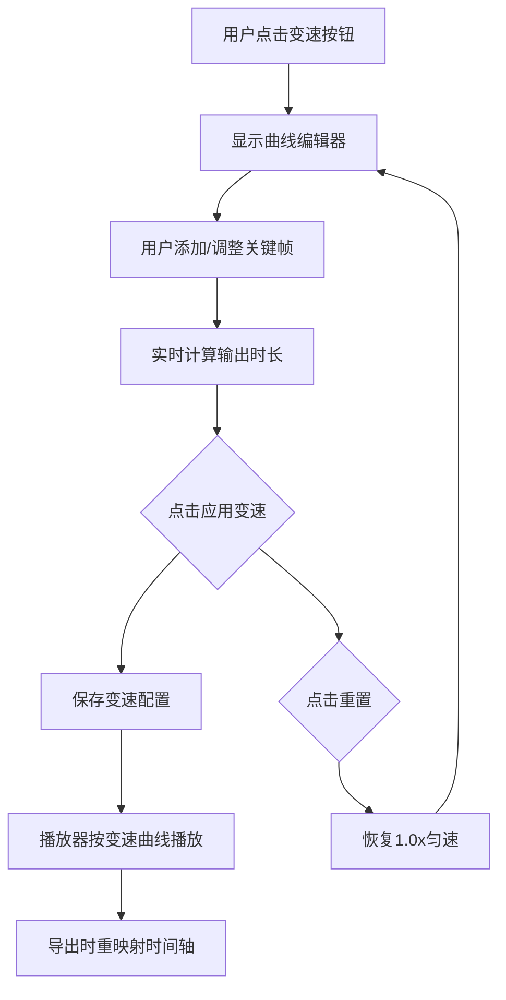

# 普通MP4视频编辑功能设计文档

## 功能概述

为普通MP4模式增加时间轴重映射(变速)核心编辑能力,使项目成为AIGC视频到客户端动画格式的完整转换工具链。

**设计目标**:
- 在现有普通MP4模式基础上增强预处理能力
- 所有编辑操作在导出前完成,导出时应用编辑结果
- 聚焦AI生成短视频的速度调整需求
- 仅保留变速功能,提供帧级精度的速度控制

---

## 一、时间轴重映射功能(变速)

### 功能定位

允许用户通过在时间轴上添加关键帧(K帧)节点控制视频播放速度,实现精确到帧的速度变化,无需补帧。

**核心使用场景**: AI生成的短视频(5秒内)速度调整困难,需要帧级别的精确速度控制。

### 交互设计

#### 入口与布局

```
底部浮层新增按钮:「变速」
点击后:浮层外左侧显示时间轴编辑器
```

| 位置 | 组件 | 说明 |
|------|------|------|
| 浮层外左对齐 | 时间轴编辑器 | 固定宽度400px,独立于侧边栏 |
| 时间轴上 | K帧节点标记 | 黑色/蓝色竖线,可点击/拖拽 |
| 时间轴下方 | 操作按钮 | 取消 / 确定 |
| K帧节点弹窗 | 速度倍率调整器 | 点击节点弹出速度设置滑块 |

#### 时间轴K帧编辑器设计(基于Figma设计稿)

**视觉结构**:
```
┌───────────────────────────────────────────┐
│ [时间轴 400px × 16px]  [取消] [确定]     │
└───────────────────────────────────────────┘
  ↑ 左对齐,在浮层外面

时间轴详细结构:
━━━━━━━━━━━━━━━━━━━━━━━━━━━━━━━━━━━━━━━━
│         │                │              │
0帧      K1(60帧)       K2(100帧)      150帧
黑色     蓝色(可拖)      蓝色(可拖)     黑色
1px      11px宽          11px宽         1px
固定     可移动          可移动         固定

底色: #F3F3F3 (浅灰色背景)
起点/终点节点: #333333 (黑色,固定)
可拖拽K帧节点: #00B4FF (蓝色,宽11px)
```

**像素-帧号映射**:
```javascript
// 时间轴总宽度: 400px
// 视频总帧数: 150帧
// 精度: 400 ÷ 150 = 2.67px/帧

// 帧号 → 像素位置
function frameToPixel(frameIndex) {
  return (frameIndex / totalFrames) * 400;
}

// 像素位置 → 帧号
function pixelToFrame(pixelX) {
  return Math.round((pixelX / 400) * totalFrames);
}
```

**节点操作**:
- **添加K帧**: 点击时间轴空白处 → 弹出速度选择器 → 插入蓝色节点
- **调整K帧位置**: 拖拽蓝色手柄(11px宽) → 左右移动 → 吸附到帧位置
- **调整K帧速度**: 点击节点 → 弹出速度滑块 → 调整倍率(0.5x - 5.0x)
- **删除K帧**: 点击节点 → 速度面板中有删除按钮
- **固定节点**: 起点(0帧)和终点(150帧)固定,不可删除,仅速度可调

#### 时间轴编辑器UI布局

**主界面(浮层外左对齐)**:
```
┌──────────────────────────────────────────────┐
│  时间轴(400px × 16px)  [取消] [确定]        │
│  ━━━━━━━━━━━━━━━━━━━━━━━━━━━━━━━━━━━━━━  │
│  │     │           │                    │    │
│  0    60帧       100帧                150帧  │
│  1.0x  2.0x       0.5x                1.0x  │
└──────────────────────────────────────────────┘
```

**K帧速度调整弹窗(点击节点弹出)**:
```
┌─────────────────────┐
│ 关键帧速度设置      │
├─────────────────────┤
│ 位置: 60帧 (2.0s)   │
├─────────────────────┤
│ 速度倍率:           │
│ [━━━━●━━━━] 2.0x   │
│ 0.5x      5.0x      │
├─────────────────────┤
│ 快捷选择:           │
│ [0.5x] [1.0x]       │
│ [2.0x] [5.0x]       │
├─────────────────────┤
│ [删除K帧] [确定]    │
└─────────────────────┘
```

**时长预估显示(时间轴上方)**:
```
原始: 5.0s → 应用后: 3.2s (-36%)
```

### 数据结构

```javascript
speedRemapConfig: {
  enabled: false,              // 是否启用变速
  keyframes: [                 // 关键帧数组(按帧号排序)
    { frame: 0, speed: 1.0, draggable: false },    // 起点固定
    { frame: 60, speed: 2.0, draggable: true },    // 可拖拽K帧
    { frame: 100, speed: 0.5, draggable: true },   // 可拖拽K帧
    { frame: 150, speed: 1.0, draggable: false }   // 终点固定
  ],
  interpolation: 'linear',     // 插值方式: 'linear'(线性) | 'easeInOut'(平滑)
  outputDuration: 3.2,         // 预计输出时长(秒)
  outputTotalFrames: 96,       // 预计输出总帧数
  originalTotalFrames: 150,    // 原始总帧数
  originalDuration: 5.0,       // 原始时长(秒)
  fps: 30                      // 帧率
}
```

### 处理流程

#### 变速应用流程



#### 速度插值计算

**关键帧之间的速度插值(基于帧号)**:

**线性插值**:
```javascript
// 给定两个关键帧 K1(frame1, speed1) 和 K2(frame2, speed2)
// 计算中间帧 frame ∈ [frame1, frame2] 的速度

function getSpeedAtFrame(frame, keyframes) {
  // 找到frame所在的两个关键帧区间
  for (let i = 0; i < keyframes.length - 1; i++) {
    const k1 = keyframes[i];
    const k2 = keyframes[i + 1];
    
    if (frame >= k1.frame && frame <= k2.frame) {
      // 线性插值
      const ratio = (frame - k1.frame) / (k2.frame - k1.frame);
      return k1.speed + (k2.speed - k1.speed) * ratio;
    }
  }
  return 1.0; // 默认速度
}

// 示例:
// K1: 第60帧 - 1.0x
// K2: 第90帧 - 2.0x
// 第75帧的速度 = 1.0 + (2.0-1.0) × (75-60)/(90-60) = 1.5x
```

**平滑插值(Ease-In-Out,可选)**:
```javascript
function getSpeedAtFrameSmooth(frame, keyframes) {
  // 找到区间后:
  const ratio = (frame - k1.frame) / (k2.frame - k1.frame);
  // 平滑函数(S曲线)
  const smoothRatio = ratio * ratio * (3 - 2 * ratio);
  return k1.speed + (k2.speed - k1.speed) * smoothRatio;
}
```

#### 时间轴重映射算法

**目标**：根据速度曲线，将原视频的每一帧映射到新的输出时间轴。

**原理**：
```
原视频时间线: t_orig (0 ~ originalDuration)
输出时间线: t_out (0 ~ outputDuration)

在原视频时间 t_orig 时：
  速度 = speed(t_orig)
  dt_out = dt_orig / speed     // 速度快，输出时间增长慢；速度慢，输出时间增长快
```

**计算输出时长**：
```
将原时间轴分成 N 段（如每 0.01 秒）
对每段：
  speed_i = 插值计算的速度
  dt_out_i = dt_orig / speed_i
outputDuration = Σ dt_out_i
```

**帧映射关系表**：
导出时预先计算映射表，避免实时计算：
```
outputFrameMap = [
  { outputFrame: 0, originalTime: 0.0 },
  { outputFrame: 1, originalTime: 0.033 },
  { outputFrame: 2, originalTime: 0.05 },   // 速度2x时，原视频走得快
  { outputFrame: 3, originalTime: 0.067 },
  ...
]
```

#### 播放器行为变化

**核心原则**: 进度条始终显示原始帧数,滑块移动速度会变化。

**播放时的表现**:
```
假设关键帧配置:
K1: 第0帧   - 1.0x
K2: 第60帧  - 2.0x  
K3: 第150帧 - 1.0x

进度条显示:
┌────────────────────────────────────┐
│ ●───────────👉──────────────────○ │  ← 滑块
└────────────────────────────────────┘
  0帧       60帧              150帧

滑块移动速度:
- 0-60帧区间: 正常速度(1.0x)
- 60-150帧区间: 滑块跑得快(2.0x,视觉上快进)
- 然后恢复正常速度

用户感知:
✅ 进度条长度不变(还是150帧的刻度)
✅ 滑块移动速度会变化(快速区域滑块跑得快)
✅ 拖动进度条时,定位的是"原始第几帧"
❌ 不会出现"进度条变慢"的情况
```

**技术实现**:
```javascript
// 播放循环
function renderLoop(timestamp) {
  // 1. 根据当前帧号获取速度倍率
  const currentSpeed = getSpeedAtFrame(currentFrame);
  
  // 2. 计算目标帧时间(应用速度)
  const targetFrameTime = (1000 / fps) / currentSpeed;
  
  // 3. 判断是否需要前进到下一帧
  if (elapsed >= targetFrameTime) {
    currentFrame++; // 帧号正常递增
    renderFrame(currentFrame); // 渲染当前帧
    
    // 4. 更新进度条(显示原始帧号)
    progress = (currentFrame / totalFrames) * 100;
  }
  
  requestAnimationFrame(renderLoop);
}
```

**拖动进度条**:
- 拖动到50% → 定位到第75帧(原始帧号)
- 不受速度影响,始终精确定位

#### 导出时处理

**导出流程(应用变速)**:
```javascript
async function exportWithSpeedRemap() {
  const { keyframes, fps, originalTotalFrames } = speedRemapConfig;
  
  // 1. 计算输出总帧数
  const outputDuration = calculateOutputDuration(keyframes, fps, originalTotalFrames);
  const outputTotalFrames = Math.ceil(outputDuration * fps);
  
  // 2. 预先构建帧映射表(提升性能)
  const frameMap = buildFrameMap(keyframes, fps, outputTotalFrames);
  
  // 3. 提取并导出帧
  for (let outFrame = 0; outFrame < outputTotalFrames; outFrame++) {
    // 查表获取原始帧号
    const originalFrame = frameMap[outFrame];
    
    // 跳转到原始帧并提取
    await seekToFrame(originalFrame);
    const frameData = captureFrame();
    
    // 添加到输出序列
    outputFrames.push(frameData);
  }
  
  // 4. 编码导出
  encodeToFormat(outputFrames);
}
```

**帧映射表构建**:
```javascript
function buildFrameMap(keyframes, fps, outputTotalFrames) {
  const frameMap = [];
  let originalTime = 0;
  
  for (let outFrame = 0; outFrame < outputTotalFrames; outFrame++) {
    // 当前输出帧对应的原始时间
    frameMap[outFrame] = Math.floor(originalTime * fps);
    
    // 计算下一帧的原始时间增量
    const speed = getSpeedAtFrame(frameMap[outFrame], keyframes);
    const dt = (1 / fps) * speed; // 速度快,原始时间走得快
    originalTime += dt;
  }
  
  return frameMap;
}

// 示例映射表:
// frameMap = [
//   0,   // 输出第0帧 → 原始第0帧
//   1,   // 输出第1帧 → 原始第1帧 (1.0x)
//   3,   // 输出第2帧 → 原始第3帧 (2.0x,跳帧)
//   5,   // 输出第3帧 → 原始第5帧
//   ...
// ]
```

**无补帧处理**:
- 速度 > 1.0x: 跳过部分原始帧(丢帧)
- 速度 < 1.0x: 重复使用原始帧(复帧)
- 不生成新的中间帧,保持原始画质

### 技术要点

**1. 节点拖拽约束**:
```javascript
// 拖拽边界检测
function validateNodePosition(draggedNode, newFrame) {
  const index = keyframes.indexOf(draggedNode);
  const prevFrame = keyframes[index - 1]?.frame || 0;
  const nextFrame = keyframes[index + 1]?.frame || totalFrames;
  
  // 不可超过相邻节点
  if (newFrame <= prevFrame || newFrame >= nextFrame) {
    return false;
  }
  
  // 首尾节点固定
  if (index === 0 || index === keyframes.length - 1) {
    return false;
  }
  
  return true;
}

// 速度范围限制
const MIN_SPEED = 0.1;  // 最小0.1倍速
const MAX_SPEED = 12;   // 最大12倍速
```

**2. 吸附功能(可选)**:
```javascript
// 拖拽时吸附到每5帧
function snapToFrame(frame, snapInterval = 5) {
  return Math.round(frame / snapInterval) * snapInterval;
}
```

**3. 时间轴渲染实现**:
```javascript
// 渲染K帧节点
function renderKeyframes(keyframes) {
  keyframes.forEach(kf => {
    const x = frameToPixel(kf.frame);
    const color = kf.draggable ? '#00B4FF' : '#333333';
    const width = kf.draggable ? 11 : 1;
    
    // 创建DOM节点或Canvas绘制
    createMarker(x, color, width, kf);
  });
}
```

**4. 输出时长计算**:
```javascript
// 根据速度曲线计算输出总时长
function calculateOutputDuration(keyframes, fps, totalFrames) {
  let outputDuration = 0;
  
  for (let frame = 0; frame < totalFrames - 1; frame++) {
    const speed = getSpeedAtFrame(frame, keyframes);
    const frameDuration = (1 / fps) / speed; // 当前帧时长
    outputDuration += frameDuration;
  }
  
  return outputDuration;
}

// 示例:
// 原始150帧,30fps → 5秒
// 应用2倍速 → 输出2.5秒
```

**5. 性能优化**:
- 拖拽时使用节流(throttle 50ms)
- 仅在释放鼠标时重新计算输出时长
- 导出时预先构建帧映射表,避免实时计算

**6. 交互反馈**:
```javascript
// 鼠标悬停K帧时显示提示
function showTooltip(kf) {
  return `
    帧号: ${kf.frame}
    时间: ${(kf.frame / fps).toFixed(2)}s
    速度: ${kf.speed.toFixed(1)}x
  `;
}
```

---

## 二、功能整合与交互规范

### 底部浮层按钮布局

**新增按钮位置**(建议布局):
```
[播放] [进度条] | [背景色] [缩放] [1:1] | [变速] | [导出GIF] [转双通道MP4] [转SVGA]
```

按钮分组逻辑:
1. 左侧:播放控制
2. 中间左:视图控制
3. 中间右:编辑功能(新增)
4. 右侧:导出转换

**注意**:变速功能使用独立的时间轴编辑器(浮层外左对齐),不占用右侧侧边栏。

### 导出流程

```
原视频帧
  ↓
[1] 根据变速配置,重映射时间轴生成输出帧索引
  ↓
[2] 编码为目标格式(双通道MP4/SVGA/GIF)
```

### 状态提示

**应用编辑后的视觉反馈**:
- 底部浮层按钮上增加标记(如:变速✓)
- 文件信息区显示:
  - 原始时长:00:05.0
  - 变速后时长:00:03.2

**导出提示**:
导出前弹窗确认:
```
即将导出的视频已应用以下编辑:
✓ 变速: 包含 3 个关键帧

预计输出时长: 00:03.2
预计文件大小: ~1.8 MB

[确认导出] [取消]
```

---

## 三、技术方案总结

### 复用现有能力

| 功能 | 复用技术 |
|------|----------|
| 变速 | 时间轴映射表 + 帧跳转 |
| 导出 | ffmpeg.wasm、protobuf编码、gif.js |
| 帧提取 | 双通道MP4/SVGA的帧提取逻辑 |

### 新增核心模块

| 模块 | 职责 | 代码位置建议 |
|------|------|-------------|
| SpeedRemapEditor | K帧时间轴编辑器 | app.js 或独立 speed-remap-editor.js |
| EditingProcessor | 编辑配置应用到导出流程 | app.js exportXXX 方法内 |

### 数据流设计

```javascript
Vue data 新增:
{
  mp4EditConfig: {
    speedRemap: { ... }  // 变速配置
  }
}

导出时读取配置:
exportToYyevaMp4() {
  let frames = extractFrames(video);
  
  // 应用变速
  if (mp4EditConfig.speedRemap.enabled) {
    frames = remapFrames(frames, speedRemapConfig);
  }
  
  // 编码导出
  encodeToMp4(frames);
}
```

### 性能优化策略

| 场景 | 优化措施 |
|------|----------|
| K帧节点拖拽 | 节流(throttle 50ms),避免频繁重绘 |
| 速度插值计算 | 仅在节点释放时计算输出时长 |
| 导出处理 | 使用 Web Worker 进行帧提取和映射计算 |
| 内存管理 | 及时释放临时 Canvas 和 ImageData |
| 时间轴渲染 | 使用 requestAnimationFrame 优化重绘 |

### 兼容性与降级

| 功能 | 浏览器要求 | 降级方案 |
|------|-----------|----------|
| Canvas 操作 | 现代浏览器 | 无需降级 |
| 拖拽交互 | 支持鼠标事件 | 移动端使用触摸事件 |
| ffmpeg.wasm | 支持 WASM | 提示用户更换浏览器 |

---

## 四、开发优先级与工作量评估

### 开发顺序

**阶段一:时间轴重映射(变速)**(4-5天)
1. K帧时间轴编辑器UI(2天)
   - 基于Figma设计稿实现400px×16px时间轴
   - K帧节点拖拽交互
   - 速度调整弹窗
2. 关键帧插值算法(1天)
   - 线性插值实现
   - 速度曲线计算
3. 时间轴映射表计算(1天)
   - 帧映射表构建
   - 输出时长计算
4. 导出流程集成变速逻辑(1天)
   - 应用帧映射表到导出
   - 三种格式(MP4/SVGA/GIF)支持

**总工作量**:4-5天

### 风险评估

| 风险 | 影响 | 缓解措施 |
|------|------|----------|
| K帧时间轴交互复杂 | 开发周期延长 | 基于Figma设计稿精确实现,避免过度设计 |
| 变速映射计算性能 | 导出速度慢 | 使用 Web Worker 后台计算 |
| 时间轴UI空间有限 | 操作精度 | 使用400px宽度,确保帧级精度(2.67px/帧) |
| 帧映射算法准确性 | 输出帧错误 | 充分测试不同速度组合,验证帧索引正确性 |

---

## 五、用户体验设计

### 新手引导

首次使用时,在变速按钮上显示气泡提示:
- "变速":通过K帧控制播放速度,精确到帧级调整

### 快捷操作

| 功能 | 操作方式 | 说明 |
|------|--------|------|
| 添加K帧 | 点击时间轴空白处 | 在当前位置添加关键帧 |
| 调整K帧速度 | 点击K帧节点 | 弹出速度调整弹窗 |
| 删除K帧 | 速度弹窗中的删除按钮 | 删除当前关键帧(起点/终点不可删) |
| 拖拽K帧 | 拖拽蓝色节点 | 调整关键帧位置 |
| 精确定位 | 输入帧号 | 在速度弹窗中手动输入 |

### 错误处理

| 场景 | 提示内容 |
|------|----------|
| 变速倍率超限 | "速度倍率范围:0.5x - 5.0x" |
| K帧位置冲突 | "K帧不能超过相邻节点位置" |
| K帧数量过多 | "最多支持10个关键帧" |
| 导出内存不足 | "视频过大或变速后帧数过多,建议降低输出质量" |

---

## 六、信心评估

**信心等级**:高

**信心基础**:
1. ✅ 项目已有 Canvas 操作、帧提取、ffmpeg 编码等基础能力
2. ✅ K帧时间轴编辑器有明确的Figma设计稿,UI/交互清晰
3. ✅ 时间轴重映射算法原理清楚,实现可控
4. ✅ 用户已明确需求(AI生成短视频速度调整),无需额外调研
5. ✅ 功能范围极度聚焦,仅保留变速功能,复杂度最低
6. ✅ 5秒视频150帧,帧映射表计算量小,性能无忧

**降低风险措施**:
- K帧编辑器严格按照Figma设计稿实现(400px×16px)
- 充分复用现有代码,减少新增模块
- 变速算法先使用线性插值,后续可迭代平滑插值
- 像素-帧号映射精度验证(2.67px/帧)
- 使用 Web Worker 处理帧映射计算,避免阻塞UI
